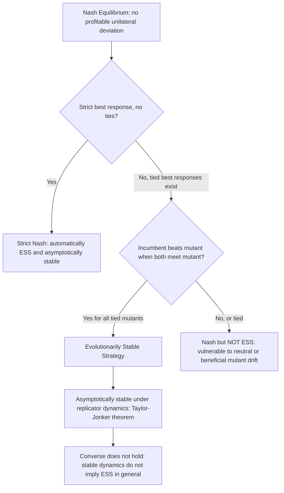

## Stability and the Relation to Nash Equilibrium

### Overview

This topic synthesizes the hierarchy of equilibrium and stability concepts developed across evolutionary game theory — Nash equilibrium, evolutionarily stable strategy (ESS), and dynamic stability under replicator and other evolutionary dynamics — into a unified picture of how these concepts relate, where they coincide, and where they diverge. Understanding these relationships is essential because each concept answers a genuinely different question: Nash equilibrium asks about individual incentives to deviate; ESS asks about resistance to invasion by rare mutants; dynamic (Lyapunov/asymptotic) stability asks about the long-run behavior of an explicit adjustment process.

**Key Points**

- The concepts form a strict nesting: (asymptotically stable under replicator dynamics) $\not\Rightarrow$ ESS $\Rightarrow$ Nash equilibrium, with the first implication generally failing and the second holding as theorem
- ESS is a **refinement** of Nash equilibrium designed to capture robustness to invasion, not rational deliberation
- The Taylor-Jonker theorem provides the key bridge: ESS $\Rightarrow$ asymptotically stable under replicator dynamics — but not the converse
- In special classes of games (zero-sum, potential, stable games), some of these gaps close and stronger equivalences hold

### The Full Hierarchy, Stated Precisely

**Level 1 — Nash equilibrium (symmetric, static):** $\mathbf{x}^*$ is a symmetric Nash equilibrium if every strategy in its support earns the maximal available payoff against $\mathbf{x}^*$ itself: no individual player (holding the rest of the population fixed) can improve by unilaterally deviating.

**Level 2 — Evolutionarily stable strategy (static, invasion-resistant):** $\mathbf{x}^*$ is an ESS if it is a Nash equilibrium **and**, additionally, for every alternative best response $\mathbf{y}$ to $\mathbf{x}^*$ (i.e., any strategy tied for best response), $\mathbf{x}^*$ still strictly outperforms $\mathbf{y}$ when both are played against $\mathbf{y}$ itself. This second clause is precisely what Nash equilibrium omits.

**Level 3 — Asymptotic stability under replicator dynamics (dynamic):** $\mathbf{x}^*$ is asymptotically stable if, under the explicit replicator ODE, trajectories starting near $\mathbf{x}^*$ converge to it over time.

**The chain of implications:**

$$\text{ESS} \implies \text{Asymptotically Stable (replicator dynamics)} \implies \text{Lyapunov Stable} \implies \text{Nash Equilibrium (fixed point)}$$

Each arrow is a theorem; **none of the reverse arrows hold in general**.

### Why Nash Equilibrium Alone Is Insufficient

**The core gap:** Nash equilibrium is a condition about a single player's incentive to deviate, holding the rest of the population fixed at the equilibrium. It says nothing about what happens if a *positive fraction* (however small) of the population actually switches to an alternative strategy and that alternative strategy then competes for survival under selection.

**Illustrative case — weakly dominated ties:** Suppose $\mathbf{x}^*$ and an alternative $\mathbf{y}$ earn identical payoff against $\mathbf{x}^*$ (both are best responses, so $\mathbf{x}^*$ is Nash). If, additionally, $\mathbf{y}$ earns weakly higher payoff than $\mathbf{x}^*$ when played against $\mathbf{y}$ itself (i.e., $\pi(\mathbf{y},\mathbf{y}) \geq \pi(\mathbf{x}^*,\mathbf{y})$), then a population of $\mathbf{y}$-mutants, once introduced, does not lose ground to the $\mathbf{x}^*$ incumbents — the mutant can persist or even grow, meaning $\mathbf{x}^*$ fails to be evolutionarily stable despite being Nash.

**[Inference]** This is the precise mechanism by which "boring" or weakly-motivated Nash equilibria (equilibria sustained only by indifference, with no strict payoff advantage against any conceivable deviation) are filtered out by the ESS refinement — Nash equilibrium treats all best responses as equally acceptable, while ESS specifically asks whether the incumbent can defend its position once a rival strategy actually gains a foothold.

### Why ESS Does Not Imply Full Dynamic Robustness

Conversely, having established that ESS is a strictly stronger requirement than Nash equilibrium, it is also *not* the final word on dynamic behavior, because ESS itself is fundamentally a **local, single-mutant, static** condition — three simplifications that can each break down in richer dynamic settings.

**Local, not global:** ESS defines resistance to invasion by *rare* (vanishingly small frequency) mutants. It says nothing about whether $\mathbf{x}^*$ is the unique long-run outcome from arbitrary (non-nearby) starting population states — indeed, as seen in coordination games, multiple ESS points can coexist, each stable only within its own basin of attraction.

**Single mutant, not simultaneous multiple mutants:** The classical ESS definition only guarantees robustness to one mutant strategy invading at a time. Games with more than two strategies can, in principle, exhibit vulnerability to simultaneous invasion by a *combination* of mutants even when no single mutant strategy alone can invade — a subtlety not captured by the basic pairwise ESS test.

**Static invasion criterion vs. explicit dynamics:** ESS characterizes a payoff comparison at a single moment (or in the limiting sense as mutant frequency $\to 0$); it does not itself specify a time path. The Taylor-Jonker theorem is precisely what supplies this missing dynamic link for the replicator equation specifically — but the theorem's guarantee (asymptotic stability under *this particular* dynamic) does not automatically transfer to other plausible evolutionary or learning dynamics (best-response dynamics, imitation dynamics with different functional forms, discrete-time versions) without additional game-specific analysis.

### Special Classes Where the Gaps Close

**Zero-sum games:** [Inference] In (symmetric) zero-sum-like game structures, the relationship between Nash equilibria, ESS, and dynamic stability is generally cleaner, and interior Nash equilibria of such games are frequently associated with **center**-type dynamics (neutrally stable orbits) rather than strict asymptotic stability, reflecting the absence of any strategy earning a genuine long-run advantage.

**Potential games and stable games (population game generalizations):** As established in the Population Games treatment, when a population game is a potential game or satisfies the broader "stable game" monotonicity condition, a much wider class of evolutionary dynamics (not just the replicator equation) provably converges to the Nash equilibrium set — closing much of the gap between the static equilibrium concept and dynamic behavior, at the cost of requiring this additional structural assumption on the payoff function.

**Strict Nash equilibria:** A **strict** Nash equilibrium (where the equilibrium strategy is the *unique* best response, with no ties) is automatically an ESS, since the absence of ties means condition 1 of the ESS definition is satisfied outright with strict inequality, no need to check the tie-breaking clause. Strict Nash equilibria are also always asymptotically stable under essentially any reasonable evolutionary dynamic, since there is no ambiguity for the dynamics to exploit. This is the cleanest case where all three levels of the hierarchy coincide.

### Comparative Summary Table

| Concept | Type | Robust to individual deviation | Robust to rare mutant invasion | Robust to dynamic (time-path) perturbation |
| --- | --- | --- | --- | --- |
| Nash Equilibrium | Static | Yes | Not necessarily | Not necessarily |
| ESS | Static (invasion) | Yes | Yes | Not guaranteed for all dynamics |
| Asymptotically Stable (replicator) | Dynamic | Yes (implied) | Yes (implied, for replicator dynamics specifically) | Yes, for replicator dynamics |
| Strict Nash Equilibrium | Static (no ties) | Yes | Yes | Yes (essentially any reasonable dynamic) |

### Worked Example: A Nash Equilibrium That Is Not an ESS

Payoff matrix (row player):

|  | vs. $A$ | vs. $B$ |
| --- | --- | --- |
| **$A$** | $1$ | $1$ |
| **$B$** | $1$ | $0$ |

**Check $A$ is Nash:** $\pi(A,A) = 1 \geq \pi(B,A) = 1$ — tied, so $A$ is a best response to itself; $A$ is a symmetric Nash equilibrium (weakly).

**Check $A$ is an ESS:** Condition 1 fails (tie, not strict: $\pi(A,A)=\pi(B,A)=1$). Move to condition 2: need $\pi(A,B) > \pi(B,B)$. Here $\pi(A,B) = 1$ and $\pi(B,B) = 0$, so $1 > 0$ — condition 2 **holds**. Therefore $A$ **is** an ESS despite the tie in condition 1, since it wins the tie-breaking comparison against the mutant.

**Contrast — modify the payoff** so $\pi(A,B) = 0$ instead of $1$: now condition 2 requires $0 > \pi(B,B)$. If $\pi(B,B) = 0$ as well, condition 2 fails too (equality, not strict inequality) — in this modified game, $A$ is Nash but **not** an ESS, and a $B$-mutant can drift/persist in the population since it does no worse than $A$ in every relevant comparison.

**[Inference]** This modified example is a case of **weak invasion neutrality** — the mutant neither strictly gains nor strictly loses, so classical deterministic replicator dynamics would (in the idealized infinite-population limit) leave the frequency of $B$ unchanged wherever it starts, while stochastic/finite-population dynamics could in principle drift the population away from $A$ over time via random fluctuation, a distinction studied in the finite-population/stochastic stability literature referenced under Replicator Dynamics.

### Diagram: The Stability Hierarchy

### Nested Concept Illustration (svg_diagram)

<svg xmlns="http://www.w3.org/2000/svg" viewBox="0 0 460 260">
<text x="230" y="22" font-size="15" text-anchor="middle" font-weight="bold">Nested Stability Concepts (svg_diagram)</text>
<circle cx="230" cy="150" r="110" fill="#4A90D9" fill-opacity="0.25" stroke="#2C5F8A" stroke-width="2" />
<text x="230" y="60" font-size="12" text-anchor="middle" font-weight="bold">Nash Equilibria</text>
<circle cx="230" cy="160" r="75" fill="#D9954A" fill-opacity="0.35" stroke="#8A5A2C" stroke-width="2" />
<text x="230" y="105" font-size="11" text-anchor="middle" font-weight="bold">ESS</text>
<circle cx="230" cy="175" r="40" fill="#5AAA6A" fill-opacity="0.5" stroke="#2C6A3A" stroke-width="2" />
<text x="230" y="180" font-size="10" text-anchor="middle" font-weight="bold">Strict Nash</text>
<text x="230" y="245" font-size="10" text-anchor="middle" font-style="italic">Each ring: strictly stronger stability requirement</text>
</svg>

### Why the Hierarchy Matters for Applications

**Empirical prediction:** [Inference] When using evolutionary game theory to explain or predict observed behavior (in animals, markets, or social conventions), the choice of which concept to invoke matters: predicting that a population *could remain* at some state (Nash) is a much weaker claim than predicting it will be *robust to occasional deviant behavior* (ESS), which is weaker still than predicting the population will *actively return* to that state after a perturbation (asymptotic stability) — using the wrong concept for the empirical claim being made is a common source of imprecision in applied evolutionary reasoning.

**Mechanism and market design implications:** In evolutionary approaches to mechanism design or institutional design, designers often specifically seek outcomes that are strict Nash equilibria (or at least ESS) rather than merely Nash, precisely because Nash equilibria sustained only by indifference are fragile to exactly the kind of small persistent deviations, errors, or drift that occur in real deployed systems with boundedly rational or heterogeneous participants.

### Open Problems and Research Directions

- Precise characterization, across broad game classes, of exactly when asymptotic stability under a *given* dynamic coincides with ESS (rather than merely being implied by it)
- Robustness of the Nash-ESS-stability hierarchy to simultaneous multi-strategy mutant invasions, rather than the classical single-mutant case
- Extending the hierarchy to population games (potential games, stable games) and characterizing analogous refinement relationships in that broader setting
- Finite-population and stochastic-stability analogues of the hierarchy, and their relationship to the idealized infinite-population deterministic results

**Related Topics**

- Evolutionarily Stable Strategies (formal definition and hawk-dove example)
- Replicator Dynamics (the specific dynamic underlying the Taylor-Jonker theorem)
- Population Games (potential games, stable games, and generalized convergence results)
- Strict vs. Weak Nash Equilibrium Refinements
- Finite-Population Stochastic Stability and Drift
- Zero-Sum Games and Center-Type Dynamics
- Mechanism Design Robustness to Behavioral Deviation