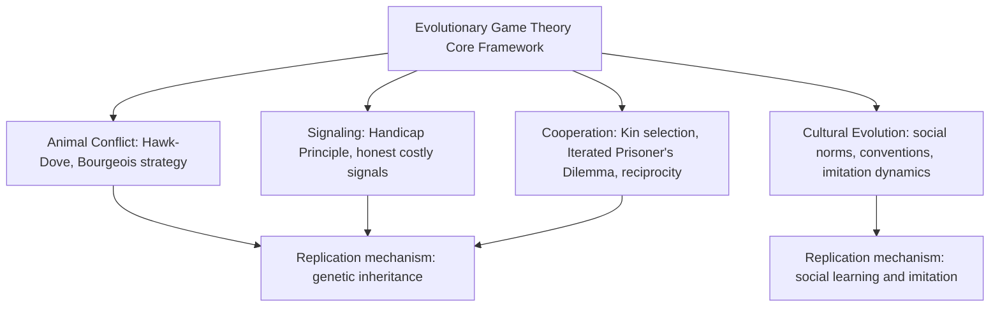

## Applications to Biology and Social Behavior

### Overview

Evolutionary game theory's original motivation was biological — explaining animal behavior through natural selection acting on strategies rather than through group-selection or naive optimality arguments — but the framework has since become a standard tool across biology, anthropology, sociology, and economics for understanding how behaviors, conventions, and institutions can emerge and persist without centralized design or conscious deliberation. This survey synthesizes how the core apparatus (ESS, replicator dynamics, population games) has been applied to concrete biological and social phenomena.

**Key Points**

- Maynard Smith developed evolutionary game theory specifically to correct flawed "for the good of the species" reasoning prevalent in mid-20th-century behavioral ecology
- Applications span animal conflict, signaling and communication, cooperation and altruism, and the cultural evolution of human social norms
- A recurring theme: behaviors that look "irrational" or "suboptimal" from an individual optimization standpoint can be explained as stable outcomes of frequency-dependent selection
- The biological and social/cultural applications share mathematical structure but differ in the underlying replication mechanism (genetic inheritance vs. social learning/imitation)

### Animal Conflict and Contest Behavior

**The original motivating problem:** Prior to Maynard Smith's work, a common explanation for why animal contests over territory or mates rarely escalate to lethal violence invoked "restraint for the good of the species" — an explanation game theory reveals as unnecessary and, taken literally, evolutionarily unstable (since a mutant willing to escalate would generally invade a population of restrained conspecifics).

**The hawk-dove resolution:** As detailed in Evolutionarily Stable Strategies, a mixed or polymorphic population of aggressive and non-aggressive individuals can be a genuine ESS, explaining limited escalation as a consequence of individual-level selection rather than group-level altruism.

**Owner-intruder asymmetries and the Bourgeois strategy:** Field observations across many territorial species show contests are frequently resolved in favor of the current owner/resident with minimal escalation. The "Bourgeois" ESS (play Hawk if owner, Dove if intruder) provides a game-theoretic account: an arbitrary but observable asymmetry (who arrived first / who currently holds the territory) serves as a coordination device, avoiding costly conflict without requiring any inherent fighting-ability difference between owner and intruder.

**[Inference]** Numerous studies across insects, birds, and other territorial animals report win rates for territory owners well above what would be predicted by resource-holding potential alone, consistent with (though not definitively proving) a Bourgeois-strategy-type equilibrium — establishing this interpretation for any specific species requires species-specific empirical work beyond what the general model itself demonstrates.

### Signaling and Costly Signaling Theory

**The problem of honest communication:** Standard cheap-talk game theory predicts that communication between parties with even partially conflicting interests should convey little credible information, since any actor benefiting from being believed has an incentive to bluff. Yet costly, seemingly honest signaling is widespread in nature (e.g., elaborate ornaments, alarm calls, begging behavior).

**Zahavi's Handicap Principle and its game-theoretic formalization (Grafen 1990):** A signal can be an evolutionarily stable, honest indicator of underlying quality specifically *because* it is costly to produce, and the cost is differentially higher for low-quality signalers — making it unprofitable for low-quality individuals to mimic high-quality signals, sustaining an ESS in which signal intensity truthfully correlates with quality.

**[Inference]** This handicap-based signaling equilibrium concept has been influential well beyond its original biological application, informing economic models of costly signaling in labor markets (education as a costly signal of ability, per Spence's classical signaling model) and other settings where credible communication under partially misaligned interests is at stake — though the biological handicap principle and Spence-style economic signaling models, while sharing deep structural similarity, were developed largely independently and have somewhat different formal assumptions.

### Cooperation and the Evolution of Altruism

**The core puzzle:** Natural selection acting on individual fitness appears to disfavor costly cooperative or altruistic acts that benefit others at the actor's own expense — yet cooperation is pervasive in nature, from microbial cooperation to complex animal social structures to human societies.

**Kin selection and inclusive fitness (Hamilton's rule):** Cooperation directed toward genetic relatives can be favored by selection even at a direct fitness cost to the actor, provided the benefit to the relative, weighted by genetic relatedness, exceeds the cost: $rB > C$, where $r$ is the coefficient of relatedness, $B$ the benefit to the recipient, and $C$ the cost to the actor. This is not itself a game-theoretic model in the strategic sense but is frequently integrated with evolutionary game-theoretic frameworks analyzing cooperation among non-relatives.

**Repeated interaction and reciprocity — the Iterated Prisoner's Dilemma:** Among unrelated individuals, cooperation can be sustained as an ESS-like outcome in repeated strategic interaction. Strategies such as **Tit-for-Tat** (cooperate first, then mirror the partner's previous move) were shown via evolutionary tournament simulation (Axelrod 1980s) to perform robustly against a wide range of competing strategies in evolving populations, though subsequent theoretical work has shown Tit-for-Tat is not itself a strict ESS in the infinitely repeated game (it can be invaded by unconditional cooperators under drift, who can then be exploited by defectors) — motivating further refinements (e.g., "Generous Tit-for-Tat," "Win-Stay-Lose-Shift").

**Group selection debates:** [Inference] The relative importance of individual-level versus group-level (multi-level) selection in explaining cooperation remains an area of ongoing scientific debate in evolutionary biology; contemporary treatments generally analyze multi-level selection using extensions of the population-genetic and game-theoretic frameworks rather than the discredited naive group-selection arguments Maynard Smith's original work was partly a reaction against, but the specific weight assigned to group-level effects in any given empirical system is a matter of active research rather than settled consensus.

### Applications to Human Social Behavior and Cultural Evolution

**Cultural evolution as a distinct replication mechanism:** Unlike genetic evolution, human behavioral strategies can spread through **social learning and imitation** rather than biological reproduction, operating on a much faster timescale. The mathematical apparatus of replicator dynamics translates directly: successful strategies (behaviors, beliefs, conventions) are imitated more, and imitation-driven frequency change follows dynamics formally analogous to the biological replicator equation.

**Social norms and convention as ESS:** Many social conventions — which side of the road to drive on, greeting customs, property norms — can be modeled as coordination-game equilibria where multiple ESS-type conventions are possible, and history/initial conditions (rather than intrinsic superiority of one convention) determine which one a society actually settles into, directly paralleling the multiple-ESS coordination game example discussed under Evolutionarily Stable Strategies.

**Fairness norms and the Ultimatum Game:** Evolutionary approaches have been applied to the puzzle of why humans frequently reject unequal splits in Ultimatum Game experiments (behavior inconsistent with pure material payoff maximization) — one line of argument models an evolved preference for enforcing fairness norms (rejecting unfair offers even at a personal cost) as potentially evolutionarily stable in a population where such preferences deter would-be unfair proposers, though this remains an area of active empirical and theoretical research with multiple competing explanatory frameworks (including reputation effects, cultural learning, and alternative preference-based models) rather than a single settled account.

**[Speculation]** More recent applications extend evolutionary game-theoretic reasoning to the spread of misinformation, political polarization, and online social behavior, modeling belief or behavior adoption as an imitation-driven dynamic process — this is an active and rapidly developing research area where the maturity and empirical validation of specific models varies considerably and should not be treated as having the same empirical grounding as the classical biological applications above.

### Worked Example: Tit-for-Tat vs. Always Defect in a Population

Consider a simplified population game with three strategies in a repeated Prisoner's Dilemma context: Always Cooperate (AC), Always Defect (AD), Tit-for-Tat (TFT), with payoffs per round: mutual cooperation $R=3$, mutual defection $P=1$, temptation to defect $T=5$, sucker's payoff $S=0$, and games lasting multiple rounds so reputation/reciprocity matters.

**Qualitative dynamic:** Starting from a population dominated by AD, a small cluster of TFT players interacting mostly with each other (e.g., under some spatial or assortative structure) can achieve mutual cooperation ($R=3$ per round) and outperform AD players who only achieve $P=1$ against each other — allowing TFT to invade under conditions of sufficient interaction assortment. Once TFT is common, AD cannot invade a population of TFT since defecting against TFT triggers reciprocal punishment. However, AC can invade a population of pure TFT under drift (identical behavior against other cooperators, no cost since TFT never encounters a reason to defect first) — and a population that drifts toward AC then becomes vulnerable to reinvasion by AD, illustrating the classical fragility of Tit-for-Tat as a strict long-run ESS discussed above.

**[Inference]** This cyclical vulnerability (TFT → drift toward AC → invasion by AD → return to conditions favoring TFT) is one reason the theoretical literature on repeated-game cooperation emphasizes that strict, permanent ESS in the classical Maynard Smith-Price sense is a demanding standard rarely met exactly by simple reciprocity strategies, motivating the study of more robust variants and of finite-population/stochastic dynamics where such cycles have been examined in simulation and analytical work.

### Diagram: Domains of Application

### Cooperation Cycle Illustration (svg_diagram)

<svg xmlns="http://www.w3.org/2000/svg" viewBox="0 0 460 260">
<text x="230" y="22" font-size="15" text-anchor="middle" font-weight="bold">Reciprocity Strategy Cycle (svg_diagram)</text>
<circle cx="230" cy="80" r="45" fill="#4A90D9" />
<text x="230" y="75" font-size="12" text-anchor="middle" fill="white">Tit-for-Tat</text>
<text x="230" y="92" font-size="10" text-anchor="middle" fill="white">dominant</text>
<circle cx="100" cy="190" r="45" fill="#D9954A" />
<text x="100" y="185" font-size="11" text-anchor="middle" fill="white">Always</text>
<text x="100" y="200" font-size="11" text-anchor="middle" fill="white">Cooperate</text>
<circle cx="360" cy="190" r="45" fill="#B94A4A" />
<text x="360" y="185" font-size="11" text-anchor="middle" fill="white">Always</text>
<text x="360" y="200" font-size="11" text-anchor="middle" fill="white">Defect</text>
<path d="M 195 105 Q 150 140 125 155" stroke="black" stroke-width="2" fill="none" marker-end="url(#a4)" />
<text x="140" y="130" font-size="9">drift (neutral)</text>
<path d="M 145 195 Q 230 220 315 195" stroke="black" stroke-width="2" fill="none" marker-end="url(#a4)" />
<text x="230" y="235" font-size="9">AD exploits AC</text>
<path d="M 335 155 Q 290 120 265 105" stroke="black" stroke-width="2" fill="none" marker-end="url(#a4)" />
<text x="330" y="130" font-size="9">TFT re-invades AD</text>
</svg>

### Comparative Summary Across Domains

| Domain | Key Phenomenon | Primary EGT Concept Applied |
| --- | --- | --- |
| Animal conflict | Limited escalation, owner advantage | Hawk-Dove ESS, Bourgeois strategy |
| Signaling | Honest costly displays | Handicap principle, ESS with cost asymmetry |
| Cooperation among relatives | Altruism toward kin | Hamilton's rule (inclusive fitness) |
| Cooperation among non-relatives | Reciprocal cooperation | Iterated games, Tit-for-Tat, replicator dynamics |
| Human conventions | Arbitrary but stable norms | Multiple ESS / coordination game equilibria |
| Fairness behavior | Rejection of unequal offers | Evolved preference stability arguments |

### Limitations and Critiques of the Applied Literature

- **Adaptationist overreach:** critics have long cautioned against treating every observed behavior as necessarily the output of an optimal or evolutionarily stable process, since not all traits are adaptive (some may be developmental byproducts, historical constraints, or the result of genetic drift)
- **Model-to-data mapping challenges:** stylized models like hawk-dove or iterated Prisoner's Dilemma require substantial simplification relative to real biological or social payoff structures, and confirming a specific ESS prediction empirically for any given species or society requires careful, system-specific measurement of costs, benefits, and relatedness rather than model plausibility alone
- **Genetic vs. cultural replication disanalogies:** while the mathematics of replicator dynamics transfers across genetic and cultural evolution, the actual mechanisms (mutation rates, inheritance fidelity, horizontal vs. vertical transmission) differ substantially, and results proven for one substrate do not automatically carry the same empirical weight when reinterpreted for the other

### Open Problems and Research Directions

- Integrating multi-level (individual and group) selection frameworks more rigorously with the individual-level ESS/replicator apparatus
- Empirically distinguishing between competing explanations (reciprocity, reputation, evolved preferences) for observed human cooperative and fairness behavior
- Extending evolutionary game-theoretic models of cultural evolution to large-scale, network-mediated social learning environments (including online social platforms)
- Formal reconciliation of biological handicap-principle signaling models with economic signaling theory (Spence-type models) developed independently in different disciplinary traditions

**Related Topics**

- Evolutionarily Stable Strategies (Hawk-Dove, Bourgeois strategy formalization)
- Replicator Dynamics (mathematical bridge between biological and cultural evolution)
- Iterated Prisoner's Dilemma and the Evolution of Reciprocity
- Kin Selection and Hamilton's Rule
- Costly Signaling Theory and the Handicap Principle
- Cultural Evolution and Social Norm Formation
- Multi-Level Selection Theory in Evolutionary Biology