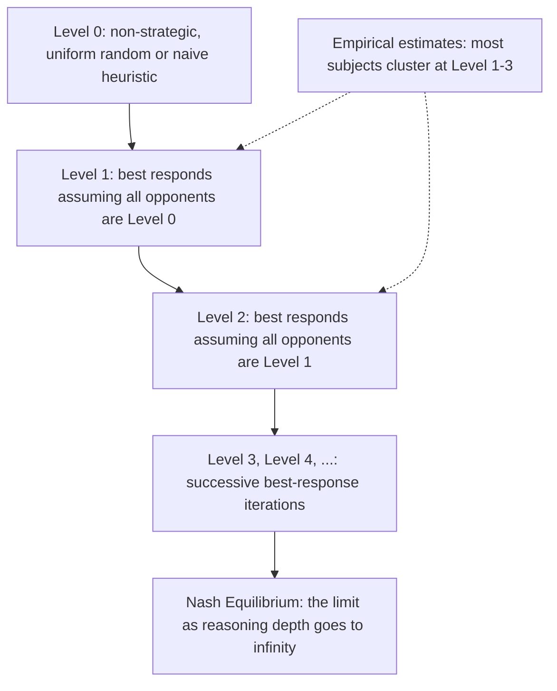

## Bounded Rationality Models

### Overview

Bounded rationality models relax the classical game-theoretic assumption that players are unboundedly rational, perfect optimizers who correctly model their opponents' equally perfect rationality. Instead, these models incorporate realistic limits on computation, memory, foresight, and strategic reasoning depth, producing predictions that better match observed human behavior in laboratory and field experiments — particularly in settings where classical Nash equilibrium analysis performs poorly as a descriptive (rather than purely normative) theory.

**Key Points**

- Motivated by consistent, systematic laboratory deviations from Nash equilibrium predictions, especially in one-shot and early-round interactions
- Major frameworks include level-k / cognitive hierarchy models, quantal response equilibrium, and models of costly or limited strategic reasoning
- These models are typically **descriptive/positive** (aiming to predict actual behavior) rather than **normative** (prescribing optimal play)
- Distinct from, but complementary to, evolutionary game theory's population-dynamics approach to explaining non-equilibrium or slow-converging behavior

### Motivation: Why Classical Rationality Assumptions Fall Short

**The common knowledge of rationality problem:** Standard Nash equilibrium analysis, and especially refinements like iterated elimination of dominated strategies, implicitly assumes not just that each player is rational, but that this rationality is **common knowledge** — each player knows the others are rational, knows that they know it, and so on to unbounded depth. Laboratory evidence (notably from **beauty contest games**, described below) shows real subjects reason through only a few levels of this hierarchy, not infinitely many.

**Beauty contest game (Nagel 1995; Keynes' original informal version):** Subjects simultaneously guess a number between 0 and 100; the winner is whoever guesses closest to some fraction $p$ (commonly $p = 2/3$) of the average guess.

**Nash equilibrium prediction:** If all players are rational and this is common knowledge, iterated reasoning drives the unique Nash equilibrium to $0$ (guess $p \times \text{average}$; if everyone guesses the same value $x$, then $x = p \cdot x$ requires $x=0$ for $p<1$).

**Observed behavior:** Actual experimental subjects typically guess numbers in the 20-35 range on average in initial rounds, far from the Nash prediction of $0$, though repeated play typically drives guesses closer to equilibrium over successive rounds. **[Inference]** This robust empirical gap between the Nash prediction and observed first-round behavior, replicated across many populations and variants since Nagel's original study, is one of the most frequently cited pieces of evidence in behavioral game theory motivating bounded-rationality alternatives to the standard equilibrium concept.

### Level-k Models

**Core idea:** Players are heterogeneous in their depth of strategic reasoning, characterized by a reasoning "level" $k = 0, 1, 2, \ldots$

**Level 0:** A non-strategic anchor type, typically modeled as choosing uniformly at random over available actions, or (in some formulations) following a naive salience-based heuristic rather than reasoning about opponents at all. Level 0 is not itself claimed to be a realistic description of any actual player — it serves as the base case anchoring the hierarchy.

**Level $k$ (for $k \geq 1$):** A level-$k$ player best-responds to the belief that **all** opponents are level-$(k-1)$ players. So a level-1 player best-responds to (assumed) uniformly random level-0 opponents; a level-2 player best-responds to the assumption that opponents are level-1; and so on.

**Beauty contest application:** In the $p=2/3$ beauty contest with a level-0 average guess of $50$ (midpoint of $[0,100]$, if level 0 is uniform random), a level-1 player guesses $\frac{2}{3} \times 50 \approx 33$; a level-2 player, best-responding to level-1 opponents, guesses $\frac{2}{3} \times 33 \approx 22$; and so on, converging toward $0$ only in the limit as $k \to \infty$. Fitting the empirically observed distribution of guesses to this framework typically implies most real subjects behave consistently with reasoning levels concentrated around $k=1$ to $k=3$, rather than either $k=0$ or the infinite-depth Nash benchmark.

**[Unverified]** The exact empirically estimated distribution of reasoning levels varies by study, subject population, and specific game, so citing precise proportions (e.g., "X% of subjects are level 2") without reference to a specific study would overstate the universality of any single number; the qualitative finding of concentration at low, finite levels is the more robust and widely replicated result.

### Cognitive Hierarchy Model

A refinement of the level-k framework addressing a specific conceptual awkwardness in the basic model: the assumption that a level-$k$ player believes *all* opponents are exactly level $(k-1)$, rather than acknowledging genuine population heterogeneity.

**Camerer, Ho, and Chong (2004) formulation:** A level-$k$ player best-responds to the **full distribution** of lower levels $0, 1, \ldots, k-1$ (typically assumed Poisson-distributed across the population with some mean $\tau$), rather than assuming everyone is exactly one level below.

**Advantages over basic level-k:** This addresses the internal inconsistency of assuming an opponent is a fixed lower type while treating oneself as capable of correctly identifying that type — the cognitive hierarchy model instead has each type reasoning about a *realistic mixture* of less sophisticated types, which is often considered a more psychologically plausible model of how strategic sophistication actually varies and is perceived across a population.

**Poisson parameter interpretation:** The single parameter $\tau$ (mean reasoning level in the population) can be estimated from experimental data and has been found in various studies to cluster in a similar low-single-digits range as level-k estimates, though — as above — exact estimated values are study- and game-specific.

### Quantal Response Equilibrium (QRE)

A distinct bounded-rationality framework (McKelvey and Palfrey, 1995) that relaxes rationality not through limited reasoning depth about others' types, but through **stochastic, noisy best response**: players tend to choose better actions more often, but do not choose optimally with certainty.

**Formal specification (logit QRE, the most common variant):** Each player chooses action $a_i$ with probability proportional to an exponential function of that action's expected payoff, scaled by a precision parameter $\lambda \geq 0$:

$$P(a_i) = \frac{\exp(\lambda \cdot \mathbb{E}[\pi_i(a_i, \mathbf{a}_{-i})])}{\sum_{a_i'} \exp(\lambda \cdot \mathbb{E}[\pi_i(a_i', \mathbf{a}_{-i})])}$$

where the expectation over opponents' actions $\mathbf{a}_{-i}$ is taken with respect to their own (equilibrium) quantal response distributions — making QRE a genuine fixed-point equilibrium concept, unlike level-k's explicit finite hierarchy.

**Limiting cases:** As $\lambda \to \infty$, QRE converges to standard Nash equilibrium (players become arbitrarily precise optimizers). As $\lambda \to 0$, QRE converges to uniform random play (no responsiveness to payoffs at all) — $\lambda$ thus serves as a single interpretable parameter capturing the population's overall degree of rational responsiveness, estimable from data.

**Key descriptive advantage:** QRE naturally predicts that strictly dominated strategies, while played less often than undominated ones, are still played with **positive probability** — matching a robust empirical regularity (some fraction of experimental subjects choosing dominated strategies) that strict Nash equilibrium analysis cannot accommodate at all (Nash assigns exactly zero probability to strictly dominated actions).

### Comparison of Frameworks

| Framework | Source of bounded rationality | Equilibrium concept? | Key free parameter(s) |
| --- | --- | --- | --- |
| Level-k | Finite depth of iterated best response | No (explicit hierarchy, not fixed point) | Distribution of levels $k$ |
| Cognitive Hierarchy | Finite depth, with realistic population mixture beliefs | No | Mean level $\tau$ (Poisson) |
| Quantal Response Equilibrium | Stochastic/noisy optimization, not depth-limited reasoning | Yes (fixed point in stochastic choice) | Precision $\lambda$ |
| Nash Equilibrium (benchmark) | None (fully rational, common knowledge) | Yes | None (or none beyond the game itself) |

### Worked Example: Level-k in a Simple Coordination-with-Salience Game

Consider a game where two players independently choose a number from $\{1, 2, 3, 4, 5\}$ and are rewarded if they match, with an asymmetric payoff structure where matching on $3$ yields the highest joint payoff (a focal/salient number), but classical Nash equilibrium analysis (any matched pair is a Nash equilibrium of this pure coordination game) provides no guidance on *which* match to expect.

**Level-0 (uniform random):** expected distribution flat across $\{1,...,5\}$.

**Level-1 reasoning:** A level-1 player who has no special theory of salience but simply best-responds to uniform level-0 is indifferent across their own choices too (since all matches with a uniformly-random opponent are, before the payoff asymmetry, symmetric) — but if level-1 players use the actual payoff structure to break this indifference (recognizing $3$ yields the best payoff *if* matched), a level-1 player who anticipates level-0 opponents might rationally choose $3$ purely because it has the highest payoff *conditional on a lucky match*, without needing any theory of mind about the opponent's salience perception.

**[Inference]** This example illustrates a subtlety often noted in the level-k literature: distinguishing genuine strategic reasoning about opponents' reasoning from simple **payoff salience** (some options are focal because of their own properties, independent of beliefs about others) requires careful experimental design, since both mechanisms can produce convergence on the same salient option and are not always empirically distinguishable from choice data alone.

### Diagram: Level-k Reasoning Hierarchy

### QRE Precision Parameter Illustration (svg_diagram)

<svg xmlns="http://www.w3.org/2000/svg" viewBox="0 0 480 240">
<text x="240" y="22" font-size="15" text-anchor="middle" font-weight="bold">QRE Choice Probability vs. Precision (svg_diagram)</text>
<line x1="50" y1="200" x2="440" y2="200" stroke="black" stroke-width="1.5" />
<line x1="50" y1="200" x2="50" y2="40" stroke="black" stroke-width="1.5" />
<text x="20" y="120" font-size="11" text-anchor="middle" transform="rotate(-90 20 120)">P(best action)</text>
<text x="245" y="220" font-size="11" text-anchor="middle">Precision (lambda)</text>
<path d="M 55 175 Q 150 165 240 120 Q 330 60 430 45" stroke="#4A90D9" stroke-width="3" fill="none" />
<text x="90" y="185" font-size="10">lambda=0: uniform (0.5 for binary)</text>
<text x="380" y="55" font-size="10">lambda to infinity: Nash (P to 1)</text>
</svg>

### Applications

- **Experimental economics:** predicting and explaining laboratory deviations from Nash equilibrium in coordination games, beauty contests, auctions, and bargaining experiments
- **Industrial organization and market design:** [Inference] applying bounded-rationality models to predict likely bidder behavior in auction design and market mechanisms where full rationality assumptions may overstate real participant sophistication, informing more robust mechanism design that performs reasonably well even against boundedly rational participants
- **Political economy:** modeling voter and candidate behavior where full common-knowledge-of-rationality assumptions are empirically implausible
- **Behavioral finance:** incorporating heterogeneous reasoning sophistication into models of trading behavior and market anomalies

### Relationship to Evolutionary Game Theory

**[Inference]** Bounded rationality models and evolutionary game theory (see the Evolutionary Game Theory chapter) offer two largely complementary, non-mutually-exclusive explanations for observed deviations from static Nash equilibrium predictions: evolutionary models emphasize that populations following simple, boundedly rational heuristics (imitation, replication) can still *converge* to equilibrium-like states over repeated interaction and selection, while level-k/QRE-style models describe the *distribution* of reasoning sophistication in a single-shot or early-stage interaction before any such convergence process has had time to operate — the two frameworks are often viewed as describing different timescales or stages of the same broader phenomenon rather than competing explanations.

### Limitations and Critiques

- **Parameter fitting vs. genuine prediction:** critics note that level-k and cognitive hierarchy models, with their free level-distribution or $\tau$ parameters, can fit a wide range of observed behavior after the fact, raising standard concerns about overfitting and out-of-sample predictive validity relative to the zero-free-parameter Nash benchmark
- **Level-0 specification sensitivity:** level-k model predictions can be highly sensitive to the (somewhat arbitrary) choice of level-0 behavior, which is not itself derived from any deeper principle within the model
- **Cross-game and cross-population stability of estimated parameters:** [Unverified] the degree to which an individual's estimated reasoning level or QRE precision parameter is stable across different games and contexts (a "trait"-like interpretation) versus context-dependent is a matter of ongoing empirical investigation rather than settled fact

### Open Problems and Research Directions

- Developing principled, non-arbitrary specifications of level-0 behavior grounded in cognitive or psychological theory rather than convenience
- Reconciling and empirically distinguishing level-k/cognitive hierarchy explanations from quantal-response-based noise explanations when both can fit similar behavioral data
- Extending bounded rationality frameworks to dynamic and repeated-game settings, including learning-based convergence toward or away from equilibrium over time
- Integrating bounded rationality models with neuroeconomic and process-tracing data (e.g., eye-tracking, response time) to test the psychological realism of specific reasoning-depth claims

**Related Topics**

- Beauty Contest Games and Iterated Reasoning Experiments
- Quantal Response Equilibrium: Formal Properties and Estimation
- Cognitive Hierarchy Model and Poisson Level Distributions
- Learning Models in Repeated Games (reinforcement learning, fictitious play)
- Evolutionary Game Theory (complementary population-dynamics perspective)
- Behavioral Auction Theory and Bidder Sophistication
- Common Knowledge of Rationality: Foundations and Critiques