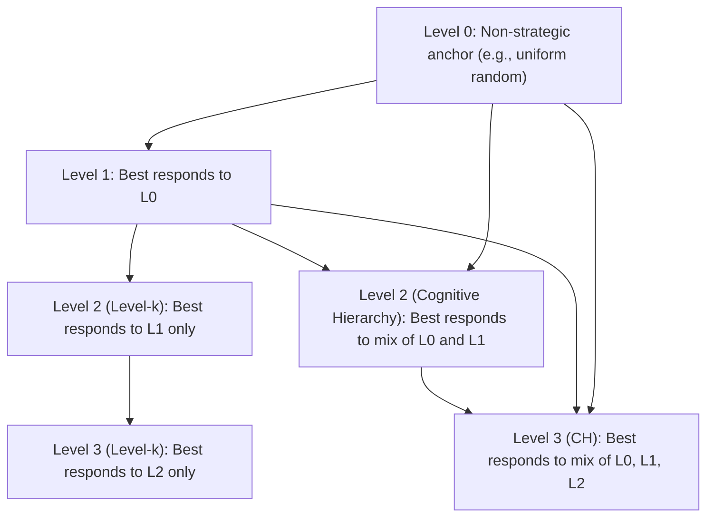

## Level-k and Cognitive Hierarchy Models

### Overview

Level-k and Cognitive Hierarchy (CH) models are behavioral game theory frameworks that relax the assumption of common knowledge of rationality found in Nash equilibrium. Instead of assuming all players reason to a fixed-point equilibrium, these models posit that players differ in their depth of strategic reasoning, organized into discrete "levels" of iterated best-response thinking. They were developed to explain systematic deviations from Nash predictions observed in experimental games such as the beauty contest game, dominance-solvable games, and normal-form coordination games.

### Motivating Problem

Nash equilibrium requires that every player's strategy be a best response to every other player's strategy simultaneously, and that this mutual consistency be common knowledge. Experimental evidence — most famously the p-beauty contest game — shows that human subjects do not converge immediately to equilibrium play, and instead exhibit a distribution of reasoning depths. Level-k and CH models were built to match this distributional, non-equilibrium behavior while retaining a tractable, parametrized structure.

### The Beauty Contest Game (Canonical Example)

In the p-beauty contest, $n$ players simultaneously choose a number in $[0, 100]$. The winner is whoever picks the number closest to $p$ times the average of all chosen numbers, where $p < 1$ (commonly $p = 2/3$).

**Key Points**

- The unique Nash equilibrium is for every player to choose $0$, since $0$ is the only fixed point under iterated elimination of dominated strategies.
- Experimental subjects rarely choose $0$ on the first play; empirical distributions show clustering around $33$, $22$, and $17$ — numbers consistent with 1, 2, and 3 steps of iterated reasoning from a naive average of $50$.
- This clustering pattern is the primary empirical motivation for level-k theory.

### Level-k Model: Core Structure

The level-k model assumes each player is assigned a reasoning "type" $k \in \{0, 1, 2, 3, \ldots\}$, and that a level-$k$ player best-responds to the belief that all opponents are level-$(k-1)$.

**Level 0 (the anchor type)**

- Level-0 players do not reason strategically at all; they follow a non-strategic behavioral rule, often a uniform randomization over the strategy space or a salient focal action.
- Level-0 is typically not observed directly in data — it is a theoretical anchor from which higher levels are inductively defined.
- The specification of L0 is the most criticized and most consequential modeling choice in the entire framework, since all higher levels derive from it.

**Level 1**

- Believes all opponents are Level 0.
- Best-responds to the L0 behavioral rule.
- In the beauty contest with $p = 2/3$ and L0 uniform on $[0,100]$ (mean $50$), L1 chooses $p \times 50 \approx 33$.

**Level 2**

- Believes all opponents are Level 1.
- Best-responds to L1's action: $p \times 33 \approx 22$.

**Level k (general)**

- Believes all opponents are Level $(k-1)$ with probability 1 (a degenerate, non-probabilistic belief).
- Formally, if $a_{k-1}$ is the action of a level-$(k-1)$ player, the level-$k$ best response solves:

$$a_k = \arg\max_{a \in A} \, u_i(a, a_{-i} = a_{k-1})$$

- This produces a deterministic sequence of predicted actions, one per level, that can be directly compared to modal or clustered choices in data.

**Key distinguishing feature**: In level-k, each type has a *point belief* — it thinks every opponent is exactly one level below, with certainty. This is the model's simplifying (and most criticized) assumption.

### Cognitive Hierarchy Model: Core Structure

The Cognitive Hierarchy model (Camerer, Ho, and Chong, 2004) generalizes level-k by replacing the degenerate one-level-below belief with a full probability distribution over all lower levels.

**Belief formation in CH**

- A level-$k$ player believes the population is composed of levels $0, 1, \ldots, k-1$, distributed according to the *truncated and renormalized* population frequency $f(0), f(1), \ldots, f(k-1)$.
- Formally, if $f(h)$ is the population share of level $h$, a level-$k$ player's belief about facing a level-$h$ opponent ($h < k$) is:

$$g_k(h) = \frac{f(h)}{\sum_{j=0}^{k-1} f(j)}$$

- This means level-$k$ players in CH are aware that the population contains a *mixture* of less sophisticated types, not just one homogeneous type immediately below them.

**Poisson parametrization**

- Camerer, Ho, and Chong's CH model typically assumes $f(k)$ follows a Poisson distribution with a single free parameter $\tau$ (mean reasoning level):

$$f(k) = \frac{e^{-\tau} \tau^k}{k!}$$

- This reduces the entire model to a single estimable parameter $\tau$, which is empirically found to average around $1.5$ across many experimental games.
- The Poisson assumption also implies a specific, testable relationship: as $k$ grows, the marginal population share $f(k)$ shrinks, meaning higher levels are assumed increasingly rare — consistent with working-memory and reasoning-cost constraints. [Inference: the working-memory interpretation is a theoretical motivation offered by the original authors, not a directly tested mechanism.]

### Level-k vs. Cognitive Hierarchy: Comparison

| Dimension | Level-k | Cognitive Hierarchy |
| --- | --- | --- |
| Belief about opponents | Point belief: 100% level $(k-1)$ | Distributional: mixture over levels $0$ to $k-1$ |
| Free parameters | One per level population share (or none, if pure iterated best response) | Single parameter $\tau$ (under Poisson specification) |
| Overconfidence | Level-$k$ never accounts for players at its own level or above | Same — CH players also never believe others are at or above their own level |
| Tractability | Very simple to compute recursively | Requires renormalizing truncated distributions at each level |
| Fit flexibility | Population shares often fit freely to data | Population shares constrained by single-parameter distribution, more parsimonious |

**Shared limitation**: both models retain the assumption that no player believes anyone (including themselves) could be reasoning at their own level or higher — an "overconfidence" property carried over from level-k into CH.

### Formal Definitions Side-by-Side

**Level-k best response:**

$$BR_k(a) = \arg\max_{a_i} \, E_{a_{-i} \sim \delta_{a_{k-1}}} \left[ u_i(a_i, a_{-i}) \right]$$

where $\delta_{a_{k-1}}$ is a point mass (Dirac delta) on the level-$(k-1)$ action.

**CH best response:**

$$BR_k(a) = \arg\max_{a_i} \, \sum_{h=0}^{k-1} g_k(h) \cdot u_i(a_i, a_{-h})$$

where $g_k(h)$ is the renormalized belief distribution defined above, and $a_{-h}$ denotes the (possibly mixed) action profile of level-$h$ opponents.

### Worked Example: Coordination via Iterated Reasoning

Consider a simplified guessing game with 3 players, each choosing an integer in $\{0, \ldots, 20\}$, target $= 0.7 \times$ average.

**Example**

- L0: uniform random over $\{0, \ldots, 20\}$, expected value $10$.
- L1 (level-k): best responds to L0's expected action of $10$ → chooses $0.7 \times 10 = 7$.
- L2 (level-k): best responds to L1's action of $7$ → chooses $0.7 \times 7 = 4.9$.
- L2 (CH), with $\tau = 1.5$: believes population is a mix of L0 and L1, weighted by $g_2(0)$ and $g_2(1)$ derived from Poisson$(1.5)$ truncated at level 1. Suppose $f(0) = 0.223$, $f(1) = 0.335$; then $g_2(0) = 0.223/0.558 \approx 0.40$, $g_2(1) \approx 0.60$. Expected opponent action $\approx 0.40 \times 10 + 0.60 \times 7 = 8.2$, so L2 (CH) chooses $0.7 \times 8.2 \approx 5.74$.

This illustrates a general pattern: CH predictions tend to sit between the pure level-$(k-1)$ and level-$k$ level-k predictions, since CH players hedge across multiple opponent types.

### Estimation and Empirical Fitting

**Key Points**

- Both models are typically estimated via maximum likelihood, fitting the distribution of levels $f(k)$ (or the Poisson parameter $\tau$ for CH) to observed choice data across one or many games simultaneously.
- A common empirical approach adds a stochastic choice rule (e.g., logit quantal response) on top of the deterministic level-$k$ or CH prediction, so that players play their level's prescribed action with the highest probability but not certainty:

$$P(a_i = a) = \frac{e^{\lambda \cdot u_i(a, \text{beliefs})}}{\sum_{a' \in A} e^{\lambda \cdot u_i(a', \text{beliefs})}}$$

- This hybrid is often called "Level-k with logit noise" or a "noisy cognitive hierarchy" model, and $\lambda$ (precision) is estimated jointly with the level distribution.
- Estimated $\tau$ values across many published experiments cluster between $1.0$ and $2.0$, and estimated level-k distributions typically show modal mass at L1 and L2, with very little mass beyond L3. [Unverified: exact estimates vary substantially by game class, subject pool, and elicitation method, and should not be treated as universal constants.]

### Applications

- **Auctions**: explaining overbidding relative to Nash equilibrium in first-price sealed-bid auctions, where bidders behave as if executing 1–2 steps of reasoning rather than full equilibrium computation.
- **Market entry games**: predicting entry rates that deviate from mixed-strategy Nash predictions.
- **Signaling and communication games**: modeling how receivers interpret cheap-talk messages when senders anticipate limited receiver sophistication.
- **Initial play in novel games**: level-k/CH models are specifically designed for *first-time* or *one-shot* play, before learning dynamics can pull behavior toward equilibrium — this is a key scope boundary of the framework.
- **Behavioral mechanism design**: incorporating level-k reasoning into mechanism robustness checks, since a mechanism that only works under full common knowledge of rationality may fail against boundedly sophisticated participants.

### Relationship to Learning Models

Level-k and CH are static, one-shot models of initial response, distinct from dynamic learning models such as reinforcement learning or experience-weighted attraction (EWA) learning, which describe how play evolves *across repeated rounds*. In practice, researchers sometimes use level-k/CH to characterize round-1 behavior and a learning model to characterize convergence in later rounds; EWA itself was constructed partly as a bridge that nests both belief-based learning and reinforcement learning.

### Critiques and Limitations

**Key Points**

- **Level-0 specification problem**: results are highly sensitive to the assumed L0 rule (uniform random vs. focal/salient action vs. game-specific heuristic), and there is no universally accepted principle for choosing it. [Inference: this sensitivity is widely discussed in the behavioral game theory literature as the framework's central methodological weakness.]
- **Ad hoc discreteness**: reasoning is modeled as discrete integer steps, whereas actual cognitive processes may not decompose so cleanly.
- **No overconfidence check**: neither model allows a player to believe others might reason at or above their own level, which some argue is psychologically unrealistic for sophisticated subjects.
- **Cross-game generalizability**: a level or $\tau$ estimated in one game does not always transfer well to predicting behavior in a structurally different game, limiting out-of-sample predictive claims. [Unverified: transferability results are mixed across studies and depend heavily on game similarity.]
- **Static framing**: neither model incorporates learning, so repeated-game or long-horizon predictions require pairing with a separate dynamic model.

### Relationship to Nash Equilibrium

Level-k and CH can be viewed as *finite-depth approximations* to the infinite-regress reasoning implicit in Nash equilibrium. As $k \to \infty$ in level-k (assuming convergence), and as $\tau \to \infty$ in CH (placing arbitrarily large weight on high levels), predictions can approach Nash equilibrium in games where iterated best response converges, such as dominance-solvable games. In games without such convergence properties (e.g., games with multiple equilibria or best-response cycles), level-k and CH predictions need not converge to any Nash equilibrium at all.

### Diagram: Reasoning Hierarchy



### Diagram: Belief Structure Comparison (svg_diagram)

<svg xmlns="http://www.w3.org/2000/svg" viewBox="0 0 760 320">
<text x="190" y="25" font-size="16" font-weight="bold" text-anchor="middle" fill="#1a1a1a">Level-k Belief Structure (svg_diagram)</text>
<text x="570" y="25" font-size="16" font-weight="bold" text-anchor="middle" fill="#1a1a1a">Cognitive Hierarchy Belief Structure (svg_diagram)</text>
<circle cx="190" cy="90" r="26" fill="#e8f0fe" stroke="#1a56db" stroke-width="2" />
<text x="190" y="95" font-size="13" text-anchor="middle" fill="#1a1a1a">L2</text>
<line x1="190" y1="116" x2="190" y2="150" stroke="#1a56db" stroke-width="2" marker-end="url(#arrow1)" />
<text x="230" y="135" font-size="11" fill="#1a1a1a">100%</text>
<circle cx="190" cy="180" r="26" fill="#fef3e8" stroke="#c2410c" stroke-width="2" />
<text x="190" y="185" font-size="13" text-anchor="middle" fill="#1a1a1a">L1</text>
<line x1="190" y1="206" x2="190" y2="240" stroke="#c2410c" stroke-width="2" marker-end="url(#arrow1)" />
<circle cx="190" cy="270" r="26" fill="#fce8f0" stroke="#9d174d" stroke-width="2" />
<text x="190" y="275" font-size="13" text-anchor="middle" fill="#1a1a1a">L0</text>
<text x="190" y="305" font-size="11" text-anchor="middle" fill="#555">believed with certainty (0%)</text>
<circle cx="570" cy="90" r="26" fill="#e8f0fe" stroke="#1a56db" stroke-width="2" />
<text x="570" y="95" font-size="13" text-anchor="middle" fill="#1a1a1a">L2</text>
<line x1="555" y1="112" x2="480" y2="230" stroke="#c2410c" stroke-width="2" marker-end="url(#arrow2)" />
<text x="490" y="180" font-size="11" fill="#1a1a1a">g(1)=60%</text>
<line x1="565" y1="116" x2="565" y2="240" stroke="#9d174d" stroke-width="2" marker-end="url(#arrow2)" />
<text x="575" y="180" font-size="11" fill="#1a1a1a">g(0)=40%</text>
<circle cx="480" cy="260" r="26" fill="#fef3e8" stroke="#c2410c" stroke-width="2" />
<text x="480" y="265" font-size="13" text-anchor="middle" fill="#1a1a1a">L1</text>
<circle cx="565" cy="270" r="26" fill="#fce8f0" stroke="#9d174d" stroke-width="2" />
<text x="565" y="275" font-size="13" text-anchor="middle" fill="#1a1a1a">L0</text>
<text x="522" y="305" font-size="11" text-anchor="middle" fill="#555">believed as a mixture</text>
</svg>

### Pseudocode: Computing Level-k Predictions



```
function level_k_action(k, game, L0_rule):
    if k == 0:
        return L0_rule(game)
    else:
        opponent_action = level_k_action(k - 1, game, L0_rule)
        return best_response(game, opponent_action)

function best_response(game, opponent_action):
    # returns argmax over own action space given opponent's fixed action
    return solve_optimization(game.payoff_function, opponent_action)
```

### Pseudocode: Computing Cognitive Hierarchy Predictions



```
function poisson_pmf(k, tau):
    return (exp(-tau) * tau^k) / factorial(k)

function ch_belief(k, tau, max_level):
    raw = [poisson_pmf(h, tau) for h in 0..k-1]
    normalizer = sum(raw)
    return [p / normalizer for p in raw]   # g_k(h) for h = 0..k-1

function ch_action(k, tau, game, lower_level_actions):
    beliefs = ch_belief(k, tau, k)
    expected_opponent_profile = weighted_average(lower_level_actions, beliefs)
    return best_response(game, expected_opponent_profile)
```

### Conclusion

Level-k and Cognitive Hierarchy models provide a parsimonious, empirically disciplined alternative to Nash equilibrium for predicting initial play in strategic games, by explicitly modeling bounded and heterogeneous depths of iterated reasoning. Level-k's simplicity (point beliefs about exactly one level below) makes it highly tractable, while CH's distributional beliefs offer a more psychologically plausible and single-parameter-flexible generalization. Both remain most credible as models of *first-time, non-equilibrium* strategic behavior, and both inherit open questions around the specification of the non-strategic anchor type and the models' limited ability to generalize across structurally different games.

**Related Topics**

- Quantal Response Equilibrium (QRE) and its integration with level-k/CH noise models
- Experience-Weighted Attraction (EWA) learning and its relation to static reasoning models
- The p-beauty contest game and other iterated dominance experiments
- Behavioral models of belief formation: analogy-based expectation equilibrium
- Poisson-CH parameter estimation techniques and identification issues
- Overconfidence and theory-of-mind limits in strategic reasoning models
- Applications of level-k reasoning in auction theory and mechanism design
- Noisy introspection models and stochastic choice extensions to bounded rationality