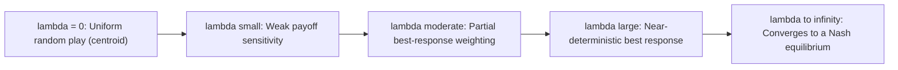

## Quantal Response Equilibrium

### Overview

Quantal Response Equilibrium (QRE) is a solution concept that generalizes Nash equilibrium by replacing exact best-response optimization with probabilistic, "noisy" best response. Introduced by McKelvey and Palfrey (1995), QRE assumes players are more likely to choose better actions but do not choose optimally with certainty, capturing bounded rationality, decision error, and unmodeled payoff heterogeneity observed in experimental data. QRE nests Nash equilibrium as a limiting case and has become one of the most widely used equilibrium refinements in experimental and behavioral game theory.

### Motivating Problem

Nash equilibrium assumes players select best responses with probability 1. Laboratory experiments consistently show players choosing strictly dominated or suboptimal strategies with positive frequency, and mixed-strategy equilibrium predictions often fail to match the empirical frequency of actions. QRE was designed to fit these patterns by allowing a smooth, statistically estimable degree of "noise" in decision-making, rather than treating deviations from equilibrium as unexplained error.

### Core Structure: The Logit QRE

The most widely used variant is logit QRE, where the probability a player chooses action $a$ increases exponentially in that action's expected payoff, scaled by a precision parameter $\lambda$.

**Formal definition**

For player $i$ with strategy space $A_i$, expected payoff $u_i(a, \sigma_{-i})$ of playing $a$ given opponents' strategy profile $\sigma_{-i}$, the logit QRE probability is:

$$\sigma_i(a) = \frac{e^{\lambda \cdot u_i(a, \sigma_{-i})}}{\sum_{a' \in A_i} e^{\lambda \cdot u_i(a', \sigma_{-i})}}$$

This must hold **simultaneously for all players**, meaning $\sigma_{-i}$ on the right-hand side is itself generated by the same fixed-point condition — this is what makes QRE an *equilibrium* concept rather than a one-shot behavioral rule.

**Key Points**

- $\lambda$ is the precision (or rationality) parameter, estimated from data rather than assumed.
- As $\lambda \to \infty$: choice probabilities collapse onto the best response, and QRE converges to Nash equilibrium.
- As $\lambda \to 0$: all actions become equally likely, corresponding to pure random play regardless of payoffs.
- Because $\sigma_{-i}$ appears on both sides of the equation, generally no closed-form solution exists; QRE must be computed as a fixed point.

### General (Non-Logit) QRE

The logit specification is a special case of the broader QRE family, which permits any "quantal response function" $\sigma_i(a) = Q_i(u_i(a, \sigma_{-i}))$ satisfying monotonicity (higher expected payoff implies weakly higher choice probability). Alternative specifications include:

- **Probit QRE**: choice probabilities derived from a normal-error random utility model instead of the extreme-value error underlying logit.
- **Power/other link functions**: less commonly used, but consistent with the same equilibrium logic — response functions responsive to payoff differences but not deterministic.

**Key Points**

- Logit QRE dominates the applied literature because it produces a smooth, differentiable system of equations that is straightforward to estimate via maximum likelihood.
- The choice of link function (logit vs. probit) rarely changes qualitative conclusions but can affect quantitative fit. [Unverified: relative fit comparisons are game- and dataset-specific.]

### Random Utility Interpretation

QRE can be derived from a random utility model in which each player's payoff from action $a$ has an additive noise term $\varepsilon_i(a)$:

$$\tilde{u}_i(a) = u_i(a, \sigma_{-i}) + \varepsilon_i(a)$$

If $\varepsilon_i(a)$ is drawn i.i.d. from a Type I Extreme Value (Gumbel) distribution, the probability that action $a$ maximizes $\tilde{u}_i$ across all $a \in A_i$ is exactly the logit formula above. This connects QRE directly to standard discrete choice econometrics (e.g., McFadden's conditional logit model), giving it a well-established statistical foundation independent of behavioral game theory.

### Worked Example: 2×2 Coordination Game

Consider a symmetric coordination game with payoff matrix (row player payoffs shown):

|  | Column: A | Column: B |
| --- | --- | --- |
| **Row: A** | 10, 10 | 0, 0 |
| **Row: B** | 0, 0 | 6, 6 |

**Example**

- Nash equilibria: (A, A), (B, B), and a mixed equilibrium.
- Under logit QRE, let $p$ = probability row plays A, and by symmetry, column also plays A with probability $p$.
- Expected payoff to Row from A: $10p$; from B: $6(1-p)$.
- QRE fixed-point condition:

$$p = \frac{e^{\lambda \cdot 10p}}{e^{\lambda \cdot 10p} + e^{\lambda \cdot 6(1-p)}}$$

- This equation must be solved numerically for $p$ given a chosen $\lambda$.
- At $\lambda = 0$: $p = 0.5$ (uniform randomization, matching zero rationality).
- As $\lambda \to \infty$: $p \to 1$, converging to the Pareto-dominant Nash equilibrium (A, A), since a fully rational player strictly prefers the higher payoff once $\sigma_{-i}$ places enough weight on A.
- At intermediate $\lambda$, QRE typically predicts a value between $0.5$ and $1$, and traces out a continuous path — the **QRE correspondence** — as $\lambda$ increases from $0$ to $\infty$.

### The QRE Correspondence and Equilibrium Selection

**Key Points**

- The full set of QRE solutions across all $\lambda \in [0, \infty)$ forms a one-dimensional curve (the "logit equilibrium correspondence") connecting the centroid (uniform randomization at $\lambda = 0$) to one or more Nash equilibria as $\lambda \to \infty$.
- In games with multiple Nash equilibria, this correspondence provides a principled equilibrium selection criterion: the Nash equilibrium that the QRE path converges to as $\lambda \to \infty$ is often interpreted as the "more robust" or "more likely to be selected" equilibrium, since it is approached from a continuous, empirically-groundable process rather than assumed by fiat.
- This selection property has made QRE influential in refining predictions in games with multiple equilibria, such as coordination games and some auction formats. [Inference: equilibrium selection via QRE limiting behavior is a widely cited application, but the selected equilibrium is not universally regarded as normatively privileged — it depends on the parametrization and starting payoffs assumed.]

### Estimation

QRE is typically estimated via maximum likelihood on observed choice frequencies:

**Key Points**

- Given observed action frequencies from experimental data, $\lambda$ is chosen to maximize the likelihood of the data under the QRE choice probabilities.
- Since QRE choice probabilities are themselves defined by a fixed point, estimation requires solving the fixed-point system (often via homotopy/continuation methods) for each candidate $\lambda$ during the optimization search.
- Estimated $\lambda$ values are not directly comparable across games with different payoff scales, since $\lambda$ interacts multiplicatively with the payoff units; some studies normalize payoffs to allow cross-game comparison.
- Extensions estimate a **heterogeneous** $\lambda$ across the population (e.g., a distribution of precision parameters) rather than a single point estimate, improving fit to data with dispersed behavior.

### Pseudocode: Computing Logit QRE via Fixed-Point Iteration



```
function logit_qre(game, lambda, tolerance, max_iterations):
    sigma = initialize_uniform_strategy(game)   # start at lambda=0 equilibrium
    for iteration in 1..max_iterations:
        sigma_new = {}
        for player i in game.players:
            for action a in game.actions[i]:
                expected_payoff = compute_expected_payoff(game, i, a, sigma)
                sigma_new[i][a] = exp(lambda * expected_payoff)
            normalize(sigma_new[i])   # divide by sum over actions
        if distance(sigma_new, sigma) < tolerance:
            return sigma_new
        sigma = sigma_new
    return sigma   # did not converge within max_iterations
```

**Key Points**

- Convergence of this simple iteration is not guaranteed for all games and all $\lambda$; more robust implementations use homotopy continuation, tracing the QRE correspondence starting from $\lambda = 0$ and slowly increasing $\lambda$, using each solution as the starting guess for the next. [Behavior may vary depending on game structure, payoff scaling, and numerical solver; convergence guarantees depend on the specific algorithm used, not the QRE model itself.]

### Extensive-Form QRE (AQRE)

For sequential (extensive-form) games, McKelvey and Palfrey developed **Agent Quantal Response Equilibrium (AQRE)**, treating each decision node as if controlled by an independent "agent" who best-responds probabilistically given continuation payoffs computed via backward induction with quantal (not exact) responses at every subsequent node.

**Key Points**

- AQRE differs from applying logit QRE naively to the normal-form representation of an extensive-form game, because it accounts for sequential rationality with noise propagated through the game tree.
- AQRE has been used to explain observed deviations from subgame-perfect equilibrium in sequential bargaining, centipede games, and signaling games — settings where subgame-perfect predictions (e.g., immediate defection in centipede games) are strongly and systematically violated in experiments.

### Applications

- **Voter turnout games**: explaining positive turnout in large elections, which standard rational-choice models struggle to predict (the "paradox of voting"), since AQRE/QRE allow a small but positive probability of "irrational" turnout.
- **Auctions**: explaining systematic overbidding relative to risk-neutral Nash bidding in first-price sealed-bid auctions.
- **Centipede and trust games**: explaining why players cooperate or pass further into the game tree than backward induction predicts.
- **Industrial organization and entry games**: fitting entry/exit decisions where a fraction of firms behave inconsistently with strict payoff maximization.
- **Political science**: modeling candidate positioning and voter behavior under bounded rationality assumptions.

### Relationship to Level-k and Cognitive Hierarchy Models

**Key Points**

- QRE and level-k/CH models both relax full rationality but along different dimensions: QRE relaxes the *precision* of best response (noisy optimization at a fixed belief), while level-k/CH relax the *depth of iterated reasoning* about opponents (deterministic best response to a bounded-sophistication belief).
- The two frameworks are complementary and are frequently combined: a "noisy" level-k or CH model applies a logit response rule on top of each level's prescribed action, effectively nesting a QRE-style choice rule inside a level-k belief structure.
- QRE, unlike level-k/CH, is a genuine **equilibrium** concept (beliefs about others must be consistent with others' actual noisy behavior in a mutual fixed point), whereas level-k/CH are explicitly non-equilibrium, since higher levels systematically misperceive the true population.

### Diagram: QRE Correspondence Path



### Diagram: Logit QRE Fixed-Point Loop (svg_diagram)

<svg xmlns="http://www.w3.org/2000/svg" viewBox="0 0 700 300">
<text x="350" y="25" font-size="16" font-weight="bold" text-anchor="middle" fill="#1a1a1a">Logit QRE Fixed-Point Structure (svg_diagram)</text>
<rect x="60" y="60" width="180" height="60" rx="8" fill="#e8f0fe" stroke="#1a56db" stroke-width="2" />
<text x="150" y="95" font-size="13" text-anchor="middle" fill="#1a1a1a">Strategy profile σ</text>
<rect x="330" y="60" width="180" height="60" rx="8" fill="#fef3e8" stroke="#c2410c" stroke-width="2" />
<text x="420" y="88" font-size="13" text-anchor="middle" fill="#1a1a1a">Expected payoffs</text>
<text x="420" y="105" font-size="13" text-anchor="middle" fill="#1a1a1a">u_i(a, σ_-i)</text>
<rect x="500" y="180" width="180" height="60" rx="8" fill="#fce8f0" stroke="#9d174d" stroke-width="2" />
<text x="590" y="208" font-size="13" text-anchor="middle" fill="#1a1a1a">Logit transform</text>
<text x="590" y="225" font-size="12" text-anchor="middle" fill="#1a1a1a">exp(λu) / Σexp(λu')</text>
<rect x="60" y="180" width="180" height="60" rx="8" fill="#e8f8ee" stroke="#15803d" stroke-width="2" />
<text x="150" y="215" font-size="13" text-anchor="middle" fill="#1a1a1a">Updated σ (new probs)</text>
<line x1="240" y1="90" x2="330" y2="90" stroke="#333" stroke-width="2" marker-end="url(#a1)" />
<line x1="420" y1="120" x2="580" y2="180" stroke="#333" stroke-width="2" marker-end="url(#a1)" />
<line x1="500" y1="210" x2="240" y2="210" stroke="#333" stroke-width="2" marker-end="url(#a1)" />
<line x1="150" y1="180" x2="150" y2="120" stroke="#333" stroke-width="2" stroke-dasharray="4,3" marker-end="url(#a1)" />
<text x="120" y="150" font-size="11" fill="#555">feed back until fixed point</text>
</svg>

### Critiques and Limitations

**Key Points**

- **Overfitting risk**: because $\lambda$ is freely estimated, QRE can fit almost any observed distribution of play reasonably well, raising concerns about its falsifiability as a distinct behavioral theory rather than a flexible curve-fitting device. [Inference: this concern is raised repeatedly in the methodological literature critiquing QRE's out-of-sample predictive power.]
- **Cross-game parameter instability**: $\lambda$ estimated in one game often does not predict behavior well in a different game, limiting claims that $\lambda$ represents a stable, individual-level trait. [Unverified: findings on cross-game stability of λ are mixed and depend on study design.]
- **Computational cost**: for large or extensive-form games, solving the QRE fixed point can be substantially more expensive than computing Nash equilibrium, especially without homotopy-based solvers.
- **No account of reasoning depth**: unlike level-k/CH, QRE does not model *why* players deviate from best response — it only parametrizes *how much* they deviate, which is a positive but not necessarily explanatory limitation.

### Conclusion

Quantal Response Equilibrium provides a statistically grounded generalization of Nash equilibrium that replaces exact optimization with a smooth, precision-parametrized noisy best response, while preserving mutual consistency of beliefs as a genuine equilibrium condition. Its logit form connects directly to standard discrete-choice econometrics, making it estimable and broadly applicable across normal-form and extensive-form games. QRE's ability to nest Nash equilibrium as a limiting case, while fitting systematic deviations observed in experiments, has made it one of the most empirically successful tools in behavioral and experimental game theory — though its flexibility also invites caution about overfitting and cross-context generalizability.

**Related Topics**

- Agent Quantal Response Equilibrium (AQRE) in extensive-form games
- Homotopy continuation methods for computing equilibrium correspondences
- Discrete choice econometrics and random utility models (McFadden logit)
- Level-k and Cognitive Hierarchy models as complementary bounded-rationality frameworks
- Equilibrium selection theory in games with multiple Nash equilibria
- Structural estimation of behavioral parameters in laboratory experiments
- Applications of QRE in voter turnout and auction theory
- Noisy introspection and other stochastic choice extensions