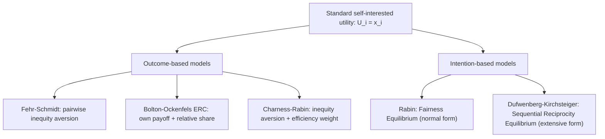

## Social Preferences and Fairness Models

### Overview

Social preferences and fairness models extend classical game theory by allowing players' utility functions to depend not only on their own material payoff but also on the payoffs received by others. These models were developed to explain robust experimental regularities — cooperation in one-shot prisoner's dilemmas, positive offers in dictator games, rejection of unfair offers in ultimatum games, and costly punishment — that standard self-interested (purely payoff-maximizing) utility functions cannot accommodate.

### Motivating Problem

Under standard game-theoretic assumptions, a rational, self-interested player should accept any positive offer in an ultimatum game (since something is better than nothing) and should offer nothing in a dictator game (since the recipient's payoff carries no weight). Experimental evidence robustly contradicts both predictions: modal ultimatum offers cluster around 40–50% of the pie, low offers are frequently rejected, and dictator game allocations often show positive giving substantially above zero. Social preference models were developed to reconcile game-theoretic prediction with this evidence by modifying the utility function itself, rather than abandoning equilibrium reasoning.

### Canonical Experimental Games

**Key Points**

- **Ultimatum game**: a proposer offers a split of a fixed sum; a responder accepts (both get the proposed split) or rejects (both get zero). Standard subgame-perfect equilibrium predicts minimal offers, always accepted; observed data shows frequent 40–50% offers and rejection of offers below roughly 20–30%.
- **Dictator game**: identical to the ultimatum game except the responder cannot reject; the "dictator" simply allocates. This isolates pure other-regarding preference from strategic concerns about rejection, since there is no threat of rejection to deter low offers.
- **Public goods game**: multiple players choose how much to contribute to a shared pot that is multiplied and redistributed equally; the dominant strategy under pure self-interest is to contribute zero (free-ride), yet observed contributions average 40–60% of endowments in early rounds, decaying over repeated play.
- **Trust game**: a sender transfers part of an endowment (multiplied in transit) to a receiver, who then chooses how much to return; self-interested receivers should return nothing, yet substantial reciprocation is routinely observed.
- **Prisoner's dilemma (one-shot)**: cooperation rates well above zero are observed even without repetition or reputation effects, contradicting the dominant-strategy prediction of mutual defection.

### Fehr-Schmidt Inequity Aversion Model

The Fehr-Schmidt (1999) model is the most widely cited formalization of inequity aversion, positing that players suffer disutility from both disadvantageous and advantageous inequality.

**Formal definition**

For player $i$ with material payoff $x_i$ and $n-1$ other players with payoffs $x_j$, utility is:

$$U_i(x) = x_i - \frac{\alpha_i}{n-1}\sum_{j \neq i} \max(x_j - x_i, 0) - \frac{\beta_i}{n-1}\sum_{j \neq i} \max(x_i - x_j, 0)$$

**Key Points**

- $\alpha_i$ measures disutility from **disadvantageous inequality** (envy) — disutility when others earn more than $i$.
- $\beta_i$ measures disutility from **advantageous inequality** (guilt) — disutility when $i$ earns more than others.
- Standard parameter restriction: $\alpha_i \geq \beta_i$ and $0 \leq \beta_i < 1$, reflecting the empirical regularity that people dislike being behind more than they dislike being ahead, and that $\beta_i < 1$ ensures a player never willingly destroys their own payoff purely to reduce advantageous inequality below the point of preferring to keep the surplus.
- Fehr-Schmidt utility directly predicts ultimatum game rejection: a responder with sufficiently high $\alpha_i$ prefers $U_i(0,0)$ over accepting a highly unequal split, since the envy term can outweigh the material gain from accepting a small positive offer.
- The model also predicts why dictators give positive amounts: a dictator with positive $\beta_i$ suffers disutility from the resulting advantageous inequality of a zero offer, making some transfer utility-maximizing even absent any risk of rejection.

**Example**

Consider an ultimatum game with a $10 pie. A proposer offers $x_1 = 8$, leaving $x_2 = 2$ for the responder.

- Responder's utility if accepting: $U_2 = 2 - \alpha_2 \cdot \max(8-2, 0) = 2 - 6\alpha_2$.
- Responder's utility if rejecting: $U_2 = 0 - \alpha_2 \cdot \max(0-0,0) = 0$.
- Responder accepts only if $2 - 6\alpha_2 > 0$, i.e., $\alpha_2 < 1/3$.
- This means responders with $\alpha_2 \geq 1/3$ will reject an 80/20 split, consistent with commonly estimated $\alpha$ values in the experimental literature clustering above this threshold for a meaningful share of subjects. [Unverified: exact population shares and elicited $\alpha$ distributions vary by study, subject pool, and stake size.]

### Bolton-Ockenfels ERC Model (Equity, Reciprocity, and Competition)

An alternative and contemporaneous formalization, Bolton and Ockenfels (2000) propose that utility depends on own payoff and *relative share* of total payoff, rather than pairwise payoff differences.

**Formal definition**

$$U_i = U_i(x_i, \sigma_i), \quad \sigma_i = \frac{x_i}{\sum_j x_j}$$

where $U_i$ is increasing in $x_i$ and maximized in $\sigma_i$ at the equal share $\sigma_i = 1/n$.

**Key Points**

- Unlike Fehr-Schmidt, ERC utility depends only on the player's own share of the total pie, not on payoff comparisons to each individual other player — this makes ERC computationally simpler in games with many players, since it requires only a single aggregate statistic rather than pairwise comparisons.
- ERC and Fehr-Schmidt make broadly similar qualitative predictions in two-player games (both predict rejection of low ultimatum offers and positive dictator giving) but can diverge in games with more than two players, since ERC cannot distinguish between different distributions of payoffs among the "other" players as long as the total sum is unchanged. [Inference: this divergence is a commonly cited theoretical distinction between the two models rather than a settled empirical ranking of one over the other.]

### Reciprocity Models: Rabin's Fairness Equilibrium

Rabin (1993) proposes that players are motivated by **reciprocity** — a desire to be kind to those perceived as kind, and unkind to those perceived as unkind — rather than by outcome-based inequality alone. This requires formalizing beliefs about others' *intentions*, not just final payoff distributions.

**Key Points**

- Rabin's model uses **kindness functions**: player $i$'s perceived kindness toward player $j$ depends on the payoff $i$ chooses to give $j$, relative to a reference point derived from the set of payoffs $i$ could have chosen (specifically, an average of the highest and lowest payoffs available, excluding Pareto-dominated options).
- A **fairness equilibrium** requires mutual consistency: each player's beliefs about the other's kindness must be correct, and each player best-responds by reciprocating perceived kindness (being kind to kind players, unkind to unkind players).
- This intention-based approach explains phenomena outcome-based models cannot: identical outcomes reached via different action paths can generate different emotional and behavioral responses, since perceived intent — not just the final split — matters. For example, a low ultimatum offer arising from a highly constrained proposer action set may be rejected less often than an identical low offer arising from an unconstrained proposer's deliberate choice. [Inference: this specific comparative prediction follows from the model's structure; the magnitude of the effect is an empirical question tested in follow-up experiments on intention-based fairness.]
- Rabin's original formulation applies to normal-form games; **Dufwenberg and Kirchsteiger (2004)** extended reciprocity-based fairness to sequential (extensive-form) games via **Sequential Reciprocity Equilibrium**, addressing the intention-attribution problem across multi-stage interactions.

### Charness-Rabin Model (Combining Inequity Aversion and Efficiency Concerns)

Charness and Rabin (2002) propose a utility function blending self-interest, a concern for the disadvantaged (similar to inequity aversion), and a concern for aggregate efficiency (social welfare), addressing evidence that subjects sometimes prefer efficient-but-unequal outcomes over equal-but-inefficient ones.

**Key Points**

- The model includes a weight on "social welfare" (the sum of payoffs) alongside a weight on the payoff of the worse-off player, allowing it to capture behavior in games where pure inequity aversion under-predicts cooperation with efficiency gains.
- This addresses a documented limitation of pure inequity-aversion models: subjects sometimes willingly accept unequal outcomes when they are Pareto-improving, a pattern inequity aversion alone struggles to rationalize without additional efficiency weighting.

### Comparison Table

| Model | Core Mechanism | Depends on Intentions? | Depends on Distribution Shape? | Key Prediction |
| --- | --- | --- | --- | --- |
| Fehr-Schmidt | Pairwise inequity aversion | No | Yes (pairwise differences) | Rejects unequal offers; positive dictator giving |
| Bolton-Ockenfels (ERC) | Own payoff + relative share of total | No | No (aggregate share only) | Similar to Fehr-Schmidt in 2-player games |
| Rabin (Fairness Equilibrium) | Reciprocity based on perceived kindness | Yes | Indirectly, via kindness function | Same outcome, different intent → different response |
| Dufwenberg-Kirchsteiger (Sequential Reciprocity) | Extensive-form reciprocity | Yes | Indirectly | Explains reciprocal behavior across multi-stage games |
| Charness-Rabin | Inequity aversion + efficiency concern | No | Yes, plus welfare weight | Accepts efficient inequality over equal inefficiency |

### Diagram: Family of Social Preference Models

### Diagram: Fehr-Schmidt Utility Regions (svg_diagram)

<svg xmlns="http://www.w3.org/2000/svg" viewBox="0 0 640 340">
<text x="320" y="25" font-size="16" font-weight="bold" text-anchor="middle" fill="#1a1a1a">Fehr-Schmidt Utility vs. Own Payoff (svg_diagram)</text>
<line x1="80" y1="280" x2="580" y2="280" stroke="#333" stroke-width="2" />
<line x1="80" y1="280" x2="80" y2="60" stroke="#333" stroke-width="2" />
<text x="580" y="300" font-size="12" text-anchor="middle" fill="#1a1a1a">x_i (own payoff)</text>
<text x="45" y="60" font-size="12" text-anchor="middle" fill="#1a1a1a">U_i</text>
<line x1="330" y1="280" x2="330" y2="60" stroke="#999" stroke-width="1" stroke-dasharray="4,3" />
<text x="330" y="298" font-size="11" text-anchor="middle" fill="#555">x_j (other's payoff)</text>
<path d="M 80 260 L 330 150" stroke="#c2410c" stroke-width="3" fill="none" />
<text x="180" y="190" font-size="11" fill="#c2410c">disadvantageous region (steep slope 1+α)</text>
<path d="M 330 150 L 580 190" stroke="#1a56db" stroke-width="3" fill="none" />
<text x="430" y="220" font-size="11" fill="#1a56db">advantageous region (flatter slope 1-β)</text>
<circle cx="330" cy="150" r="4" fill="#1a1a1a" />
<text x="330" y="130" font-size="11" text-anchor="middle" fill="#1a1a1a">x_i = x_j (equality kink)</text>
</svg>

### Applications

- **Labor economics**: explaining wage rigidity and gift-exchange behavior in employment relationships, where reciprocity-based effort responses to perceived generous wages have been used to model efficiency-wage phenomena.
- **Public goods provision and taxation**: explaining voluntary contributions above the free-riding prediction and conditional cooperation patterns (contributing more when others are perceived to contribute more).
- **Bargaining and negotiation design**: informing mechanism design that anticipates rejection of "unfair" surplus splits, relevant to contract design and negotiation strategy.
- **Charitable giving and market design**: modeling warm-glow giving and donor behavior beyond pure altruism, relevant to fundraising mechanism design.
- **Corporate social responsibility and consumer behavior**: modeling willingness to pay premiums for perceived fair trade or ethical sourcing, framed as social-preference-driven consumption.

### Critiques and Limitations

**Key Points**

- **Parameter heterogeneity and identification**: individual $\alpha_i$, $\beta_i$ (or equivalent) parameters must typically be estimated from behavior in the very games used to test the models, raising concerns about circularity and limited out-of-sample predictive validity. [Inference: this identification concern is a recurring methodological critique in the experimental economics literature.]
- **Context sensitivity**: measured social preference parameters can shift substantially with framing, stake size, and social distance between players, suggesting the "preference" may be less stable than a fixed-parameter utility function implies. [Unverified: the degree of context sensitivity varies across studies and elicitation methods.]
- **Model proliferation without a unifying test**: because multiple models (Fehr-Schmidt, ERC, Rabin, Charness-Rabin) can each fit subsets of the stylized facts, distinguishing between them typically requires carefully designed experiments targeting their specific divergent predictions, and no single model has been established as a universally dominant, all-encompassing account. [Inference: this pluralism reflects an unresolved area of active experimental research rather than a settled consensus.]
- **Cultural and demographic variation**: cross-cultural experiments (e.g., extensions of the ultimatum game across diverse societies) show substantial variation in fairness norms and offer/rejection patterns, suggesting fairness parameters may be socially constructed rather than universal traits. [Unverified: the scope and drivers of this cross-cultural variation remain subjects of ongoing empirical study.]

### Relationship to Other Behavioral Game Theory Frameworks

Social preference models address deviations from Nash equilibrium in the **utility function itself** (players maximize a different objective than pure own-payoff), which is a distinct modeling strategy from level-k/cognitive hierarchy and QRE, both of which retain a standard self-interested payoff function but relax the **reasoning process** (level-k/CH) or the **precision of best response** (QRE). In practice, these approaches are complementary and are increasingly combined — for example, estimating a QRE with an underlying Fehr-Schmidt utility function to jointly explain both fairness-driven and noise-driven deviations from equilibrium predictions in a single structural model.

### Conclusion

Social preference and fairness models formalize the widely replicated experimental finding that individuals care about the distribution of payoffs, not merely their own material outcome, by directly modifying the utility function to include terms for inequity aversion, relative standing, or reciprocated intentions. The Fehr-Schmidt and Bolton-Ockenfels models capture outcome-based inequity aversion with tractable, estimable functional forms, while Rabin's fairness equilibrium and its sequential extension incorporate the psychologically important role of perceived intent. Together, these frameworks substantially improve the predictive power of game-theoretic models in canonical bargaining, public-goods, and trust environments, while facing ongoing challenges around parameter stability, identification, and generalizability across contexts and cultures.

**Related Topics**

- Rabin's Fairness Equilibrium and kindness functions in detail
- Sequential Reciprocity Equilibrium (Dufwenberg-Kirchsteiger) in extensive-form games
- Cross-cultural ultimatum game experiments and norm variation
- Gift-exchange and efficiency-wage models in labor economics
- Combining social preferences with Quantal Response Equilibrium (structural estimation)
- Warm-glow giving and altruism models in public economics
- Conditional cooperation and evidence from repeated public goods games
- Charness-Rabin efficiency-concern utility functions