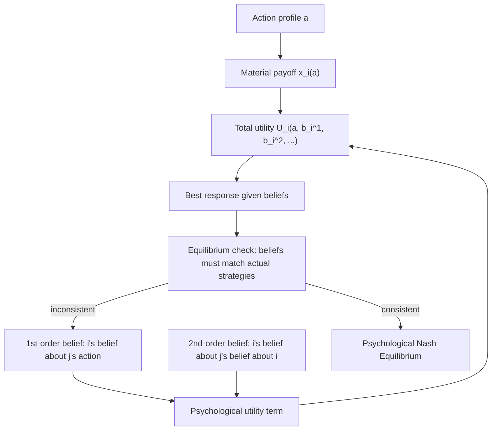

## Psychological Game Theory and Belief-Dependent Preferences

### Overview

Psychological game theory (PGT) extends standard game theory by allowing players' utility functions to depend not only on the actions and outcomes of the game but also on players' **beliefs** — both their beliefs about others' actions and their higher-order beliefs about what others believe. This framework, formalized by Geanakoplos, Pearce, and Stacchetti (1989) and substantially developed by Battigalli and Dufwenberg (2009), provides the mathematical foundation underlying reciprocity, guilt aversion, anger, surprise, and other emotionally-driven behaviors that cannot be captured in classical games where utility depends only on the material outcome.

### Motivating Problem

Standard game theory defines a player's payoff as a function solely of the action profile chosen: $u_i(a_1, \ldots, a_n)$. This formulation cannot represent behaviors that are demonstrably belief-dependent — for example, a person who feels guilty for disappointing someone's expectations, regardless of the material outcome, or someone who reciprocates a kind action *because* they perceived it as intentionally kind, not merely because of its payoff consequence. Rabin's fairness equilibrium (see Social Preferences and Fairness Models) was an early belief-dependent model, but it was defined only for simultaneous-move games. PGT was developed to provide a fully general, dynamically consistent framework in which utility can depend on arbitrarily high orders of belief, applicable to both simultaneous and sequential games.

### Core Structure: Belief-Dependent Utility

In a psychological game, a player's utility depends on the full action profile **and** a hierarchy of beliefs:

$$U_i(a, b_i^1, b_i^2, \ldots)$$

where:

- $a = (a_1, \ldots, a_n)$ is the action profile,
- $b_i^1$ is player $i$'s **first-order belief**: a probability distribution over opponents' actions/types,
- $b_i^2$ is player $i$'s **second-order belief**: a belief about others' first-order beliefs (i.e., what $i$ thinks others think $i$ will do),
- higher orders $b_i^k$ extend this recursively.

**Key Points**

- This formulation nests standard game theory as the special case where $U_i$ does not actually depend on any $b_i^k$ term.
- Because beliefs themselves depend on the equilibrium being played (players' beliefs must be consistent with actual strategies in equilibrium), psychological games require a modified equilibrium concept — a **psychological Nash equilibrium** — where both actions and the belief hierarchies that enter utility are mutually consistent fixed points.
- The framework can, in principle, extend to arbitrarily high orders of belief, though most applied models truncate at first- or second-order beliefs for tractability, since these are sufficient to represent phenomena like guilt aversion and reciprocity.

### Psychological Nash Equilibrium

**Formal definition**

A strategy profile $\sigma^*$ together with a belief hierarchy $b^*$ constitutes a psychological Nash equilibrium if, for every player $i$:

1. $\sigma_i^*$ maximizes $U_i(a, b_i^*)$ given the belief hierarchy $b_i^*$ and opponents' strategies $\sigma_{-i}^*$.
2. The belief hierarchy $b_i^*$ is **correct**: $i$'s first-order belief about $j$'s action matches $j$'s actual equilibrium strategy $\sigma_j^*$, and $i$'s second-order belief about what $j$ believes about $i$ matches $i$'s actual equilibrium strategy $\sigma_i^*$, and so on recursively.

**Key Points**

- Condition 2 is the crucial addition relative to Nash equilibrium: beliefs are not just consistent with opponents' strategies (as in Nash equilibrium's implicit correct-beliefs assumption about actions) but are themselves *arguments in the utility function* that must be pinned down consistently.
- Because utility depends on beliefs that depend on the equilibrium strategy, psychological Nash equilibrium is a genuinely more complex fixed-point problem than standard Nash equilibrium, sometimes requiring iterative or numerical solution methods even in simple games.

### Guilt Aversion

Guilt aversion, formalized within PGT primarily by Battigalli and Dufwenberg (2007), models a player's disutility from letting down another player's expectations, independent of the material payoff consequence.

**Formal structure**

A common specification defines player $i$'s guilt-adjusted utility as:

$$U_i(a) = x_i(a) - \theta_i \cdot \max(0, \, E_j[x_j \mid b_j^1] - x_j(a))$$

where:

- $x_i(a)$ is $i$'s material payoff from action profile $a$,
- $E_j[x_j \mid b_j^1]$ is what player $i$ believes player $j$ **expects** to receive (i.e., $i$'s second-order belief about $j$'s first-order belief),
- $x_j(a)$ is $j$'s actual realized payoff,
- $\theta_i \geq 0$ is a guilt-sensitivity parameter.

**Key Points**

- The guilt term is only active when $i$ delivers *less* than $j$ was believed to expect — guilt is asymmetric, triggered by disappointing expectations, not by exceeding them.
- This directly predicts behavior in **trust games**: a trustee who believes the truster expects a generous return will return more than a self-interested trustee would, purely to avoid the guilt of disappointing that belief — even absent any repeated-game or reputational incentive.
- Guilt aversion differs sharply from Fehr-Schmidt-style inequity aversion because it depends on *expectations*, not on the *realized distribution* of payoffs: a trustee facing a truster who expected little would feel less guilt returning little, even if the resulting split were identical in payoff terms to a case involving a truster who expected a lot.

### Example: Guilt Aversion in the Trust Game

**Example**

Consider a trust game where the sender transmits an amount that is tripled, and the receiver decides how much to return.

- Suppose the receiver believes (second-order belief) that the sender expects a return of $15 out of a $30 tripled pot.
- If the receiver returns only $5, guilt-adjusted disutility includes a term $\theta_i \times \max(0, 15 - 5) = 10\theta_i$.
- For a receiver with sufficiently high $\theta_i$, the guilt cost of returning $5 may exceed the $10 material gain from keeping it rather than returning $15, making the higher return utility-maximizing.
- This produces a testable comparative static: if the sender's transfer (and hence the receiver's inferred expectation) increases, the guilt-averse receiver's optimal return should increase correspondingly — a pattern used to empirically distinguish guilt aversion from simple unconditional altruism, since altruism alone does not predict return amounts should track the sender's *expectations* specifically.

### Reciprocity Revisited: Formal Kindness in PGT

Rabin's kindness-based reciprocity (introduced in Social Preferences and Fairness Models) is itself a psychological game construct — it depends explicitly on second-order beliefs (perceived kindness requires believing something about what the other player believed they were giving up). PGT provides the general mathematical scaffolding that makes Rabin's original normal-form model and its extensive-form extension (Dufwenberg-Kirchsteiger's Sequential Reciprocity Equilibrium) formally well-defined as belief-dependent utility maximization problems within a consistent equilibrium framework.

**Key Points**

- **Kindness function**: player $i$'s kindness toward $j$ is defined relative to an "equitable" payoff — typically the average of the highest and lowest payoffs $i$ could feasibly have given $j$ (excluding Pareto-dominated choices) — so that kindness is measured relative to what was *possible*, not merely what was *given*.
- **Reciprocation**: player $j$'s response is modeled as $j$'s kindness toward $i$ being proportional to how kind $j$ perceives $i$ to have been, weighted by a reciprocity-sensitivity parameter, closing the belief loop that defines psychological Nash equilibrium in this setting.

### Other Belief-Dependent Emotions Modeled in PGT

**Key Points**

- **Anger/frustration**: modeled as disutility triggered when a player's realized payoff falls below a belief-dependent reference point attributed to another player's *intentional* choice, distinguishing anger from mere disappointment at an impersonal outcome (e.g., bad luck).
- **Surprise**: some extensions model utility shifts triggered by the gap between a first-order belief and the realized action, independent of the payoff consequence of that gap.
- **Anxiety/suspense**: models incorporating belief-dependent utility during the resolution of uncertainty, relevant to games with sequential information revelation (e.g., anticipatory utility in dynamic decision problems).
- These extensions generally follow the same architecture as guilt aversion — a baseline material payoff term plus an additive psychological term that is a function of some belief hierarchy — differing primarily in which belief order and which reference comparison enters the emotional term.

### Dynamic Psychological Games and Belatti-Dufwenberg's Framework

Battigalli and Dufwenberg (2009) generalized PGT to fully dynamic (multi-stage) games, which required addressing how belief hierarchies update along the game tree as information is revealed.

**Key Points**

- In dynamic PGT, beliefs at each information set must be derived via **belief updating** consistent with the game's information structure (analogous to Bayesian updating in signaling games), and the utility function can depend on beliefs held at any point along the path of play, not just terminal beliefs.
- This dynamic extension enables modeling of sequential guilt and reciprocity — for example, a player who forms an intention early in the game and is later held to account for whether they honored the expectation that intention created, formalized via **sequential psychological equilibrium**, an extension analogous to how subgame-perfect equilibrium extends Nash equilibrium to dynamic settings.

### Comparison Table: PGT vs. Other Behavioral Frameworks

| Framework | Utility Depends On | Belief Order Required | Equilibrium Concept |
| --- | --- | --- | --- |
| Standard game theory | Action profile only | None | Nash equilibrium |
| Fehr-Schmidt / ERC (outcome-based) | Own and others' realized payoffs | None | Nash equilibrium with modified utility |
| Rabin's Fairness Equilibrium | Perceived kindness (implicit beliefs about intent) | 2nd order | Fairness equilibrium (a PGT special case) |
| Guilt aversion | Gap between belief-dependent expectation and realized payoff | 2nd order | Psychological Nash equilibrium |
| General PGT | Arbitrary belief hierarchies | Arbitrary (typically 1st–2nd in practice) | Psychological Nash equilibrium / sequential psychological equilibrium |
| Level-k / Cognitive Hierarchy | Own payoff only, with bounded reasoning about opponent type | Implicit in reasoning depth, not utility argument | Not an equilibrium concept (non-equilibrium) |
| QRE | Own payoff only, with noisy best response | None (beliefs about opponents' mixed strategies, standard sense) | Quantal Response Equilibrium |

### Diagram: Belief Hierarchy Structure in PGT

### Diagram: Guilt Aversion Mechanism (svg_diagram)

<svg xmlns="http://www.w3.org/2000/svg" viewBox="0 0 700 300">
<text x="350" y="25" font-size="16" font-weight="bold" text-anchor="middle" fill="#1a1a1a">Guilt Aversion Mechanism in the Trust Game (svg_diagram)</text>
<rect x="40" y="60" width="180" height="55" rx="8" fill="#e8f0fe" stroke="#1a56db" stroke-width="2" />
<text x="130" y="82" font-size="12" text-anchor="middle" fill="#1a1a1a">Sender's 1st-order belief:</text>
<text x="130" y="98" font-size="12" text-anchor="middle" fill="#1a1a1a">expects return of $E</text>
<rect x="270" y="60" width="180" height="55" rx="8" fill="#fef3e8" stroke="#c2410c" stroke-width="2" />
<text x="360" y="82" font-size="12" text-anchor="middle" fill="#1a1a1a">Receiver's 2nd-order belief:</text>
<text x="360" y="98" font-size="12" text-anchor="middle" fill="#1a1a1a">believes sender expects $E</text>
<rect x="500" y="60" width="170" height="55" rx="8" fill="#fce8f0" stroke="#9d174d" stroke-width="2" />
<text x="585" y="82" font-size="12" text-anchor="middle" fill="#1a1a1a">Receiver chooses</text>
<text x="585" y="98" font-size="12" text-anchor="middle" fill="#1a1a1a">actual return $R</text>
<rect x="270" y="180" width="180" height="70" rx="8" fill="#e8f8ee" stroke="#15803d" stroke-width="2" />
<text x="360" y="205" font-size="12" text-anchor="middle" fill="#1a1a1a">Guilt term:</text>
<text x="360" y="222" font-size="12" text-anchor="middle" fill="#1a1a1a">θ × max(0, E − R)</text>
<text x="360" y="239" font-size="11" text-anchor="middle" fill="#555">active only if R &lt; E</text>
<line x1="220" y1="88" x2="270" y2="88" stroke="#333" stroke-width="2" marker-end="url(#g1)" />
<line x1="450" y1="88" x2="500" y2="88" stroke="#333" stroke-width="2" marker-end="url(#g1)" />
<line x1="360" y1="115" x2="360" y2="180" stroke="#333" stroke-width="2" marker-end="url(#g1)" />
<line x1="585" y1="115" x2="420" y2="180" stroke="#333" stroke-width="2" marker-end="url(#g1)" />
</svg>

### Empirical Testing and Identification Strategies

**Key Points**

- Testing guilt aversion and reciprocity models empirically typically requires **belief elicitation**: directly measuring subjects' first- and second-order beliefs (often incentivized with a proper scoring rule) rather than relying solely on inferred parameters, since belief-dependent theories make predictions specifically about the causal role of elicited beliefs.
- A common identification strategy manipulates the *information* a player has about another's expectations (e.g., revealing versus concealing what the sender expects) to test whether behavior tracks elicited beliefs, as belief-dependent models predict, rather than tracking observed actions or realized payoffs alone.
- Distinguishing guilt aversion from simple altruism or inequity aversion empirically requires designs where the *belief* and the *realized payoff distribution* can be varied independently — for example, holding constant the final payoff split while manipulating what the recipient believed to expect. [Inference: this identification approach is the standard methodological strategy in the literature testing belief-dependent theories, though the precise experimental designs vary by study.]

### Applications

- **Behavioral contract theory**: modeling guilt-averse agents in principal-agent settings, where anticipated guilt from disappointing a principal's expectations can substitute for or interact with monetary incentive schemes.
- **Organizational behavior**: explaining effort provision and reciprocal cooperation in teams and gift-exchange labor relationships beyond what pure inequity aversion predicts.
- **Marketing and persuasion**: modeling consumer guilt in response to perceived expectations (e.g., charitable solicitation framing that raises perceived donor expectations).
- **Political economy**: modeling politician behavior driven by anticipated voter disappointment (belief-dependent accountability), distinct from purely reputational or electoral-incentive-based models.

### Critiques and Limitations

**Key Points**

- **Complexity and tractability**: solving for psychological Nash equilibria is substantially more demanding than standard Nash equilibrium, since beliefs at every order must be simultaneously pinned down consistently, which limits applicability to relatively small or highly stylized games in most applied work.
- **Belief elicitation validity**: because these models hinge on subjects' actual beliefs, empirical tests depend heavily on the validity and incentive-compatibility of belief elicitation methods, and elicited beliefs may not perfectly reflect the beliefs actually driving behavior. [Unverified: the extent of measurement error in incentivized belief elicitation is debated and varies by elicitation mechanism.]
- **Parameter and specification proliferation**: as with outcome-based social preference models, multiple competing formalizations of guilt, reciprocity, and related emotions coexist, and no single specification has been established as uniquely correct across all experimental contexts. [Inference: this reflects an active and unresolved area of theoretical and empirical research rather than a settled consensus.]
- **Higher-order belief measurement difficulty**: while the framework permits arbitrarily high belief orders, reliably eliciting third-order-or-higher beliefs from human subjects is empirically very difficult, in practice constraining most applied models to first- and second-order beliefs regardless of theoretical generality.

### Relationship to Other Behavioral Game Theory Frameworks

Psychological game theory sits conceptually "above" outcome-based social preference models (Fehr-Schmidt, ERC), providing the general belief-dependent utility architecture that intention-based fairness (Rabin) and guilt aversion require but that purely outcome-based inequity aversion does not. It is largely orthogonal to level-k/cognitive hierarchy models (which constrain the *depth* of strategic reasoning about opponents' actions) and to QRE (which introduces noise into best response), since PGT instead modifies *what enters the utility function itself*. In principle, all three modifications — bounded reasoning depth, noisy best response, and belief-dependent utility — can be combined within a single structural model, though such fully integrated specifications are computationally demanding and comparatively rare in applied work.

### Conclusion

Psychological game theory generalizes classical game theory by admitting belief hierarchies as direct arguments in players' utility functions, providing the rigorous mathematical foundation for modeling guilt, reciprocity, anger, and related emotionally and socially grounded behaviors that purely outcome-based models cannot represent. Through the psychological Nash equilibrium concept — and its dynamic extension, sequential psychological equilibrium — the framework formalizes how beliefs about actions and beliefs about beliefs must be mutually consistent with actual play, enabling precise, testable predictions such as guilt-driven reciprocation in trust games. While computationally demanding and reliant on the validity of belief elicitation for empirical testing, PGT remains the most general and theoretically foundational framework within behavioral game theory for representing belief-dependent preferences.

**Related Topics**

- Guilt aversion experiments and incentivized belief elicitation methods
- Sequential Reciprocity Equilibrium (Dufwenberg-Kirchsteiger) as a PGT application
- Anger, disappointment, and reference-dependent emotion models in dynamic games
- Behavioral contract theory with guilt-averse agents
- Higher-order belief measurement techniques in experimental economics
- Combining psychological game theory with QRE and level-k reasoning
- Sequential psychological equilibrium in multi-stage games
- Comparing intention-based versus outcome-based fairness models empirically