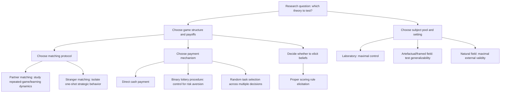

## Experimental Methods in Game Theory

### Overview

Experimental methods in game theory encompass the design, implementation, and analysis of controlled laboratory and field studies used to test strategic behavior predictions against human subjects. These methods provide the empirical foundation for behavioral game theory frameworks such as level-k/cognitive hierarchy models, quantal response equilibrium, social preference models, and psychological game theory, by generating the systematic deviations from classical predictions that those models are built to explain. Experimental economics as a field was substantially shaped by Vernon Smith and Reinhard Selten, whose work (recognized in the 2002 Nobel Memorial Prize in Economic Sciences, shared with Daniel Kahneman) established many of the methodological standards discussed below.

### Motivating Problem

Game-theoretic predictions are, in principle, testable: they specify precise equilibrium strategies for well-defined games. However, testing these predictions rigorously requires controlling for confounds that field data cannot easily rule out — subjects' true payoffs, information sets, beliefs about opponents, and the incentive structure must all be known and controllable to the experimenter. Laboratory experiments were developed specifically to create this controlled environment, allowing researchers to isolate the causal effect of game structure on behavior and to cleanly test whether observed play matches Nash equilibrium, level-k, QRE, or social preference predictions.

### Core Methodological Principles

**Key Points**

- **Induced value theory**: subjects' preferences over abstract tokens or points are induced via a monetary payment scheme (points convert to real money at a known exchange rate), allowing the experimenter to control the payoff structure of the induced game precisely, independent of subjects' pre-existing preferences over the tokens themselves.
- **Salience**: rewards must be clearly and saliently tied to subjects' actual decisions, so that subjects perceive a genuine, cognitively engaged connection between their choices and their financial outcomes.
- **Dominance**: monetary incentives from the experiment must be large enough to dominate any subjective costs or psychological considerations unrelated to the induced game (e.g., effort costs of decision-making), so that behavior reflects the intended incentive structure rather than incidental factors.
- **Privacy**: subjects are typically informed only of their own payoff function (and the structure/rules of the game), not necessarily other subjects' induced values, unless the experimental design specifically calls for common knowledge of payoffs (as most game-theoretic predictions require).
- These four principles, originally articulated by Vernon Smith, form the classical justification for treating laboratory behavior as informative about the underlying induced game, rather than merely an artifact of the lab environment.

### Incentive Compatibility and Payment Mechanisms

**Key Points**

- **Show-up fee**: a fixed payment guaranteed for participation, used to compensate for time and travel independent of performance, and to ensure recruitment is not confounded by risk of zero payment.
- **Random payment / one-task-in-many selection**: when subjects complete multiple decisions or games in a single session, one task is randomly selected (ex post) for actual payment, intended to preserve incentive compatibility across all tasks without requiring the experimenter to pay for every decision — though this assumes subjects do not exhibit strong non-expected-utility violations (e.g., certain forms of narrow bracketing) that could distort behavior in randomly-paid designs. [Inference: the validity of random payment mechanisms under non-expected-utility preferences is a genuinely debated methodological question in experimental economics, not a fully settled matter.]
- **Binary lottery procedure**: converts payoffs into probabilities of winning a fixed prize, intended to control for risk aversion by inducing (approximately) risk-neutral behavior over the induced points, though its effectiveness depends on subjects' preferences conforming closely to expected utility theory.
- **Direct cash payment**: subjects are paid the literal point total earned, the most common and straightforward mechanism, though it leaves risk preferences over money as a potential confound in games involving risk (e.g., mixed-strategy equilibrium tests).

### Common Experimental Designs

**Between-subjects vs. within-subjects designs**

- **Between-subjects**: different subjects are assigned to different treatment conditions (e.g., different game parameters), avoiding contamination from experience in other conditions but requiring larger sample sizes to achieve statistical power.
- **Within-subjects**: the same subjects experience multiple treatment conditions, increasing statistical power per subject but introducing potential order effects, learning, and spillover between conditions that must be controlled for (e.g., via randomized or counterbalanced ordering).

**Repeated play designs**

- **Partner matching**: the same group of subjects plays repeatedly against each other across rounds, allowing reputation and learning dynamics to develop — appropriate for studying repeated-game phenomena like cooperation sustained by punishment strategies.
- **Stranger matching (perfect stranger design)**: subjects are re-randomized into new groups/pairings each round so that no subject plays against the same opponent twice, isolating one-shot strategic behavior from repeated-game reputation effects across a session.
- **Fixed vs. random matching within stranger designs**: some designs further randomize whether subjects even know they won't be re-matched, addressing subtle strategic considerations about whether subjects believe reputation effects are possible.

**Key Points**

- The choice between partner and stranger matching is critical for interpretation: level-k, CH, and QRE are typically tested using stranger-matching, one-shot-style designs to isolate initial/non-learned strategic responses, while learning models (e.g., experience-weighted attraction) require repeated exposure, often under partner matching, to observe convergence dynamics.

### Instructions and Common Knowledge

**Key Points**

- Game-theoretic solution concepts typically assume common knowledge of the game's rules and payoff structure; experimental instructions are therefore written and often orally reinforced (sometimes accompanied by comprehension quizzes) to establish this common knowledge as rigorously as possible.
- **Framing and context-neutral language**: instructions commonly use abstract, neutral terminology (e.g., "Player A" and "Player B" rather than loaded terms) to avoid unintentionally cueing social norms or emotional associations that could confound tests of a specific theoretical prediction — though deliberate framing manipulations are themselves sometimes the experimental treatment of interest (e.g., testing whether "Community Game" versus "Wall Street Game" framing changes cooperation rates in a prisoner's dilemma).
- **Comprehension checks**: many designs include control questions verifying subjects understand payoff calculations before play begins, with failure to answer correctly sometimes leading to exclusion or additional instruction, to reduce the confound of simple misunderstanding being mistaken for a substantive behavioral deviation.

### Eliciting Beliefs

Belief elicitation is central to testing level-k, cognitive hierarchy, and psychological game theory models, all of which make predictions about players' actual beliefs, not just their actions.

**Key Points**

- **Proper scoring rules** (e.g., the quadratic scoring rule): incentivize subjects to report their true subjective probability distribution over an uncertain event (such as an opponent's action) by structuring the payment so that expected payoff is uniquely maximized by truthful reporting.
- A commonly used form of the quadratic scoring rule pays:

$$\text{Payoff} = M - c \sum_{k} (r_k - \mathbb{1}[\text{outcome} = k])^2$$

where $r_k$ is the reported probability on outcome $k$, $\mathbb{1}[\cdot]$ is an indicator function, and $M, c$ are scaling constants; this payoff is maximized in expectation only when $r_k$ equals the subject's true belief.

- **Incentive confound with risk aversion**: naive scoring-rule elicitation is not perfectly incentive-compatible under non-expected-utility risk preferences, since risk-averse subjects may distort reports toward $50/50$ to reduce payoff variance; corrections include the **binary lottery procedure** applied specifically to the belief-elicitation payment, or econometric adjustments assuming a specific risk-preference model.
- Belief elicitation is sometimes paired with **incentivized guessing** in beauty-contest-style games to directly compare stated beliefs against chosen actions, testing whether choices are consistent with best-responding to reported beliefs — a key test of internal consistency for level-k and CH models.

### Statistical and Econometric Analysis

**Key Points**

- **Maximum likelihood estimation (MLE)** is the dominant method for fitting structural behavioral models (level-k population shares, CH's $\tau$, QRE's $\lambda$, Fehr-Schmidt's $\alpha, \beta$) to observed choice data, since these models generate explicit choice probability predictions that can be directly compared to observed frequencies.
- **Mixture models**: because individual subjects are rarely perfectly classified into a single "type" (e.g., a single level-k level), finite mixture models estimate the population-level distribution of types simultaneously with individual-level type-assignment probabilities.
- **Panel/clustering considerations**: because the same subject typically makes multiple decisions across a session, standard errors must account for within-subject correlation (e.g., via clustering at the subject level), and analyses distinguishing between-subject and within-subject variation require appropriately specified random-effects or clustered models.
- **Non-parametric tests**: for simpler comparisons (e.g., contribution levels across two treatments), non-parametric tests such as the Mann-Whitney U test or Wilcoxon signed-rank test are commonly used alongside or instead of parametric regression, particularly with smaller sample sizes typical of lab experiments.

### Laboratory vs. Field Experiments

**Key Points**

- **Laboratory experiments**: offer maximal control over information, payoffs, and matching, at the cost of relying on a subject pool (often university students) whose representativeness of the broader population is a recurring methodological concern.
- **Artefactual field experiments**: use the same controlled design as lab experiments but recruit a non-standard subject pool (e.g., professionals, a specific target population) to test whether lab findings generalize beyond student subjects.
- **Framed field experiments**: embed the experimental task within a real-world context or framing relevant to the subject pool (e.g., a bargaining game framed around an actual market subjects participate in), while retaining researcher control over the treatment.
- **Natural field experiments**: subjects are unaware they are participating in an experiment, maximizing external validity but sacrificing some experimental control (e.g., subjects' full payoff functions and beliefs about the game structure cannot always be verified as intended).
- This taxonomy (List, 2007) is widely used to organize claims about the external validity of experimental game theory findings, from tightly controlled lab studies to naturalistic field settings.

### Online and Large-Scale Experimental Platforms

**Key Points**

- Online subject pools (e.g., Prolific, Amazon Mechanical Turk, and university-run online panels) have substantially expanded sample sizes and subject pool diversity available to experimental game theorists relative to traditional in-person lab sessions.
- Online experiments introduce distinct methodological concerns: reduced monitoring of attention and comprehension, potential for multiple/duplicate participation, and weaker enforcement of prohibitions against subjects consulting outside resources or communicating with each other during the study, all of which typically require additional attention-check and comprehension-verification design elements beyond those used in physical labs. [Inference: the relative data-quality trade-offs between online and physical lab experiments are an active area of methodological research and vary by platform and study design.]
- Software platforms such as oTree, z-Tree, and similar frameworks are widely used to implement both in-person and online interactive game-theoretic experiments, handling real-time matching, payoff computation, and data recording.

### Common Threats to Validity

**Key Points**

- **Experimenter demand effects**: subjects may adjust behavior based on perceived expectations of the experimenter rather than pure incentive-driven optimization, motivating neutral framing and, in some designs, deception-free protocols to avoid subjects second-guessing the stated rules.
- **Hawthorne-type effects**: awareness of being observed/studied may itself alter behavior, a general concern for any lab-based measurement of naturally occurring conduct.
- **Deception**: many experimental economics venues enforce a strict no-deception norm (unlike some psychology subfields), reasoning that subject trust in truthful instructions is a public good for the subject pool and the discipline; violating this can contaminate future studies if subjects learn to distrust instructions. [Inference: the no-deception norm is widely enforced by experimental economics journals and professional associations, though enforcement mechanisms and definitions of what constitutes deception can vary by venue.]
- **Selection into the subject pool**: volunteer subject pools are not random samples of any broader population, and self-selection into game-theory experiments specifically may correlate with unobserved traits (e.g., risk tolerance, cognitive style) relevant to the very behaviors being studied.
- **Small stakes / hypothetical bias**: results obtained under low-stakes lab payments may not generalize to higher-stakes real-world decisions; stake-size robustness checks (comparing behavior across payment levels) are a common way of probing this concern, with mixed and context-dependent findings on how strongly increasing stakes shifts behavior. [Unverified: the magnitude and direction of stake-size effects vary considerably across game types and studies.]

### Preregistration and Replication

**Key Points**

- **Preregistration**: specifying hypotheses, sample size, and analysis plans before data collection has become an increasingly standard practice in experimental economics, intended to reduce researcher degrees of freedom (e.g., selective reporting of significant results, post hoc hypothesis formation) and improve the credibility of confirmatory tests of theoretical predictions.
- **Replication studies**: large-scale replication projects have examined whether canonical experimental game theory findings (e.g., specific treatment effects in trust or public goods games) reproduce across independent labs and subject pools, contributing to an ongoing broader assessment of replicability standards across the social sciences. [Unverified: aggregate replication rates specific to experimental game theory, as distinct from experimental economics or psychology more broadly, should be checked against current systematic reviews rather than assumed from any single study.]

### Diagram: Experimental Design Decision Flow

### Diagram: Belief Elicitation via Scoring Rule (svg_diagram)

<svg xmlns="http://www.w3.org/2000/svg" viewBox="0 0 700 300">
<text x="350" y="25" font-size="16" font-weight="bold" text-anchor="middle" fill="#1a1a1a">Quadratic Scoring Rule Incentive Structure (svg_diagram)</text>
<rect x="40" y="60" width="200" height="55" rx="8" fill="#e8f0fe" stroke="#1a56db" stroke-width="2" />
<text x="140" y="82" font-size="12" text-anchor="middle" fill="#1a1a1a">Subject's true belief</text>
<text x="140" y="98" font-size="12" text-anchor="middle" fill="#1a1a1a">over opponent's action</text>
<rect x="290" y="60" width="200" height="55" rx="8" fill="#fef3e8" stroke="#c2410c" stroke-width="2" />
<text x="390" y="82" font-size="12" text-anchor="middle" fill="#1a1a1a">Reported probability</text>
<text x="390" y="98" font-size="12" text-anchor="middle" fill="#1a1a1a">vector r_k</text>
<rect x="540" y="60" width="130" height="55" rx="8" fill="#fce8f0" stroke="#9d174d" stroke-width="2" />
<text x="605" y="82" font-size="12" text-anchor="middle" fill="#1a1a1a">Realized outcome</text>
<text x="605" y="98" font-size="12" text-anchor="middle" fill="#1a1a1a">observed</text>
<rect x="290" y="180" width="200" height="70" rx="8" fill="#e8f8ee" stroke="#15803d" stroke-width="2" />
<text x="390" y="205" font-size="12" text-anchor="middle" fill="#1a1a1a">Payoff = M − c·Σ(r_k − 1[outcome=k])²</text>
<text x="390" y="225" font-size="11" text-anchor="middle" fill="#555">maximized only when r_k = true belief</text>
<line x1="140" y1="115" x2="140" y2="145" stroke="#333" stroke-width="2" />
<line x1="140" y1="145" x2="390" y2="145" stroke="#333" stroke-width="2" marker-end="url(#e1)" />
<line x1="390" y1="115" x2="390" y2="180" stroke="#333" stroke-width="2" marker-end="url(#e1)" />
<line x1="605" y1="115" x2="490" y2="215" stroke="#333" stroke-width="2" marker-end="url(#e1)" />
</svg>

### Applications of Experimental Findings to Model Estimation

**Key Points**

- Experimental data from beauty-contest games directly supplies the empirical target used to estimate level-k population shares and CH's $\tau$ parameter, as discussed in Level-k and Cognitive Hierarchy Models.
- Coordination and dominance-solvable game experiments supply the choice-frequency data used to estimate QRE's precision parameter $\lambda$.
- Ultimatum, dictator, trust, and public goods game data provide the moment conditions used to estimate Fehr-Schmidt, ERC, and Rabin-style reciprocity parameters, as discussed in Social Preferences and Fairness Models.
- Trust game designs combined with incentivized belief elicitation directly test guilt aversion and other belief-dependent predictions from psychological game theory.

### Critiques and Limitations of Experimental Methods Generally

**Key Points**

- **External validity concerns**: even well-controlled lab findings may not generalize to naturalistic, high-stakes, or socially embedded real-world strategic interactions, a persistent tension across the experimental economics literature. [Inference: this is a broadly acknowledged limitation discussed across the methodological literature, not a claim specific to any one study.]
- **WEIRD subject pools**: the historical reliance on university student subjects from Western, Educated, Industrialized, Rich, and Democratic societies raises generalizability concerns that cross-cultural and cross-population replications (including framed and natural field experiments) are specifically designed to address.
- **Publication bias**: as in other empirical social sciences, a documented historical tendency to publish statistically significant or theoretically novel findings more readily than null results can distort the apparent weight of evidence for or against specific behavioral models; preregistration and registered-report formats are among the methodological responses developed to mitigate this. [Unverified: the current magnitude of publication bias specifically within experimental game theory, versus economics or the social sciences broadly, should be checked against up-to-date meta-scientific analyses.]

### Conclusion

Experimental methods in game theory provide the controlled empirical infrastructure necessary to test, distinguish between, and estimate the parameters of the behavioral models developed throughout this chapter — level-k and cognitive hierarchy reasoning, quantal response equilibrium, social preference and fairness models, and psychological game theory. Grounded in induced value theory and refined through decades of methodological development around incentive compatibility, matching protocols, belief elicitation, and threats to validity, these methods remain the primary mechanism by which behavioral game theory moves from theoretical proposal to empirically disciplined science. Continuing developments in online experimentation, preregistration, and large-scale replication are actively reshaping the methodological standards of the field.

**Related Topics**

- Induced value theory and the foundations of experimental economics (Vernon Smith)
- Proper scoring rules and risk-preference corrections in belief elicitation
- oTree, z-Tree, and software infrastructure for interactive experiments
- Laboratory versus field experiment taxonomy (List's classification)
- Preregistration and the replication crisis in experimental social science
- Structural estimation methods for level-k, CH, QRE, and social preference models
- Online subject pools and data-quality considerations (Prolific, MTurk)
- Cross-cultural experimental game theory and WEIRD sample generalizability