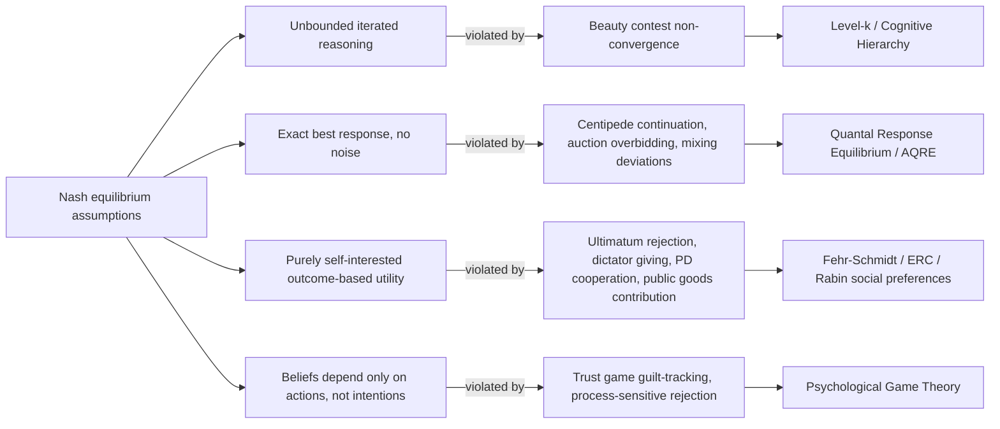

## Empirical Anomalies from Nash Predictions

### Overview

This topic catalogs the systematic, robustly replicated deviations between Nash equilibrium predictions and observed human behavior across canonical experimental games. These anomalies constitute the empirical evidence base that motivated the behavioral game theory frameworks covered elsewhere in this chapter — level-k/cognitive hierarchy models, quantal response equilibrium, social preference models, and psychological game theory. Rather than presenting a new model, this topic organizes the empirical patterns themselves: what Nash equilibrium predicts, what is actually observed, and which behavioral framework(s) were developed to address each anomaly.

### Motivating Problem

Nash equilibrium requires common knowledge of rationality, correct beliefs about opponents' strategies, and payoff-maximizing behavior with no regard for others' outcomes. Testing these joint assumptions experimentally reveals specific, recurring failure points rather than uniform random noise — behavior deviates from Nash predictions in structured, theory-relevant ways. Cataloging these anomalies precisely is necessary both to motivate behavioral alternatives and to specify exactly which assumption (reasoning depth, precision, or utility function) each anomaly implicates.

### Anomaly 1: Overplay of Cooperation in One-Shot Prisoner's Dilemma

**Key Points**

- **Nash prediction**: mutual defection is the unique dominant-strategy equilibrium; cooperation should never occur in a truly one-shot interaction with no reputation or repeated-game incentive.
- **Observed behavior**: cooperation rates in one-shot prisoner's dilemma experiments are consistently well above zero, commonly in the range of 30–50% depending on stakes, framing, and subject pool. [Unverified: exact cooperation rates vary substantially across studies, payoff magnitudes, and framing manipulations, and should not be treated as a fixed universal constant.]
- **Implicated assumption**: pure self-interested payoff maximization; addressed primarily by social preference models (inequity aversion, altruism) and reciprocity-based psychological game theory.

### Anomaly 2: Non-Convergence in the p-Beauty Contest Game

**Key Points**

- **Nash prediction**: with $p < 1$, iterated elimination of dominated strategies yields a unique equilibrium of $0$ for all players.
- **Observed behavior**: first-round choices cluster around values consistent with 1–3 steps of iterated reasoning from a naive starting point (commonly reported clustering near $33$, $22$, and $17$ under $p = 2/3$), not at $0$; convergence toward lower values occurs only gradually across repeated rounds with the same fixed group of players.
- **Implicated assumption**: common knowledge of rationality and unbounded iterated reasoning; directly motivates level-k and cognitive hierarchy models (see Level-k and Cognitive Hierarchy Models).

### Anomaly 3: Rejection of Positive Offers in the Ultimatum Game

**Key Points**

- **Nash prediction** (subgame-perfect equilibrium): the proposer offers the smallest positive unit possible, and the responder accepts any positive offer, since something exceeds nothing for a purely self-interested responder.
- **Observed behavior**: modal offers cluster around 40–50% of the pie, and offers below approximately 20–30% are frequently rejected — responders forgo strictly positive payoffs to punish perceived unfairness.
- **Implicated assumption**: pure self-interested utility (rejection of a positive payoff is irrational under standard preferences); directly motivates inequity aversion (Fehr-Schmidt, Bolton-Ockenfels) and reciprocity/kindness-based models (Rabin), as covered in Social Preferences and Fairness Models.

### Anomaly 4: Positive Giving in the Dictator Game

**Key Points**

- **Nash prediction**: since the responder cannot reject or retaliate, a purely self-interested dictator should allocate zero to the recipient.
- **Observed behavior**: dictators typically give positive, non-trivial amounts (commonly reported averages fall in a wide range depending on design details, framing, and social distance manipulations), though giving is generally lower than in the ultimatum game, consistent with removing the strategic threat of rejection while some other-regarding motive remains.
- **Implicated assumption**: pure self-interested utility, isolated from strategic rejection-avoidance concerns present in the ultimatum game; motivates altruism and advantageous-inequality-aversion terms (the $\beta$ parameter in Fehr-Schmidt) specifically, since this game removes the strategic confound present in the ultimatum game.

### Anomaly 5: Over-Contribution in Public Goods Games

**Key Points**

- **Nash prediction**: with a marginal per-capita return less than 1, full free-riding (zero contribution) is the unique dominant-strategy equilibrium.
- **Observed behavior**: initial-round contributions average well above zero (commonly reported in the range of 40–60% of endowments), though contributions typically decay across repeated rounds toward, but rarely fully reaching, the zero-contribution prediction.
- **Implicated assumption**: pure self-interested utility combined with the assumption of no conditional cooperation; addressed by social preference models incorporating reciprocity/conditional cooperation, and by learning models explaining the decay pattern across rounds (distinct from the static anomaly itself).

### Anomaly 6: Reciprocation in the Trust Game

**Key Points**

- **Nash prediction**: a purely self-interested receiver returns nothing regardless of the amount sent, so a purely self-interested sender should send nothing anticipating this.
- **Observed behavior**: senders typically transfer a substantial share of their endowment, and receivers return positive amounts that often (though not always) roughly track the amount sent, contradicting both backward-induction steps of the standard prediction.
- **Implicated assumption**: pure self-interested utility on the part of the receiver, and correct anticipation of self-interested receiver behavior by the sender; addressed by both outcome-based social preference models and, more precisely (since return amounts often track the sender's *expectations* rather than just the amount sent), guilt-aversion models within psychological game theory.

### Anomaly 7: Backward Induction Failure in the Centipede Game

**Key Points**

- **Nash prediction** (subgame-perfect equilibrium via backward induction): the first mover should end the game immediately at the very first opportunity, since backward induction unravels cooperation from the last node forward.
- **Observed behavior**: players typically continue passing the growing pot for several rounds beyond the predicted immediate-stop point, with the very last-round defection also occurring far less than full backward induction would suggest at every preceding node.
- **Implicated assumption**: common knowledge of rationality propagated through the entire game tree; addressed by Agent Quantal Response Equilibrium (AQRE), which allows noisy responses at every node so that continuation is not immediately unraveled by anticipated future noise, as covered in Quantal Response Equilibrium.

### Anomaly 8: Overbidding in First-Price Sealed-Bid Auctions

**Key Points**

- **Nash prediction**: under the risk-neutral independent private values benchmark, bidders shade their bid below their true valuation by a specific factor determined by the number of bidders.
- **Observed behavior**: bidders systematically bid above the risk-neutral Nash prediction, a highly robust finding across many independent studies and auction formats.
- **Implicated assumption**: risk-neutral, precisely optimizing bidders; addressed by risk-aversion adjustments to the benchmark, QRE-based noisy bidding models, and level-k reasoning applied to auction strategy — illustrating that a single anomaly can have multiple, not mutually exclusive, behavioral explanations. [Inference: which explanation dominates for overbidding is an actively contested empirical question, with risk aversion, QRE, and level-k reasoning each finding support in different studies; no single account is universally accepted as the primary driver.]

### Anomaly 9: Coordination Failure and Equilibrium Selection

**Key Points**

- **Nash prediction**: in games with multiple pure-strategy equilibria (e.g., stag hunt or minimum-effort coordination games), any of the equilibria is equally valid as a prediction under standard Nash equilibrium alone, which provides no selection criterion among them.
- **Observed behavior**: play often fails to coordinate on the Pareto-efficient equilibrium, particularly as group size increases in minimum-effort ("weak-link") coordination games, with play frequently converging toward lower-payoff equilibria as strategic uncertainty about others' actions grows.
- **Implicated assumption**: Nash equilibrium's silence on equilibrium selection under multiplicity; addressed by the QRE correspondence's equilibrium-selection property (see Quantal Response Equilibrium) and by level-k reasoning about the salience of the risk-dominant versus payoff-dominant equilibrium.

### Anomaly 10: Positive Rejection Under Guilt-Independent Fairness Manipulations

**Key Points**

- **Nash prediction**: with outcomes held constant, the *process* by which an outcome was reached (e.g., whether a low ultimatum offer arose from a constrained versus unconstrained proposer action set) should not affect a purely outcome-maximizing responder's decision.
- **Observed behavior**: identical low offers are rejected at different rates depending on whether the proposer had a genuine alternative to being fair, indicating that intent, not just outcome, drives responder behavior.
- **Implicated assumption**: outcome-only utility (as embedded even in outcome-based social preference models like Fehr-Schmidt); this anomaly specifically distinguishes intention-based models (Rabin's fairness equilibrium, psychological game theory) from purely outcome-based inequity aversion, since outcome-based models alone cannot generate this process-sensitivity.

### Anomaly 11: Violations of Expected Utility and Mixed-Strategy Equilibrium Predictions

**Key Points**

- **Nash prediction**: in games with a unique mixed-strategy equilibrium (e.g., matching pennies variants), players should randomize with the specific probabilities that make opponents indifferent between their own pure strategies.
- **Observed behavior**: observed mixing frequencies frequently deviate systematically from the exact equilibrium probabilities, and serial correlation patterns in sequences of choices (e.g., "hot hand" or gambler's-fallacy-like alternation patterns) often violate the i.i.d. randomization the equilibrium concept implicitly assumes.
- **Implicated assumption**: precise randomization at exact equilibrium probabilities; addressed by QRE (explaining systematic frequency deviations via noisy best response) and by note that reinforcement/belief-learning models are typically needed to explain the sequential correlation patterns specifically, which QRE alone (as a static equilibrium concept) does not directly address.

### Summary Table: Anomalies and Corresponding Behavioral Frameworks

| Anomaly | Game | Nash Prediction | Observed Pattern | Primary Framework(s) Addressing It |
| --- | --- | --- | --- | --- |
| Cooperation | One-shot PD | Mutual defection | 30–50% cooperation | Social preferences, reciprocity |
| Non-convergence | Beauty contest | All choose 0 | Clustering near 17–33 | Level-k, Cognitive Hierarchy |
| Rejection | Ultimatum game | Accept any positive offer | Rejects offers below ~20–30% | Fehr-Schmidt, ERC, Rabin |
| Positive giving | Dictator game | Give 0 | Positive non-trivial giving | Fehr-Schmidt (β), altruism |
| Over-contribution | Public goods | Contribute 0 | 40–60% initial contribution | Reciprocity, conditional cooperation |
| Reciprocation | Trust game | Return 0 | Positive, expectation-tracking returns | Guilt aversion, social preferences |
| Continued play | Centipede game | Stop immediately | Continue several rounds | AQRE |
| Overbidding | First-price auction | Shaded bid below value | Bids above risk-neutral Nash | Risk aversion, QRE, level-k |
| Miscoordination | Weak-link games | Any equilibrium equally valid | Convergence to low-payoff equilibria | QRE selection, level-k |
| Process sensitivity | Modified ultimatum | Outcome alone determines response | Intent affects rejection | Rabin, psychological game theory |
| Mixing deviations | Matching pennies variants | Exact equilibrium mixing probabilities | Systematic frequency deviations | QRE |

### Diagram: Anomaly-to-Framework Mapping

### Diagram: Magnitude of Deviation Across Games (svg_diagram)

<svg xmlns="http://www.w3.org/2000/svg" viewBox="0 0 700 340">
<text x="350" y="25" font-size="16" font-weight="bold" text-anchor="middle" fill="#1a1a1a">Nash Prediction vs. Typical Observed Behavior (svg_diagram)</text>
<line x1="120" y1="290" x2="680" y2="290" stroke="#333" stroke-width="2" />
<line x1="120" y1="290" x2="120" y2="60" stroke="#333" stroke-width="2" />
<text x="60" y="60" font-size="11" text-anchor="middle" fill="#1a1a1a">% of pie / endowment</text>

<text x="180" y="305" font-size="10" text-anchor="middle" fill="`#1a1a1a`">Ultimatum</text>

<rect x="160" y="270" width="20" height="20" fill="`#c2410c`" />

<rect x="185" y="150" width="20" height="140" fill="`#1a56db`" />

<text x="195" y="145" font-size="9" text-anchor="middle" fill="`#1a1a1a`">~45%</text>

<text x="170" y="265" font-size="9" text-anchor="middle" fill="`#1a1a1a`">~0%</text>

<text x="330" y="305" font-size="10" text-anchor="middle" fill="`#1a1a1a`">Dictator</text>

<rect x="310" y="270" width="20" height="20" fill="`#c2410c`" />

<rect x="335" y="220" width="20" height="70" fill="`#1a56db`" />

<text x="345" y="215" font-size="9" text-anchor="middle" fill="`#1a1a1a`">~20%</text>

<text x="480" y="305" font-size="10" text-anchor="middle" fill="`#1a1a1a`">Public Goods</text>

<rect x="460" y="270" width="20" height="20" fill="`#c2410c`" />

<rect x="485" y="140" width="20" height="150" fill="`#1a56db`" />

<text x="495" y="135" font-size="9" text-anchor="middle" fill="`#1a1a1a`">~50%</text>

<text x="600" y="305" font-size="10" text-anchor="middle" fill="`#1a1a1a`">Trust (return)</text>

<rect x="580" y="270" width="20" height="20" fill="`#c2410c`" />

<rect x="605" y="180" width="20" height="110" fill="`#1a56db`" />

<text x="615" y="175" font-size="9" text-anchor="middle" fill="`#1a1a1a`">~35%</text>

<rect x="450" y="55" width="15" height="15" fill="#c2410c" />
<text x="475" y="67" font-size="11" fill="#1a1a1a">Nash prediction</text>
<rect x="450" y="78" width="15" height="15" fill="#1a56db" />
<text x="475" y="90" font-size="11" fill="#1a1a1a">Typical observed</text>
</svg>

### Why These Anomalies Are Structured, Not Random Noise

**Key Points**

- A central empirical fact motivating the entire behavioral game theory research program is that deviations from Nash predictions are not merely mean-zero noise around the equilibrium prediction — they are systematically directional (e.g., consistently *toward* fairness, cooperation, or bounded reasoning depth) and often quantitatively predictable across related games using a common small set of parameters ($\alpha, \beta$; $\tau$; $\lambda$; $\theta$).
- This structure is precisely what justifies replacing pure Nash equilibrium with parametrized behavioral alternatives rather than simply adding unstructured error terms to the standard model — the deviations carry theoretically meaningful content about reasoning depth, decision precision, or utility composition. [Inference: this interpretive framing — that anomalies reflect structured psychological mechanisms rather than measurement noise — is the standard justification offered across the behavioral game theory literature for developing distinct parametrized models, though the precise mechanism underlying any given anomaly remains an object of ongoing empirical investigation.]

### Cross-Game Consistency and Its Limits

**Key Points**

- Some behavioral parameters estimated in one game show reasonable qualitative consistency when applied to predict behavior in structurally related games (e.g., inequity aversion parameters estimated from ultimatum games informing predictions in related bargaining games).
- However, cross-game parameter stability is imperfect: level-k classifications, $\tau$ estimates, $\lambda$ estimates, and social preference parameters estimated from one game frequently do not transfer with high precision to a different game, an important caveat raised as a limitation within each individual framework's own coverage (see Level-k and Cognitive Hierarchy Models, Quantal Response Equilibrium, and Social Preferences and Fairness Models). [Unverified: the degree of cross-game transferability is study- and parameter-specific and should not be generalized as either uniformly strong or uniformly weak.]

### Applications of Cataloging Anomalies

- **Model selection and testing**: identifying which specific anomaly a given experimental design targets clarifies which behavioral framework(s) that design is actually equipped to test, avoiding conflation between distinct explanatory mechanisms (e.g., distinguishing bounded reasoning from noisy best response from social preference).
- **Mechanism design robustness**: mechanism designers use this catalog to stress-test proposed mechanisms against known behavioral deviations (e.g., checking auction formats against documented overbidding patterns) rather than relying solely on risk-neutral Nash benchmarks.
- **Policy-relevant behavioral prediction**: public goods and coordination game anomalies directly inform predictions about voluntary compliance, tax behavior, and collective action problems in applied public economics.
- **Curriculum and theory development**: the anomaly catalog itself functions as the empirical scaffolding connecting classical game theory to each subsequent behavioral model covered in this chapter.

### Critiques and Limitations

**Key Points**

- **Overlapping explanations**: several anomalies (e.g., auction overbidding, coordination failure) admit multiple plausible behavioral explanations, and distinguishing between competing accounts typically requires carefully designed experiments targeting their specific divergent predictions rather than accepting any single explanation by default.
- **External validity of laboratory anomalies**: as discussed in Experimental Methods in Game Theory, the degree to which laboratory-documented anomalies generalize to higher-stakes, real-world, or non-WEIRD populations remains an active empirical question rather than a settled matter.
- **Magnitude variability**: precise quantitative magnitudes reported for any given anomaly (e.g., exact rejection rates, exact contribution percentages) vary meaningfully across studies, stakes, and populations, so the qualitative *direction* of each anomaly is far more robust than any single reported magnitude. [Unverified: readers should consult current meta-analyses for up-to-date magnitude estimates rather than treating any single figure as a fixed constant.]

### Conclusion

The catalog of empirical anomalies from Nash predictions — spanning cooperation, iterated reasoning, fairness, reciprocity, backward induction, auction bidding, coordination, and mixed-strategy randomization — provides the structured, replicated evidence base that behavioral game theory as a field was built to explain. Each anomaly implicates a specific classical assumption (unbounded reasoning, precise optimization, or purely self-interested outcome-based utility), and each maps onto one or more of the parametrized behavioral frameworks covered in this chapter: level-k/cognitive hierarchy, quantal response equilibrium, social preference models, and psychological game theory. Understanding this anomaly-to-framework mapping is essential for correctly interpreting what any given behavioral model is, and is not, designed to explain.

**Related Topics**

- Meta-analyses and magnitude estimates across replicated experimental game theory findings
- Distinguishing competing explanations for auction overbidding (risk aversion vs. QRE vs. level-k)
- Learning models (experience-weighted attraction) explaining anomaly decay across repeated rounds
- Cross-cultural replication of ultimatum game and public goods game anomalies
- Mechanism design robustness checks against documented behavioral anomalies
- Weak-link (minimum-effort) coordination games and group-size effects on miscoordination
- Hot hand and gambler's fallacy patterns in mixed-strategy equilibrium experiments
- Historical development of behavioral game theory as a response to accumulated anomalies