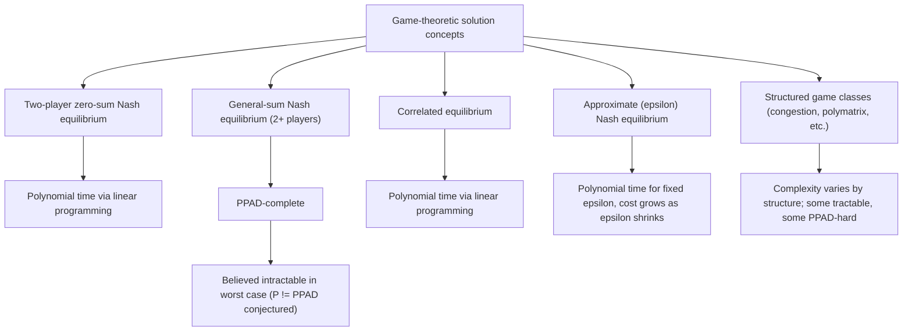

## Computational Complexity of Equilibria

### Overview

The computational complexity of equilibria addresses the algorithmic question of how hard it is to *compute* a Nash equilibrium (or related solution concepts) given a game's description, as opposed to merely proving equilibria exist. This subfield of algorithmic game theory established that finding a Nash equilibrium is, in a precise complexity-theoretic sense, unlikely to be solvable in polynomial time even for finite, well-specified games — a landmark result formalized through the complexity class **PPAD** (Polynomial Parity Argument on Directed graphs).

### Motivating Problem

Nash's existence theorem guarantees that every finite game has at least one mixed-strategy equilibrium, but existence proofs (via Brouwer's or Kakutani's fixed-point theorems) are inherently non-constructive — they do not supply an efficient algorithm for finding that equilibrium. This creates a foundational tension for any application treating Nash equilibrium as a *predictive* or *prescriptive* solution concept: if computing the equilibrium requires more computational resources than any real player (human or algorithmic) plausibly has, the equilibrium's status as a behaviorally realistic prediction is undermined. Formalizing exactly how hard this computation is became a central research question at the intersection of computer science and game theory.

### Background: Complexity Classes P, NP, and Why Neither Fits

**Key Points**

- **P** (polynomial time): problems solvable by a deterministic algorithm in time polynomial in input size. No general polynomial-time algorithm for computing Nash equilibria in arbitrary finite games is known.
- **NP** (nondeterministic polynomial time): the class of decision problems whose solutions can be *verified* in polynomial time. Nash equilibrium computation does not naturally fit as an NP-completeness question because it is a **search problem** (find *a* solution) rather than a decision problem (does *a* solution with a given property exist) — and, critically, a Nash equilibrium is guaranteed to exist by Nash's theorem, so the "does a solution exist" question is trivially always "yes," making standard NP-completeness reductions inapplicable.
- This mismatch — a search problem whose existence is guaranteed but whose solution appears hard to construct — motivated the definition of an entirely new complexity class tailored to this style of problem: **TFNP** (Total Function NP, problems that are guaranteed to have a solution, with search being the computational task) and, within it, **PPAD**.

### PPAD: The Complexity Class for Nash Equilibrium

**Formal characterization**

PPAD problems are characterized by an existence proof based on a specific combinatorial argument: in any directed graph where every node has in-degree and out-degree at most 1, if a node with an unmatched incoming edge exists (a "source"), there must exist another such unbalanced node (a "sink") reachable via directed paths — this parity-based existence argument mirrors the structure of Sperner's lemma and Brouwer's fixed-point theorem, both of which underlie Nash's original existence proof.

**Key Points**

- **Sperner's Lemma** provides a discrete, combinatorial analogue of Brouwer's fixed-point theorem: any properly colored triangulation of a simplex must contain a small "rainbow" sub-simplex containing all colors, and this fact is used constructively as the combinatorial engine underlying PPAD-membership proofs for Nash equilibrium computation.
- **Lemke-Howson algorithm**: a classical pivoting algorithm (predating the PPAD formalization) for computing a single Nash equilibrium of a two-player game, which follows a path analogous to the simplex method in linear programming; its worst-case running time is exponential, and it was later used as the canonical example establishing that Nash equilibrium computation is PPAD-complete, since the algorithm's path-following structure directly mirrors the PPAD existence argument.
- **PPAD-completeness result**: Daskalakis, Goldberg, and Papadimitriou (2006) proved that computing a Nash equilibrium in a general game with **three or more players** is PPAD-complete; Chen and Deng (2006) extended the PPAD-completeness result to the **two-player** case, showing that even the simplest non-trivial setting is PPAD-hard.
- **Interpretation of PPAD-completeness**: because PPAD is believed (though not proven) to be strictly harder than P — analogous to the widely-believed but unproven separation of P and NP — PPAD-completeness of Nash equilibrium computation is interpreted as strong evidence that no efficient (polynomial-time) general algorithm exists, though this remains conditional on the unproven conjecture $P \neq PPAD$.

### Why This Matters for Behavioral Interpretation

**Key Points**

- If computing a Nash equilibrium is computationally intractable in the worst case, this raises a direct challenge to using Nash equilibrium as a descriptive model of behavior: boundedly rational human players (or even sophisticated algorithmic agents) cannot be assumed to simply "compute" the equilibrium the way classical game theory implicitly assumes.
- This computational hardness result is sometimes cited as an independent, complexity-theoretic justification for the behavioral alternatives covered elsewhere in this course — level-k/cognitive hierarchy models (bounded iterated reasoning), quantal response equilibrium (noisy, imprecise optimization), and learning models — since these frameworks do not require players to solve a PPAD-hard fixed-point problem, but instead use tractable, iterative, or heuristic procedures. [Inference: while the PPAD-hardness result is a rigorously established mathematical fact, its interpretation as an *explanation* for observed behavioral deviations from Nash equilibrium is a widely discussed connection in the algorithmic game theory literature rather than a directly tested causal claim.]

### Complexity of Other Equilibrium and Solution Concepts

**Correlated equilibrium**

- Unlike Nash equilibrium, a correlated equilibrium (where players' strategies may be correlated via a public signal) can be computed in **polynomial time** for normal-form games via linear programming, since the correlated equilibrium set is defined by linear incentive-compatibility constraints over a probability distribution on the joint action space.
- This computational tractability is a major reason correlated equilibrium is often preferred as a solution concept in algorithmic mechanism design contexts where computational feasibility is a first-class design constraint.

**Zero-sum games**

- Two-player zero-sum games are a notable tractable special case: Nash equilibria can be computed in polynomial time via **linear programming**, since the minimax theorem (von Neumann) guarantees that the equilibrium payoff corresponds to the solution of a linear program's primal-dual pair.
- This tractability does **not** extend to general-sum games, which is precisely where the PPAD-completeness results apply.

**Nash equilibria in specific structured games**

- **Congestion games** (where PPAD-hardness of general Nash computation does not directly transfer) admit pure-strategy Nash equilibria that can sometimes be found via **potential function** methods (Rosenthal's potential function), though finding the *global optimum* of that potential function, as opposed to *any* local optimum corresponding to an equilibrium, can itself be computationally hard depending on the specific congestion game structure. [Inference: the precise complexity classification of Nash equilibrium computation varies considerably by specific structured game class, and general statements should be checked against the specific subclass of interest.]
- **Zero-sum polymatrix games** and certain other structured multi-player settings have been shown to retain polynomial-time tractability, illustrating that PPAD-hardness is a property of *general* games rather than a universal barrier across all game structures. [Unverified: the full landscape of which structured game classes retain tractability is an active area of ongoing research and should be checked against current literature for any specific game class of interest.]

### Approximate Nash Equilibria

Given the hardness of computing *exact* Nash equilibria, substantial research has focused on **approximate** equilibria, where a player's payoff need only be within $\epsilon$ of their best response payoff rather than exactly optimal.

**Key Points**

- **$\epsilon$-Nash equilibrium**: a strategy profile where no player can improve their payoff by more than $\epsilon$ via unilateral deviation.
- Approximation algorithms exist that compute $\epsilon$-Nash equilibria in polynomial time for various fixed values of $\epsilon$, though achieving very small $\epsilon$ (approaching an exact equilibrium) generally still faces PPAD-related hardness barriers, and known approximation guarantees historically could not be pushed arbitrarily close to $\epsilon = 0$ in polynomial time without resolving the underlying PPAD-completeness barrier.
- This line of research produces a **complexity-approximation tradeoff curve**: as the required approximation quality $\epsilon$ shrinks toward exact equilibrium, computational cost grows, mirroring similar tradeoffs found throughout approximation algorithm theory for other NP-hard and PPAD-hard problems.

### Complexity of Computing Equilibria in Specific Game Classes

| Game Class | Nash Equilibrium Complexity | Notes |
| --- | --- | --- |
| Two-player zero-sum | Polynomial time (LP) | Via minimax theorem duality |
| Two-player general-sum | PPAD-complete | Chen and Deng (2006) |
| Three-or-more-player general-sum | PPAD-complete | Daskalakis, Goldberg, Papadimitriou (2006) |
| Correlated equilibrium (any # players) | Polynomial time (LP) | Linear incentive-compatibility constraints |
| Congestion games (pure-strategy equilibrium existence) | Existence guaranteed via potential function; finding one can vary by structure | Rosenthal's potential function |
| Symmetric games | PPAD-complete in general | Still inherits general hardness in most formulations [Unverified: some symmetric subclasses admit tractable special-case algorithms] |

### Diagram: Complexity Landscape of Equilibrium Concepts

### Diagram: PPAD Existence Argument Structure (svg_diagram)

<svg xmlns="http://www.w3.org/2000/svg" viewBox="0 0 700 320">
<text x="350" y="25" font-size="16" font-weight="bold" text-anchor="middle" fill="#1a1a1a">PPAD Directed Graph Existence Argument (svg_diagram)</text>
<circle cx="100" cy="150" r="24" fill="#e8f8ee" stroke="#15803d" stroke-width="2" />
<text x="100" y="155" font-size="11" text-anchor="middle" fill="#1a1a1a">Source</text>
<circle cx="260" cy="100" r="20" fill="#e8f0fe" stroke="#1a56db" stroke-width="2" />
<circle cx="260" cy="200" r="20" fill="#e8f0fe" stroke="#1a56db" stroke-width="2" />
<circle cx="420" cy="150" r="20" fill="#e8f0fe" stroke="#1a56db" stroke-width="2" />
<circle cx="580" cy="150" r="24" fill="#fce8f0" stroke="#9d174d" stroke-width="2" />
<text x="580" y="155" font-size="11" text-anchor="middle" fill="#1a1a1a">Sink</text>
<line x1="120" y1="145" x2="245" y2="108" stroke="#333" stroke-width="2" marker-end="url(#p1)" />
<line x1="120" y1="155" x2="245" y2="195" stroke="#333" stroke-width="2" marker-end="url(#p1)" />
<line x1="278" y1="105" x2="405" y2="145" stroke="#333" stroke-width="2" marker-end="url(#p1)" />
<line x1="278" y1="195" x2="405" y2="155" stroke="#333" stroke-width="2" marker-end="url(#p1)" />
<line x1="440" y1="150" x2="558" y2="150" stroke="#333" stroke-width="2" marker-end="url(#p1)" />

<text x="350" y="270" font-size="12" text-anchor="middle" fill="#555">Every node has in/out-degree ≤ 1.</text>

<text x="350" y="288" font-size="12" text-anchor="middle" fill="#555">An unmatched "source" node guarantees a reachable unmatched "sink" — this parity argument, applied to a discretized game, proves a Nash equilibrium exists without directly constructing it efficiently.</text>

</svg>

### Algorithmic Approaches in Practice

**Key Points**

- **Lemke-Howson algorithm**: remains the standard method for computing a single exact Nash equilibrium in two-player games in practice, despite worst-case exponential running time, since it performs efficiently on many practically encountered game instances.
- **Support enumeration**: an alternative approach that enumerates candidate supports (subsets of pure strategies assigned positive probability) and checks the resulting linear feasibility system, computationally expensive in the worst case (exponential in the number of pure strategies) but straightforward to implement for small games.
- **Fictitious play and other learning dynamics**: iterative procedures that are simple to implement and can converge to Nash equilibria in specific game classes (e.g., zero-sum games), though they do not converge to Nash equilibrium in general games, and are more directly connected to behavioral learning models than to structural equilibrium computation guarantees.
- **Global Newton methods and homotopy/continuation methods**: numerical approaches (also used for computing QRE, as covered in Quantal Response Equilibrium) that can compute equilibria effectively in many practical instances despite the absence of general polynomial-time worst-case guarantees.

### Relationship to Mechanism Design and Algorithmic Game Theory

**Key Points**

- Computational complexity results directly inform **mechanism design**: a mechanism whose equilibrium requires participants (or the mechanism operator) to solve a PPAD-hard problem is a practically significant design flaw, motivating a preference for mechanisms with computationally tractable equilibrium concepts (e.g., dominant-strategy mechanisms, which require no equilibrium computation at all since truth-telling is optimal regardless of others' strategies).
- The complexity of equilibria is a foundational topic within **algorithmic game theory**, a field explicitly concerned with the computational aspects of strategic interaction, distinguishing it from classical game theory's traditional focus on existence and characterization of equilibria without regard to computational cost.
- **Price of anarchy** analysis (quantifying the efficiency loss from strategic behavior relative to a social optimum) is a related but distinct algorithmic game theory concept, concerned with the *quality* of equilibria rather than the *computational cost* of finding them; the two lines of research are complementary components of the broader algorithmic game theory research program.

### Applications

- **Network routing and congestion games**: computational tractability of equilibria in traffic and network routing models directly affects the feasibility of using equilibrium predictions for real-time network management systems.
- **Auction and mechanism design for automated systems**: computational complexity results guide the design of algorithmic auction mechanisms (e.g., online advertising auctions) where equilibrium computation may need to occur in real time or at scale.
- **Multi-agent reinforcement learning**: PPAD-hardness results inform expectations about whether decentralized learning algorithms in multi-agent AI systems can be guaranteed to converge to Nash equilibria, motivating research into alternative, more tractable solution concepts (e.g., correlated equilibria, or approximate equilibria) for multi-agent learning systems.
- **Cryptographic and blockchain protocol design**: complexity-theoretic equilibrium analysis has been applied to game-theoretic security analyses of decentralized protocols, where participants' strategic incentives and their computational tractability both matter for protocol robustness.

### Critiques and Limitations

**Key Points**

- **Worst-case vs. typical-case complexity**: PPAD-completeness is a worst-case hardness result; many practically encountered games may admit efficient equilibrium computation despite the general worst-case hardness, so PPAD-completeness does not imply every specific game instance is hard in practice.
- **Conditional nature of hardness conclusions**: the interpretation of PPAD-completeness as genuine intractability rests on the unproven conjecture $P \neq PPAD$; while this is broadly accepted analogously to $P \neq NP$, it remains formally unresolved.
- **Behavioral relevance is interpretive, not directly causal**: while computational hardness is often cited as a complementary justification for bounded-rationality behavioral models, the connection between formal worst-case complexity results and the specific cognitive mechanisms underlying observed human deviations from Nash equilibrium is an interpretive bridge rather than a directly established causal or mechanistic link. [Inference: this caveat reflects a widely acknowledged distinction in the algorithmic game theory literature between formal complexity results and their informal use as behavioral motivation.]

### Conclusion

The computational complexity of equilibria establishes, through the PPAD-completeness of Nash equilibrium computation, that no efficient general algorithm for finding Nash equilibria is likely to exist — a foundational result connecting fixed-point existence proofs (Brouwer, Sperner) to formal computational hardness. This result sits alongside notable tractable special cases (zero-sum games, correlated equilibria) and motivates both algorithmic research into approximate equilibria and a broader interpretive connection to bounded-rationality behavioral models covered elsewhere in this course. As a cornerstone of algorithmic game theory, this complexity landscape directly shapes practical considerations in mechanism design, network economics, and multi-agent computational systems.

**Related Topics**

- Lemke-Howson algorithm implementation and worst-case versus practical performance
- Correlated equilibrium computation via linear programming
- Price of anarchy and efficiency loss in strategic systems
- Approximate ($\epsilon$-Nash) equilibrium algorithms and approximation-complexity tradeoffs
- PPAD-completeness proofs and their connection to Sperner's Lemma and Brouwer's fixed-point theorem
- Complexity of equilibria in structured game classes (congestion games, polymatrix games)
- Multi-agent reinforcement learning convergence guarantees and equilibrium concepts
- Mechanism design with computationally tractable solution concepts (dominant-strategy mechanisms)