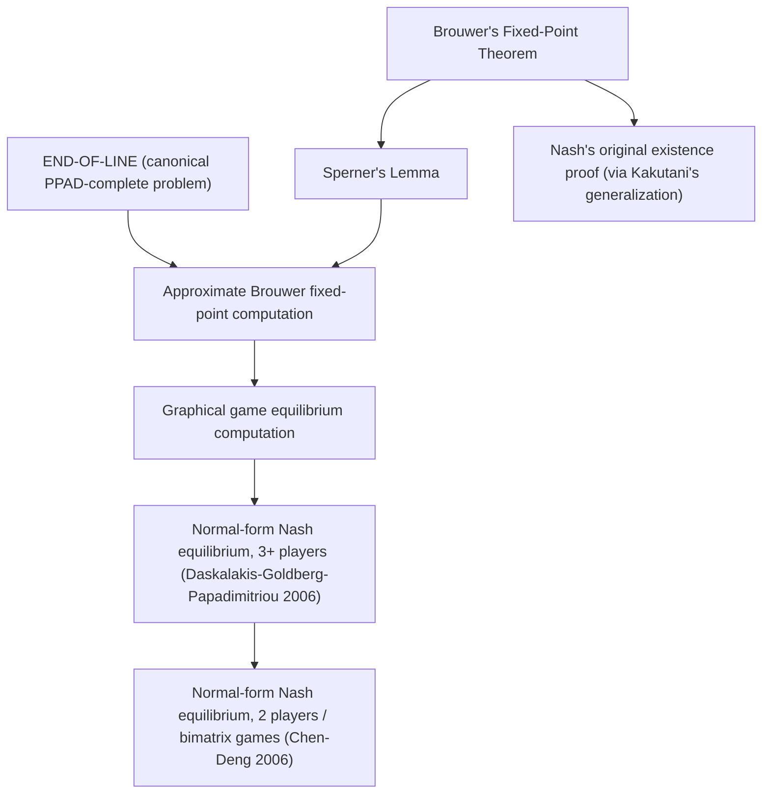

## PPAD-Completeness

### Overview

PPAD-completeness is a formal complexity-theoretic classification establishing that a computational problem is among the hardest problems in the complexity class PPAD (Polynomial Parity Argument on Directed graphs). The most significant application of this classification in game theory is the result that computing a Nash equilibrium of a finite normal-form game is PPAD-complete, meaning it is exactly as hard as every other problem in PPAD and, if solved in polynomial time, would imply a polynomial-time algorithm for all PPAD problems. This topic details the formal definition of PPAD, the structure of PPAD-completeness proofs, and the specific reductions establishing Nash equilibrium's place within this class.

### Motivating Problem

Classical complexity theory classifies decision problems using P, NP, and NP-completeness, but Nash equilibrium computation is a **search problem with a guaranteed solution** (Nash's theorem proves every finite game has an equilibrium), not a decision problem whose existence is in question. Standard NP-completeness reductions require the possibility that no solution exists, which does not apply here. PPAD was defined specifically to capture this class of "guaranteed to exist, hard to find" problems, providing the correct formal framework for classifying Nash equilibrium's computational difficulty.

### TFNP and the Guaranteed-Existence Problem Class

**Key Points**

- **TFNP** (Total Function NP): the class of search problems in NP for which every valid input is guaranteed to have at least one solution, and any proposed solution can be verified in polynomial time. Nash equilibrium computation belongs to TFNP because Nash's existence theorem guarantees a solution always exists.
- TFNP is believed to contain problems strictly harder than P but is not believed to be NP-hard in the traditional sense, since the "no" instance that NP-hardness reductions typically rely on cannot occur (a solution always exists) — TFNP occupies a distinct complexity niche between P and NP-hardness.
- TFNP is further subdivided into syntactically defined subclasses based on *which combinatorial argument* guarantees the existence of a solution. **PPAD** is the subclass whose existence guarantee follows from a **directed graph parity argument**; other subclasses include **PPA** (undirected graph parity argument), **PLS** (Polynomial Local Search, guaranteed by the existence of a local optimum), and **PPP** (Polynomial Pigeonhole Principle).

### Formal Definition of PPAD

**The END-OF-LINE problem (PPAD's canonical complete problem)**

PPAD is formally defined via a canonical problem, **END-OF-LINE**, which captures the essential combinatorial structure of the class:

- **Input**: an implicitly defined directed graph on an exponentially large vertex set (represented compactly via two polynomial-time computable functions, a "successor" function $S$ and a "predecessor" function $P$, applied to vertex labels), where every vertex has in-degree and out-degree at most 1, and a designated starting vertex known to have an unmatched incoming edge (a "source").
- **Output**: any other vertex with unbalanced degree (either a source with no incoming edge or a sink with no outgoing edge) — guaranteed to exist because in a graph where all degrees are ≤ 1, the source vertex must lie on a directed path, and any finite path must terminate somewhere, so at least one additional unbalanced vertex is guaranteed to exist.

**Key Points**

- The existence guarantee for END-OF-LINE is a direct application of the **handshake-lemma-style parity argument**: in any graph with maximum degree 1 per direction, unbalanced vertices come in a specific parity relationship, so a known unbalanced vertex (the given source) guarantees the existence of at least one more.
- **PPAD is defined as the class of all TFNP problems polynomial-time reducible to END-OF-LINE**, meaning a problem is in PPAD if a solution to it can be efficiently transformed into a solution of some instance of END-OF-LINE, and vice versa for completeness.
- Because the graph is exponentially large but implicitly defined by polynomial-time computable functions, the problem is nontrivial: an algorithm cannot simply enumerate all vertices, but must exploit the structure of $S$ and $P$ to efficiently locate an unbalanced vertex.

### Defining PPAD-Completeness

**Formal definition**

A problem $L$ is **PPAD-complete** if:

1. $L \in$ PPAD (a solution to $L$ can be verified in polynomial time, and $L$ polynomial-time reduces to END-OF-LINE), and
2. Every problem in PPAD polynomial-time reduces to $L$ (i.e., $L$ is PPAD-hard).

**Key Points**

- PPAD-completeness places $L$ among the "hardest" problems in PPAD: an efficient (polynomial-time) algorithm for any single PPAD-complete problem would yield an efficient algorithm for *every* problem in PPAD, via the chain of reductions.
- This mirrors the logical structure of NP-completeness (where an efficient algorithm for one NP-complete problem would solve all of NP), but operates entirely within the TFNP/PPAD framework rather than classical NP.
- No polynomial-time algorithm for END-OF-LINE (or any PPAD-complete problem) is known, and none is believed to exist, though — as with $P \neq NP$ — this remains an unproven conjecture ($P \neq PPAD$).

### The Path from Brouwer's Fixed-Point Theorem to PPAD

**Key Points**

- **Brouwer's Fixed-Point Theorem**: any continuous function mapping a compact, convex set to itself has at least one fixed point. Nash's original existence proof applies Brouwer's theorem (via Kakutani's generalization for correspondences) to a best-response mapping over mixed-strategy space, proving equilibrium existence non-constructively.
- **Sperner's Lemma**: the discrete combinatorial analogue of Brouwer's theorem — any properly colored triangulation of a simplex satisfying specific boundary coloring conditions must contain a fully-colored ("rainbow") elementary sub-simplex. Sperner's Lemma provides a constructive-style combinatorial proof of Brouwer's theorem and is the key intermediate step connecting fixed-point existence to a discrete search problem.
- **From Sperner to END-OF-LINE**: the search for a rainbow simplex in Sperner's Lemma can itself be framed as a directed-graph line-following problem — following a path of adjacently-colored simplices — giving Sperner's Lemma's associated search problem (finding a panchromatic simplex) a natural PPAD structure, which is the combinatorial bridge Papadimitriou originally used to define PPAD and connect it to fixed-point computation problems like Nash equilibrium.
- This chain — Brouwer's theorem → Sperner's Lemma → discrete directed-graph search (END-OF-LINE) — is why PPAD is specifically the complexity class capturing the difficulty of computing Brouwer-style fixed points, and by extension, Nash equilibria.

### Key PPAD-Completeness Results in Game Theory

**Key Points**

- **Daskalakis, Goldberg, and Papadimitriou (2006)**: proved that computing a Nash equilibrium of a **normal-form game with three or more players** is PPAD-complete, via a reduction chain starting from a PPAD-complete fixed-point computation problem (approximating a Brouwer fixed point) through a sequence of intermediate "graphical game" constructions that simulate arbitrary PPAD circuits using game-theoretic gadgets.
- **Chen and Deng (2006)**: extended and sharpened this result to show that even computing a Nash equilibrium of a **two-player normal-form game** (sometimes referred to as the "bimatrix game" case) is PPAD-complete, closing the gap left by the three-or-more-player result and establishing that PPAD-hardness is not an artifact of having many players.
- **Reduction strategy (general structure)**: these proofs construct a polynomial-time reduction from END-OF-LINE (or an equivalent PPAD-complete fixed-point problem) to Nash equilibrium computation, by building a game whose equilibria are forced, via carefully designed payoff structures ("gadgets"), to correspond to solutions of the original END-OF-LINE instance — meaning any algorithm that could efficiently compute Nash equilibria in general games could be used to efficiently solve END-OF-LINE itself.

### Illustrative Structure of a PPAD-Hardness Reduction

**Example**

While the full technical reductions in the Daskalakis-Goldberg-Papadimitriou and Chen-Deng proofs are intricate, the general reduction pattern follows this structure:

1. Start with an arbitrary instance of END-OF-LINE, defined by successor/predecessor circuits $S$ and $P$.
2. Construct a game (or sequence of games, via intermediate "generalized circuit" and "graphical game" representations) in which each player's payoff-maximizing strategy is designed to simulate evaluating $S$ or $P$ at a particular point.
3. Show that any Nash equilibrium of the constructed game must correspond to a vertex where $S$ and $P$ are "consistent" in a way that identifies an unbalanced vertex of the original END-OF-LINE graph.
4. Conclude: an efficient algorithm for finding Nash equilibria would efficiently solve END-OF-LINE, establishing PPAD-hardness of Nash equilibrium computation.

**Key Points**

- This reduction pattern is a form of **gadget-based reduction**, analogous in spirit (though technically distinct) to gadget reductions used in classical NP-completeness proofs (e.g., reducing 3-SAT to other NP-complete problems via variable and clause gadgets).
- The actual proofs require substantial additional machinery — including intermediate PPAD-complete problems such as **Brouwer function approximation** and **graphical games** — rather than a single direct reduction, reflecting the genuine technical depth of these results.

### Diagram: Reduction Chain Establishing Nash Equilibrium PPAD-Completeness

### Diagram: TFNP Subclass Structure (svg_diagram)

<svg xmlns="http://www.w3.org/2000/svg" viewBox="0 0 700 320">
<text x="350" y="25" font-size="16" font-weight="bold" text-anchor="middle" fill="#1a1a1a">TFNP and Its Syntactic Subclasses (svg_diagram)</text>
<rect x="220" y="50" width="260" height="50" rx="8" fill="#e8f0fe" stroke="#1a56db" stroke-width="2" />
<text x="350" y="80" font-size="13" text-anchor="middle" fill="#1a1a1a">TFNP: guaranteed-solution search problems</text>
<rect x="60" y="150" width="150" height="60" rx="8" fill="#fef3e8" stroke="#c2410c" stroke-width="2" />
<text x="135" y="175" font-size="12" text-anchor="middle" fill="#1a1a1a">PPAD</text>
<text x="135" y="192" font-size="10" text-anchor="middle" fill="#1a1a1a">directed graph parity</text>
<rect x="230" y="150" width="150" height="60" rx="8" fill="#fce8f0" stroke="#9d174d" stroke-width="2" />
<text x="305" y="175" font-size="12" text-anchor="middle" fill="#1a1a1a">PPA</text>
<text x="305" y="192" font-size="10" text-anchor="middle" fill="#1a1a1a">undirected graph parity</text>
<rect x="400" y="150" width="150" height="60" rx="8" fill="#e8f8ee" stroke="#15803d" stroke-width="2" />
<text x="475" y="175" font-size="12" text-anchor="middle" fill="#1a1a1a">PLS</text>
<text x="475" y="192" font-size="10" text-anchor="middle" fill="#1a1a1a">local search optimum</text>
<rect x="560" y="150" width="120" height="60" rx="8" fill="#f3e8fc" stroke="#7c3aed" stroke-width="2" />
<text x="620" y="175" font-size="12" text-anchor="middle" fill="#1a1a1a">PPP</text>
<text x="620" y="192" font-size="10" text-anchor="middle" fill="#1a1a1a">pigeonhole</text>
<line x1="300" y1="100" x2="150" y2="150" stroke="#333" stroke-width="1.5" />
<line x1="330" y1="100" x2="305" y2="150" stroke="#333" stroke-width="1.5" />
<line x1="360" y1="100" x2="470" y2="150" stroke="#333" stroke-width="1.5" />
<line x1="390" y1="100" x2="615" y2="150" stroke="#333" stroke-width="1.5" />
<rect x="90" y="245" width="90" height="35" rx="6" fill="#fff" stroke="#c2410c" stroke-width="1.5" />
<text x="135" y="267" font-size="10" text-anchor="middle" fill="#1a1a1a">Nash equilibrium</text>
<line x1="135" y1="210" x2="135" y2="245" stroke="#c2410c" stroke-width="2" marker-end="url(#t1)" />
</svg>

### Other PPAD-Complete Problems

**Key Points**

- **Sperner's Lemma (the discrete search problem)**: finding a panchromatic ("rainbow") elementary simplex in a properly colored triangulation is itself PPAD-complete, and serves as an important intermediate problem in reduction chains.
- **Market equilibrium computation**: computing a market equilibrium (competitive equilibrium prices) in certain classes of exchange economies with general (non-linear, non-Leontief) utility functions has also been shown to be PPAD-complete, extending the reach of PPAD-completeness beyond strategic games to general equilibrium theory in economics.
- **Fractional stable matching and related fixed-point problems**: several other fixed-point-flavored computational problems across economics and combinatorics have been classified as PPAD-complete, reflecting PPAD's broad applicability to any problem whose existence guarantee derives from a Brouwer-style fixed-point or parity argument. [Unverified: the precise and current catalog of known PPAD-complete problems continues to expand with ongoing research and should be checked against up-to-date complexity theory surveys for a comprehensive list.]

### Approximate PPAD-Completeness and Continuous Versions

**Key Points**

- Because PPAD-completeness proofs for Nash equilibrium often proceed through an intermediate **approximate** Brouwer fixed-point problem, a closely related and equally important result establishes that computing an $\epsilon$-approximate Nash equilibrium is also PPAD-hard for sufficiently small (inverse-polynomial or smaller) $\epsilon$, meaning the hardness barrier persists even when exact equilibrium is not required, though (as discussed in Computational Complexity of Equilibria) approximation algorithms with weaker guarantees on $\epsilon$ can still be computed efficiently.
- This distinction — between the regime of $\epsilon$ where approximate equilibria are efficiently computable, and the regime of very small $\epsilon$ where PPAD-hardness persists — is central to understanding precisely where the practical computational hardness boundary lies for Nash equilibrium approximation.

### Implications and Interpretation

**Key Points**

- PPAD-completeness is widely interpreted, analogously to NP-completeness under the $P \neq NP$ conjecture, as strong evidence of computational intractability, though it remains a conditional conclusion resting on the unproven $P \neq PPAD$ conjecture.
- The result reframes the classical game-theoretic assumption that "rational players compute the equilibrium" as computationally implausible in general, general-sum games — reinforcing a foundational, complexity-theoretic argument (distinct from, but complementary to, purely behavioral/experimental evidence) for why real strategic agents may not play exact Nash equilibrium.
- PPAD-completeness does **not** imply that *every* Nash equilibrium instance is hard to compute — it is a worst-case classification, and many practically relevant games (zero-sum games, various structured game classes, and many empirically studied small games) admit efficient equilibrium computation, as detailed in Computational Complexity of Equilibria.

### Applications

- **Theoretical computer science and economics research**: PPAD-completeness results are foundational reference points cited across algorithmic game theory, computational economics, and complexity theory research connecting game-theoretic solution concepts to formal computational hardness.
- **Guiding algorithm design**: knowledge of PPAD-completeness redirects algorithmic research away from seeking general polynomial-time exact Nash equilibrium algorithms and toward approximate algorithms, structured special cases, and alternative tractable solution concepts (e.g., correlated equilibrium).
- **Multi-agent systems and AI**: PPAD-hardness results inform the theoretical limits on what convergence guarantees decentralized multi-agent learning algorithms can be expected to achieve in general-sum settings.
- **Market design and general equilibrium computation**: PPAD-completeness results for market equilibrium computation directly parallel the game-theoretic results, informing computational expectations in computational economics and market design research.

### Critiques and Limitations

**Key Points**

- **Conditional hardness**: as with all PPAD-completeness conclusions, the practical interpretation as genuine intractability depends on the unproven $P \neq PPAD$ conjecture; a proof that $P = PPAD$ (though considered very unlikely by the research community) would overturn this interpretation entirely.
- **Worst-case, not average-case or instance-specific**: PPAD-completeness characterizes the hardest instances within the problem class; specific games of practical interest may be far easier, and empirical algorithm performance (e.g., Lemke-Howson in practice) often substantially outperforms worst-case theoretical bounds.
- **Reduction complexity and accessibility**: the actual mathematical reductions establishing PPAD-completeness for Nash equilibrium are technically intricate, involving several intermediate PPAD-complete problems (Brouwer approximation, graphical games) rather than a single direct argument, which can make the result's mechanics less immediately transparent than more classical NP-completeness reductions. [Inference: this relative technical opacity, compared to more commonly taught NP-completeness proofs, is a widely noted pedagogical observation in complexity theory and algorithmic game theory courses.]

### Conclusion

PPAD-completeness provides the precise complexity-theoretic classification explaining why computing a Nash equilibrium is believed to be computationally intractable in the worst case, formalized through the canonical END-OF-LINE problem and its foundation in the parity-argument structure connecting Brouwer's fixed-point theorem, Sperner's Lemma, and discrete directed-graph search. The landmark results of Daskalakis, Goldberg, and Papadimitriou, and of Chen and Deng, established that this hardness holds even for two-player normal-form games, cementing PPAD-completeness as one of the central results at the intersection of computer science and game theory and directly motivating the broader study of computational complexity of equilibria and its behavioral and algorithmic implications throughout algorithmic game theory.

**Related Topics**

- END-OF-LINE problem formalization and its role as PPAD's canonical complete problem
- Sperner's Lemma as a discrete analogue of Brouwer's fixed-point theorem
- Graphical games and their role as intermediate reduction targets in PPAD-completeness proofs
- TFNP subclasses: PPA, PLS, and PPP compared to PPAD
- PPAD-completeness of market equilibrium computation in general equilibrium theory
- Approximate Nash equilibrium hardness for small epsilon
- Historical development: Papadimitriou's original definition of PPAD and its motivations
- Practical algorithm performance (Lemke-Howson, homotopy methods) versus worst-case PPAD-hardness