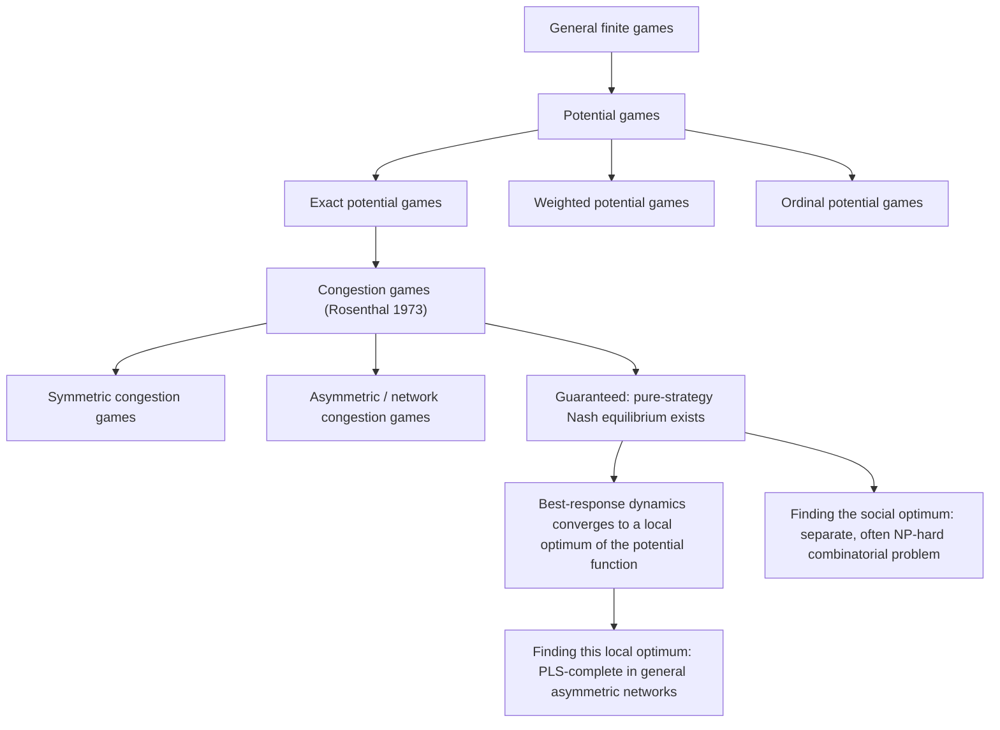

## Potential Games and Congestion Games

### Overview

Potential games are a class of strategic-form games in which the incentive structure of every player can be captured by a single, shared real-valued function called a **potential function** — a change in any player's payoff from a unilateral deviation is exactly (or ordinally) mirrored by the corresponding change in this one global function. Congestion games are a specific, highly applicable subclass of potential games, first formalized by Rosenthal (1973), in which players compete for shared resources and payoffs depend on how many players use each resource. This pairing of concepts provides one of the most computationally and structurally well-behaved corners of game theory, guaranteeing pure-strategy Nash equilibrium existence and enabling tractable equilibrium analysis where general games (per Computational Complexity of Equilibria and PPAD-Completeness) do not.

### Motivating Problem

General finite games are not guaranteed to have a pure-strategy Nash equilibrium (only a mixed-strategy one, per Nash's theorem), and even where pure equilibria exist, finding them can be PPAD-hard in general-sum games. Many real-world strategic settings — network routing, resource allocation, facility location — have structure that goes beyond the fully general case: player interactions occur only through shared, congestible resources, and players are otherwise indifferent to the identities of who else uses those resources. Potential games and congestion games formalize this structure, and in doing so, recover both pure-strategy equilibrium existence and, in significant special cases, computational tractability.

### Formal Definition: Potential Games

**Exact potential games**

A game is an **exact potential game** if there exists a function $\Phi: A \to \mathbb{R}$, defined over the joint action space $A = A_1 \times \cdots \times A_n$, such that for every player $i$, every action profile $a_{-i}$ of the other players, and every pair of actions $a_i, a_i' \in A_i$:

$$u_i(a_i, a_{-i}) - u_i(a_i', a_{-i}) = \Phi(a_i, a_{-i}) - \Phi(a_i', a_{-i})$$

**Key Points**

- This condition means the potential function $\Phi$ exactly tracks the payoff change any player experiences from a unilateral deviation, regardless of which player deviates.
- Because $\Phi$ is a single shared function (unlike each player's individual $u_i$), any pure-strategy local maximum of $\Phi$ (a profile where no single player can increase $\Phi$ by unilaterally deviating) is automatically a pure-strategy Nash equilibrium, since deviating cannot increase $u_i$ either.
- Since $A$ is finite in most applied settings, $\Phi$ must attain a global maximum over the finite set $A$, and this maximum is guaranteed to be a Nash equilibrium — **this constructively guarantees pure-strategy Nash equilibrium existence in every finite exact potential game**, a substantially stronger guarantee than Nash's general mixed-strategy existence theorem provides.

**Ordinal and weighted potential games**

- **Ordinal potential games**: relax the exact equality requirement to only require that the *sign* of the payoff change matches the sign of the potential function change (i.e., a player's payoff increases from a deviation if and only if $\Phi$ increases), rather than requiring the magnitudes to match exactly.
- **Weighted potential games**: require the payoff change to equal a player-specific positive weight times the potential function change, generalizing the exact case (where all weights equal 1).
- **Key Points**: all three variants (exact, weighted, ordinal) retain the core existence guarantee — a maximizer of $\Phi$ is a pure-strategy Nash equilibrium — since the proof relies only on the sign-matching property, which all three specifications satisfy.

### Formal Definition: Congestion Games

**Rosenthal's congestion game model**

A congestion game is defined by:

- A finite set of players $N = \{1, \ldots, n\}$,
- A finite set of resources (or "facilities") $R$,
- For each player $i$, a strategy set $A_i \subseteq 2^R$ (each strategy is a subset of resources, e.g., a path through a network),
- For each resource $r \in R$, a cost (or payoff) function $c_r(x_r)$ depending only on the number of players $x_r$ currently using resource $r$.

A player's total payoff (cost) from a strategy profile $a$ is the sum of the resource-specific costs over the resources in their chosen strategy:

$$u_i(a) = -\sum_{r \in a_i} c_r(x_r(a))$$

(costs are typically modeled as negative payoffs, since congestion games are most naturally framed as cost-minimization settings, e.g., traffic routing).

**Key Points**

- The defining structural feature of congestion games is **anonymity**: a resource's cost depends only on the *number* of players using it, not on *which specific players* they are — this is what allows the entire multi-player interaction to be summarized by a single potential function.
- **Symmetric congestion games**: all players share the identical strategy set $A_i = A$ (e.g., all players choose from the same set of possible routes).
- **Asymmetric (network) congestion games**: players may have distinct strategy sets, commonly represented as distinct source-destination pairs in a shared network, with strategies corresponding to paths through that network.

### Rosenthal's Potential Function

**The key theorem**

Rosenthal (1973) proved that every congestion game is an exact potential game, with the potential function:

$$\Phi(a) = \sum_{r \in R} \sum_{k=1}^{x_r(a)} c_r(k)$$

**Key Points**

- This potential function sums, for each resource, the cost contributions "as if" users had joined the resource one at a time, up to the current usage level $x_r(a)$ — a construction sometimes called the **Rosenthal potential** or the **congestion potential**.
- The proof that this $\Phi$ satisfies the exact potential game condition follows directly from the anonymity property: when a single player switches strategies, only the resources they add or remove change their usage count by exactly 1, and the corresponding change in $\Phi$ (adding or removing the marginal $k$-th term of $c_r$) exactly matches the change in that player's own cost from using or not using that resource.
- This result is the foundational bridge connecting congestion games to potential games: **every finite congestion game possesses at least one pure-strategy Nash equilibrium**, obtained (constructively, in principle) as a global (or even local) maximizer of $\Phi$ over the finite action space.

### Worked Example: Simple Congestion Game

**Example**

Consider two players choosing between two parallel routes (resources) A and B between a shared origin and destination, with cost functions $c_A(x) = x$ and $c_B(x) = 2$ (route B has a fixed cost regardless of congestion, route A's cost grows linearly with the number of users).

- If both players choose route A: each pays $c_A(2) = 2$.
- If both players choose route B: each pays $c_B(2) = 2$.
- If one player chooses A and the other B: the A-player pays $c_A(1) = 1$; the B-player pays $c_B(1) = 2$.

Computing Rosenthal's potential for the profile (A, A):

$$\Phi(A,A) = \left[c_A(1) + c_A(2)\right] + \left[\text{no one on B}\right] = 1 + 2 = 3$$

For the profile (A, B):

$$\Phi(A,B) = \left[c_A(1)\right] + \left[c_B(1)\right] = 1 + 2 = 3$$

For the profile (B, B):

$$\Phi(B,B) = \left[c_B(1) + c_B(2)\right] = 2 + 2 = 4$$

Since this is a cost-minimization setting, the equilibrium corresponds to a *minimizer* of $\Phi$ under the cost-based convention (or, equivalently, a maximizer of $-\Phi$ treated as a potential for payoffs $-c$): both $(A,A)$ and $(A,B)$-type profiles achieve $\Phi = 3$, and checking unilateral deviations confirms $(A, B)$ (one player on each route) is a pure-strategy Nash equilibrium, since neither player can reduce their own cost by switching (the A-player would pay $c_A(2)=2$ if they moved to a symmetric position, no improvement; the B-player would pay $c_A(2) = 2$ if switching to A, which is a tie, not an improvement, under this specific parametrization). [Behavior may vary with different cost function specifications; this worked example illustrates the mechanics of Rosenthal potential computation for this specific parametrization only.]

### The Price of Anarchy in Congestion Games

**Key Points**

- The **price of anarchy (PoA)** measures the ratio between the total cost (or social welfare) at the *worst* Nash equilibrium and the total cost at the socially optimal (centrally coordinated) outcome, quantifying the efficiency loss from decentralized, self-interested play relative to coordination.
- Congestion games with linear cost functions ($c_r(x) = a_r x + b_r$) have a well-established price of anarchy bound of **exactly $\frac{5}{3}$** in the worst case (a classical result in this literature), meaning decentralized equilibrium play can be at most $5/3$ times as costly as the social optimum for this specific cost function class.
- **Braess's Paradox** is a striking illustrative phenomenon closely associated with congestion games: adding a new resource (e.g., a new road link in a traffic network) can, counterintuitively, *increase* the cost experienced by all players at the new Nash equilibrium, because the added resource creates a new dominant-strategy incentive path that congests the network more than the added capacity relieves it — a direct demonstration that individually rational decisions can degrade collective outcomes, of central relevance to price-of-anarchy analysis.
- Price of anarchy analysis is closely related to, but analytically distinct from, the computational complexity of *finding* an equilibrium (covered in Computational Complexity of Equilibria) — PoA concerns the *quality* of equilibria that exist, not the *cost of computing* them.

### Computational Complexity: Finding vs. Optimizing the Potential

**Key Points**

- The existence of a Rosenthal potential guarantees that a pure-strategy Nash equilibrium exists and corresponds to a **local** maximum (or minimum, under cost framing) of $\Phi$ — but finding a **global** optimum of $\Phi$ can itself be a computationally hard combinatorial optimization problem, depending on the specific structure of the strategy sets and cost functions.
- **Finding *some* pure Nash equilibrium (a local optimum of $\Phi$)**: this is generally tractable via a straightforward **best-response dynamics** algorithm — repeatedly letting players unilaterally switch to improve their own payoff — since each improving move strictly increases $\Phi$ (a potential function argument bounding the process), and $\Phi$ is bounded over the finite action space, guaranteeing termination at a local optimum, which is a pure Nash equilibrium. However, the *number of steps* until convergence in general congestion games can be exponential in the worst case, and this local-search problem (finding *any* Nash equilibrium, not necessarily the globally optimal one) is known to be **PLS-complete** (Polynomial Local Search-complete) in general asymmetric network congestion games — a different TFNP subclass from PPAD, reflecting the "local search" rather than "directed graph parity" existence argument underlying the guarantee.
- **Finding the socially optimal profile (global minimum total cost)**: this is a distinct and, in many congestion game variants, NP-hard combinatorial optimization problem in its own right, separate from the (typically easier, though still potentially exponential-time in the worst case for exact global optimization of $\Phi$) equilibrium-finding problem.

### Diagram: Potential Games and Congestion Games Hierarchy

### Diagram: Rosenthal Potential Construction (svg_diagram)

<svg xmlns="http://www.w3.org/2000/svg" viewBox="0 0 700 300">
<text x="350" y="25" font-size="16" font-weight="bold" text-anchor="middle" fill="#1a1a1a">Rosenthal Potential Function Construction (svg_diagram)</text>

<text x="60" y="70" font-size="12" fill="`#1a1a1a`">Resource r, cost function c_r(k)</text>

<rect x="60" y="90" width="40" height="40" fill="`#e8f0fe`" stroke="`#1a56db`" stroke-width="2" />

<text x="80" y="115" font-size="11" text-anchor="middle" fill="`#1a1a1a`">c_r(1)</text>

<rect x="110" y="90" width="40" height="40" fill="`#e8f0fe`" stroke="`#1a56db`" stroke-width="2" />

<text x="130" y="115" font-size="11" text-anchor="middle" fill="`#1a1a1a`">c_r(2)</text>

<rect x="160" y="90" width="40" height="40" fill="`#e8f0fe`" stroke="`#1a56db`" stroke-width="2" />

<text x="180" y="115" font-size="11" text-anchor="middle" fill="`#1a1a1a`">c_r(3)</text>

<text x="230" y="115" font-size="12" fill="#555">... summed as users join one at a time</text>

<text x="60" y="170" font-size="12" fill="`#1a1a1a`">Φ(a) = Σ_r [ c_r(1) + c_r(2) + ... + c_r(x_r(a)) ]</text>

<rect x="60" y="200" width="580" height="70" rx="8" fill="#e8f8ee" stroke="#15803d" stroke-width="2" />
<text x="350" y="228" font-size="12" text-anchor="middle" fill="#1a1a1a">Key property: when one player switches strategy,</text>
<text x="350" y="248" font-size="12" text-anchor="middle" fill="#1a1a1a">only the marginal (k-th) term for affected resources changes —</text>
<text x="350" y="265" font-size="11" text-anchor="middle" fill="#555">exactly matching that player's own payoff change (anonymity property)</text>
</svg>

### Extensions and Related Game Classes

**Key Points**

- **Weighted congestion games**: players have different weights (e.g., representing different traffic volumes) affecting how much they contribute to a resource's congestion level; these games are no longer guaranteed to be *exact* potential games in general (they may only admit a weighted potential, or in some formulations, may not be potential games at all depending on the cost function class), altering equilibrium existence guarantees relative to the unweighted case. [Inference: the precise conditions under which weighted congestion games retain potential-game structure depend on the specific cost function class and weighting scheme, and general claims should be checked against the specific model variant.]
- **Player-specific cost congestion games**: relax the anonymity assumption to allow costs to depend on player identity as well as congestion level, generally losing the exact potential game property and the accompanying pure-equilibrium existence guarantee.
- **Atomic vs. non-atomic (nonatomic) congestion games**: atomic games (finitely many players, each controlling a non-negligible share of traffic, as described above) contrast with nonatomic congestion games (a continuum of infinitesimal players, each individually negligible, more common in traffic flow modeling), which have somewhat different equilibrium characterization and price-of-anarchy results, though both frameworks share the core congestion-game motivation.
- **Local-effect games and graphical games**: other structured game classes sharing some potential-game-style locality properties, relevant to broader algorithmic game theory research on tractable game representations.

### Applications

- **Network routing and traffic engineering**: the canonical application domain, modeling drivers' route choices as a congestion game to analyze traffic equilibrium, predict congestion patterns, and evaluate infrastructure changes (including Braess's Paradox scenarios).
- **Wireless spectrum and channel allocation**: modeling devices' channel selection as a congestion game, where interference (congestion) on a shared frequency channel depends on the number of devices using it.
- **Job scheduling on shared machines**: modeling jobs' machine selection decisions in distributed computing systems as a congestion game, where a machine's processing delay depends on its current load.
- **Facility location and resource sharing**: modeling agents' facility or resource selection decisions where shared use degrades quality of service (e.g., server selection in distributed systems, parking space allocation).
- **Mechanism design for network resource allocation**: potential game structure is leveraged in the design of decentralized network protocols intended to converge reliably to an efficient or near-efficient equilibrium via simple, local best-response-style updates.

### Relationship to Other Algorithmic Game Theory Topics

**Key Points**

- Potential and congestion games occupy a notably more tractable position in the complexity landscape than general games: while general Nash equilibrium computation is PPAD-complete (see PPAD-Completeness), finding *a* pure Nash equilibrium in a congestion game via best-response dynamics is PLS-complete — a different, though still believed-intractable-in-the-worst-case, complexity class — illustrating that "more structured" does not automatically mean "easy," but does change *which* hardness barrier applies.
- Price of anarchy analysis in congestion games is one of the most developed and quantitatively precise branches of the broader price-of-anarchy research program in algorithmic game theory, providing tight, cost-function-class-specific bounds (such as the $5/3$ bound for linear costs) rather than only qualitative existence results.
- The guaranteed existence of pure-strategy equilibria in potential games provides a natural, well-behaved test bed for studying **learning dynamics** (e.g., best-response dynamics, fictitious play) since convergence guarantees that fail in general games often hold in potential games specifically, due to the monotonic potential-function-improvement argument.

### Critiques and Limitations

**Key Points**

- **Anonymity assumption may not hold in practice**: many real-world congestion settings involve genuine player-specific cost differences (e.g., different vehicle types affecting road wear, different data priorities affecting network congestion), and once anonymity is relaxed, the clean potential-function guarantees generally no longer apply. [Inference: this scope limitation is a standard caveat noted when applying the idealized congestion game model to real-world settings with heterogeneous participants.]
- **Convergence time in practice**: while best-response dynamics is guaranteed to converge to *a* pure Nash equilibrium in potential games, the number of iterations required can be exponential in the worst case, and PLS-completeness results suggest no general polynomial-time guarantee exists for reaching that local optimum efficiently in all congestion game instances.
- **Price of anarchy bounds are worst-case**: bounds such as the $5/3$ figure for linear-cost congestion games represent worst-case guarantees across the entire class of instances; typical or average-case efficiency loss in specific practical networks may be substantially smaller. [Unverified: typical-case efficiency loss depends heavily on the specific network topology and cost function parameters of the application in question.]
- **Multiple equilibria and selection**: congestion games, like many game classes, can admit multiple pure-strategy Nash equilibria of differing quality (differing total cost), and the potential-function framework guarantees *existence* but not which equilibrium decentralized play will actually reach, leaving an equilibrium selection question analogous to that discussed in Empirical Anomalies from Nash Predictions.

### Conclusion

Potential games and their canonical subclass, congestion games, provide one of the most structurally elegant and analytically tractable corners of game theory: by capturing every player's incentive to deviate within a single shared potential function, these games guarantee pure-strategy Nash equilibrium existence constructively, in sharp contrast to the PPAD-complete hardness of general Nash equilibrium computation. Rosenthal's foundational construction directly connects an intuitive resource-sharing model to this potential-function machinery, and the resulting framework underlies extensive research on price of anarchy, Braess's Paradox, and the PLS-completeness of equilibrium-finding via local search — making potential and congestion games a central bridge between classical equilibrium theory, computational complexity, and practical network and resource-allocation applications.

**Related Topics**

- Braess's Paradox and network capacity expansion counterintuitive effects
- Price of anarchy bounds for linear, polynomial, and general cost function classes
- PLS-completeness of local search problems and its relationship to PPAD
- Weighted and player-specific congestion games and loss of potential-game structure
- Atomic versus nonatomic congestion game models in traffic flow theory
- Best-response dynamics and convergence guarantees in potential games
- Mechanism design for decentralized network protocols using potential-game structure
- Applications of congestion games to wireless spectrum allocation and job scheduling