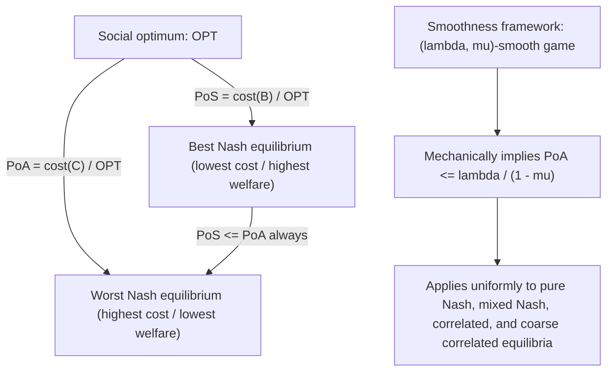

## Price of Anarchy and Price of Stability

### Overview

Price of Anarchy (PoA) and Price of Stability (PoS) are quantitative measures of the efficiency loss caused by decentralized, self-interested strategic behavior relative to a centrally coordinated social optimum. Introduced by Koutsoupias and Papadimitriou (1999) — who coined the term "price of anarchy" — these metrics formalize precisely how much worse (or, for PoS, how much better in the best case) equilibrium outcomes can be compared to what a benevolent central planner could achieve, providing the central quantitative framework within algorithmic game theory for evaluating the efficiency of strategic systems.

### Motivating Problem

Nash equilibrium and other solution concepts describe *what* outcome self-interested agents will reach, but say nothing directly about *how good* that outcome is relative to what is achievable. A network, market, or resource-allocation system with a unique, easily computed Nash equilibrium could still perform terribly compared to an optimal coordinated allocation. Price of Anarchy and Price of Stability were developed to close this gap, converting the qualitative observation that "selfish behavior can be inefficient" (illustrated dramatically by phenomena like Braess's Paradox, covered in Potential Games and Congestion Games) into precise, provable numerical bounds.

### Formal Definition: Price of Anarchy

**Formal definition**

Given a game with a social cost (or welfare) function $C(a)$ over action profiles $a$, let $\text{OPT} = \min_a C(a)$ denote the socially optimal cost, and let $\mathcal{E}$ denote the set of Nash equilibria of the game. The **Price of Anarchy** is:

$$\text{PoA} = \frac{\max_{a \in \mathcal{E}} C(a)}{\text{OPT}}$$

(For welfare-maximization framings rather than cost-minimization, the ratio is inverted: $\text{PoA} = \text{OPT} / \min_{a \in \mathcal{E}} W(a)$, comparing optimal welfare to the *worst* equilibrium's welfare.)

**Key Points**

- PoA specifically uses the **worst** equilibrium among all Nash equilibria of the game, providing a **pessimistic** bound: it answers "how bad can decentralized play possibly be?"
- $\text{PoA} \geq 1$ always (cost framing), since the optimum is, by definition, at least as good as any other outcome including any equilibrium; $\text{PoA} = 1$ indicates no efficiency loss at the worst equilibrium.
- PoA can be extended beyond pure-strategy Nash equilibria to mixed-strategy equilibria, correlated equilibria, and coarse correlated equilibria, with the equilibrium set $\mathcal{E}$ substituted accordingly — broader equilibrium concepts (e.g., coarse correlated equilibrium, which contains the outcomes of many natural learning dynamics) generally yield weakly worse (higher) PoA bounds, since they include a weakly larger set of possible outcomes to take the worst case over.

### Formal Definition: Price of Stability

**Formal definition**

$$\text{PoS} = \frac{\min_{a \in \mathcal{E}} C(a)}{\text{OPT}}$$

**Key Points**

- PoS uses the **best** equilibrium among all Nash equilibria, providing an **optimistic** bound: it answers "if play could be steered toward the best available equilibrium, how close to optimal could decentralized-but-coordinated-selection outcomes get?"
- $\text{PoS} \leq \text{PoA}$ always, since the best equilibrium's cost cannot exceed the worst equilibrium's cost.
- PoS is particularly relevant to settings where a system designer can influence *which* equilibrium is reached (e.g., via a recommended default, a focal point, or a mechanism nudging play toward a specific equilibrium) even without being able to fully dictate behavior, making it a natural efficiency benchmark for **mechanism design** and protocol design contexts.
- Computing PoS generally requires establishing the existence of at least one "good" equilibrium and proving no equilibrium is worse than a specific bound — for potential games (see Potential Games and Congestion Games), one common proof technique bounds PoS using the potential function itself, since the global minimizer of the potential function is guaranteed to be a Nash equilibrium.

### The Smoothness Framework (Roughgarden)

A major unifying technique for proving PoA bounds across many different game classes is the **smoothness framework**, developed primarily by Roughgarden.

**Formal structure**

A game is **$(\lambda, \mu)$-smooth** if, for every action profile $a$ and every alternative profile $a^*$ (in particular, the optimal profile), the following holds:

$$\sum_{i} u_i(a_i^*, a_{-i}) \geq \lambda \cdot W(a^*) - \mu \cdot W(a)$$

where $W$ is the social welfare function.

**Key Points**

- If a game is $(\lambda, \mu)$-smooth with $\mu < 1$, this condition mechanically implies a Price of Anarchy bound of $\text{PoA} \leq \frac{\lambda}{1-\mu}$ for a wide range of equilibrium concepts simultaneously — including pure Nash, mixed Nash, correlated equilibrium, and coarse correlated equilibrium — a substantial generalization beyond bounds proved for pure-strategy equilibria alone.
- The smoothness framework's key practical value is that it reduces the (often case-specific and technically involved) task of proving a PoA bound to verifying a single, mechanically checkable inequality, applicable uniformly across many disparate game classes (congestion games, auctions, network design games) without needing separate ad hoc arguments for each equilibrium concept.
- This framework substantially generalized and unified many previously separate PoA results (including the linear-congestion-game $5/3$ bound) under a single proof technique. [Inference: the smoothness framework's role as the dominant modern unifying technique is well-established in the algorithmic game theory literature, though specific games may still admit tighter bounds via specialized, non-smoothness arguments.]

### Price of Anarchy in Congestion Games

**Key Points**

- For congestion games with **linear cost functions** ($c_r(x) = a_r x + b_r$, with $a_r, b_r \geq 0$), the Price of Anarchy for pure Nash equilibria is exactly $\frac{5}{3}$ in the worst case — a tight bound (both an upper bound provable via smoothness-style arguments and a matching lower bound achievable by an explicit example instance).
- For congestion games with **polynomial cost functions** of maximum degree $d$, the PoA bound grows with $d$, reflecting that steeper marginal congestion costs create larger gaps between selfish and optimal routing as cost sensitivity to congestion increases. [Unverified: the precise closed-form PoA bound as a function of degree $d$ should be checked against the specific polynomial cost function class and normalization convention used in a given source, as multiple related but distinct bounds appear across the congestion game literature.]
- **Price of Stability in congestion games**: since Rosenthal's potential function (see Potential Games and Congestion Games) guarantees that its global minimizer is a Nash equilibrium, and this potential-minimizing equilibrium's actual social cost can be directly related to the true social optimum via the structure of the potential function, PoS bounds for congestion games are commonly proved by directly analyzing the relationship between the potential-minimizing profile's cost and $\text{OPT}$, generally yielding PoS bounds considerably better than the corresponding PoA bounds for the same cost function class.

### Worked Example: Illustrating PoA and PoS

**Example**

Consider a simple two-route congestion game (as in Potential Games and Congestion Games) with $N$ units of traffic, route A with cost $c_A(x) = x/N$ (normalized linear congestion) and route B with a fixed cost $c_B(x) = 1$ regardless of load.

- **Social optimum**: splits traffic to minimize total cost; a straightforward calculus argument shows routing a specific optimal fraction onto route A (where marginal cost on A equals the fixed cost on B) minimizes total system cost.
- **Nash equilibrium**: self-interested agents route onto A until the *average* (not marginal) cost on A equals the cost on B, since each agent only cares about their own experienced cost, not the marginal congestion externality they impose on others already on the route.
- Because the equilibrium condition uses average cost while the optimum condition uses marginal cost, and marginal cost exceeds average cost for increasing linear cost functions, the equilibrium routes *more* traffic onto the congestible route A than is socially optimal — a specific instance of the general principle that self-interested congestion decisions ignore the negative externality imposed on other users of the same resource, producing a PoA strictly greater than 1 in this class of games.
- This "ignoring the externality" mechanism is the fundamental economic intuition underlying positive Price of Anarchy in essentially all congestion and network routing settings: selfish agents equate private marginal benefit to private cost, while social optimality requires equating private marginal benefit to the *full social marginal cost*, including the externality imposed on others.

### Price of Anarchy in Auctions

**Key Points**

- **Simple auction formats** (e.g., simultaneous item auctions, first-price auctions in specific settings) have been extensively analyzed via the smoothness framework, with PoA bounds established for social welfare loss relative to the optimal (efficient) allocation under various bidder valuation classes (e.g., submodular, subadditive valuations).
- A commonly cited result for certain simultaneous first-price auction settings under submodular valuations establishes a PoA bound of at most $2$ (i.e., equilibrium welfare is at least half the optimal welfare) — a landmark application of the smoothness framework beyond congestion games. [Unverified: the precise scope of valuation classes and auction formats for which this specific bound holds should be checked against the specific auction model, since PoA results in auction theory are often stated for particular valuation and information structure assumptions.]
- These auction-theoretic PoA results provide a complexity-and-efficiency-aware complement to the overbidding anomaly discussed in Empirical Anomalies from Nash Predictions — PoA addresses the *welfare* consequences of strategic bidding at equilibrium, a distinct question from whether bids match the risk-neutral Nash benchmark.

### Diagram: PoA and PoS Relationship

### Diagram: Efficiency Loss Spectrum (svg_diagram)

<svg xmlns="http://www.w3.org/2000/svg" viewBox="0 0 700 260">
<text x="350" y="25" font-size="16" font-weight="bold" text-anchor="middle" fill="#1a1a1a">Price of Anarchy vs. Price of Stability (svg_diagram)</text>
<line x1="80" y1="150" x2="620" y2="150" stroke="#333" stroke-width="2" />
<text x="80" y="175" font-size="11" text-anchor="middle" fill="#1a1a1a">Social Optimum</text>
<circle cx="80" cy="150" r="8" fill="#15803d" />
<circle cx="300" cy="150" r="8" fill="#1a56db" />
<text x="300" y="175" font-size="11" text-anchor="middle" fill="#1a1a1a">Best Equilibrium</text>
<text x="300" y="192" font-size="10" text-anchor="middle" fill="#1a56db">(defines Price of Stability)</text>
<circle cx="580" cy="150" r="8" fill="#c2410c" />
<text x="580" y="175" font-size="11" text-anchor="middle" fill="#1a1a1a">Worst Equilibrium</text>
<text x="580" y="192" font-size="10" text-anchor="middle" fill="#c2410c">(defines Price of Anarchy)</text>
<line x1="90" y1="150" x2="292" y2="150" stroke="#1a56db" stroke-width="3" />
<line x1="308" y1="150" x2="572" y2="150" stroke="#c2410c" stroke-width="3" stroke-dasharray="6,4" />

<text x="350" y="225" font-size="12" text-anchor="middle" fill="#555">Increasing distance from optimum = increasing efficiency loss</text>

</svg>

### Bounding Techniques Beyond Smoothness

**Key Points**

- **Potential function arguments**: as noted above, potential games permit PoS bounds derived directly from the relationship between the potential function's global minimum and the true social cost function, a technique specific to potential games rather than general enough for the broad smoothness framework's scope.
- **Direct combinatorial arguments**: some of the earliest PoA results (including Koutsoupias and Papadimitriou's original analysis) used game-specific combinatorial arguments tailored to the particular structure of the game under study (originally, a simple load-balancing/scheduling game), predating the later unification provided by the smoothness framework.
- **LP-duality-based bounds**: for games with underlying combinatorial optimization structure (e.g., certain network design and routing games), price of anarchy bounds have been derived using linear programming duality arguments connecting the equilibrium conditions to the dual of the social optimization problem.

### Applications

- **Network design and infrastructure investment**: PoA/PoS analysis informs decisions about capacity expansion and network topology changes, directly relevant to avoiding Braess's-Paradox-style counterproductive investments (see Potential Games and Congestion Games).
- **Auction and mechanism design**: PoA bounds for specific auction formats guide platform designers (e.g., online advertising exchanges) in selecting mechanisms that bound worst-case welfare loss from strategic bidder behavior.
- **Distributed computing and load balancing**: PoA analysis of job-scheduling and load-balancing games informs the design of distributed systems where individual processes or servers make self-interested resource allocation decisions.
- **Regulatory and policy design**: PoA/PoS bounds can inform policy interventions (e.g., congestion pricing, tolls) designed specifically to close the gap between selfish and socially optimal behavior by internalizing externalities, directly motivated by the "ignored externality" mechanism underlying positive PoA in congestion settings.
- **Blockchain and decentralized protocol design**: PoA-style efficiency analysis has been applied to evaluate the welfare consequences of strategic behavior (e.g., transaction fee bidding, validator behavior) in decentralized cryptographic and blockchain protocols.

### Relationship to Mechanism Design: Closing the Gap

**Key Points**

- **Congestion pricing / tolls**: a canonical mechanism-design response to positive PoA in congestion games — imposing a toll equal to the externality a user imposes on others (the difference between marginal and average cost) can, in principle, align private incentives with social optimality, reducing PoA toward 1 in the tolled game.
- **VCG-style mechanisms**: in appropriate settings, Vickrey-Clarke-Groves mechanisms achieve full efficiency (PoA = 1) by construction, since truthful bidding is a dominant strategy and the mechanism directly implements the socially efficient outcome — illustrating that PoA is not an unavoidable law of nature but a consequence of the specific game/mechanism under analysis, which designers can sometimes improve through careful mechanism choice.
- This connects PoA/PoS analysis directly to the broader mechanism design goal (see also Computational Complexity of Equilibria's discussion of dominant-strategy mechanisms) of designing rules of interaction that minimize the gap between self-interested and socially optimal behavior, ideally while retaining computational tractability.

### Critiques and Limitations

**Key Points**

- **Worst-case orientation**: PoA, by construction, reflects worst-case efficiency loss across all game instances within a class (or all equilibria within a specific game), which may substantially overstate the *typical* efficiency loss observed in practice for specific real-world instances. [Inference: this worst-case-versus-typical-case gap is a broadly acknowledged limitation across algorithmic game theory analyses employing PoA, analogous to similar critiques of worst-case complexity analysis generally.]
- **Equilibrium selection ambiguity for PoS**: Price of Stability's practical relevance depends on the plausibility that decentralized dynamics or a designer's intervention can actually steer play toward the best equilibrium; absent such a mechanism, PoS may be an overly optimistic benchmark not reflective of actually observed outcomes. [Inference: this concern parallels the broader equilibrium selection problem discussed in Empirical Anomalies from Nash Predictions.]
- **Dependence on the social cost/welfare function specification**: PoA and PoS values are entirely dependent on how social cost or welfare is defined; different reasonable specifications of the social objective (e.g., total cost vs. maximum individual cost, i.e., egalitarian objectives) can yield substantially different PoA conclusions for the same underlying game. [Unverified: the sensitivity of specific published PoA bounds to alternative social welfare specifications varies by game class and should be checked against the specific objective function used in any given result.]
- **Extending beyond static, one-shot analysis**: PoA and PoS are fundamentally static, equilibrium-based measures; they do not directly characterize the efficiency of behavior during learning or adjustment processes before equilibrium (if ever) is reached, an important caveat when applying these bounds to systems where convergence to equilibrium is not fast, complete, or guaranteed at all (see also Computational Complexity of Equilibria's discussion of convergence guarantees for learning dynamics).

### Conclusion

Price of Anarchy and Price of Stability provide the central quantitative vocabulary within algorithmic game theory for measuring how much efficiency is lost — in the worst case (PoA) or best case (PoS) — when self-interested strategic behavior replaces centrally coordinated optimization. Grounded in explicit bounds for congestion games (the classical $5/3$ linear-cost result) and unified across many disparate game classes by Roughgarden's smoothness framework, these measures connect directly to mechanism design (via congestion pricing and efficient mechanisms like VCG) and provide the quantitative counterpart to the qualitative existence and computability results covered in Potential Games and Congestion Games and Computational Complexity of Equilibria, completing the core toolkit for evaluating strategic systems in algorithmic game theory.

**Related Topics**

- Roughgarden's smoothness framework and its application across auction and network design games
- Congestion pricing and toll mechanisms for internalizing externalities
- VCG mechanisms and efficient mechanism design achieving PoA = 1
- Braess's Paradox as an illustrative extreme case of positive Price of Anarchy
- PoA bounds in simultaneous and first-price auctions under various valuation classes
- Learning dynamics and convergence rates toward efficient versus inefficient equilibria
- Egalitarian versus utilitarian social welfare objectives and their effect on PoA bounds
- LP-duality-based Price of Anarchy proofs in network design games