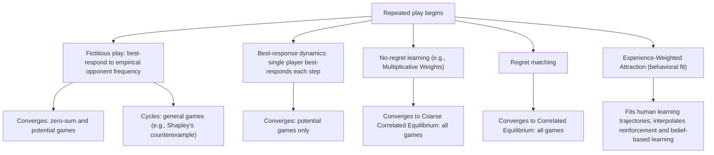

## Learning in Games

### Overview

Learning in games studies dynamic processes by which players adjust their strategies over repeated play, based on observed history, rather than assuming players immediately compute and play an equilibrium strategy. This body of theory provides a behaviorally and computationally grounded alternative — or complement — to static equilibrium analysis, addressing both how equilibrium play might plausibly emerge (or fail to emerge) over time, and how decentralized learning algorithms behave in multi-agent systems. Learning in games connects directly to the computational hardness results in Computational Complexity of Equilibria and PPAD-Completeness (which motivate why players cannot simply "compute" equilibria) and to the empirical anomalies cataloged in Empirical Anomalies from Nash Predictions (many of which concern round-by-round dynamics rather than static one-shot deviations).

### Motivating Problem

Static equilibrium concepts (Nash, correlated, QRE) describe fixed points of mutual best response but are silent on *how* players arrive at these fixed points, especially in games with multiple equilibria or where computing an exact equilibrium is intractable. Repeated interaction is ubiquitous in real strategic settings — markets, auctions, routing systems, multi-agent AI systems — and understanding whether simple, plausible adjustment rules converge to equilibrium, and if so how quickly and to which equilibrium, is essential both for behavioral realism and for the design of decentralized algorithmic systems.

### Fictitious Play

**Formal structure**

Fictitious play, introduced by Brown (1951), has each player best-respond in every round to the **empirical frequency distribution** of opponents' past actions, treating this historical frequency as if it were a fixed (mixed) strategy the opponent is currently playing.

**Key Points**

- At each round $t$, player $i$ computes $\hat{\sigma}_{-i}^t$, the empirical frequency of each opponent action observed in rounds $1, \ldots, t-1$, and plays a best response to $\hat{\sigma}_{-i}^t$.
- **Convergence guarantee in zero-sum games**: fictitious play is guaranteed to converge (empirical frequencies converge to a Nash equilibrium) in two-player zero-sum games, a classical result (Robinson, 1951) connecting this simple learning rule to the same class of games where equilibrium computation is polynomial-time tractable via linear programming (see Computational Complexity of Equilibria).
- **Convergence in potential games**: fictitious play (and several of its variants) also converges in potential games (see Potential Games and Congestion Games), since the potential function again provides a natural Lyapunov-style argument bounding the learning process.
- **Non-convergence in general games**: fictitious play does **not** converge to Nash equilibrium in general games; well-known counterexamples (e.g., Shapley's counterexample, a specific 3x3 game) exhibit persistent cycling in empirical frequencies rather than convergence, demonstrating that this simple, intuitively plausible learning rule is not universally reliable.

### Best-Response Dynamics

**Key Points**

- **Best-response dynamics**: at each time step, a single player (chosen according to some update rule — sequentially, randomly, or asynchronously) switches to their exact best response given the current strategies of all other players, which remain fixed.
- In potential games, best-response dynamics is guaranteed to converge to a pure-strategy Nash equilibrium, since every best-response update strictly increases the potential function (see Potential Games and Congestion Games), and the potential function is bounded above on the finite action space, guaranteeing eventual termination at a local (and hence, for potential games, Nash equilibrium) optimum.
- In general games, best-response dynamics can cycle indefinitely without converging, and even where it does converge, the number of steps required can be exponential in the worst case — directly connected to the PLS-completeness result for finding equilibria via local search in general congestion games (see Potential Games and Congestion Games).

### No-Regret Learning

No-regret learning algorithms are a broad and highly influential class of adaptive procedures where each player minimizes their own **regret** — the gap between their realized cumulative payoff and the payoff they could have achieved by playing the single best fixed action in hindsight.

**Formal definition of regret**

For player $i$ over $T$ rounds, regret with respect to a fixed alternative action $a_i'$ is:

$$\text{Regret}_i^T = \max_{a_i' \in A_i} \sum_{t=1}^{T} \left[ u_i(a_i', a_{-i}^t) - u_i(a_i^t, a_{-i}^t) \right]$$

A learning algorithm is a **no-regret algorithm** if, regardless of the opponents' play, $\frac{\text{Regret}_i^T}{T} \to 0$ as $T \to \infty$ (average regret vanishes).

**Key Points**

- **Multiplicative Weights Update (MWU)**: a canonical no-regret algorithm, where each player maintains a weight on each of their available actions, updates weights multiplicatively based on observed payoffs (increasing weight on actions that would have performed well), and plays according to the normalized weight distribution — widely used both as a behavioral learning model and as a practical algorithmic tool in online optimization.
- **Convergence to coarse correlated equilibrium**: a foundational and widely cited result establishes that if *all* players in a game use no-regret learning algorithms, the empirical distribution of joint play converges to the set of **coarse correlated equilibria** of the game — a substantially weaker and more general equilibrium concept than Nash equilibrium, but one that no-regret dynamics reaches under very mild assumptions, without requiring any coordination or common knowledge of the game structure among players.
- This result is particularly significant because no-regret learning is both a **behaviorally plausible** model (players need only track their own realized and counterfactual payoffs, not compute an equilibrium) and an **algorithmically practical** procedure (efficiently implementable, e.g., via MWU) — bridging behavioral realism and algorithmic tractability in a way that direct equilibrium computation (PPAD-hard in general) cannot.
- **No-regret learning does not, in general, converge to Nash equilibrium** — coarse correlated equilibrium is a strictly larger set than the correlated equilibrium set, which in turn contains the Nash equilibrium set; no-regret dynamics guarantees landing somewhere in this larger set, not necessarily at a Nash equilibrium specifically.

### Regret Matching and Correlated Equilibrium

**Key Points**

- **Regret matching** (Hart and Mas-Colell, 2000): a specific no-regret-style algorithm in which each player's probability of switching to a given alternative action is proportional to the positive part of their regret for not having played that action, rather than an exponential-weighting scheme like MWU.
- A key theoretical result establishes that when all players use regret matching (or certain closely related variants), the empirical joint distribution of play converges to the set of **correlated equilibria** — a tighter convergence result than the general no-regret-to-coarse-correlated-equilibrium result, since correlated equilibrium is a subset of coarse correlated equilibrium.
- This connects directly to the computational tractability point made in Computational Complexity of Equilibria: correlated equilibrium is polynomial-time computable via linear programming, and regret matching provides a natural, fully decentralized (no central linear program solver required) dynamic process that reaches this same tractable equilibrium concept.

### Experience-Weighted Attraction (EWA) Learning

Experience-Weighted Attraction, developed by Camerer and Ho (1999), is a behavioral learning model designed to nest and interpolate between reinforcement learning and belief-based learning (such as fictitious play), fitting observed human learning trajectories in repeated experimental games.

**Formal structure**

EWA maintains an "attraction" $A_i^j(t)$ for each strategy $j$ available to player $i$, updated each round according to:

$$A_i^j(t) = \frac{\phi \cdot N(t-1) \cdot A_i^j(t-1) + \left[\delta + (1-\delta)\cdot\mathbb{1}(j = a_i^t)\right] \cdot u_i(j, a_{-i}^t)}{N(t)}$$

with $N(t) = \phi \cdot (1-\kappa) \cdot N(t-1) + 1$, and choice probabilities derived from attractions via a logit (softmax) response function.

**Key Points**

- $\delta$ controls the weight placed on **foregone payoffs** (what a strategy *would have* earned, even if not played) versus only the payoff from the **actually chosen** strategy — $\delta = 0$ recovers pure reinforcement learning (only realized payoffs update attractions), while $\delta = 1$ recovers a belief-based learning model closely related to fictitious play (all strategies' hypothetical payoffs update attractions equally).
- $\phi$ is a decay/discount parameter controlling how quickly past experience is depreciated relative to new experience, and $\kappa$ controls the growth rate of the experience weight $N(t)$ itself.
- This nesting structure allows EWA to be fit to experimental data via maximum likelihood, with $\delta$, $\phi$, and $\kappa$ estimated as free parameters, and the fitted values used to characterize whether observed human learning behavior in a given game more closely resembles pure reinforcement, pure belief-based learning, or an intermediate combination.
- EWA is explicitly positioned as a bridge between the game-theoretic learning dynamics discussed above (fictitious play, best-response dynamics) and the initial-response behavioral models covered in Level-k and Cognitive Hierarchy Models — level-k/CH describe round-1 behavior, while EWA (or similar learning models) describes how behavior evolves across subsequent rounds of the same repeated game.

### Convergence Results Summary

| Learning Rule | Convergence Guarantee | Game Class |
| --- | --- | --- |
| Fictitious play | Converges to Nash equilibrium | Two-player zero-sum, potential games |
| Fictitious play | Not guaranteed; known cycling counterexamples | General games |
| Best-response dynamics | Converges to pure Nash equilibrium | Potential games |
| Best-response dynamics | Not guaranteed; can cycle | General games |
| No-regret learning (e.g., MWU) | Converges to coarse correlated equilibrium | All games |
| Regret matching | Converges to correlated equilibrium | All games |
| EWA | Fits observed human trajectories; no general equilibrium convergence guarantee claimed | Behavioral/empirical modeling context |

### Diagram: Learning Dynamics and Their Equilibrium Targets

### Diagram: No-Regret Learning Mechanism (svg_diagram)

<svg xmlns="http://www.w3.org/2000/svg" viewBox="0 0 700 300">
<text x="350" y="25" font-size="16" font-weight="bold" text-anchor="middle" fill="#1a1a1a">No-Regret Learning Loop (svg_diagram)</text>
<rect x="40" y="60" width="160" height="55" rx="8" fill="#e8f0fe" stroke="#1a56db" stroke-width="2" />
<text x="120" y="82" font-size="12" text-anchor="middle" fill="#1a1a1a">Play action a_i^t</text>
<text x="120" y="98" font-size="12" text-anchor="middle" fill="#1a1a1a">based on current weights</text>
<rect x="270" y="60" width="160" height="55" rx="8" fill="#fef3e8" stroke="#c2410c" stroke-width="2" />
<text x="350" y="82" font-size="12" text-anchor="middle" fill="#1a1a1a">Observe realized payoff</text>
<text x="350" y="98" font-size="12" text-anchor="middle" fill="#1a1a1a">and counterfactual payoffs</text>
<rect x="500" y="60" width="170" height="55" rx="8" fill="#fce8f0" stroke="#9d174d" stroke-width="2" />
<text x="585" y="82" font-size="12" text-anchor="middle" fill="#1a1a1a">Update weights</text>
<text x="585" y="98" font-size="12" text-anchor="middle" fill="#1a1a1a">(multiplicative / regret-based)</text>
<rect x="270" y="190" width="160" height="60" rx="8" fill="#e8f8ee" stroke="#15803d" stroke-width="2" />
<text x="350" y="215" font-size="12" text-anchor="middle" fill="#1a1a1a">Average regret</text>
<text x="350" y="233" font-size="12" text-anchor="middle" fill="#1a1a1a">to zero as T grows</text>
<line x1="200" y1="88" x2="270" y2="88" stroke="#333" stroke-width="2" marker-end="url(#lg1)" />
<line x1="430" y1="88" x2="500" y2="88" stroke="#333" stroke-width="2" marker-end="url(#lg1)" />
<line x1="585" y1="115" x2="120" y2="60" stroke="#333" stroke-width="1.5" stroke-dasharray="4,3" marker-end="url(#lg1)" />
<line x1="350" y1="115" x2="350" y2="190" stroke="#333" stroke-width="2" marker-end="url(#lg1)" />
</svg>

### Connection to Multi-Agent Reinforcement Learning

**Key Points**

- No-regret learning algorithms and their convergence guarantees to coarse correlated equilibrium provide one of the primary theoretical foundations for analyzing **multi-agent reinforcement learning (MARL)** systems, where independently learning agents (potentially without knowledge of the game structure or other agents' algorithms) interact repeatedly.
- Because general Nash equilibrium computation is PPAD-hard (see PPAD-Completeness) but no-regret learning provably converges to the weaker coarse correlated equilibrium concept efficiently, this gap is often cited as a formal explanation for why decentralized MARL algorithms cannot, in general, be expected to converge to Nash equilibrium, motivating researchers to instead study convergence to correlated or coarse correlated equilibria as the more realistic target. [Inference: this framing — using no-regret/PPAD complexity results to set realistic expectations for MARL convergence — is a widely cited connection in the algorithmic game theory and MARL literature, though the practical behavior of specific modern deep MARL algorithms in complex environments remains an active empirical research area distinct from these classical theoretical guarantees.]
- **Self-play** in modern MARL systems (e.g., iteratively training an agent against past or current versions of itself) has informal connections to fictitious-play-style dynamics, though the specific convergence properties of self-play in complex, function-approximated (deep learning) settings are not generally covered by the classical fictitious play convergence theorems, which apply to the tabular, finite-game setting.

### Applications

- **Algorithmic trading and market design**: no-regret learning algorithms are directly used as practical trading and bidding strategies in repeated market interactions (e.g., ad auctions, financial markets), where the no-regret guarantee provides a worst-case performance bound independent of the strategies used by other market participants.
- **Distributed and multi-agent systems**: learning dynamics with known convergence properties (e.g., best-response dynamics in potential games) inform the design of decentralized protocols intended to self-organize toward efficient configurations without central coordination (see also Potential Games and Congestion Games).
- **Behavioral and experimental economics**: EWA and related learning models are used to fit and interpret round-by-round behavior observed in repeated laboratory experiments, complementing the static, initial-response models covered in Level-k and Cognitive Hierarchy Models (see also Experimental Methods in Game Theory).
- **Online advertising and recommendation systems**: multiplicative weights and related no-regret algorithms are widely deployed in online decision-making systems facing adversarial or non-stationary environments, leveraging the algorithm's guarantee to perform well regardless of the specific (possibly adversarial) sequence of realized payoffs.

### Critiques and Limitations

**Key Points**

- **Gap between theoretical learning models and real learning agents**: classical convergence results (fictitious play, no-regret learning) are typically proven for idealized, tabular, perfectly-executing agents; real human learners (per EWA's own behavioral motivation) and real deployed algorithmic agents (e.g., deep reinforcement learning systems) may deviate substantially from these idealized update rules, limiting the direct predictive applicability of the classical convergence theorems to real-world learning behavior. [Inference: this gap between idealized theoretical learning models and observed or deployed learning behavior is a recurring theme noted across both the behavioral learning literature (motivating EWA) and the modern MARL literature.]
- **Weak equilibrium target for general convergence guarantees**: the strongest *universally applicable* convergence guarantee (no-regret learning to coarse correlated equilibrium) targets a substantially weaker solution concept than Nash equilibrium, meaning this guarantee alone does not establish that learning dynamics will produce behaviorally or strategically "sensible" outcomes in the same sense that Nash equilibrium convergence would.
- **Multiple learning rules, multiple targets**: as the summary table above illustrates, different plausible learning rules converge (or fail to converge) to different solution concepts under different game-class restrictions, meaning "does learning converge to equilibrium" does not have a single universal answer — it depends critically on which learning rule and which game class are being considered.
- **EWA parameter interpretability and identification**: as with other structurally estimated behavioral models covered elsewhere in this course (e.g., level-k population shares, QRE's $\lambda$), EWA's fitted parameters ($\delta, \phi, \kappa$) can be sensitive to the specific games and estimation procedures used, raising similar concerns about cross-game parameter stability and identification. [Unverified: the degree of cross-game stability specifically for EWA parameters should be checked against current estimation studies rather than assumed.]

### Conclusion

Learning in games provides the dynamic complement to the static equilibrium concepts, computational complexity results, and structural game classes covered throughout this course: rather than assuming players compute an equilibrium directly, this framework studies plausible, often computationally simple adjustment rules — fictitious play, best-response dynamics, no-regret learning, regret matching, and behaviorally-fitted models like EWA — and characterizes precisely which of these rules converge, to which equilibrium concept, and under which game-class restrictions. The striking general result that no-regret learning converges to coarse correlated equilibrium in *any* game, despite the PPAD-hardness of computing Nash equilibrium directly, exemplifies how learning dynamics can achieve tractable, decentralized convergence to a meaningful (if weaker) solution concept precisely where direct equilibrium computation cannot, making learning in games a central bridge connecting behavioral game theory, computational complexity, and multi-agent algorithmic systems.

**Related Topics**

- Multiplicative Weights Update algorithm and its applications in online optimization
- Shapley's counterexample and other non-convergence results for fictitious play
- Coarse correlated equilibrium versus correlated equilibrium versus Nash equilibrium
- Regret matching and its connection to polynomial-time correlated equilibrium computation
- Experience-Weighted Attraction parameter estimation in repeated experimental games
- Multi-agent reinforcement learning convergence guarantees and self-play dynamics
- Behaviorally fitted learning models versus idealized theoretical learning rules
- Applications of no-regret learning in algorithmic trading and online advertising systems