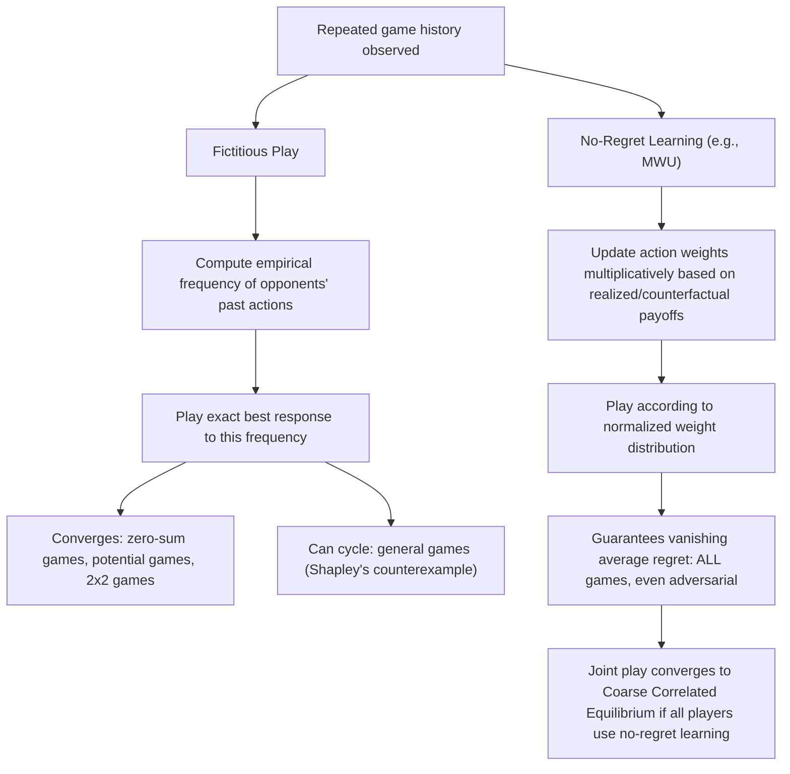

## No-Regret Learning and Fictitious Play

### Overview

No-regret learning and fictitious play are two foundational adaptive procedures by which players adjust strategies over repeated play based on observed history. Fictitious play (Brown, 1951) is the earlier, belief-based approach in which players best-respond to opponents' empirical action frequencies. No-regret learning is a broader, more modern family of algorithms unified by the guarantee that a player's average performance approaches that of the best fixed action in hindsight, regardless of the environment. This topic examines both frameworks in depth, their formal relationship to one another, and their distinct convergence properties — extending the overview provided in Learning in Games with the detailed mechanics of these two specific, closely related learning rules.

### Motivating Problem

A player repeatedly facing the same strategic situation needs a rule for updating behavior based on what has been observed so far, without necessarily knowing the opponents' payoff functions, strategy sets, or rationality. Fictitious play addresses this by treating the opponents' history as revealing a fixed, if slowly evolving, "type" to best-respond against. No-regret learning instead sidesteps modeling opponents altogether, focusing purely on guaranteeing a worst-case performance bound relative to the single best action a player could have played in hindsight — a criterion that holds even against an adversarial or non-stationary environment, not just a fixed opponent strategy.

### Fictitious Play: Formal Mechanics

**Update rule**

At each round $t = 1, 2, \ldots$, player $i$ maintains the empirical frequency distribution of each opponent $j$'s past actions:

$$\hat{\sigma}_j^t(a_j) = \frac{1}{t-1}\sum_{s=1}^{t-1} \mathbb{1}[a_j^s = a_j]$$

Player $i$ then plays a best response to the profile of empirical frequencies $\hat{\sigma}_{-i}^t$:

$$a_i^t \in \arg\max_{a_i \in A_i} \, u_i(a_i, \hat{\sigma}_{-i}^t)$$

**Key Points**

- Fictitious play is a **belief-based** learning rule: it implicitly assumes opponents' actions are draws from a fixed (if unknown) stationary distribution, and updates a Bayesian-flavored point estimate (the empirical frequency) of that distribution each round.
- Ties in the best-response correspondence are typically broken by a fixed rule (e.g., lowest-indexed action) or via a small randomization, since the empirical frequency computation itself is deterministic given history.
- **Stochastic fictitious play**: a smoothed variant replacing the exact best response with a logit (or other smooth) response function over the empirical frequencies, connecting fictitious play directly to the stochastic choice structure of Quantal Response Equilibrium (see Quantal Response Equilibrium) and improving convergence properties in some game classes relative to the discontinuous exact-best-response version.

### Convergence Properties of Fictitious Play

**Key Points**

- **Two-player zero-sum games**: Robinson (1951) proved that fictitious play's empirical action frequencies converge to a Nash equilibrium (specifically, the minimax value and optimal strategies) in any finite two-player zero-sum game — the original convergence result motivating the method's continued theoretical importance.
- **Potential games**: fictitious play (and several close variants) converges in potential games (see Potential Games and Congestion Games), leveraging the same potential-function-based argument that guarantees best-response dynamics converges in this game class.
- **2×2 games generally**: fictitious play converges in all finite two-player games with only two strategies per player, a further positive result beyond the zero-sum case specifically.
- **Non-convergence in general games**: fictitious play is **not** guaranteed to converge in general finite games. **Shapley's counterexample** (a specific 3-strategy, two-player, non-zero-sum game) demonstrates that empirical frequencies can cycle indefinitely rather than converging to any equilibrium, establishing that the positive convergence results above do not extend universally.
- **Convergence in beliefs vs. convergence in play**: even where empirical frequencies converge, this does not necessarily mean the actual sequence of realized actions converges or stabilizes — the *frequencies* converging to equilibrium probabilities is compatible with the *realized* action sequence never repeating exactly the same joint action.

### No-Regret Learning: Formal Mechanics

**Regret definition (recap)**

For player $i$ over $T$ rounds, regret with respect to the best fixed action in hindsight is:

$$\text{Regret}_i^T = \max_{a_i' \in A_i} \sum_{t=1}^{T} u_i(a_i', a_{-i}^t) - \sum_{t=1}^{T} u_i(a_i^t, a_{-i}^t)$$

A sequence of play is a **no-regret sequence** if $\text{Regret}_i^T / T \to 0$ as $T \to \infty$, regardless of the sequence of opponents' play $a_{-i}^t$ (including adversarially chosen sequences).

**Multiplicative Weights Update (MWU) — canonical no-regret algorithm**

At each round, player $i$ maintains a weight $w_i^j(t)$ for each action $j \in A_i$, initialized uniformly, and updates:

$$w_i^j(t+1) = w_i^j(t) \cdot (1 + \eta \cdot u_i(j, a_{-i}^t))$$

with the player's mixed strategy at round $t+1$ given by the normalized weights $\sigma_i^j(t+1) = w_i^j(t+1) / \sum_k w_i^k(t+1)$, and $\eta$ a learning-rate parameter.

**Key Points**

- MWU achieves regret that grows only as $O(\sqrt{T \log |A_i|})$ (with an appropriately tuned learning rate $\eta$), meaning average regret $\text{Regret}_i^T / T \to 0$ at a rate of $O(\sqrt{\log|A_i| / T})$ — a formal, worst-case guarantee independent of the opponents' behavior, including fully adversarial opponents.
- Unlike fictitious play, MWU (and no-regret algorithms generally) makes **no assumption whatsoever about the stationarity of the environment** — the regret guarantee holds against any sequence of opponent play, including one adaptively chosen by an adversary aware of the player's algorithm, which is a substantially stronger worst-case robustness property than fictitious play's convergence results (which require specific game-class assumptions like zero-sum or potential-game structure).
- **Follow-the-Regularized-Leader (FTRL)** and **Online Mirror Descent** are broader algorithmic families (from online convex optimization) that generalize and unify multiplicative weights and several other no-regret algorithms under a common mathematical framework, connecting game-theoretic learning directly to the online learning literature in theoretical computer science.

### The Relationship Between Fictitious Play and No-Regret Learning

**Key Points**

- Fictitious play can be viewed as a "hard" (non-smoothed) limiting case within the broader landscape of adaptive learning rules, whereas no-regret algorithms like MWU use "soft," probabilistically weighted responses rather than an exact, discontinuous best response to the current belief.
- **Fictitious play is not, in general, a no-regret algorithm**: because it commits to an exact best response each round based on a point estimate of opponents' strategies, it can be exploited by an adversarial opponent aware of this deterministic (or near-deterministic) rule in ways that violate the no-regret guarantee in the worst case, whereas MWU's randomized, smoothly-updated weights are specifically designed to resist such exploitation.
- **Stochastic fictitious play**, by smoothing the best-response step (e.g., via a logit response), can be shown under appropriate conditions to satisfy a no-regret-style guarantee, narrowing — though not fully closing — the conceptual gap between the two frameworks; this smoothing is precisely what connects stochastic fictitious play to both no-regret learning and to Quantal Response Equilibrium simultaneously.
- Despite their different formal guarantees, both approaches share the deeper unifying idea of **learning from history without direct equilibrium computation**, situating both squarely within the broader learning-in-games research program (see Learning in Games) as tractable, decentralized alternatives to the PPAD-hard problem of directly computing a Nash equilibrium (see PPAD-Completeness).

### Worked Example: Fictitious Play in Matching Pennies

**Example**

Consider Matching Pennies: Player 1 wins by matching Player 2's choice (Heads/Heads or Tails/Tails); Player 2 wins by mismatching. The unique Nash equilibrium has both players randomizing 50/50.

- Round 1: no history exists; suppose both players start with an arbitrary action, say Player 1 plays Heads, Player 2 plays Tails.
- Round 2: Player 1's empirical frequency of Player 2's play is 100% Tails, so Player 1 best-responds by playing Tails (to match). Player 2's empirical frequency of Player 1's play is 100% Heads, so Player 2 best-responds by playing Tails (to mismatch Heads)... but since Player 1 also switches, patterns of mutual adjustment begin.
- Over many rounds, in this specific zero-sum game, the empirical frequencies of both players' play converge toward 50/50, consistent with Robinson's convergence theorem for two-player zero-sum games — though the exact round-by-round sequence of actions can cycle through longer streaks of one action before correcting, rather than alternating in a simple, immediately visible pattern.

### Worked Example: Regret Calculation

**Example**

Suppose a player chooses among 3 actions over 5 rounds, receiving payoffs $u(a_1) = [2, 0, 3, 1, 2]$, $u(a_2) = [1, 3, 0, 2, 1]$, $u(a_3) = [0, 1, 1, 3, 0]$ for the three actions across the five rounds respectively, and the player's actual realized payoffs (having played some specific sequence) sum to $8$.

- Cumulative payoff if $a_1$ always played: $2+0+3+1+2 = 8$
- Cumulative payoff if $a_2$ always played: $1+3+0+2+1 = 7$
- Cumulative payoff if $a_3$ always played: $0+1+1+3+0 = 5$
- Best fixed action in hindsight: $a_1$, with cumulative payoff $8$.
- Regret $= 8 - 8 = 0$ in this specific illustrative case (the player happened to achieve the same cumulative payoff as the best fixed action); a no-regret algorithm guarantees that, averaged over many such rounds and against any sequence of realized payoffs, this gap grows sub-linearly in $T$, not that it is exactly zero in any specific short run.

### Diagram: Fictitious Play vs. No-Regret Learning Comparison

### Diagram: Regret Accumulation Over Time (svg_diagram)

<svg xmlns="http://www.w3.org/2000/svg" viewBox="0 0 700 300">
<text x="350" y="25" font-size="16" font-weight="bold" text-anchor="middle" fill="#1a1a1a">Average Regret Approaching Zero (svg_diagram)</text>
<line x1="80" y1="260" x2="640" y2="260" stroke="#333" stroke-width="2" />
<line x1="80" y1="260" x2="80" y2="50" stroke="#333" stroke-width="2" />
<text x="360" y="285" font-size="12" text-anchor="middle" fill="#1a1a1a">Rounds (T)</text>
<text x="45" y="150" font-size="12" text-anchor="middle" fill="#1a1a1a" transform="rotate(-90 45 150)">Regret_T / T</text>
<path d="M 80 90 Q 200 180 350 220 T 640 245" stroke="#1a56db" stroke-width="3" fill="none" />
<text x="450" y="200" font-size="11" fill="#1a56db">Average regret (MWU): O(sqrt(log|A|/T))</text>
<line x1="80" y1="250" x2="640" y2="250" stroke="#15803d" stroke-width="1.5" stroke-dasharray="5,4" />
<text x="560" y="240" font-size="11" fill="#15803d">Regret = 0 asymptote</text>
</svg>

### Extensions and Variants

**Key Points**

- **Adaptive/generalized weakened fictitious play**: variants that relax the requirement of exact best response (e.g., allowing $\epsilon$-best responses or slowly vanishing exploration) have been shown to retain convergence properties in a broader set of circumstances than the original exact-best-response fictitious play, while remaining conceptually closer to the belief-based fictitious play tradition than to no-regret algorithms.
- **Follow-the-Perturbed-Leader**: a no-regret algorithm that adds random perturbations to cumulative payoffs before selecting the best action each round, achieving no-regret guarantees through randomization applied at the decision stage rather than through smooth weight updates as in MWU.
- **Bandit feedback settings**: both fictitious play and no-regret learning have variants adapted to settings where a player observes only their own realized payoff (not the full opponent action or full counterfactual payoff vector for all actions) — a substantially harder "bandit" feedback setting requiring exploration-exploitation tradeoffs, connecting this literature to the broader multi-armed bandit research program in online learning theory.
- **Swap regret and correlated equilibrium**: a refinement of the regret concept — **swap regret** (regret with respect to the best *action-dependent* modification rule, not just the best single fixed action) — when minimized by all players, yields convergence to correlated equilibrium rather than the weaker coarse correlated equilibrium that standard (external) no-regret guarantees produce, closely paralleling the regret-matching result discussed in Learning in Games.

### Applications

- **Algorithmic trading and repeated auctions**: no-regret algorithms, particularly MWU and its variants, are directly deployed as bidding and trading strategies in repeated market settings, valued specifically for their adversarial robustness guarantee (performance bounded well even against a strategically sophisticated counterparty).
- **Behavioral modeling of human learning**: fictitious play (and its stochastic/smoothed variants) remains a benchmark model against which observed human learning trajectories in repeated experimental games are compared, often alongside or nested within the more flexible Experience-Weighted Attraction framework (see Learning in Games).
- **Distributed optimization and multi-agent systems**: no-regret learning provides theoretical guarantees for decentralized agents in multi-agent reinforcement learning and distributed control systems, where the coarse-correlated-equilibrium convergence result offers a tractable target where direct Nash equilibrium computation would be PPAD-hard (see PPAD-Completeness).
- **Online advertising and recommendation**: multiplicative weights and closely related online learning algorithms are foundational tools in ad allocation and recommendation systems operating under non-stationary, potentially adversarial user or bidder behavior.

### Critiques and Limitations

**Key Points**

- **Fictitious play's fragility outside favorable game classes**: because convergence is guaranteed only for specific game classes (zero-sum, potential, 2×2), fictitious play's practical reliability as a general-purpose learning model is limited, and Shapley's counterexample demonstrates this is not merely a theoretical curiosity but an actual failure mode in a simple, explicitly constructible game.
- **No-regret learning's weak equilibrium target**: as emphasized in Learning in Games, the universally guaranteed convergence of no-regret learning is to coarse correlated equilibrium, a substantially weaker solution concept than Nash equilibrium — the guarantee's generality comes at the cost of a less behaviorally or strategically informative convergence target.
- **Rate of convergence versus asymptotic guarantees**: both fictitious play's convergence theorems and no-regret learning's regret bounds are typically asymptotic ($T \to \infty$) or provide only polynomial-rate finite-sample bounds; the practically relevant question of how many rounds are needed before near-equilibrium behavior emerges in a specific finite game can require substantially more rounds than are plausible in real repeated interactions (e.g., laboratory experiments with a limited number of rounds). [Inference: this finite-sample versus asymptotic distinction is a standard caveat in both the theoretical learning-in-games literature and its application to interpreting experimental data.]
- **Behavioral realism of the underlying update rules**: neither fictitious play's exact empirical-frequency best response nor MWU's precise multiplicative weight update is typically presented as a literal claim about human cognitive processing; both are better understood as stylized, mathematically tractable models capturing certain qualitative features of adaptive behavior, a limitation shared with most of the formal learning rules discussed in Learning in Games.

### Conclusion

No-regret learning and fictitious play represent two historically and conceptually connected but formally distinct approaches to modeling adaptive behavior in repeated games. Fictitious play, the earlier belief-based approach, offers strong convergence guarantees in specific favorable game classes (zero-sum, potential games) but is not universally reliable, as Shapley's counterexample demonstrates. No-regret learning, exemplified by the Multiplicative Weights Update algorithm, offers a substantially more robust and universal guarantee — vanishing average regret against any opponent sequence, in any game — at the cost of a weaker guaranteed convergence target (coarse correlated equilibrium rather than Nash equilibrium). Together, these two frameworks anchor the broader learning-in-games research program (see Learning in Games), providing the essential mechanics underlying decentralized, tractable, and behaviorally motivated alternatives to direct equilibrium computation.

**Related Topics**

- Shapley's counterexample and other non-convergence results for fictitious play
- Follow-the-Regularized-Leader and Online Mirror Descent as unifying no-regret frameworks
- Swap regret and its connection to correlated equilibrium convergence
- Bandit feedback variants of fictitious play and no-regret learning
- Stochastic fictitious play and its connection to Quantal Response Equilibrium
- Finite-sample convergence rates versus asymptotic guarantees in learning-in-games theory
- Multi-armed bandit algorithms and their relationship to game-theoretic no-regret learning
- Applications of Multiplicative Weights Update in algorithmic trading and online advertising