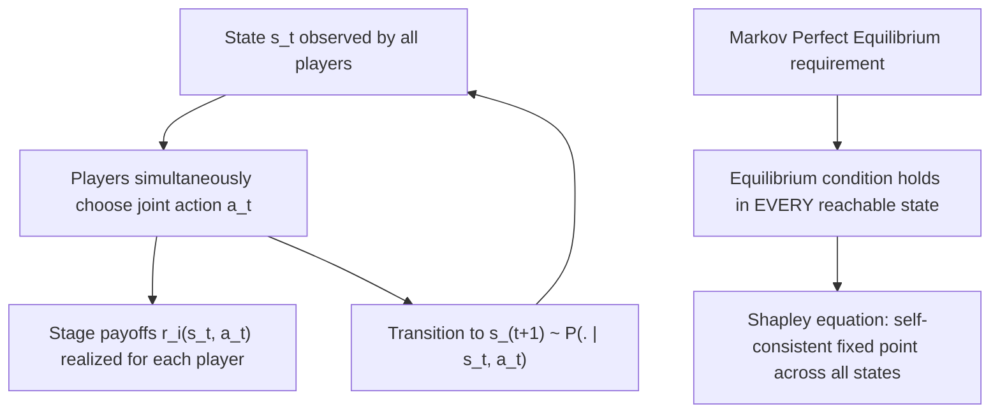

## Markov Games

### Overview

Markov games (also called stochastic games) generalize both repeated games and Markov decision processes by modeling multi-agent strategic interaction across a sequence of states, where transitions between states depend on the joint actions of all players and each state carries its own stage-game payoff structure. First introduced by Shapley (1953) — in the same period as much of classical game theory's foundational development — Markov games provide the formal framework underlying modern multi-agent reinforcement learning, dynamic oligopoly models, and any strategic setting where the game's structure itself evolves over time as a consequence of players' actions.

### Motivating Problem

Repeated games (as analyzed in Learning in Games and No-Regret Learning and Fictitious Play) assume the same stage game is played identically in every round. Many real strategic settings do not fit this mold: the "game" being played can itself change from round to round based on what happened previously — a firm's market position shifts after a pricing decision, a robot's environment changes after an action, a resource pool depletes after extraction. Markov games were developed to formalize this coupling between strategic action and state transition within a single, unified dynamic framework, nesting both single-agent Markov Decision Processes (MDPs) and standard repeated games as special cases.

### Formal Definition

**Formal structure**

A Markov game (stochastic game) is defined by the tuple $(N, S, \{A_i\}_{i \in N}, P, \{r_i\}_{i \in N}, \gamma)$:

- $N = \{1, \ldots, n\}$: the set of players.
- $S$: a finite (or otherwise well-behaved) set of states.
- $A_i(s)$: the action set available to player $i$ in state $s$; the joint action space is $A(s) = \prod_i A_i(s)$.
- $P(s' \mid s, a)$: the transition probability function, giving the probability of moving to state $s'$ given current state $s$ and joint action profile $a = (a_1, \ldots, a_n)$.
- $r_i(s, a)$: player $i$'s stage payoff (reward) in state $s$ under joint action $a$.
- $\gamma \in [0, 1)$: a common discount factor applied to future payoffs.

**Key Points**

- At each time step $t$, all players observe the current state $s_t$, simultaneously choose actions $a_t = (a_{1,t}, \ldots, a_{n,t})$, receive stage payoffs $r_i(s_t, a_t)$, and the game transitions to a new state $s_{t+1} \sim P(\cdot \mid s_t, a_t)$.
- Each player's objective is typically to maximize the expected discounted sum of payoffs, $\mathbb{E}\left[\sum_{t=0}^{\infty} \gamma^t r_i(s_t, a_t)\right]$, mirroring the standard objective in single-agent MDPs but now over a *joint* action process determined by multiple strategic agents.
- **Nesting classical frameworks**: with a single state ($|S| = 1$), a Markov game reduces exactly to a standard repeated game (see Learning in Games); with a single player ($n = 1$), a Markov game reduces exactly to a standard MDP — Markov games are the genuine common generalization of both.

### Strategies in Markov Games

**Key Points**

- A **stationary (Markov) strategy** for player $i$ is a mapping $\pi_i: S \to \Delta(A_i)$ from states to (possibly mixed) actions, depending only on the current state and not on the full history — the natural generalization of a stationary policy from single-agent MDP theory.
- A **history-dependent strategy** allows player $i$'s action to depend on the entire observed history of states and joint actions, a strictly larger strategy space than stationary strategies, analogous to the distinction between stationary and history-dependent policies in single-agent dynamic programming.
- **Markov Perfect Equilibrium (MPE)**: the standard solution concept for Markov games, requiring that the strategy profile constitutes a Nash equilibrium not just from the initial state, but from **every** state that could be reached — a direct generalization of subgame-perfect equilibrium (from extensive-form game theory) to the stochastic-transition, infinite-horizon setting.
- MPE typically restricts attention to stationary strategies (hence "Markov" in the name), which is both a substantive equilibrium refinement and a significant simplification relative to allowing arbitrary history-dependent strategies, paralleling how stationary policies are typically sufficient (and computationally preferable) in single-agent infinite-horizon MDPs with time-invariant transition and reward structure.

### Value Functions and the Shapley Equation

**Key Points**

- Analogous to the Bellman equation in single-agent MDPs, Markov games admit a recursive characterization of equilibrium value via the **Shapley equation**, where each player's value function $V_i(s)$ at state $s$ satisfies a fixed-point condition: $V_i(s)$ equals the stage-game equilibrium payoff to player $i$ in the one-shot game with payoffs $r_i(s, a) + \gamma \, \mathbb{E}_{s' \sim P(\cdot|s,a)}[V_i(s')]$, where the "one-shot game" being solved at each state is itself an equilibrium problem over the joint action space $A(s)$.
- This recursive structure is why Markov games are described as having a stage game "embedded" at every state — solving for a Markov Perfect Equilibrium requires solving, self-consistently, a static equilibrium problem (Nash, in general-sum Markov games) at every state simultaneously with correctly anticipated continuation values from every other state.
- **Special case: zero-sum Markov games (stochastic games in Shapley's original sense)**: Shapley's original 1953 paper specifically analyzed the two-player zero-sum case, where the embedded stage-game equilibrium at each state is a zero-sum equilibrium (computable via linear programming, as in Computational Complexity of Equilibria), and proved that a stationary equilibrium exists and can be characterized via a value-iteration-style algorithm converging to the unique equilibrium value.

### Computational Considerations

**Key Points**

- **Zero-sum Markov games**: because the embedded stage game at each state is zero-sum, and zero-sum games are polynomial-time solvable via linear programming, value-iteration-style algorithms for zero-sum Markov games retain favorable computational properties broadly similar to single-agent MDP value iteration, extended with a per-state matrix-game solve.
- **General-sum Markov games**: because the embedded stage game at each state can require computing a general-sum Nash equilibrium (PPAD-complete, per PPAD-Completeness), computing a Markov Perfect Equilibrium in general-sum Markov games inherits this same worst-case computational hardness, compounded across every state in the state space — general-sum Markov game equilibrium computation is, in the worst case, at least as hard as static Nash equilibrium computation, and is not generally believed to be efficiently solvable.
- **Existence of stationary equilibria**: Fink (1964) and Takahashi (1964) extended Shapley's existence result to general-sum Markov games, proving that a stationary Markov Perfect Equilibrium (in possibly mixed strategies) exists for finite general-sum discounted Markov games — an existence guarantee analogous to Nash's theorem, but the corresponding computational hardness (PPAD-completeness, inherited from the embedded static game) also carries over, exactly paralleling the existence-versus-computability distinction discussed for static games in Computational Complexity of Equilibria and PPAD-Completeness.

### Worked Example: Simple Two-State Markov Game

**Example**

Consider a two-player, two-state Markov game modeling a simplified duopoly: state $s_1$ ("normal market") and state $s_2$ ("price war"), with each firm choosing to price High or Low.

- In state $s_1$: if both price High, both earn stage payoff 4 and remain in $s_1$; if either prices Low while the other prices High, the low-pricer earns 5, the high-pricer earns 0, and the game transitions to $s_2$; if both price Low, both earn 1 and transition to $s_2$.
- In state $s_2$ ("price war"): both firms earn a reduced stage payoff regardless of action (e.g., both earn 1 if both price Low, reflecting an ongoing price war), with some probability of reverting to $s_1$ if both firms price High for a sustained period (a "truce" transition).
- A Markov Perfect Equilibrium in this setting requires solving self-consistently for equilibrium behavior in *both* states: firms' incentives to deviate to Low pricing in $s_1$ depend on how costly the resulting transition to the price-war state $s_2$ is, which in turn depends on the equilibrium behavior (and payoffs) within $s_2$ itself — the essence of the Shapley equation's simultaneous, self-referential fixed-point structure.
- This example illustrates how **punishment-and-reward dynamics** across states (a firm considering undercutting must weigh the one-shot gain in $s_1$ against the discounted cost of transitioning into a worse continuation state $s_2$) generalize the folk-theorem-style cooperation-sustaining mechanisms familiar from standard infinitely repeated games, but now with the "punishment" implemented via an actual state transition rather than merely a change in continuation strategy within a fixed repeated stage game.

### Diagram: Markov Game Structure

### Diagram: Nesting Relationship Among Frameworks (svg_diagram)

<svg xmlns="http://www.w3.org/2000/svg" viewBox="0 0 700 320">
<text x="350" y="25" font-size="16" font-weight="bold" text-anchor="middle" fill="#1a1a1a">Markov Games as a Common Generalization (svg_diagram)</text>
<rect x="230" y="50" width="240" height="60" rx="8" fill="#e8f0fe" stroke="#1a56db" stroke-width="2" />
<text x="350" y="75" font-size="13" text-anchor="middle" fill="#1a1a1a">Markov Games</text>
<text x="350" y="93" font-size="11" text-anchor="middle" fill="#555">(N players, |S| states)</text>
<rect x="60" y="180" width="220" height="60" rx="8" fill="#fef3e8" stroke="#c2410c" stroke-width="2" />
<text x="170" y="205" font-size="13" text-anchor="middle" fill="#1a1a1a">Repeated Games</text>
<text x="170" y="223" font-size="11" text-anchor="middle" fill="#555">special case: |S| = 1</text>
<rect x="420" y="180" width="220" height="60" rx="8" fill="#fce8f0" stroke="#9d174d" stroke-width="2" />
<text x="530" y="205" font-size="13" text-anchor="middle" fill="#1a1a1a">Markov Decision Process</text>
<text x="530" y="223" font-size="11" text-anchor="middle" fill="#555">special case: N = 1</text>
<line x1="290" y1="110" x2="180" y2="180" stroke="#333" stroke-width="2" />
<line x1="410" y1="110" x2="520" y2="180" stroke="#333" stroke-width="2" />

<text x="350" y="290" font-size="12" text-anchor="middle" fill="#555">Both classical frameworks are special cases of the Markov game structure</text>

</svg>

### Learning and Multi-Agent Reinforcement Learning in Markov Games

**Key Points**

- **Minimax-Q learning** (Littman, 1994): an extension of single-agent Q-learning to two-player zero-sum Markov games, replacing the standard max operator over next-state values with a minimax operator solved via the embedded zero-sum stage game at each state, inheriting the polynomial-time tractability of zero-sum equilibrium computation at each learning step.
- **Nash-Q learning and correlated-Q learning**: extensions of Q-learning to general-sum Markov games, requiring a general-sum Nash (or correlated) equilibrium computation embedded at each state-update step; because general-sum equilibrium computation is PPAD-hard (per PPAD-Completeness), these algorithms inherit corresponding computational costs and, unlike minimax-Q, generally lack strong convergence guarantees outside specific structural restrictions on the underlying game.
- **Independent learning**: a common practical alternative where each agent runs a single-agent reinforcement learning algorithm (e.g., Q-learning) treating other agents as part of a (non-stationary) environment, ignoring the explicit multi-agent equilibrium structure; this approach sacrifices formal convergence guarantees relative to game-theoretically-grounded algorithms like Nash-Q, but is often more practically tractable and widely used in deep multi-agent reinforcement learning applications, connecting directly to the no-regret and self-play learning dynamics discussed in Learning in Games and No-Regret Learning and Fictitious Play.
- Modern deep multi-agent reinforcement learning (e.g., using deep neural network function approximation within a Markov game framework) largely builds on this classical Markov game formalism, though function approximation and non-tabular state/action spaces introduce additional theoretical and practical complications beyond the finite, tabular Markov game setting analyzed in the classical literature. [Inference: the extent to which classical Markov game convergence guarantees transfer to deep, function-approximated multi-agent reinforcement learning settings remains an active area of ongoing research rather than a settled matter.]

### Applications

- **Dynamic oligopoly and industrial organization**: Markov Perfect Equilibrium is the standard solution concept for dynamic models of firm competition, entry, exit, and investment (e.g., Ericson-Pakes-style dynamic oligopoly models), where firms' states (capital stock, market position) evolve based on strategic investment and pricing decisions.
- **Resource extraction and environmental economics**: Markov games model strategic interaction over depletable or renewable shared resources (e.g., fisheries, groundwater), where the resource stock is the evolving state variable jointly affected by all players' extraction decisions.
- **Robotics and multi-agent AI systems**: Markov games (often under the name "stochastic games" in the reinforcement learning literature) provide the formal foundation for multi-robot coordination, autonomous vehicle interaction, and other embodied multi-agent systems where the physical environment state evolves based on joint agent actions.
- **Network security and cyber-defense**: Markov games have been used to model attacker-defender dynamics in network security settings, where the "state" represents the current security posture or compromise status of a system, evolving based on both attacker and defender actions.
- **Political economy and dynamic bargaining**: Markov games underlie dynamic models of legislative bargaining and political competition, where the state captures the current policy status quo or political configuration, evolving based on players' strategic choices in each period.

### Relationship to Other Frameworks in This Course

**Key Points**

- Markov games are the natural dynamic extension of the repeated-game learning dynamics covered in Learning in Games and No-Regret Learning and Fictitious Play — several no-regret and fictitious-play-style algorithms have documented (though generally more limited and structurally-restricted) extensions to the Markov game setting, an active area of ongoing research connecting static learning-in-games theory to dynamic multi-agent reinforcement learning. [Unverified: the precise scope of convergence guarantees for no-regret and fictitious-play-style algorithms specifically within Markov games, as opposed to repeated static games, varies across the algorithmic and structural assumptions of specific papers and should be checked against current literature.]
- The computational complexity landscape directly inherits from static game results: zero-sum Markov games remain tractable (mirroring the tractability of static zero-sum games, per Computational Complexity of Equilibria), while general-sum Markov games inherit PPAD-hardness from the embedded static Nash equilibrium computation at each state (per PPAD-Completeness).
- Markov Perfect Equilibrium's requirement of equilibrium at every reachable state directly parallels subgame-perfect equilibrium's requirement of equilibrium at every subgame in finite extensive-form games, extending this classical dynamic-consistency requirement to the stochastic-transition, infinite-horizon setting.

### Critiques and Limitations

**Key Points**

- **Computational intractability in general-sum settings**: as with static Nash equilibrium, general-sum Markov Perfect Equilibrium computation faces PPAD-hardness at every state, meaning that even the modest computational advantages sometimes available for smaller static games do not straightforwardly extend to the full multi-state Markov game setting, compounding the difficulty considerably in practice.
- **Restriction to stationary strategies**: focusing on Markov Perfect Equilibrium (stationary strategies) is a substantive restriction relative to the full space of history-dependent strategies; this restriction is standard and often well-justified for tractability, but it can exclude certain equilibria (e.g., those relying on more complex historical triggers) that might be sustainable under the broader strategy space, a consideration familiar from the folk theorem literature in standard repeated games. [Inference: the tension between tractability gains from stationarity and the potential exclusion of richer, history-dependent equilibria is a standard theoretical caveat noted in the dynamic games literature.]
- **Multiple equilibria and selection**: as in static games, Markov games can admit multiple Markov Perfect Equilibria, and the framework itself provides no general selection criterion among them, echoing the equilibrium selection challenges discussed in Empirical Anomalies from Nash Predictions and Price of Anarchy and Price of Stability.
- **Gap between classical theory and deep multi-agent reinforcement learning practice**: much of the classical Markov game theory (Shapley's algorithm, Minimax-Q, Nash-Q) is developed for finite, tabular state and action spaces; modern applications increasingly involve continuous, high-dimensional, or otherwise intractably large state spaces requiring function approximation, where the classical convergence guarantees generally do not directly apply without additional assumptions or modifications. [Unverified: the specific conditions under which classical Markov game convergence results extend to function-approximated settings are the subject of ongoing research and vary by algorithm and approximation architecture.]

### Conclusion

Markov games provide the foundational formalism for strategic interaction across evolving states, unifying single-agent Markov Decision Processes and standard repeated games under a single framework via the Shapley equation and the Markov Perfect Equilibrium solution concept. Shapley's original tractable result for zero-sum Markov games, extended by Fink and Takahashi to general-sum existence (though not tractability) results, directly mirrors the existence-versus-computability distinction established for static games in Computational Complexity of Equilibria and PPAD-Completeness. As the formal backbone of modern multi-agent reinforcement learning — via algorithms like Minimax-Q and Nash-Q — Markov games serve as the essential bridge connecting classical dynamic game theory to contemporary multi-agent AI systems, dynamic industrial organization, and strategic resource management applications.

**Related Topics**

- Shapley's original 1953 existence and algorithmic results for zero-sum stochastic games
- Minimax-Q, Nash-Q, and correlated-Q learning algorithms in multi-agent reinforcement learning
- Ericson-Pakes dynamic oligopoly models and Markov Perfect Equilibrium in industrial organization
- Folk theorems and history-dependent strategies versus stationary Markov Perfect Equilibrium
- Function approximation and deep multi-agent reinforcement learning in large state spaces
- Independent learning versus game-theoretically grounded multi-agent learning algorithms
- Zero-sum versus general-sum Markov game computational complexity distinctions
- Applications of Markov games to resource extraction and environmental economics