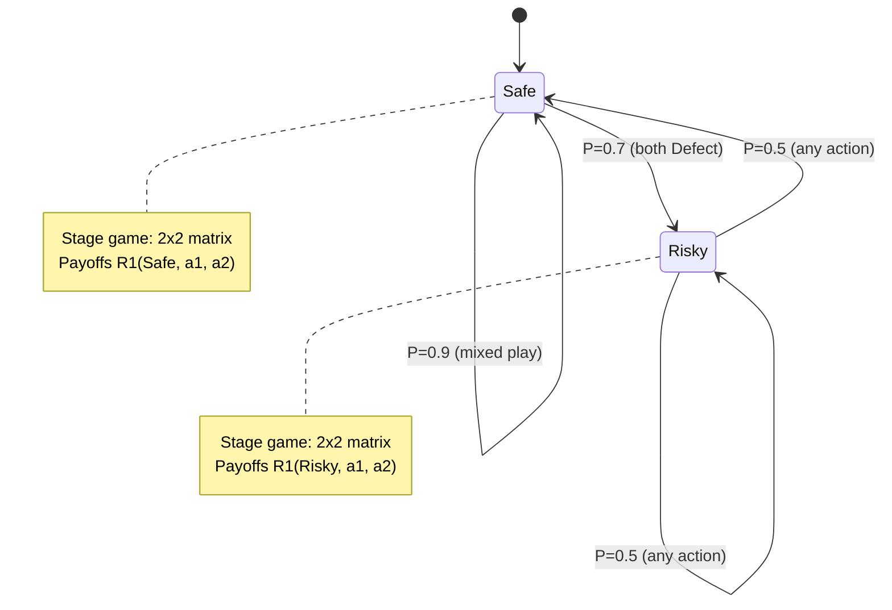

## Stochastic Games

### Definition and Formal Framework

A stochastic game (also called a Markov game) is a dynamic game with probabilistic transitions between states, generalizing both repeated games and Markov decision processes to multiple players. Introduced by Lloyd Shapley in 1953, it models situations where players interact repeatedly across a sequence of states, and the state itself evolves stochastically based on the joint actions taken.

A stochastic game is formally defined as a tuple:

$$G = (N, S, \{A_i\}_{i \in N}, P, \{R_i\}_{i \in N}, \gamma)$$

Where:

- $N = \{1, 2, \ldots, n\}$ is the set of players
- $S$ is the set of states
- $A_i$ is the action set available to player $i$ (possibly state-dependent, $A_i(s)$)
- $P(s' \mid s, a_1, \ldots, a_n)$ is the transition probability function, giving the probability of moving to state $s'$ given current state $s$ and the joint action profile $a = (a_1, \ldots, a_n)$
- $R_i(s, a_1, \ldots, a_n)$ is the stage payoff (reward) function for player $i$
- $\gamma \in [0, 1)$ is the discount factor

At each stage $t$, the game is in some state $s_t \in S$. Players simultaneously (or sequentially, depending on the model) choose actions $a_{i,t} \in A_i(s_t)$. Each player receives a stage payoff $R_i(s_t, a_t)$, and the game transitions to a new state $s_{t+1}$ according to $P(\cdot \mid s_t, a_t)$. This process repeats, generating an infinite (or finite) sequence of states and payoffs.

### Relationship to Other Game Classes

Stochastic games sit at the intersection of several frameworks:

- **Markov Decision Processes (MDPs)**: A stochastic game with $n = 1$ player reduces to an MDP.
- **Repeated Games**: A stochastic game with a single state ($|S| = 1$) reduces to a repeated game, since the "state" never changes regardless of actions.
- **Matrix/Normal-Form Games**: The stage game at each fixed state, if played once, is itself a normal-form game.
- **Extensive-Form Games**: Stochastic games can be unrolled into an extensive-form game tree with chance nodes representing the transition function, though the tree is generally infinite for infinite-horizon games.

This positioning makes stochastic games a natural unifying framework for sequential, multi-agent decision-making under uncertainty.

### Payoff Criteria

Since stochastic games typically involve an infinite horizon, players' objectives must aggregate an infinite stream of stage payoffs. Common criteria include:

**Discounted Payoff**

$$V_i = \sum_{t=0}^{\infty} \gamma^t R_i(s_t, a_t)$$

This is the most common formulation because the discount factor guarantees convergence of the infinite sum and yields well-behaved fixed-point equations.

**Average (Undiscounted) Payoff**

$$V_i = \lim_{T \to \infty} \frac{1}{T} \sum_{t=0}^{T-1} R_i(s_t, a_t)$$

Average-payoff (or "limit of means") stochastic games are analytically harder because the limit may not exist or may depend on the strategy profile in ways that discounted games avoid; existence results here often require additional assumptions like irreducibility of the transition structure. [Inference: the precise existence conditions depend on the structural class of the game and are an active area within the stochastic games literature.]

**Finite-Horizon (Total) Payoff**

$$V_i = \sum_{t=0}^{T} R_i(s_t, a_t)$$

Used when the game has a fixed, known terminal time $T$.

### Strategies and Stationarity

A **history-dependent (behavioral) strategy** for player $i$ maps the entire observed history of states and actions to a (possibly mixed) action. Formally, $\sigma_i: H_t \to \Delta(A_i)$ where $H_t$ is the set of histories up to time $t$.

A **stationary (Markov) strategy** depends only on the current state: $\sigma_i: S \to \Delta(A_i(s))$. Stationary strategies are of central interest because, under the discounted criterion, Shapley showed that stationary equilibrium strategies always exist for two-player zero-sum stochastic games with finite state and action spaces — players do not need to condition on history beyond the current state to play optimally.

### Shapley's Zero-Sum Stochastic Game and the Value Function

Shapley's foundational 1953 result addressed two-player zero-sum stochastic games. Define $V(s)$ as the value of the game starting in state $s$ under discounted payoffs. The value function satisfies a **stochastic game analogue of the Bellman equation**, combining a one-shot matrix game evaluation with continuation values:

$$V(s) = \text{val}\left[ R(s, a_1, a_2) + \gamma \sum_{s' \in S} P(s' \mid s, a_1, a_2) V(s') \right]$$

Here, $\text{val}[\cdot]$ denotes the value of the zero-sum matrix game defined by the bracketed expression, where the matrix game is played over the action sets $A_1(s) \times A_2(s)$, using minimax (or equivalently, the mixed-strategy security value guaranteed by the Minimax Theorem).

**Shapley Operator**: Define an operator $\Phi$ on the space of bounded functions $V: S \to \mathbb{R}$:

$$(\Phi V)(s) = \text{val}_{a_1, a_2}\left[ R(s, a_1, a_2) + \gamma \sum_{s'} P(s' \mid s, a_1, a_2) V(s') \right]$$

Because $\gamma < 1$, $\Phi$ is a contraction mapping with modulus $\gamma$ under the sup-norm, so the Banach Fixed-Point Theorem guarantees a unique fixed point $V^*$ satisfying $\Phi V^* = V^*$. This fixed point is the value of the stochastic game, and value iteration ($V_{k+1} = \Phi V_k$) converges to it geometrically.

### Existence of Equilibrium in the General-Sum Case

For $n$-player general-sum discounted stochastic games with finite state and action spaces, existence of a stationary Markov perfect equilibrium in behavior (mixed) strategies was established by Fink (1964) and independently by Takahashi (1964), extending Shapley's zero-sum result using a fixed-point argument analogous to Nash's existence proof but applied over the space of stationary strategy profiles combined with value functions.

The general-sum discounted stochastic game's equilibrium conditions require simultaneously solving, for each player $i$ and state $s$:

$$V_i(s) = R_i(s, \sigma^*(s)) + \gamma \sum_{s'} P(s' \mid s, \sigma^*(s)) V_i(s')$$

where $\sigma^*(s)$ is a Nash equilibrium of the one-shot game with payoffs $R_i(s, a) + \gamma \sum_{s'} P(s'\mid s,a) V_i(s')$ at every state $s$ simultaneously — a substantially harder fixed-point problem than the zero-sum case because there is no single "value" to iterate on; each player's continuation value depends on the equilibrium selected at every other state.

### Markov Perfect Equilibrium (MPE)

The solution concept most associated with stochastic games is the **Markov Perfect Equilibrium**: a subgame-perfect equilibrium in stationary (Markov) strategies, where no player can benefit from deviating at any state, given the strategies of others and correct beliefs about the continuation value function.

MPE requires two conditions simultaneously:

1. **Sequential rationality**: at every state $s$, each player's action is a best response to others' actions, given continuation values $V_i$.
2. **Consistency**: the continuation values $V_i(s)$ are correctly derived from the equilibrium strategies via the transition dynamics.

MPE is attractive because it rules out non-credible threats that depend on payoff-irrelevant history (unlike general subgame-perfect equilibria in the full history-dependent strategy space), while still capturing the strategic interdependence across states.

### Worked Example: A Two-State Pursuit Game

Consider a simplified two-player zero-sum stochastic game with two states, $S = \{s_1, s_2\}$, representing "Safe" and "Risky" market conditions. Each player has two actions, $\{C, D\}$ (Cooperate/Defect).

**Stage payoffs to Player 1 (zero-sum, Player 2 receives the negative):**

State $s_1$ (Safe):

|  | P2: C | P2: D |
| --- | --- | --- |
| **P1: C** | 3 | 0 |
| **P1: D** | 5 | 1 |

State $s_2$ (Risky):

|  | P2: C | P2: D |
| --- | --- | --- |
| **P1: C** | 1 | -2 |
| **P1: D** | 2 | 0 |

**Transition rule**: If both players play $D$ in $s_1$, the state transitions to $s_2$ with probability 0.7 (aggressive play "heats up" the market); otherwise, the state remains $s_1$ with probability 0.9. From $s_2$, any joint action returns to $s_1$ with probability 0.5.

**Solving via value iteration**: Initialize $V_0(s_1) = V_0(s_2) = 0$. At each iteration, compute the matrix game at each state using the current value estimates, solve for its minimax value using linear programming or the standard $2\times 2$ zero-sum formula, then update:

$$V_{k+1}(s_1) = \text{val}\left[R(s_1, a) + \gamma\left(P(s_1\mid s_1,a) V_k(s_1) + P(s_2\mid s_1,a) V_k(s_2)\right)\right]$$

Repeating this until $\|V_{k+1} - V_k\|_\infty < \epsilon$ yields the fixed-point values $V^*(s_1), V^*(s_2)$, and the associated equilibrium mixed strategies at each state (the "optimal stationary strategies" per Shapley's theorem). [Inference: exact numerical values depend on the chosen discount factor $\gamma$ and are omitted here since the example is illustrative of the method rather than a fully solved numerical instance.]

### Algorithmic Approaches

**Value Iteration**: Directly apply the Shapley operator $\Phi$ repeatedly. Guaranteed to converge for $\gamma < 1$ due to the contraction property, but convergence can be slow (linear rate governed by $\gamma$).

**Policy Iteration (Hoffman-Karp algorithm)**: Alternates between (1) fixing a stationary policy and solving the induced system of linear equations for its value, and (2) improving the policy by finding a best response at each state given the current value estimates. Often converges faster than value iteration in practice for zero-sum games, though each iteration is more computationally expensive.

**Linear Programming**: For zero-sum stochastic games, the value and optimal strategies can in principle be characterized via nested or simultaneous LP formulations, though the coupling across states via the transition function makes a single global LP formulation (unlike single-state matrix games) generally unavailable; instead, LPs are typically solved per-state within an iterative scheme.

**Homotopy and Continuation Methods**: For general-sum games where equilibrium computation is not guaranteed to be tractable via simple iteration, homotopy methods trace a path of equilibria as a parameter (e.g., a fictitious discount or perturbation term) is varied from an easy-to-solve case to the target game. [Inference: the practical performance of these methods is problem-dependent and is an active area of algorithmic game theory research.]

**Reinforcement Learning Connections**: Multi-agent reinforcement learning (MARL) algorithms such as Minimax-Q (Littman, 1994) and Nash-Q learning generalize Q-learning to stochastic games, learning the value function and equilibrium strategies from sampled transitions rather than a known model — directly operationalizing the Shapley/Fink-Takahashi fixed-point structure in a model-free setting.

### State Transition Diagram

### Recursive Structure Diagram (svg_diagram)

<svg xmlns="http://www.w3.org/2000/svg" viewBox="0 0 720 340">
\<style\>
.box { fill: #eef2f7; stroke: #34495e; stroke-width: 1.5; }
.lbl { font-family: Arial, sans-serif; font-size: 13px; fill: #2c3e50; }
.title { font-family: Arial, sans-serif; font-size: 15px; fill: #1a1a1a; font-weight: bold; }
.arrow { stroke: #34495e; stroke-width: 1.5; marker-end: url(#arrowhead); fill: none; }
\</style\>
<text x="360" y="24" text-anchor="middle" class="title">Stochastic Game Value Recursion (svg_diagram)</text>
<rect x="30" y="60" width="180" height="70" rx="6" class="box" />
<text x="120" y="88" text-anchor="middle" class="lbl">State s</text>
<text x="120" y="108" text-anchor="middle" class="lbl">Stage game R(s, a1, a2)</text>
<rect x="270" y="60" width="200" height="70" rx="6" class="box" />
<text x="370" y="88" text-anchor="middle" class="lbl">Joint action a = (a1, a2)</text>
<text x="370" y="108" text-anchor="middle" class="lbl">chosen via equilibrium</text>
<rect x="530" y="60" width="160" height="70" rx="6" class="box" />
<text x="610" y="88" text-anchor="middle" class="lbl">Transition P(s'|s,a)</text>
<text x="610" y="108" text-anchor="middle" class="lbl">to next state s'</text>
<rect x="270" y="200" width="200" height="90" rx="6" class="box" />
<text x="370" y="228" text-anchor="middle" class="lbl">Continuation value</text>
<text x="370" y="248" text-anchor="middle" class="lbl">gamma * sum_s' P(s'|s,a) V(s')</text>
<text x="370" y="268" text-anchor="middle" class="lbl">fed back into V(s)</text>
<line x1="210" y1="95" x2="270" y2="95" class="arrow" />
<line x1="470" y1="95" x2="530" y2="95" class="arrow" />
<line x1="610" y1="130" x2="610" y2="245" class="arrow" />
<line x1="610" y1="245" x2="470" y2="245" class="arrow" />
<line x1="270" y1="245" x2="150" y2="245" class="arrow" />
<line x1="120" y1="245" x2="120" y2="130" class="arrow" />
<text x="180" y="330" text-anchor="middle" class="lbl">V(s) = val[ R(s,a) + gamma * E_s'[V(s')] ] (Shapley/Bellman fixed point)</text>
</svg>

### Applications

- **Economics**: Dynamic oligopoly competition, resource extraction games (e.g., fishery or oil-field depletion where the "state" is the remaining stock), and capital accumulation games.
- **Wireless and Networked Systems**: Power control and spectrum-sharing among competing transmitters, where channel conditions form the stochastic state.
- **Robotics and Multi-Agent AI**: Multi-robot coordination and pursuit-evasion games where the environment state (positions, resources) evolves with joint actions.
- **Political Economy**: Repeated bargaining and coalition formation under changing institutional states.
- **Cybersecurity**: Attacker-defender interactions over an evolving network state (e.g., patched/unpatched vulnerabilities).
- **Reinforcement Learning Benchmarks**: Multi-agent RL testbeds (e.g., grid-world pursuit games, soccer simulations) are frequently formalized as stochastic games to study emergent multi-agent behavior.

### Key Points

- Stochastic games generalize repeated games and MDPs by combining state transitions with multi-player strategic interaction at each stage.
- Shapley (1953) proved existence of a value and optimal stationary strategies for two-player zero-sum discounted stochastic games via a contraction-mapping (Bellman-like) fixed point.
- Fink (1964) and Takahashi (1964) extended existence of stationary equilibria to $n$-player general-sum discounted games.
- Markov Perfect Equilibrium is the standard solution concept, requiring both sequential rationality and value-function consistency at every state.
- Discounted payoff criteria are analytically more tractable than average (undiscounted) payoff criteria due to guaranteed contraction properties.
- Computational methods include value iteration, policy iteration (Hoffman-Karp for zero-sum games), and model-free multi-agent reinforcement learning algorithms (Minimax-Q, Nash-Q).

### Related Topics

- Markov Decision Processes (MDPs) as the single-player special case
- Repeated Games and the Folk Theorem
- Minimax-Q Learning and Nash-Q Learning (Multi-Agent Reinforcement Learning)
- Mean-Field Games (the large-population limit of stochastic games)
- Differential Games (continuous-time analogue)
- Partially Observable Stochastic Games (POSGs)
- The Folk Theorem for Stochastic Games
- Zero-Sum vs. General-Sum Game Distinctions
- Bellman Equations and Dynamic Programming
- Correlated Equilibrium in Dynamic Settings