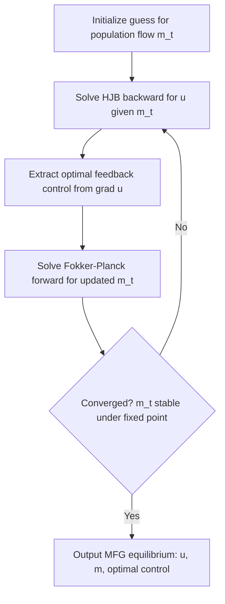

## Mean Field Games

### Overview

Mean field game (MFG) theory models strategic interaction among a very large (continuum) number of small, individually negligible players who interact only through the aggregate statistical distribution of the population's states, not through direct pairwise coupling. Introduced independently by Lasry and Lions and by Huang, Malhamé, and Caines in the mid-2000s, MFG theory provides tractable approximations to N-player stochastic differential games as $N \to \infty$, converting an intractable coupled system of $N$ Hamilton-Jacobi-Bellman (HJB) equations into a closed system of two coupled PDEs.

### Motivation: From N-Player Games to the Mean Field Limit

Consider $N$ symmetric players with idiosyncratic noise, each controlling state $X_t^i$ via control $\alpha_t^i$, minimizing a cost that depends on the **empirical distribution** of all players:

$$m_t^N = \frac{1}{N}\sum_{j=1}^N \delta_{X_t^j}$$

As $N \to \infty$, under exchangeability and propagation-of-chaos arguments, $m_t^N$ converges to a deterministic flow of measures $m_t$, and each player's best response reduces to solving a **single-player** stochastic control problem against this fixed distribution — since any one player's influence on the aggregate becomes negligible.

[Inference] This decoupling is the core simplification that makes MFG tractable: instead of $N$ coupled equations, one solves a fixed-point problem in a single representative agent's optimization coupled with a distributional consistency condition.

### The MFG PDE System

Let $u(t,x)$ be the value function of a representative player and $m(t,x)$ the population density. The standard MFG system on $[0,T] \times \mathbb{R}^d$ is:

**Hamilton-Jacobi-Bellman equation (backward in time):**

$$-\partial_t u - \nu \Delta u + H(x, \nabla u, m) = 0, \quad u(T,x) = g(x, m(T))$$

**Kolmogorov-Fokker-Planck equation (forward in time):**

$$\partial_t m - \nu \Delta m - \mathrm{div}\left( m \, \partial_p H(x, \nabla u, m) \right) = 0, \quad m(0,x) = m_0(x)$$

where:

- $H(x,p,m)$ is the **Hamiltonian**, derived from the running cost and dynamics, typically $H(x,p,m) = \sup_a \{ -f(x,a,m) - p \cdot b(x,a) \}$ for dynamics $dX_t = b(X_t, \alpha_t)\,dt + \sqrt{2\nu}\,dW_t$.
- $\nu \ge 0$ is a diffusion (noise) coefficient.
- The optimal feedback control is $\alpha^*(t,x) = \partial_p H(x, \nabla u(t,x), m(t))^{-1}$-type expression (argmax of the Hamiltonian).

**Key structural feature**: the HJB equation runs **backward** from a terminal condition while the Fokker-Planck equation runs **forward** from an initial condition, coupled through $m$ appearing in $u$'s equation and $\nabla u$ appearing in $m$'s equation. This forward-backward coupling is what makes MFG systems mathematically distinct from standard optimal control (which is purely backward) and standard forward diffusion (which is purely forward).

### Diagram: MFG Fixed-Point Structure (svg_diagram)

<svg xmlns="http://www.w3.org/2000/svg" viewBox="0 0 720 380" font-family="Arial, sans-serif">
<title>MFG Fixed-Point Structure (svg_diagram)</title>
<rect x="0" y="0" width="720" height="380" fill="#ffffff" />
<rect x="60" y="40" width="280" height="80" rx="8" fill="#e8f0fe" stroke="#3b5bdb" stroke-width="1.5" />
<text x="200" y="65" text-anchor="middle" font-size="14" font-weight="bold" fill="#1c2b4a">HJB Equation (backward)</text>
<text x="200" y="85" text-anchor="middle" font-size="11" fill="#1c2b4a">-∂ₜu - νΔu + H(x,∇u,m) = 0</text>
<text x="200" y="103" text-anchor="middle" font-size="11" fill="#1c2b4a">given population flow m(t,x)</text>
<rect x="380" y="40" width="280" height="80" rx="8" fill="#d3f9d8" stroke="#2f9e44" stroke-width="1.5" />
<text x="520" y="65" text-anchor="middle" font-size="14" font-weight="bold" fill="#1b4620">Fokker-Planck Eq. (forward)</text>
<text x="520" y="85" text-anchor="middle" font-size="11" fill="#1b4620">∂ₜm - νΔm - div(m·∂ₚH) = 0</text>
<text x="520" y="103" text-anchor="middle" font-size="11" fill="#1b4620">given optimal control from u</text>
<line x1="340" y1="70" x2="380" y2="70" stroke="#333" stroke-width="1.5" marker-end="url(#arr)" />
<text x="360" y="60" text-anchor="middle" font-size="10">m drives u</text>
<path d="M 520 120 C 520 180, 200 180, 200 120" stroke="#333" stroke-width="1.5" fill="none" marker-end="url(#arr)" />
<text x="360" y="195" text-anchor="middle" font-size="10">∇u drives optimal control, which drives m</text>
<rect x="200" y="240" width="320" height="60" rx="8" fill="#fff3bf" stroke="#e8a917" stroke-width="1.5" />
<text x="360" y="265" text-anchor="middle" font-size="13" font-weight="bold" fill="#5c4b00">Nash Equilibrium of the Mean Field Game</text>
<text x="360" y="283" text-anchor="middle" font-size="11" fill="#5c4b00">Fixed point: (u,m) mutually consistent</text>
<line x1="360" y1="240" x2="360" y2="210" stroke="#333" stroke-width="1.5" marker-end="url(#arr)" />
<rect x="30" y="320" width="660" height="45" rx="8" fill="#f1f3f5" stroke="#495057" stroke-width="1.5" />
<text x="360" y="348" text-anchor="middle" font-size="12" fill="#212529">Approximates the symmetric N-player game equilibrium as N → ∞</text>
</svg>

### Existence and Uniqueness

Existence of solutions generally uses Schauder fixed-point arguments on the coupling map $m \mapsto u \mapsto$ (optimal flow) $\mapsto m$.

**Lasry-Lions monotonicity condition**: uniqueness typically requires the coupling costs to satisfy a monotonicity condition, e.g.:

$$\int (g(x,m_1) - g(x,m_2))\, d(m_1 - m_2)(x) \ge 0$$

with strict inequality unless $m_1 = m_2$. Intuitively, this captures **congestion effects** (players prefer states less occupied by others), which stabilizes the equilibrium and rules out oscillatory multiplicity.

[Inference] Without a monotonicity structure, MFG systems can admit multiple equilibria, analogous to multiplicity in static games with strategic complementarities, though the precise non-uniqueness landscape is problem-dependent.

### Worked Example: Systemic Risk / Herding Model

Consider $N$ banks with log-capitalization $X_t^i$, each controlling drift $\alpha_t^i$ to stay close to the population mean (mutual borrowing/lending), with dynamics:

$$dX_t^i = \left[ \kappa(\bar{X}_t - X_t^i) + \alpha_t^i \right] dt + \sigma\, dW_t^i$$

where $\bar{X}_t = \frac{1}{N}\sum_j X_t^j$ is the empirical mean. Each bank minimizes a quadratic effort cost plus a penalty for deviating from the mean, with a terminal penalty encouraging solvency ($X_T^i \ge 0$).

**Mean field limit:** $\bar{X}_t \to m(t)$ (mean of the limiting distribution), decoupling player $i$'s problem into a standard linear-quadratic control problem against a known deterministic mean trajectory $m(t)$.

**Steps:**

1. Guess a linear-quadratic value function $u(t,x) = a(t) x^2 + b(t) x + c(t)$.
2. Substitute into the HJB equation; the optimal control $\alpha^*(t,x)$ comes out linear in $(x - m(t))$: a **mean-reverting** feedback strategy.
3. Substitute $\alpha^*$ into the Fokker-Planck equation to propagate $m(t)$ forward, verifying self-consistency ($m(t)$ computed from $\alpha^*$ matches the mean used to derive $\alpha^*$).

**Key Points**

- This class of linear-quadratic MFG models is explicitly solvable via coupled Riccati ODEs, analogous to LQ differential games but decoupled into single-agent problems against an aggregate.
- The model illustrates **systemic risk contagion**: a common noise term (shared market shock) added to $\bar{X}_t$ can produce simultaneous defaults, motivating the extension to MFGs with common noise.

### MFG with Common Noise

When all players are subject to a shared random shock $W_t^0$ (e.g., a market-wide factor) in addition to idiosyncratic noise, the population distribution $m_t$ itself becomes **stochastic** rather than deterministic. The system becomes a **stochastic MFG**, requiring:

$$du(t,x) = -H(x,\nabla u, m_t)\,dt + \nu(t,x)\, dW_t^0, \quad \text{(backward stochastic PDE)}$$

$$dm_t = [\ldots]\,dt + [\ldots]\,dW_t^0 \quad \text{(stochastic Fokker-Planck)}$$

[Unverified] The well-posedness theory for MFGs with common noise is considerably more delicate than the deterministic case and typically relies on the master equation formulation (below) or probabilistic weak-solution approaches; results are sensitive to the specific regularity assumptions imposed.

### The Master Equation

To capture finite-$N$ corrections and MFG with common noise rigorously, Lions introduced the **master equation**, a PDE on the space of probability measures for a function $U(t,x,m)$:

$$-\partial_t U - \nu\Delta_x U + H(x,\nabla_x U, m) - \int \nu \Delta_y \frac{\delta U}{\delta m}(t,x,m,y)\, dm(y) - \int \partial_p H(y,\nabla_x U(t,y,m),m)\cdot \nabla_y \frac{\delta U}{\delta m}(t,x,m,y)\, dm(y) = 0$$

with $U(T,x,m) = g(x,m)$. Here $U(t,x,m)$ represents the value to a player at state $x$ when the population distribution is $m$ — a single object from which the entire MFG system (and its finite-$N$ approximation error) can be recovered. This is the natural infinite-dimensional analogue connecting MFG to the $N$-player game via a rigorous convergence/propagation-of-chaos argument.

### Numerical Methods

- **Finite difference schemes** (Achdou-Capuzzo-Dolcetta): discretize the coupled forward-backward PDE system on a grid, solved via a Newton-type iteration exploiting the specific monotone structure of the discretization.
- **Fictitious play / policy iteration**: iterate between (a) solving the HJB for $u$ given a fixed $m$-flow, (b) updating $m$ via Fokker-Planck given the resulting control, and (c) averaging iterates to ensure convergence under monotonicity.
- **Machine learning approaches**: deep MFG solvers parametrize $u$ and $m$ (or the control policy) with neural networks, minimizing a loss combining the HJB residual, Fokker-Planck residual, and boundary conditions (physics-informed neural network style), or use fictitious-play-based deep reinforcement learning for the population game.

### Applications

- **Economics/finance**: systemic risk and interbank lending, optimal execution with market impact, high-frequency trading with a crowd of similar traders, macroeconomic models with heterogeneous agents (Aiyagari-type models reframed as MFG).
- **Crowd dynamics**: pedestrian flow modeling, evacuation planning, traffic flow (mean field traffic models).
- **Epidemiology**: optimal control of vaccination/social distancing in large populations (each individual optimizes given aggregate infection prevalence).
- **Energy systems**: electric vehicle charging coordination, demand-response in smart grids.
- **Machine learning**: connections to training dynamics of very wide neural networks (mean-field limit of stochastic gradient descent), multi-agent reinforcement learning at scale.

### Relationship to Other Frameworks

- **Differential games** (previous topic): MFG is the $N \to \infty$ limit of symmetric $N$-player stochastic differential games; the coupled HJB system of the $N$-player feedback Nash equilibrium becomes the two-equation MFG system.
- **Optimal transport**: the Fokker-Planck component and certain MFG variational formulations (Benamou-Brenier-type) connect closely to optimal transport theory, especially in the deterministic, potential MFG case where the system arises as the Euler-Lagrange condition of a convex variational problem.
- **Mean-field control (MFC)** — a related but distinct concept: MFC considers a **single social planner** optimizing the *whole population's* aggregate objective (cooperative), yielding a different PDE system (McKean-Vlasov control) than the competitive MFG equilibrium. Confusing MFG (competitive) with MFC (cooperative) is a common conceptual error since the equations look superficially similar.

### Common Pitfalls

- Treating MFG as simply "a game with many players" without recognizing the specific structural requirement that interaction occurs **only** through the aggregate distribution, not pairwise.
- Confusing the competitive MFG Nash equilibrium with the cooperative mean-field control (social optimum) — these generally yield different equilibrium distributions (a mean-field analogue of the price of anarchy).
- Assuming uniqueness of the MFG equilibrium without checking a monotonicity-type condition.
- [Speculation] In numerical implementations, naive fixed-point iteration (without damping/averaging) often fails to converge for non-monotone MFGs, though robustness varies by problem and discretization scheme.

**Related Topics**

- Differential Games
- Mean-Field Control and McKean-Vlasov Optimal Control
- The Master Equation and Propagation of Chaos
- Optimal Transport Theory
- Systemic Risk Models in Finance
- Hamilton-Jacobi-Bellman Equation
- Fokker-Planck / Kolmogorov Forward Equation
- Multi-Agent Reinforcement Learning at Scale
- Price of Anarchy in Large Games