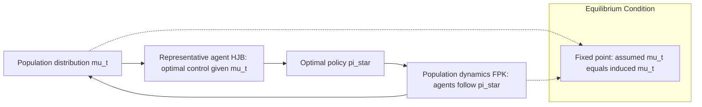

## Large Population Games

### Definition and Motivation

Large population games study strategic interaction among a very large (formally, a continuum or asymptotically infinite) number of players, where each individual player has a negligible effect on the aggregate outcome, yet the collective behavior of all players jointly determines the environment each player responds to. This framework addresses a fundamental computational and conceptual limitation of classical $n$-player game theory: as $n$ grows, tracking the individual strategy of every opponent becomes both analytically intractable and strategically irrelevant, since no single player can unilaterally shift the aggregate state.

The central modeling idea is **anonymity**: a player's payoff depends on their own state and action and on the *distribution* of states/actions across the population, rather than on the identities or individual choices of specific other players. This transforms an $n$-dimensional strategic coupling problem into a fixed-point problem between an individual's best response and a population distribution.

### Relationship to Other Frameworks

- **Stochastic Games**: Large population games can be viewed as the many-player limit of stochastic games, where per-player state transitions remain individually stochastic (Markovian) but the population-level empirical distribution of states becomes deterministic by a law-of-large-numbers effect as $n \to \infty$.
- **Nash Equilibrium**: Large population games retain Nash equilibrium as the solution concept but reformulate it as a fixed point between individual optimization and population distribution, often called a **Mean-Field Equilibrium (MFE)** or **Wardrop Equilibrium**, depending on the sub-tradition.
- **Aggregative Games**: A related but distinct class where payoffs depend on an aggregate (e.g., sum or average) of all actions rather than the full distribution; large population games generalize this by allowing payoff-relevant heterogeneity captured in a full distribution rather than a single scalar aggregate.
- **Evolutionary Game Theory**: Shares the population-distribution perspective, but evolutionary game theory typically emphasizes dynamic adjustment processes (replicator dynamics) rather than static or dynamic-programming equilibrium computation.

### Two Major Modeling Traditions

**1. Nonatomic (Continuum) Games — Schmeidler / Aumann Tradition**

Formalized by Schmeidler (1973) and rooted in Aumann's (1964) work on markets with a continuum of traders, this tradition models the player set as a continuum, typically the unit interval $[0,1]$ with Lebesgue measure. Each player $\omega \in [0,1]$ chooses an action $a(\omega) \in A$, and payoffs are given by:

$$u(\omega, a(\omega), \mu_a)$$

where $\mu_a$ is the distribution (measure) of actions induced across the population. Because any individual player is a measure-zero subset of $[0,1]$, no single player's deviation changes $\mu_a$, formalizing the "negligible impact" property exactly (rather than only approximately, as in large finite games).

**2. Mean-Field Games (MFG) — Lasry-Lions / Huang-Caines-Malhamé Tradition**

Introduced independently by Lasry and Lions (2006–2007) and by Huang, Caines, and Malhamé (2006) under the name "Nash Certainty Equivalence," Mean-Field Games extend the large population idea to **dynamic, stochastic** settings, coupling:

1. A **Hamilton-Jacobi-Bellman (HJB) equation** describing each representative player's optimal control problem given the population's evolving distribution, and
2. A **Fokker-Planck-Kolmogorov (FPK) equation** describing how the population distribution evolves given that all players follow their optimal control.

This forms a coupled forward-backward system: the HJB equation runs backward in time (from a terminal condition), while the FPK equation runs forward in time (from an initial distribution), and consistency between the two defines the mean-field equilibrium.

### Formal Mean-Field Game Structure

Consider a representative player with state $x_t \in \mathbb{R}^d$ evolving according to a controlled stochastic differential equation:

$$dx_t = b(x_t, \alpha_t, \mu_t)\, dt + \sigma(x_t, \mu_t)\, dW_t$$

where $\alpha_t$ is the player's control (action), $\mu_t$ is the population distribution at time $t$, and $W_t$ is a Wiener process. The player minimizes an expected cost:

$$J(\alpha) = \mathbb{E}\left[\int_0^T f(x_t, \alpha_t, \mu_t)\, dt + g(x_T, \mu_T)\right]$$

**HJB Equation** (value function $V(t, x)$, given a fixed flow of measures $\mu_t$):

$$-\partial_t V - \inf_{\alpha} \left\{ b(x, \alpha, \mu_t) \cdot \nabla V + f(x, \alpha, \mu_t) \right\} - \frac{1}{2}\text{tr}(\sigma \sigma^\top \nabla^2 V) = 0$$

with terminal condition $V(T, x) = g(x, \mu_T)$.

**Fokker-Planck Equation** (population density $m(t, x)$, given the optimal control $\alpha^*$ derived from $V$):

$$\partial_t m + \text{div}(b(x, \alpha^*(t,x), \mu_t)\, m) - \frac{1}{2}\sum_{i,j} \partial_{x_i x_j}^2 (\sigma \sigma^\top_{ij}\, m) = 0$$

with initial condition $m(0, \cdot) = m_0$.

**Mean-Field Equilibrium**: A pair $(V, m)$ solving both equations simultaneously such that $\mu_t = m(t, \cdot)$ for all $t$. Existence and uniqueness of solutions typically require Lasry-Lions monotonicity conditions on $f$ and $g$ with respect to $\mu$, which rule out pathological "herding" instabilities. [Inference: precise existence/uniqueness theorems depend on regularity and monotonicity assumptions that vary by paper and application; this is an active mathematical research area rather than a single settled result.]

### Discrete-Time / Discrete-State Mean-Field Games (MFG on Markov Chains)

For applications closer to game-theoretic and reinforcement-learning practice, discrete-time Mean-Field Games replace the SDE/PDE system with a Markov Decision Process coupled to a population distribution:

- State space $S$ (finite or countable), action space $A$
- Representative player transition: $P(s' \mid s, a, \mu)$, where $\mu \in \Delta(S)$ is the population state distribution
- Reward: $r(s, a, \mu)$
- **Individual best response**: given a fixed sequence of population distributions $\{\mu_t\}$, the representative player solves a standard MDP to obtain optimal policy $\pi^*$
- **Population consistency**: the distribution $\mu_{t+1}$ induced by all players following $\pi^*$ from $\mu_t$ must match the assumed $\mu_{t+1}$ used in the player's MDP

This discrete formulation is the basis for most **Mean-Field Reinforcement Learning (MFRL)** algorithms, which learn $\pi^*$ and the fixed-point distribution $\mu^*$ jointly via iterative simulation, avoiding the need to explicitly solve HJB/FPK PDEs.

### Wardrop Equilibrium (Nonatomic Routing/Congestion Games)

A widely used special case for congestion and routing settings (traffic networks, network resource allocation) is the **Wardrop Equilibrium**, introduced by John Wardrop (1952) in the context of road traffic. In a nonatomic congestion game, a continuum of players each route an infinitesimal flow across a network, and:

**Wardrop's First Principle (User Equilibrium)**: All used paths between an origin-destination pair have equal and minimal cost; no used path has higher cost than an unused one.

Formally, for flow $f_p$ on path $p$ and path cost $c_p(f)$ (a function of the flow on all paths, since costs typically depend on congestion):

$$f_p > 0 \implies c_p(f) = \min_{p' \in P} c_{p'}(f)$$

This equilibrium concept coincides with the Nash equilibrium of the corresponding nonatomic game, since with infinitesimal players, no individual can affect aggregate congestion, so each simply selects a minimum-cost path given current congestion levels — precisely the anonymity property central to large population games.

**Price of Anarchy**: A key application-driven result compares the total cost under Wardrop equilibrium to the social-optimum (centrally coordinated) flow, quantifying the inefficiency of decentralized routing. The classic Pigou example (a two-link network with linear vs. constant latency functions) demonstrates that equilibrium flow can be strictly worse than optimal flow, and Roughgarden and Tardos established tight bounds on this inefficiency ratio for broad classes of latency functions.

### Worked Example: Congestion Game with Two Routes

Consider a continuum of drivers, total mass normalized to 1, traveling from origin $O$ to destination $D$ via two routes:

- Route A: latency $c_A(x) = x$ (congestion-dependent; $x$ = fraction of drivers using A)
- Route B: latency $c_B(x) = 0.75$ (constant; unaffected by congestion)

**Finding Wardrop Equilibrium**: If both routes are used, costs must be equal:

$$c_A(x^*) = c_B \implies x^* = 0.75$$

So at equilibrium, 75% of drivers use Route A (cost $0.75$) and 25% use Route B (cost $0.75$) — both routes have identical cost, consistent with Wardrop's principle. Total equilibrium cost:

$$C_{eq} = 0.75 \times 0.75 + 0.25 \times 0.75 = 0.75$$

**Social optimum** (minimizing total travel time $x \cdot c_A(x) + (1-x) \cdot c_B$):

$$\min_x \left[ x^2 + 0.75(1-x) \right]$$

Taking the derivative and setting to zero: $2x - 0.75 = 0 \implies x^* = 0.375$. Social-optimum total cost:

$$C_{opt} = 0.375^2 + 0.75(0.625) = 0.1406 + 0.46875 = 0.609$$

Since $C_{eq} = 0.75 > C_{opt} = 0.609$, the decentralized equilibrium is strictly less efficient than the social optimum — a direct illustration of the Price of Anarchy in nonatomic congestion games. [Inference: this numerical illustration is constructed for pedagogical clarity rather than drawn from a specific published dataset.]

### Mean-Field Equilibrium as an Approximation to Large Finite Games

A key theoretical justification for the mean-field approach is the **approximation theorem**: as the number of players $n \to \infty$, the equilibria of the $n$-player stochastic game converge (under regularity conditions) to the mean-field equilibrium, and conversely, the mean-field equilibrium strategy, when applied by all $n$ players in the finite game, constitutes an **$\epsilon$-Nash equilibrium** with $\epsilon \to 0$ as $n \to \infty$. This result (established in various forms by Huang-Caines-Malhamé and later refined by others) justifies using the tractable mean-field limit as a practical proxy for computationally intractable large-but-finite games.

### Algorithmic and Computational Approaches

- **Fixed-Point / Fictitious Play Iteration**: Alternate between (1) solving the representative agent's best-response problem given a candidate population trajectory $\mu_t$, and (2) updating $\mu_t$ based on the resulting population behavior, iterating to convergence (analogous to fictitious play in classical game theory).
- **PDE Solvers for HJB-FPK Systems**: Finite-difference or finite-element numerical schemes for the coupled forward-backward PDE system, especially in continuous-state MFGs. [Inference: exact solver choice and convergence properties are highly problem-specific.]
- **Mean-Field Reinforcement Learning (MFRL)**: Model-free learning where each agent updates its policy using a mean-field-augmented Q-function $Q(s, a, \mu)$, and the population distribution $\mu$ is estimated empirically from simulation, iteratively refined alongside the policy (Yang et al., 2018, "Mean Field Multi-Agent Reinforcement Learning").
- **Deep Learning-Based MFG Solvers**: Recent approaches parameterize the value function and/or population density with neural networks, trained via variants of physics-informed neural network (PINN) losses that penalize violation of the HJB and FPK equations. [Unverified: this is a fast-moving research area; specific architectures and benchmark results should be checked against current literature for any applied use.]

### System Coupling Diagram

### Mean-Field Equilibrium Structure (svg_diagram)

<svg xmlns="http://www.w3.org/2000/svg" viewBox="0 0 740 320">
\<style\>
.box { fill: #eef7f0; stroke: #2e7d4f; stroke-width: 1.5; }
.box2 { fill: #f7f0ee; stroke: #a6462e; stroke-width: 1.5; }
.lbl { font-family: Arial, sans-serif; font-size: 12.5px; fill: #2c3e50; }
.title { font-family: Arial, sans-serif; font-size: 15px; fill: #1a1a1a; font-weight: bold; }
.arrow { stroke: #34495e; stroke-width: 1.5; marker-end: url(#arrowhead2); fill: none; }
\</style\>
<text x="370" y="24" text-anchor="middle" class="title">Mean-Field Game Equilibrium Loop (svg_diagram)</text>
<rect x="40" y="70" width="220" height="80" rx="6" class="box" />
<text x="150" y="98" text-anchor="middle" class="lbl">Population Distribution</text>
<text x="150" y="118" text-anchor="middle" class="lbl">mu_t (state of the crowd)</text>
<rect x="500" y="70" width="200" height="80" rx="6" class="box2" />
<text x="600" y="98" text-anchor="middle" class="lbl">Representative Agent</text>
<text x="600" y="118" text-anchor="middle" class="lbl">solves HJB given mu_t</text>
<rect x="500" y="210" width="200" height="80" rx="6" class="box2" />
<text x="600" y="238" text-anchor="middle" class="lbl">Optimal Policy pi*(t,x)</text>
<text x="600" y="258" text-anchor="middle" class="lbl">applied by every agent</text>
<rect x="40" y="210" width="220" height="80" rx="6" class="box" />
<text x="150" y="238" text-anchor="middle" class="lbl">FPK Update</text>
<text x="150" y="258" text-anchor="middle" class="lbl">mu evolves under pi*</text>
<line x1="260" y1="110" x2="500" y2="110" class="arrow" />
<line x1="600" y1="150" x2="600" y2="210" class="arrow" />
<line x1="500" y1="250" x2="260" y2="250" class="arrow" />
<line x1="150" y1="210" x2="150" y2="150" class="arrow" />
<text x="370" y="305" text-anchor="middle" class="lbl">Equilibrium: assumed mu_t at input = induced mu_t at output, for all t</text>
</svg>

### Applications

- **Traffic and Transportation Networks**: Wardrop equilibrium models for congestion routing, ride-sharing fleet positioning, and urban mobility planning.
- **Financial Markets**: Systemic risk models where a large number of banks or traders interact through a common market-clearing price or aggregate exposure (mean-field models of interbank lending, herding, and contagion).
- **Epidemiology**: Large-population SIR-type models where individual behavior (e.g., social distancing effort) responds to the population-level infection distribution.
- **Energy Systems**: Demand-response and electric vehicle charging coordination, where each consumer's charging decision responds to aggregate grid load.
- **Crowd Dynamics**: Pedestrian flow and evacuation modeling, where individual movement decisions depend on local crowd density.
- **Machine Learning / Multi-Agent RL**: Mean-field reinforcement learning for large-scale multi-agent systems (e.g., massive multiplayer game AI, swarm robotics) where pairwise interaction modeling is computationally infeasible.

### Key Points

- Large population games replace individual-opponent tracking with a population distribution, exploiting the negligible-impact property of each player in a large or continuum population.
- Two major traditions: nonatomic games (Schmeidler/Aumann, static) and Mean-Field Games (Lasry-Lions / Huang-Caines-Malhamé, dynamic and stochastic).
- Mean-Field Games couple a backward HJB equation (individual optimization) with a forward Fokker-Planck equation (population evolution) into a joint fixed-point system.
- Wardrop equilibrium is the nonatomic-game solution concept for congestion/routing settings, characterized by equal costs across all used paths.
- Mean-field equilibria approximate large finite-player Nash equilibria, with approximation error (as an $\epsilon$-Nash equilibrium) vanishing as $n \to \infty$.
- Computational approaches range from classical fixed-point/fictitious-play iteration and PDE solvers to modern mean-field reinforcement learning and neural-network-based MFG solvers.

### Related Topics

- Mean-Field Games: HJB-FPK System (deep dive)
- Wardrop Equilibrium and Price of Anarchy
- Aggregative Games
- Evolutionary Game Theory and Replicator Dynamics
- Mean-Field Reinforcement Learning
- Nonatomic Games (Schmeidler's Existence Theorem)
- Congestion Games and Potential Functions
- Stochastic Games (finite-player predecessor framework)
- Fictitious Play and Learning in Games
- Systemic Risk Models in Financial Networks