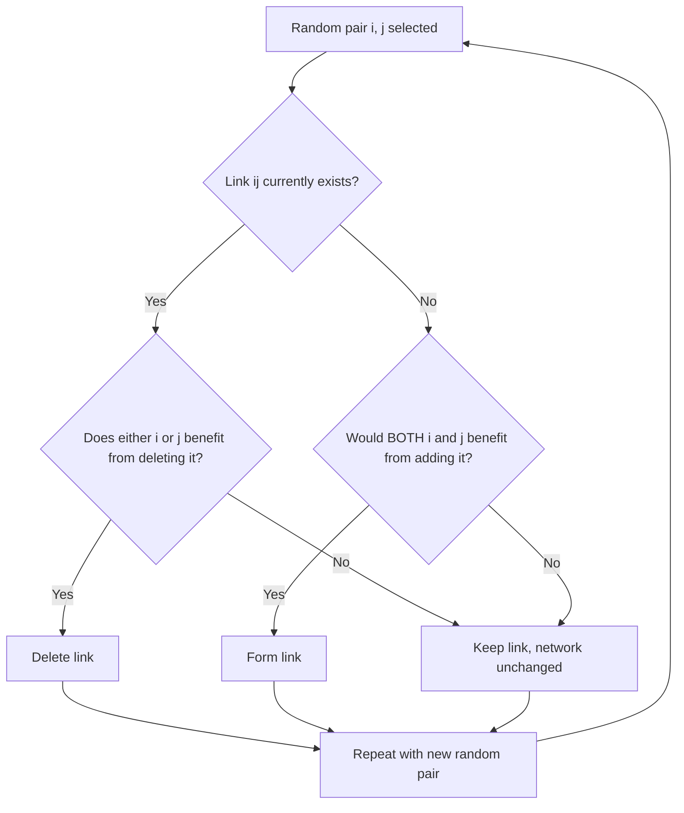

## Network Formation Games

### Overview

Network formation games model strategic decisions by individual agents about which links (relationships, connections, edges) to create or sever within a network, where each agent's payoff depends on the resulting network structure. Unlike graphical games (where the network is fixed and players choose actions), network formation games treat the network topology itself as the equilibrium object — the "action" is a choice of links, and the resulting graph is an outcome of strategic interaction rather than an exogenous input.

### Formal Setup

Let $N = \{1, \dots, n\}$ be the set of players (nodes). Each player $i$ chooses a set of links to propose, $g_i \subseteq \{ \{i,j\} : j \ne i \}$. The realized network $g = \bigcup_i g_i$ (or, under **mutual consent**, only links proposed by both endpoints) determines each player's payoff $u_i(g)$.

**Two canonical link-formation protocols:**

- **One-sided link formation (Bala-Goyal / directed model)**: player $i$ unilaterally decides to form a link to $j$; the link exists in $g$ as soon as $i$ proposes it, regardless of $j$'s consent. Costs are borne by the initiator, but **benefits may flow to both** endpoints (e.g., information access).
- **Two-sided link formation (Jackson-Wolinsky / mutual consent)**: a link $\{i,j\}$ forms only if **both** $i$ and $j$ agree; this requires equilibrium concepts beyond standard Nash equilibrium, since unilateral deviation cannot unilaterally *add* a link (only sever one's own links).

### Solution Concepts

**Nash Network (one-sided formation)**: a network $g^*$ is a Nash network if no player can improve their payoff by unilaterally changing their own link set $g_i$, holding all others' link sets fixed. Standard Nash equilibrium applies directly since link decisions are unilateral.

**Pairwise Stability (two-sided formation)**: because adding a link requires bilateral consent, standard Nash equilibrium is too weak (it only captures unilateral deviations, i.e., link deletions) and too permissive (a "no new links" equilibrium may be trivially stable even when both parties would benefit from adding one). Jackson and Wolinsky's **pairwise stability** requires:

1. **No profitable unilateral deletion**: for every link $\{i,j\} \in g$, neither $i$ nor $j$ benefits from deleting it: $u_i(g) \ge u_i(g - ij)$ and $u_j(g) \ge u_j(g-ij)$.
2. **No profitable bilateral addition**: for every link $\{i,j\} \notin g$, it is not the case that **both** $i$ and $j$ would strictly benefit from adding it (with at least one strictly better off and the other weakly better off): NOT $\left[ u_i(g+ij) > u_i(g) \text{ and } u_j(g+ij) \ge u_j(g) \right]$ (and symmetrically).

[Inference] Pairwise stability is a coarser, more permissive-to-model concept than full Nash equilibrium over bilateral link-formation strategies (e.g., Myerson's or Dutta-Mutuswami's refinements), because it does not require robustness to coordinated multi-link deviations — this is why pairwise-stable networks are not always efficient or unique, and stronger refinements (pairwise Nash stability, strong stability) are used when coalitional deviations matter.

### The Connections Model (Jackson-Wolinsky)

A canonical worked example. Each player benefits from **direct and indirect** connections, with benefits decaying over path length, while direct links carry a cost $c$.

**Payoff function:**

$$u_i(g) = \sum_{j \ne i} \delta^{\ell(i,j)} - c \cdot \eta_i(g)$$

where $\delta \in (0,1)$ is a decay factor, $\ell(i,j)$ is the shortest path length between $i$ and $j$ in $g$ (with $\delta^{\ell} = 0$ if disconnected), and $\eta_i(g)$ is the number of direct links $i$ maintains.

**Key results:**

- If $c < \delta - \delta^2$ (link cost is low relative to net direct benefit even after accounting for the value of indirect paths), the **complete network** (everyone linked to everyone) is the unique efficient network and is pairwise stable.
- If $\delta - \delta^2 < c < \delta$ (link cost exceeds this threshold but a direct link is still worth more than nothing), the **star network** (one central hub connected to all others, who are connected only to the hub) is efficient, and can be pairwise stable for cost ranges depending on $n$.
- If $c > \delta$, the **empty network** (no links) is efficient and stable.

**Key Points**

- This model produces the seminal **tension between efficiency and stability**: for intermediate cost ranges, the pairwise-stable network (often the star, or a network the star competes with) can differ from the efficient network, meaning decentralized formation does not always deliver the socially optimal topology.
- The star is fragile from a stability standpoint in some parameter ranges: peripheral nodes may want to link directly to each other, and the hub bears disproportionate cost while providing large positive externalities to others — a canonical illustration of externalities in network formation.

### Efficiency vs. Stability: The Core Tension

**Efficient network**: maximizes total (utilitarian) welfare $\sum_i u_i(g)$ across all possible networks.

**Stability**: satisfies a decentralized equilibrium condition (Nash network or pairwise stability) reflecting individually rational link decisions.

Jackson and Wolinsky's central finding: **no general payoff function guarantees that stable networks are efficient**, because individual link-formation decisions do not internalize the **externalities** a link imposes on third parties (e.g., a link between $i$ and $j$ shortens paths for other pairs, benefiting them without compensation, or increases congestion, harming them).

[Inference] This is directly analogous to the standard externality problem in public economics — link formation is a local, bilateral decision, but its welfare consequences are global, so no decentralized bilateral-consent process generally internalizes all spillovers without some additional transfer or bargaining mechanism.

### Diagram: Efficiency-Stability Gap Across Cost Regimes (svg_diagram)

<svg xmlns="http://www.w3.org/2000/svg" viewBox="0 0 760 380" font-family="Arial, sans-serif">
<title>Efficiency-Stability Gap Across Cost Regimes (svg_diagram)</title>
<rect x="0" y="0" width="760" height="380" fill="#ffffff" />
<line x1="60" y1="330" x2="700" y2="330" stroke="#333" stroke-width="2" marker-end="url(#arr3)" />
<text x="380" y="360" text-anchor="middle" font-size="12" fill="#333">Increasing link cost c</text>
<rect x="60" y="60" width="180" height="90" rx="8" fill="#d3f9d8" stroke="#2f9e44" stroke-width="1.5" />
<text x="150" y="85" text-anchor="middle" font-size="12" font-weight="bold" fill="#1b4620">Low cost</text>
<text x="150" y="103" text-anchor="middle" font-size="11" fill="#1b4620">c &lt; δ − δ²</text>
<text x="150" y="121" text-anchor="middle" font-size="10" fill="#1b4620">Complete network:</text>
<text x="150" y="137" text-anchor="middle" font-size="10" fill="#1b4620">Efficient = Stable</text>
<rect x="290" y="60" width="180" height="90" rx="8" fill="#fff3bf" stroke="#e8a917" stroke-width="1.5" />
<text x="380" y="85" text-anchor="middle" font-size="12" font-weight="bold" fill="#5c4b00">Intermediate cost</text>
<text x="380" y="103" text-anchor="middle" font-size="11" fill="#5c4b00">δ − δ² &lt; c &lt; δ</text>
<text x="380" y="121" text-anchor="middle" font-size="10" fill="#5c4b00">Star network efficient;</text>
<text x="380" y="137" text-anchor="middle" font-size="10" fill="#5c4b00">stability not guaranteed</text>
<rect x="520" y="60" width="180" height="90" rx="8" fill="#ffe3e3" stroke="#c92a2a" stroke-width="1.5" />
<text x="610" y="85" text-anchor="middle" font-size="12" font-weight="bold" fill="#7a0d0d">High cost</text>
<text x="610" y="103" text-anchor="middle" font-size="11" fill="#7a0d0d">c &gt; δ</text>
<text x="610" y="121" text-anchor="middle" font-size="10" fill="#7a0d0d">Empty network:</text>
<text x="610" y="137" text-anchor="middle" font-size="10" fill="#7a0d0d">Efficient = Stable</text>
<rect x="220" y="200" width="320" height="60" rx="8" fill="#e8f0fe" stroke="#3b5bdb" stroke-width="1.5" />
<text x="380" y="225" text-anchor="middle" font-size="12" font-weight="bold" fill="#1c2b4a">Efficiency-Stability Gap</text>
<text x="380" y="243" text-anchor="middle" font-size="10" fill="#1c2b4a">Widest in intermediate cost regime</text>
<line x1="380" y1="150" x2="380" y2="200" stroke="#666" />
</svg>

### Directed / One-Sided Formation: The Bala-Goyal Model

Players unilaterally form costly links to access information/resources, with benefits flowing along paths regardless of who paid for the link.

**Key structural results:**

- Under **two-way flow** (information flows both directions along a link regardless of who initiated it) with homogeneous costs and benefits, **strict Nash networks** are either the **wheel/circle** (minimally connected) or **center-sponsored star**, depending on cost parameters.
- Nash networks tend toward **minimally connected architectures** because links are individually costly but their information benefits are non-rival, creating a free-rider incentive for peripheral nodes to let others "sponsor" costly links.

[Unverified] The precise characterization of Nash networks in Bala-Goyal-type models depends heavily on the exact information decay and cost-sharing assumptions (one-way vs. two-way flow, homogeneous vs. heterogeneous costs), and different variants of the model yield qualitatively different stable architectures.

### Worked Example: R&D Collaboration Network

Firms decide which competitors to form bilateral R&D partnerships with (mutual consent required — matches the Jackson-Wolinsky framework). A link $\{i,j\}$ costs both firms a fixed setup cost $c$ but yields each a knowledge-spillover benefit depending on the network's connectivity (firms further apart in the collaboration network absorb less spillover from each other's R&D).

**Steps to analyze:**

1. Specify the payoff as direct benefit from own links minus cost, plus a decaying indirect benefit from firms reachable within the network (structurally identical to the connections model above, but interpreted as R&D spillovers rather than social benefit).
2. Check pairwise stability by verifying no pair of unlinked firms would both gain from forming a link, and no linked pair would both gain from severing it.
3. Compare against the socially efficient network (which might be denser than the stable one, since firms don't internalize the spillover benefit their R&D link confers on non-participants via subsequent knowledge diffusion).

**Key Points**

- This directly illustrates why real-world R&D consortia and patent-pooling networks often feature policy interventions (subsidies for collaboration) — a response to the standard finding that pairwise-stable collaboration networks under-provide links relative to the efficient benchmark when spillovers are positive externalities.

### Dynamic Network Formation

Static pairwise stability is often extended to a **dynamic process**: at each period, a randomly selected pair of players meets and decides whether to form/sever a link based on myopic best response (comparing current vs. counterfactual payoff). Key questions:

- **Convergence**: does the myopic best-response dynamic converge to a pairwise-stable network, and if multiple stable networks exist, which one is reached (path dependence)?
- **Stochastic stability**: with occasional "trembles" (mistakes/experimentation), which stable network is selected in the long run as the trembling probability vanishes — analogous to stochastic stability concepts in evolutionary game theory.

### Applications

- **Social networks**: friendship formation, homophily-driven link patterns, social capital accumulation.
- **Economic networks**: trade networks, supply chain formation, interbank lending networks (with implications for systemic risk propagation).
- **R&D and innovation**: research collaboration networks, patent-citation network formation, strategic alliances.
- **Communication/infrastructure networks**: peer-to-peer network topology formation, internet autonomous-system peering agreements.
- **Political science**: coalition and alliance formation among states or parties, modeled as network formation with security/trade payoffs.

### Relationship to Other Frameworks

- **Graphical games**: the natural complement — graphical games take the network as *given* and study equilibrium *actions* on it; network formation games make the network itself the equilibrium object. Combined models ("co-evolution of network and behavior") study both simultaneously.
- **Coalition formation / cooperative game theory**: pairwise stability shares conceptual DNA with core stability concepts in cooperative games, though network formation typically restricts attention to bilateral (pairwise) deviations rather than full coalitional deviations, motivating stronger refinements when coalitional stability matters.
- **Matching theory**: mutual-consent link formation is structurally related to two-sided matching (stability requires no blocking pair), though matching typically restricts each agent to at most one partner (or a fixed capacity) while network formation generally allows arbitrary degree.
- **Random graph models**: contrasts with network formation game theory by generating network structure via exogenous stochastic rules (e.g., Erdős–Rényi, preferential attachment) rather than strategic optimization — useful as a null model against which to test whether observed network features (e.g., degree distributions) require strategic explanation.

### Common Pitfalls

- Applying standard Nash equilibrium directly to mutual-consent link formation without adjustment — this misses the bilateral nature of link *creation* (though not link *deletion*), which is why pairwise stability exists as a distinct solution concept.
- Assuming pairwise-stable networks are efficient — the Jackson-Wolinsky connections model is the standard counterexample showing this is generally false.
- Treating pairwise stability as immune to coalitional deviations — a pairwise-stable network can still be vulnerable to a *group* of players jointly restructuring several links at once, which is why refinements like strong stability exist.
- [Speculation] In applied/empirical network formation models (e.g., structural estimation of strategic network data), the multiplicity of pairwise-stable networks for given parameters is often a practical econometric challenge, though the severity depends on the specific empirical setting and estimation approach used.

**Related Topics**

- Graphical Games
- Coalition Formation and Cooperative Game Theory
- Two-Sided Matching Theory
- Random Graph Models and Network Science
- Externalities and Public Goods
- Evolutionary Game Theory and Stochastic Stability
- Social and Economic Network Analysis
- Systemic Risk in Financial Networks