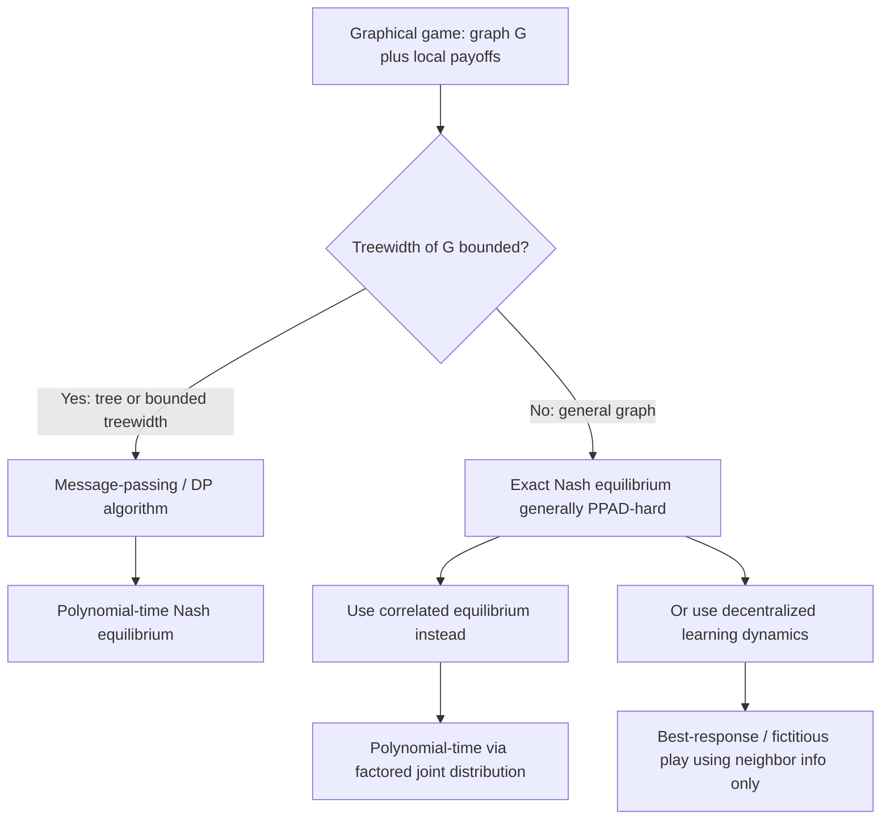

## Graphical Games

### Overview

A graphical game represents a multi-player strategic setting using a graph structure to compactly encode payoff dependencies: each player is a node, and a player's payoff depends only on their own action and the actions of their **neighbors** in the graph, not on the entire population. Introduced formally by Kearns, Littman, and Singh, graphical games address the exponential blow-up of representing an $n$-player normal-form game (whose payoff table has size exponential in $n$) by exploiting sparse, local interaction structure — analogous to how graphical models (Bayesian networks, Markov random fields) compactly represent joint probability distributions.

### Formal Definition

A graphical game is a tuple $(G, \{A_i\}, \{u_i\})$ where:

- $G = (V, E)$ is a graph with $V = \{1, \dots, n\}$ representing players.
- $N(i)$ denotes the **neighborhood** of player $i$ (players connected to $i$ by an edge, possibly including $i$ itself depending on convention).
- $A_i$ is player $i$'s action set.
- $u_i : A_{N(i)} \to \mathbb{R}$ is player $i$'s payoff function, depending **only** on the actions of players in $N(i)$ (i.e., $i$ and its graph-neighbors), not on the full joint action profile $A_1 \times \cdots \times A_n$.

**Representation size**: if the maximum degree (neighborhood size) in $G$ is $k$, each player's payoff table has size $O(|A_i| \cdot |A|^k)$ rather than $O(|A|^n)$ — exponential in the **degree** rather than in the total number of players, which is the key compactness gain when the graph is sparse ($k \ll n$).

### Nash Equilibrium Computation

Because payoffs are local, equilibrium computation can often exploit the graph structure algorithmically, rather than requiring the full joint action space.

**Tree-structured graphical games**: when $G$ is a tree (or has bounded treewidth), Nash equilibria can be computed via a **dynamic-programming / message-passing** algorithm analogous to belief propagation in graphical models:

1. Root the tree at an arbitrary node.
2. Process nodes from leaves to root, computing, for each node and each possible action of its parent, the set of best-response actions (or equilibrium correspondences) in the subtree.
3. Combine these into a global equilibrium by propagating consistent choices back down from the root.

[Inference] This tree-structured algorithm runs in time polynomial in the size of the graph (rather than exponential in $n$), which is the central computational payoff of exploiting graphical structure — analogous to exact inference algorithms on tree-structured probabilistic graphical models.

**General graphs**: for graphs with cycles or unbounded treewidth, exact Nash equilibrium computation is generally **PPAD-hard** (inheriting the general hardness of Nash equilibrium computation), though graphical structure can still be exploited via junction-tree-style algorithms when **treewidth** is bounded, at cost exponential in treewidth rather than in $n$.

### Correlated Equilibrium in Graphical Games

A major computational advantage of graphical games appears for **correlated equilibrium** rather than Nash equilibrium:

- A correlated equilibrium is a joint distribution over the full action profile such that no player wants to deviate given their conditional beliefs.
- Naively, this distribution has size exponential in $n$.
- **Kearns-Littman-Singh** showed that for graphical games, a correlated equilibrium can be computed in time **polynomial in the size of the graph representation** when the graph has bounded treewidth, by representing the equilibrium distribution itself as a graphical model (factored according to the graph's cliques) rather than a full joint table.

**Key Points**

- This asymmetry — correlated equilibria being more tractable than Nash equilibria in graphical games — mirrors a broader pattern in algorithmic game theory where correlated equilibrium (a convex, LP-representable solution concept) is generally computationally easier than Nash equilibrium (defined via a nonconvex fixed-point condition).

### Diagram: Graphical Game Structure and Payoff Locality (svg_diagram)

<svg xmlns="http://www.w3.org/2000/svg" viewBox="0 0 700 400" font-family="Arial, sans-serif">
<title>Graphical Game Structure and Payoff Locality (svg_diagram)</title>
<rect x="0" y="0" width="700" height="400" fill="#ffffff" />
<circle cx="350" cy="90" r="28" fill="#e8f0fe" stroke="#3b5bdb" stroke-width="2" />
<text x="350" y="95" text-anchor="middle" font-size="14" font-weight="bold" fill="#1c2b4a">i</text>
<circle cx="200" cy="200" r="26" fill="#d3f9d8" stroke="#2f9e44" stroke-width="2" />
<text x="200" y="205" text-anchor="middle" font-size="13" fill="#1b4620">j</text>
<circle cx="500" cy="200" r="26" fill="#d3f9d8" stroke="#2f9e44" stroke-width="2" />
<text x="500" y="205" text-anchor="middle" font-size="13" fill="#1b4620">k</text>
<circle cx="350" cy="230" r="26" fill="#d3f9d8" stroke="#2f9e44" stroke-width="2" />
<text x="350" y="235" text-anchor="middle" font-size="13" fill="#1b4620">l</text>
<circle cx="100" cy="320" r="24" fill="#f1f3f5" stroke="#495057" stroke-width="2" />
<text x="100" y="325" text-anchor="middle" font-size="12" fill="#212529">m</text>
<circle cx="600" cy="320" r="24" fill="#f1f3f5" stroke="#495057" stroke-width="2" />
<text x="600" y="325" text-anchor="middle" font-size="12" fill="#212529">n</text>
<line x1="350" y1="118" x2="200" y2="174" stroke="#333" stroke-width="2" />
<line x1="350" y1="118" x2="500" y2="174" stroke="#333" stroke-width="2" />
<line x1="350" y1="118" x2="350" y2="204" stroke="#333" stroke-width="2" />
<line x1="200" y1="222" x2="100" y2="298" stroke="#999" stroke-width="1.5" stroke-dasharray="4,3" />
<line x1="500" y1="222" x2="600" y2="298" stroke="#999" stroke-width="1.5" stroke-dasharray="4,3" />
<rect x="30" y="20" width="260" height="55" rx="8" fill="#fff3bf" stroke="#e8a917" stroke-width="1.5" />
<text x="160" y="42" text-anchor="middle" font-size="11" font-weight="bold" fill="#5c4b00">u_i depends ONLY on:</text>
<text x="160" y="60" text-anchor="middle" font-size="11" fill="#5c4b00">actions of i, j, k, l (neighbors)</text>
<rect x="410" y="20" width="260" height="55" rx="8" fill="#ffe3e3" stroke="#c92a2a" stroke-width="1.5" />
<text x="540" y="42" text-anchor="middle" font-size="11" font-weight="bold" fill="#7a0d0d">NOT dependent on:</text>
<text x="540" y="60" text-anchor="middle" font-size="11" fill="#7a0d0d">actions of m, n (non-neighbors)</text>
</svg>

### Worked Example: Local Public Goods Game on a Graph

Each player $i$ chooses effort $e_i \in \{0,1\}$ (contribute or not) to a local public good shared with graph-neighbors. Payoff:

$$u_i(e_i, e_{N(i)}) = B\left( \max\left(e_i, \max_{j \in N(i)} e_j\right) \right) - c \cdot e_i$$

i.e., a player benefits $B$ if **anyone** in their closed neighborhood (self or neighbors) contributes, at private cost $c$ if they contribute themselves — the graphical analogue of the classical "best-shot" public goods game.

**Steps to find equilibria:**

1. On a given graph, a **pure Nash equilibrium** corresponds to a **maximal independent-set-like structure**: a set $S$ of contributors such that every non-contributor has at least one contributing neighbor, and no contributor could profitably stop contributing (i.e., $S$ is a **dominating set** where contributors have no free-riding neighbor also contributing redundantly in a way that creates a profitable deviation).
2. On tree-structured graphs, the leaf-to-root dynamic programming procedure described above finds such equilibria efficiently: process leaves first (a leaf contributes iff its single neighbor does not), propagate constraints upward.
3. On general graphs, multiple equilibria typically exist (any maximal independent dominating set works), illustrating equilibrium multiplicity as a generic feature of graphical games.

**Key Points**

- This example demonstrates how the **graph topology directly determines which equilibria are possible** — a star graph and a cycle graph with the same number of nodes produce very different sets of equilibrium contribution patterns.
- Graphical public goods games are widely used to study free-riding, "smart hubs" in networks (high-degree nodes especially likely to be relied upon), and the diffusion of costly cooperative behavior in social networks.

### Learning Dynamics on Graphical Games

Since exact equilibrium computation is hard on general graphs, decentralized learning is often studied instead:

- **Best-response dynamics with local information**: each player observes only neighbors' actions and updates via myopic best response — naturally suited to the graphical structure since payoffs (and hence best responses) only require neighbor information.
- **Convergence in potential graphical games**: if the graphical game is also a **potential game** (a global potential function whose local improvements correspond to individual best responses), asynchronous best-response dynamics converge to a pure Nash equilibrium — many local-interaction games (e.g., graphical coordination games, local public goods) fall into this class.
- **Fictitious play and no-regret learning**: extended to graphical settings by having each player track empirical frequencies of *neighbors'* actions rather than the full population, reducing the statistical/computational burden of learning.

### Complexity Landscape

| Solution Concept | Tree / Bounded Treewidth | General Graph |
| --- | --- | --- |
| Pure Nash Equilibrium | Polynomial (DP/message-passing) | May not exist; hard to decide existence in general |
| Mixed Nash Equilibrium | Polynomial | PPAD-hard (inherits general hardness) |
| Correlated Equilibrium | Polynomial | Polynomial (bounded treewidth exploited via factored representation) |

[Unverified] The exact boundary of tractability (e.g., precisely which treewidth-dependent algorithms scale to which graph sizes in practice) depends on implementation details and the specific algorithm variant; the polynomial-time guarantees above are with respect to the size of the graphical representation and the treewidth-dependent exponent, not necessarily fast in absolute terms for large treewidth.

### Applications

- **Social networks**: opinion dynamics, local public goods and free-riding, peer effects in adoption of behaviors/technologies constrained to observed neighbors.
- **Wireless and sensor networks**: interference games where a node's payoff (throughput) depends only on nearby transmitters (physical/graph proximity determines interference).
- **Epidemiology and behavior**: vaccination games where individuals' incentives depend on the vaccination choices of their direct social contacts.
- **Distributed computing/multi-agent systems**: resource allocation and congestion control where agents interact only with graph-neighbors (e.g., in a communication or physical topology).
- **Spatial economics**: local competition models (e.g., retailers competing only with geographically adjacent rivals).

### Relationship to Other Frameworks

- **Network formation games** (previous topic): the natural complement — network formation games make the **graph itself** the strategic/equilibrium object, while graphical games take the graph as **given** and study equilibrium **actions** on it. Some models study the co-evolution of both simultaneously.
- **Probabilistic graphical models**: graphical games are a direct game-theoretic analogue of Bayesian networks/Markov random fields; the message-passing equilibrium algorithms are structurally borrowed from exact inference algorithms (junction tree algorithm, belief propagation) in that literature.
- **Potential games**: many practically important graphical games (local public goods, graphical coordination games) are also potential games, which is what typically guarantees convergence of decentralized learning dynamics to pure Nash equilibria.
- **Polymatrix games**: a related compact representation where a player's payoff decomposes as a **sum** of pairwise payoffs with each neighbor (rather than a general function of neighbors' joint actions) — a special, additively separable case of graphical games with its own specialized (and sometimes more tractable) equilibrium algorithms.

### Common Pitfalls

- Assuming graphical structure alone guarantees fast Nash equilibrium computation — the polynomial-time guarantees generally require bounded treewidth (or tree structure), not just "sparse" in the sense of low average degree.
- Conflating graphical games with network formation games — one takes the graph as fixed and asks about actions; the other makes the graph itself the equilibrium object.
- Overlooking that correlated equilibrium computation being tractable in graphical games does **not** imply Nash equilibrium computation is similarly tractable — these are genuinely different complexity results, not two versions of the same fact.
- [Speculation] In empirical applications to real social/economic networks (which often have small-world or scale-free structure with pockets of high local density), treewidth can be large even when the graph looks "sparse" in an average-degree sense, potentially limiting the practical applicability of exact tree-based algorithms; approximate or learning-based methods are often used instead, though the trade-offs are context-dependent.

**Related Topics**

- Network Formation Games
- Probabilistic Graphical Models and Belief Propagation
- Potential Games
- Polymatrix Games
- Correlated Equilibrium
- Computational Complexity of Nash Equilibrium (PPAD)
- Local Public Goods and Free-Riding
- Evolutionary Dynamics on Networks