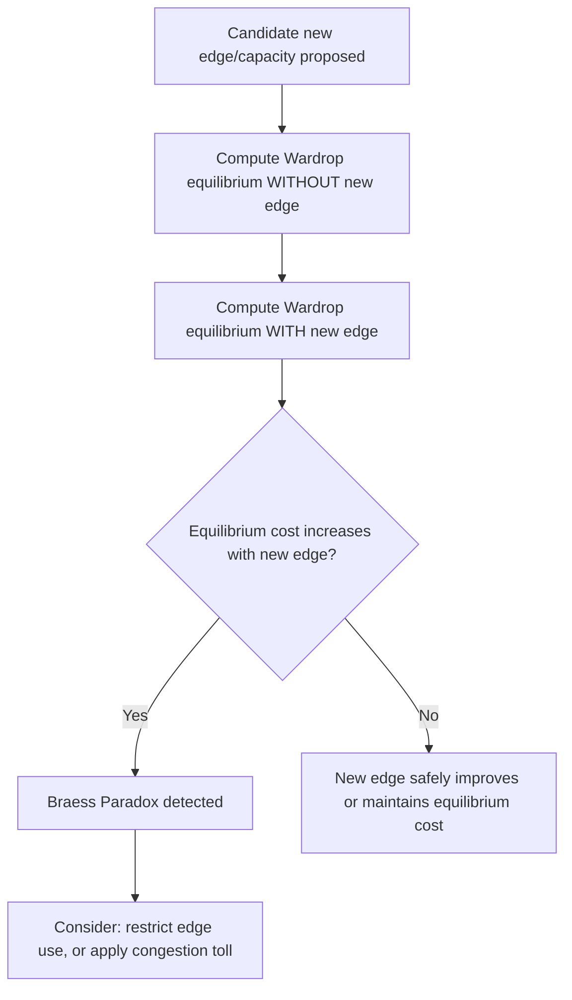

## Selfish Routing and Braess's Paradox

### Overview

Selfish routing studies traffic (or flow) equilibria in networks where individual agents (drivers, packets, users) each choose a path to minimize their own cost (typically latency/delay), without coordinating with others or accounting for the congestion externality they impose on fellow users. Braess's Paradox is the striking phenomenon, discovered by Dietrich Braess in 1968, where **adding capacity** to a network — a new road, link, or resource — can **increase** the equilibrium travel cost for everyone, because it changes the selfish equilibrium routing pattern in a way that is collectively worse despite (or because of) offering more options.

### Wardrop Equilibrium: The Solution Concept

In a network with a continuum of infinitesimal users (a **nonatomic** routing game — each individual user's own flow contribution is negligible), the standard equilibrium notion is the **Wardrop equilibrium**:

**Wardrop's First Principle (user equilibrium)**: for each origin-destination pair, all used paths have **equal and minimal** cost; no used path has higher cost than an unused path.

Formally, for flow $f$ decomposed across paths $P$ connecting each O-D pair, with path cost $c_P(f) = \sum_{e \in P} c_e(f_e)$ (sum of edge latency functions $c_e$ evaluated at edge flow $f_e$):

$$f_P > 0 \implies c_P(f) = \min_{P' \in \mathcal{P}} c_{P'}(f)$$

This is the continuum/nonatomic analogue of Nash equilibrium: no user can reduce their own travel cost by unilaterally switching paths, since all used paths already have equal (minimal) cost.

**Existence and uniqueness**: for continuous, nondecreasing (monotone) edge latency functions, the Wardrop equilibrium **flow pattern is unique** (though the specific path decomposition achieving it may not be), and can be characterized as the solution to a convex optimization problem (Beckmann's formulation):

$$\min_{f} \sum_{e} \int_0^{f_e} c_e(x)\, dx \quad \text{s.t. flow conservation and nonnegativity}$$

The first-order (KKT) conditions of this convex program recover exactly the Wardrop equilibrium condition.

### Social Optimum vs. User Equilibrium

The **socially optimal** flow minimizes total system travel time (not per-user cost):

$$\min_f \sum_e f_e \cdot c_e(f_e)$$

**Key structural fact**: the socially optimal flow is itself the Wardrop equilibrium of a *modified* network in which each edge's cost function is replaced by its **marginal cost**:

$$c_e^{\text{marginal}}(f_e) = c_e(f_e) + f_e \cdot c_e'(f_e)$$

This marginal-cost term is exactly the negative externality a marginal user imposes on all other users of that edge by adding to congestion — the selfish equilibrium ignores this term, while the social optimum internalizes it. This is the routing-theoretic analogue of Pigouvian externality analysis, and directly motivates **congestion pricing/tolls** equal to the marginal externality as a mechanism to align selfish equilibrium with social optimum.

### Braess's Paradox: Canonical Example

**Setup**: 4 nodes — source $S$, sink $T$, and intermediate nodes $A$, $B$. Two routes exist: $S \to A \to T$ and $S \to B \to T$. Let total flow (traffic demand) be normalized to 1 unit.

**Original network** (no $A$-$B$ link):

- Edge $S \to A$: cost $= x$ (increases with flow $x$ on it) — a "sensitive" congestible edge.
- Edge $A \to T$: cost $= 1$ (constant, uncongested).
- Edge $S \to B$: cost $= 1$ (constant, uncongested).
- Edge $B \to T$: cost $= x$ (congestible).

By symmetry, Wardrop equilibrium splits flow evenly: $1/2$ via $S$-$A$-$T$, $1/2$ via $S$-$B$-$T$. Cost of each path: $0.5 + 1 = 1.5$. **Equilibrium total cost per user: 1.5.**

**Add a new zero-cost link $A \to B$** (a shortcut, representing added capacity):

Now a new path $S \to A \to B \to T$ becomes available with cost $x_{SA} + 0 + x_{BT}$. Since this path can exploit both congestible edges, at Wardrop equilibrium **all traffic** shifts to this path (any user on the old paths would strictly benefit from switching, since it dominates when others haven't fully switched, until it, too, becomes fully congested):

- All flow (1 unit) routes $S \to A \to B \to T$: cost $= 1 + 0 + 1 = 2$.

**Result: equilibrium cost per user rises from 1.5 to 2**, even though a strictly better routing option (the original 1.5-cost split) is still technically available to individual users — but it is not an equilibrium, since users on it would deviate to exploit the new shortcut when others are not using it, and the process converges to the worse symmetric equilibrium at cost 2.

**Key Points**

- The paradox arises because the new link creates a **dominant strategy trap**: at the original equilibrium, a user has a private incentive to reroute via the new link, but universal adoption of this incentive raises congestion on the *shared* edges ($S$-$A$ and $B$-$T$) enough to make everyone worse off — a classic **prisoner's-dilemma-like structure** embedded in the routing game.
- Removing the added link (or, equivalently, banning its use) restores the better equilibrium — a rare situation where *restricting* choices improves selfish equilibrium outcomes, counter to the usual monotonic relationship between having more options and doing at least as well.

### Diagram: Braess's Paradox Network (svg_diagram)

<svg xmlns="http://www.w3.org/2000/svg" viewBox="0 0 720 380" font-family="Arial, sans-serif">
<title>Braess Paradox Network Before and After New Link (svg_diagram)</title>
<rect x="0" y="0" width="720" height="380" fill="#ffffff" />

<text x="180" y="30" text-anchor="middle" font-size="14" font-weight="bold" fill="`#1c2b4a`">Before: equilibrium cost 1.5</text>

<circle cx="60" cy="180" r="22" fill="`#e8f0fe`" stroke="`#3b5bdb`" stroke-width="2" />

<text x="60" y="185" text-anchor="middle" font-size="12">S</text>

<circle cx="180" cy="90" r="22" fill="`#d3f9d8`" stroke="`#2f9e44`" stroke-width="2" />

<text x="180" y="95" text-anchor="middle" font-size="12">A</text>

<circle cx="180" cy="270" r="22" fill="`#d3f9d8`" stroke="`#2f9e44`" stroke-width="2" />

<text x="180" y="275" text-anchor="middle" font-size="12">B</text>

<circle cx="300" cy="180" r="22" fill="`#ffe3e3`" stroke="`#c92a2a`" stroke-width="2" />

<text x="300" y="185" text-anchor="middle" font-size="12">T</text>

<line x1="78" y1="165" x2="162" y2="105" stroke="#333" stroke-width="2" />
<text x="105" y="120" font-size="10">cost = x</text>
<line x1="198" y1="105" x2="282" y2="165" stroke="#333" stroke-width="2" />
<text x="245" y="120" font-size="10">cost = 1</text>
<line x1="78" y1="195" x2="162" y2="255" stroke="#333" stroke-width="2" />
<text x="90" y="245" font-size="10">cost = 1</text>
<line x1="198" y1="255" x2="282" y2="195" stroke="#333" stroke-width="2" />
<text x="235" y="245" font-size="10">cost = x</text>

<text x="540" y="30" text-anchor="middle" font-size="14" font-weight="bold" fill="`#7a0d0d`">After: equilibrium cost 2.0</text>

<circle cx="420" cy="180" r="22" fill="`#e8f0fe`" stroke="`#3b5bdb`" stroke-width="2" />

<text x="420" y="185" text-anchor="middle" font-size="12">S</text>

<circle cx="540" cy="90" r="22" fill="`#d3f9d8`" stroke="`#2f9e44`" stroke-width="2" />

<text x="540" y="95" text-anchor="middle" font-size="12">A</text>

<circle cx="540" cy="270" r="22" fill="`#d3f9d8`" stroke="`#2f9e44`" stroke-width="2" />

<text x="540" y="275" text-anchor="middle" font-size="12">B</text>

<circle cx="660" cy="180" r="22" fill="`#ffe3e3`" stroke="`#c92a2a`" stroke-width="2" />

<text x="660" y="185" text-anchor="middle" font-size="12">T</text>

<line x1="438" y1="165" x2="522" y2="105" stroke="#333" stroke-width="2" />
<text x="465" y="120" font-size="10">cost = x</text>
<line x1="558" y1="105" x2="642" y2="165" stroke="#999" stroke-width="1.5" stroke-dasharray="3,2" />
<text x="605" y="120" font-size="10">cost = 1</text>
<line x1="438" y1="195" x2="522" y2="255" stroke="#999" stroke-width="1.5" stroke-dasharray="3,2" />
<text x="450" y="245" font-size="10">cost = 1</text>
<line x1="558" y1="255" x2="642" y2="195" stroke="#333" stroke-width="2" />
<text x="595" y="245" font-size="10">cost = x</text>
<line x1="540" y1="112" x2="540" y2="248" stroke="#c92a2a" stroke-width="2.5" />
<text x="555" y="185" font-size="10" fill="#c92a2a">new: cost = 0</text>

<text x="540" y="340" text-anchor="middle" font-size="11" fill="#333">All flow now routes S→A→B→T, congesting both sensitive edges</text>

</svg>

### Price of Anarchy

The **price of anarchy (PoA)** quantifies the worst-case efficiency loss from selfish routing relative to the social optimum:

$$\text{PoA} = \frac{\text{Cost of worst Wardrop equilibrium}}{\text{Cost of social optimum}}$$

**Key results (Roughgarden-Tardos)**:

- For **affine (linear) latency functions** $c_e(x) = a_e x + b_e$, the price of anarchy is bounded by exactly $\frac{4}{3}$ in the worst case (the "Pigou example" — a two-edge network with one constant-cost and one linear-cost edge — achieves this bound).
- For general latency function classes, the price of anarchy bound depends on the class's "steepness," characterized via a formula involving the class's worst-case ratio between marginal cost and average cost.
- **Braess's Paradox is bounded**: the price-of-anarchy framework implies the paradox cannot make things arbitrarily worse for affine costs — the $4/3$ bound applies regardless of network topology (including topologies exhibiting the paradox), since PoA bounds are topology-independent for a given latency function class.

[Inference] This topology-independence is a significant structural result: it means that even though Braess's Paradox shows individual networks can behave counterintuitively when links are added, the *degree* of possible damage is still capped by the price-of-anarchy bound for the relevant cost-function class, not unbounded.

### Worked Example: Detecting and Resolving Braess's Paradox

Given a network, to check whether a candidate added edge would trigger Braess's Paradox:

1. Compute the Wardrop equilibrium cost of the network **without** the candidate edge (solve the convex Beckmann program or use the equal-cost-path condition directly for simple networks).
2. Compute the Wardrop equilibrium cost **with** the candidate edge added.
3. If the "with" equilibrium cost exceeds the "without" cost, the edge is Braess-paradoxical for this demand level: adding it counterproductively raises congestion via a shift in the selfish equilibrium.

**Resolution strategies:**

- **Edge removal / selective closure**: if a paradoxical edge is identified, restricting its use (closing that road, in real transportation examples) restores the better equilibrium — real-world transportation authorities have documented cases where closing streets reduced overall congestion.
- **Congestion pricing / tolls**: setting a toll equal to the marginal externality on the paradox-inducing edge internalizes the externality, making the socially optimal flow (not necessarily excluding the new edge) the new selfish equilibrium.
- **Capacity-aware network design**: since whether the paradox occurs depends on the specific demand level, a network design that is stable (non-paradoxical) at one demand level may become paradoxical at another — good network design must account for the full expected demand range, not just a single operating point.

### Atomic (Discrete) Selfish Routing

When flow is composed of a finite number of discrete players (**atomic** routing, e.g., a small number of large freight companies rather than a continuum of individual drivers), the equilibrium concept becomes standard (mixed or pure) **Nash equilibrium** rather than Wardrop equilibrium.

**Key differences from nonatomic routing:**

- Pure Nash equilibria may fail to exist in general atomic routing games (though they are guaranteed to exist for certain classes, e.g., via potential function arguments in **congestion games**, of which atomic routing is a special case).
- The price of anarchy for atomic **unweighted** routing games with affine costs is bounded (commonly cited bound of $5/2$ in the literature for pure Nash equilibria), a looser bound than the nonatomic $4/3$ case, reflecting the additional coordination failure possible with discrete, non-negligible players.
- [Unverified] Exact price-of-anarchy constants for atomic routing vary by whether equilibria are pure or mixed, whether players are weighted (different flow amounts) or unweighted, and the precise latency function class — the literature contains several related but distinct bounds depending on these modeling choices.

### Applications

- **Transportation networks**: highway/road network design, traffic signal timing, real-world documented cases of road closures reducing congestion (e.g., widely cited examples in Seoul, Stuttgart, and New York City).
- **Telecommunications**: internet packet routing, where selfish routing protocols (each router/ISP optimizing its own path) can produce inefficient global routing compared to centrally optimized routing.
- **Congestion pricing policy**: theoretical basis for road tolls, airport landing fees, and other congestion-based pricing mechanisms in infrastructure economics.
- **Power grids**: analogous paradoxes have been studied in electrical networks, where adding transmission lines can, under certain physical flow laws (Kirchhoff's laws rather than shortest-path routing), similarly worsen network-wide outcomes.

### Relationship to Other Frameworks

- **Congestion games**: selfish routing is the canonical example of a (nonatomic or atomic) congestion game, where payoffs depend on the number/identity of others sharing each resource (edge) — connecting this topic directly to potential game theory, since congestion games are a well-known class of potential games (Rosenthal's theorem).
- **Large population games**: nonatomic Wardrop equilibrium is exactly the continuum limit discussed under aggregative/large population games — the routing game is a canonical worked example of that broader theory.
- **Mechanism design and Pigouvian taxation**: the marginal-cost pricing solution to the efficiency gap is a direct application of Pigouvian tax theory to a network setting, linking routing theory to public economics.
- **Price of anarchy / algorithmic game theory**: selfish routing is one of the founding case studies of the price-of-anarchy research program, alongside network formation games and other decentralized-vs-centralized efficiency comparisons.

### Common Pitfalls

- Assuming Braess's Paradox requires unusual or contrived networks — it can occur in fairly natural network topologies and is not merely a mathematical curiosity; it has been argued to explain real transportation phenomena, though attributing any specific real-world congestion event definitively to the paradox (versus other causes) requires care.
- Confusing the **user equilibrium** (Wardrop / selfish routing outcome) with the **system optimum** — these generally differ except in special cases (e.g., all latency functions constant, or specific symmetric network structures).
- Assuming more capacity or more routing options always weakly improves outcomes — this is the core misconception the paradox corrects; equilibrium effects can overturn this intuition even though it holds for centrally optimized (non-strategic) routing.
- [Speculation] Whether a specific proposed infrastructure addition will trigger Braess's Paradox in practice depends sensitively on the exact latency functions and demand levels, which are difficult to estimate precisely, so real-world predictions of the paradox's occurrence carry meaningful empirical uncertainty even when the theoretical mechanism is well understood.

**Related Topics**

- Congestion Games and Potential Games
- Large Population / Aggregative Games
- Price of Anarchy in Algorithmic Game Theory
- Pigouvian Taxation and Congestion Pricing
- Network Formation Games
- Atomic vs. Nonatomic Games
- Graphical Games