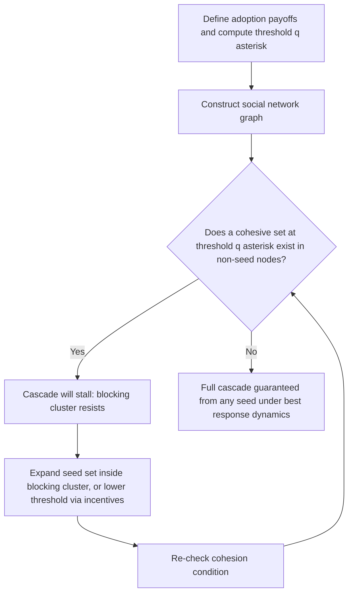

## Diffusion Games on Social Networks

### Overview

Diffusion games model how behaviors, products, information, or infections spread through a social network when individuals' adoption decisions are strategically or threshold-dependent on the choices of their network neighbors. Unlike purely epidemiological diffusion models (which typically assume fixed, exogenous transmission probabilities), diffusion **games** treat each node's adoption decision as a **strategic or best-response choice**, making network structure, neighbor influence, and payoff externalities central to the equilibrium analysis — connecting graphical game theory (previous topics) to the dynamics of cascades and social influence.

### Core Model: Networked Coordination / Threshold Games

The canonical diffusion game is a **networked coordination game**: each node $i$ chooses an action $a_i \in \{0, 1\}$ (e.g., adopt a new technology vs. stick with the status quo), and payoffs depend on **coordinating with neighbors**:

$$u_i(a_i, a_{N(i)}) = \sum_{j \in N(i)} w_{ij} \cdot \pi(a_i, a_j)$$

where $w_{ij}$ is the edge weight (interaction strength) and $\pi(a_i,a_j)$ is a 2x2 coordination payoff matrix (e.g., both playing the new action $1$ yields payoff $b$; both playing $0$ yields payoff $d$; mismatched actions yield $0$).

**Best-response threshold rule**: given this structure, player $i$'s best response reduces to a simple **threshold condition**: adopt the new action ($a_i = 1$) if and only if the fraction (or weighted fraction) of neighbors already playing $1$ exceeds a threshold $q^*$ determined by the payoff parameters:

$$q^* = \frac{d}{b+d}$$

This is the foundational **Morris (2000) contagion threshold model**, linking local network coordination games directly to Granovetter-style threshold models of collective behavior.

### Diffusion as Equilibrium Selection: Which Equilibrium Spreads?

Networked coordination games generically have **multiple equilibria** — "all-0" (nobody adopts) and "all-1" (everyone adopts) are always both Nash equilibria when payoffs are symmetric coordination payoffs, plus potentially many mixed/partial equilibria. Diffusion game theory studies **which equilibrium a cascade of best-response updates converges to**, starting from a small "seed" set of early adopters.

**Key structural concept — cohesive sets**: a set $S$ of nodes is **$q$-cohesive** if every node in $S$ has at least a fraction $q$ of its neighbors also in $S$.

**Contagion theorem (Morris)**: a small seed set of adopters can trigger **full contagion** (cascade to the entire network under best-response dynamics) if and only if the complement of the seed set does **not** contain any set that is cohesive at the relevant threshold $q^*$ — i.e., there is no "firewall" of mutually-reinforcing non-adopters that can resist the spreading behavior.

[Inference] This gives a precise graph-theoretic characterization of "when does a networked innovation go viral": contagion succeeds exactly when the network lacks sufficiently cohesive pockets of resistance at the given behavioral threshold, making network topology — not just the seed set size — the decisive factor.

### Diagram: Cascade Dynamics and Cohesive Blocking Sets (svg_diagram)

<svg xmlns="http://www.w3.org/2000/svg" viewBox="0 0 740 400" font-family="Arial, sans-serif">
<title>Cascade Dynamics and Cohesive Blocking Sets (svg_diagram)</title>
<rect x="0" y="0" width="740" height="400" fill="#ffffff" />

<text x="200" y="30" text-anchor="middle" font-size="13" font-weight="bold" fill="`#1c2b4a`">Sparse periphery: cascade spreads</text>

<circle cx="80" cy="100" r="20" fill="`#c92a2a`" stroke="`#7a0d0d`" stroke-width="2" />

<text x="80" y="105" text-anchor="middle" font-size="10" fill="#fff">seed</text>

<circle cx="180" cy="80" r="18" fill="`#f1f3f5`" stroke="`#495057`" stroke-width="1.5" />

<circle cx="200" cy="150" r="18" fill="`#f1f3f5`" stroke="`#495057`" stroke-width="1.5" />

<circle cx="120" cy="190" r="18" fill="`#f1f3f5`" stroke="`#495057`" stroke-width="1.5" />

<circle cx="280" cy="120" r="18" fill="`#f1f3f5`" stroke="`#495057`" stroke-width="1.5" />

<line x1="98" y1="90" x2="165" y2="83" stroke="#333" stroke-width="1.5" />

<line x1="95" y1="112" x2="188" y2="142" stroke="#333" stroke-width="1.5" />

<line x1="70" y1="118" x2="128" y2="178" stroke="#333" stroke-width="1.5" />

<line x1="215" y1="140" x2="265" y2="125" stroke="#333" stroke-width="1.5" />

<text x="200" y="240" text-anchor="middle" font-size="11" fill="`#1b4620`">No cohesive resistant set → full cascade</text>

<text x="560" y="30" text-anchor="middle" font-size="13" font-weight="bold" fill="`#7a0d0d`">Dense cluster: cascade blocked</text>

<circle cx="440" cy="100" r="20" fill="`#c92a2a`" stroke="`#7a0d0d`" stroke-width="2" />

<text x="440" y="105" text-anchor="middle" font-size="10" fill="#fff">seed</text>

<circle cx="540" cy="90" r="18" fill="`#f1f3f5`" stroke="`#495057`" stroke-width="1.5" />

<g>
<circle cx="640" cy="120" r="18" fill="#e8f0fe" stroke="#3b5bdb" stroke-width="1.5" />
<circle cx="700" cy="90" r="18" fill="#e8f0fe" stroke="#3b5bdb" stroke-width="1.5" />
<circle cx="680" cy="180" r="18" fill="#e8f0fe" stroke="#3b5bdb" stroke-width="1.5" />
<circle cx="620" cy="190" r="18" fill="#e8f0fe" stroke="#3b5bdb" stroke-width="1.5" />
<line x1="640" y1="120" x2="700" y2="90" stroke="#3b5bdb" stroke-width="1.5" />
<line x1="640" y1="120" x2="680" y2="180" stroke="#3b5bdb" stroke-width="1.5" />
<line x1="640" y1="120" x2="620" y2="190" stroke="#3b5bdb" stroke-width="1.5" />
<line x1="700" y1="90" x2="680" y2="180" stroke="#3b5bdb" stroke-width="1.5" />
<line x1="680" y1="180" x2="620" y2="190" stroke="#3b5bdb" stroke-width="1.5" />
</g>
<line x1="458" y1="95" x2="525" y2="90" stroke="#333" stroke-width="1.5" />
<line x1="540" y1="108" x2="625" y2="118" stroke="#999" stroke-width="1.5" stroke-dasharray="3,2" />
<text x="640" y="240" text-anchor="middle" font-size="11" fill="#7a0d0d">Densely connected group is cohesive at q* → resists adoption</text>
</svg>

### Bootstrap Percolation Connection

Diffusion games with threshold best responses are mathematically equivalent to **bootstrap percolation**: nodes are "infected/activated" if a sufficient number (or fraction) of neighbors are already active, and activation is permanent (monotone, no reversion).

- On specific graph families (e.g., $d$-regular graphs, random graphs $G(n,p)$, or lattices), bootstrap percolation theory provides sharp thresholds on the **seed set size** needed to trigger full percolation (contagion) as a function of the activation threshold $q^*$ and graph connectivity parameters.
- [Unverified] Precise finite-size threshold formulas (e.g., critical seed fractions for full percolation) are graph-family-specific and often require asymptotic (large-$n$) analysis; exact small-network results can differ substantially from the asymptotic predictions.

### Independent Cascade and Linear Threshold Models

Two influential (though not always strictly "game-theoretic" in the Nash-equilibrium sense) diffusion models widely used alongside the coordination-game framework, especially in the **influence maximization** literature:

**Linear Threshold (LT) Model**: each node $i$ has a fixed threshold $\theta_i$ (often drawn randomly) and edge weights $w_{ij}$ summing to at most 1 across neighbors; $i$ activates when $\sum_{j \in N(i), \text{active}} w_{ij} \ge \theta_i$. This is a direct generalization of the coordination-game threshold rule above, but with heterogeneous, possibly randomized thresholds rather than a single game-derived $q^*$.

**Independent Cascade (IC) Model**: when node $j$ becomes active, it gets **one chance** to activate each currently-inactive neighbor $i$, succeeding independently with probability $p_{ji}$; this is a stochastic, probabilistic diffusion process rather than a deterministic best-response rule.

**Key distinction from the strategic diffusion game above**: LT and IC are typically used as **descriptive stochastic process models** (fitting/predicting real cascades, or as the substrate for the influence maximization optimization problem), whereas the coordination-game/threshold-equilibrium framework treats adoption as a genuine **strategic best response** derived from explicit payoffs — the two literatures are closely related mathematically (LT is essentially the deterministic special case of the game-theoretic threshold model) but originate from different modeling traditions (algorithms/data mining for IC/LT; game theory/economics for the coordination model).

### Influence Maximization

A major applied problem built on these diffusion models: given a budget of $k$ seed nodes, choose the seed set $S$ maximizing the **expected number of eventually-activated nodes**, $\sigma(S)$, under a chosen diffusion model (typically IC or LT).

**Key computational result (Kempe-Kleinberg-Tardos)**:

- The influence maximization problem is **NP-hard** for both IC and LT models.
- However, the influence spread function $\sigma(S)$ is **monotone and submodular** in $S$ under both models (adding a node to a larger set yields weakly smaller marginal gain than adding it to a smaller set — "diminishing returns").
- This submodularity enables a simple **greedy algorithm** (repeatedly add the node with highest marginal influence gain) that achieves a $(1 - 1/e) \approx 0.63$ approximation to the optimal seed set — a foundational result connecting diffusion games to submodular optimization theory.

**Key Points**

- Submodularity is the critical structural property that makes influence maximization tractable despite NP-hardness of the exact optimum; without it, no such greedy guarantee would generally hold.
- Efficient implementations use techniques like lazy-forward (CELF) evaluation or sketch-based estimation (e.g., reverse-reachable-set sampling) to scale greedy influence maximization to large real-world networks, since naively estimating $\sigma(S)$ via simulation for each candidate node is computationally expensive.

### Worked Example: Product Adoption with Network Externalities

A firm wants to seed a new product into a social network to trigger a full cascade, using the coordination-game/threshold framework.

**Steps:**

1. Estimate the coordination payoff parameters ($b$ for mutual adoption benefit, $d$ for mutual non-adoption/status-quo benefit) from market research, giving threshold $q^* = d/(b+d)$.
2. Construct (or estimate from data) the social network graph, including edge weights if interactions vary in strength.
3. Check for **cohesive blocking sets**: identify densely-connected subgroups (e.g., tight-knit communities) where the internal connection density exceeds $q^*$ — these are candidate "resistant pockets" that could stop the cascade from spreading further.
4. If blocking sets exist, either (a) increase the seed set to include members *within* each blocking cluster (rather than only seeding well-connected "hub" individuals outside it), or (b) target reducing $q^*$ via a stronger promotional payoff (e.g., discounts) to lower the effective adoption threshold.
5. Use a submodular greedy algorithm (if optimizing under a stochastic IC/LT model rather than deterministic threshold cascades) to select the cost-effective seed set within budget $k$.

**Key Points**

- This example shows the practical synthesis of the two threads: the **graph-theoretic cohesion condition** (from the game-theoretic threshold model) diagnoses *why* a cascade might stall, while the **submodular greedy algorithm** (from the influence-maximization literature) provides a scalable *optimization* method once a stochastic diffusion model is assumed.

### Relationship to Epidemic Models

Diffusion games are closely related to, but distinct from, classical epidemic models (SIR/SIS) used in network epidemiology:

- **SIR/SIS models** typically assume **exogenous, fixed transmission probabilities** per contact, with no strategic adoption decision — infection spreads mechanically based on contact structure and a fixed infection rate.
- **Diffusion games** make the "infection" (adoption) decision **endogenous and strategic**, depending on neighbors' choices via a payoff-derived best response — closer in spirit to social learning and coordination than to biological contagion, even though the mathematical machinery (percolation, cascade thresholds) is shared.
- [Inference] This distinction matters for policy: epidemic-style interventions (reducing contact rate) address the *mechanism* of spread, while diffusion-game interventions (subsidies, targeted seeding, information campaigns) address the *incentive structure* driving strategic adoption — different intervention levers are appropriate depending on which model best describes the underlying phenomenon.

### Applications

- **Technology adoption**: viral marketing, platform/network-effect products (social media, communication apps), diffusion of agricultural or medical innovations through village social networks.
- **Financial contagion**: strategic default cascades in interbank networks, where a bank's incentive to default/withdraw depends on how many counterparties have already done so (a threshold-game structure analogous to bank-run models).
- **Political and social movements**: participation cascades in protests or collective action, where individual participation incentives depend on expected participation of network peers (a classic application of threshold models, per Granovetter's original riot/protest framing).
- **Public health behavior**: vaccination hesitancy/uptake cascades, mask-wearing norms, and other health behaviors with social reinforcement.
- **Online platforms**: information/misinformation cascades, meme and content virality, recommendation-driven adoption cascades.

### Relationship to Other Frameworks

- **Graphical games** (earlier topic): diffusion games are a dynamic, cascading special case of graphical games, where the coordination-game payoff structure and best-response dynamics on the graph produce the cascade process studied here.
- **Network formation games**: diffusion outcomes depend heavily on network topology, which in richer models is itself endogenously formed (co-evolution of network structure and diffusion, an active research frontier connecting both topics).
- **Evolutionary game theory**: best-response/threshold cascade dynamics on networks are a spatial/networked analogue of evolutionary dynamics (replicator-type updating), with cohesive sets playing a role analogous to evolutionarily stable strategy "basins" in spatial games.
- **Submodular optimization / algorithmic game theory**: the influence maximization problem connects diffusion games to a broader computer science literature on submodular function maximization under budget constraints, extending beyond game theory proper into combinatorial optimization.

### Common Pitfalls

- Treating linear threshold/independent cascade diffusion as strictly game-theoretic Nash equilibrium models — they are more accurately described as stochastic process models of spread, related to but not identical in interpretation to the coordination-game threshold-equilibrium framework.
- Assuming a larger or more central seed set always triggers greater cascade — cohesive blocking sets can resist even well-placed seeds, meaning **network structure**, not just seed size, determines cascade success.
- Ignoring submodularity when designing heuristic (non-greedy) seeding strategies — algorithms lacking the greedy submodular-maximization guarantee can perform arbitrarily worse than optimal in adversarial cases, even if they seem intuitively reasonable (e.g., naive "highest-degree node" heuristics).
- [Speculation] Real-world cascades often deviate from both the deterministic threshold model and the IC/LT stochastic models due to factors like limited attention, multiple competing behaviors, and time-varying influence — practitioners frequently note that fitted diffusion models can underperform out-of-sample, though the extent of this gap is context- and dataset-dependent.

**Related Topics**

- Graphical Games
- Network Formation Games
- Bootstrap Percolation
- Submodular Optimization and Influence Maximization
- Evolutionary Game Theory on Networks
- Epidemic Models (SIR/SIS) on Networks
- Social Learning and Information Cascades
- Financial Contagion and Bank-Run Models