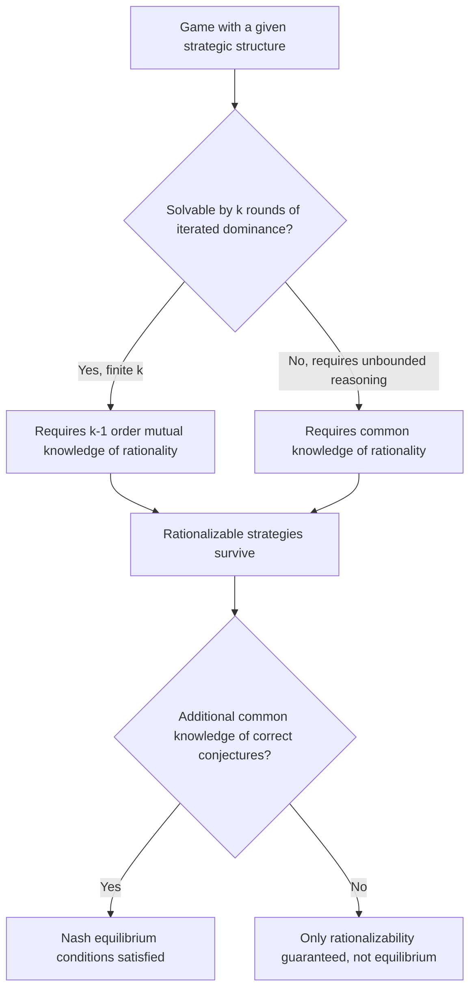

## Common Knowledge and Interactive Epistemology

### Overview

Interactive epistemology studies how the beliefs and knowledge of multiple agents about the world, and about each other's beliefs, jointly determine rational behavior in strategic settings. Common knowledge — the notion that not only does everyone know a fact, but everyone knows that everyone knows it, and so on ad infinitum — is the central formal construct connecting epistemic logic to game theory, since virtually all standard game-theoretic solution concepts (Nash equilibrium, rationalizability, backward induction) implicitly or explicitly rely on some form of common knowledge of rationality and/or the game's structure.

### Formal Framework: Knowledge and Information Partitions

The standard model (Aumann, 1976) represents an agent's knowledge via a **state space** $\Omega$ (the set of all possible "states of the world," encoding both the physical environment and every agent's beliefs) together with, for each agent $i$, a **partition** $\Pi_i$ of $\Omega$ into information cells.

- At the true state $\omega$, agent $i$ knows they are in the cell $\Pi_i(\omega)$ containing $\omega$, but cannot distinguish among states within that cell.
- Agent $i$ **knows event** $E \subseteq \Omega$ at state $\omega$ if $\Pi_i(\omega) \subseteq E$ (every state $i$ considers possible implies $E$).
- The **knowledge operator** $K_i(E) = \{ \omega : \Pi_i(\omega) \subseteq E \}$ denotes the set of states at which $i$ knows $E$.

**Properties (S5 modal logic axioms) typically assumed for knowledge:**

- **Truth axiom**: $K_i(E) \subseteq E$ (you cannot "know" something false).
- **Positive introspection**: $K_i(E) \subseteq K_i(K_i(E))$ (if you know $E$, you know that you know it).
- **Negative introspection**: $\neg K_i(E) \subseteq K_i(\neg K_i(E))$ (if you don't know $E$, you know that you don't know it) — this holds automatically under the partition model, since partitions imply this introspective structure.

[Inference] The partition-based model is a special (partitional) case of more general possibility-correspondence models used in epistemic logic; the S5 axioms (in particular negative introspection) are a consequence of imposing the partition structure specifically, and weaker epistemic models (allowing non-partitional information structures) relax these introspection properties, which matters for modeling bounded or imperfect self-awareness of one's own knowledge.

### Common Knowledge: Formal Definition

Event $E$ is **mutual knowledge** at $\omega$ if all agents know $E$: $\omega \in \bigcap_i K_i(E)$.

Event $E$ is **common knowledge** at $\omega$ if it is mutual knowledge, and everyone knows it is mutual knowledge, and everyone knows that everyone knows that, ad infinitum. Formally, define the **common knowledge operator**:

$$C(E) = \bigcap_{n=1}^{\infty} \left( \bigcap_{i_1} K_{i_1} \bigcap_{i_2} K_{i_2} \cdots \bigcap_{i_n} K_{i_n} (E) \right)$$

**Equivalent, more tractable characterization (via meet of partitions)**: define the **common knowledge partition** as the finest common coarsening of all individual partitions $\Pi_i$ (i.e., the partition generated by merging cells whenever any single agent's partition connects them, iterated until stable — the "meet" $\wedge_i \Pi_i$). Then:

$$C(E) = \{ \omega : (\wedge_i \Pi_i)(\omega) \subseteq E \}$$

$E$ is common knowledge at $\omega$ if and only if the common-knowledge-partition cell containing $\omega$ is entirely contained in $E$.

**Key Points**

- This "meet of partitions" characterization is computationally central: rather than checking an infinite regress of "everyone knows that everyone knows..." conditions directly, one computes the coarsest common refinement of all agents' information partitions once, then simply checks set containment — this is the operational method used in most applications.

### Diagram: Common Knowledge as the Meet of Partitions (svg_diagram)

<svg xmlns="http://www.w3.org/2000/svg" viewBox="0 0 720 380" font-family="Arial, sans-serif">
<title>Common Knowledge as the Meet of Partitions (svg_diagram)</title>
<rect x="0" y="0" width="720" height="380" fill="#ffffff" />
<rect x="40" y="40" width="300" height="140" rx="6" fill="none" stroke="#3b5bdb" stroke-width="1.5" />
<text x="190" y="30" text-anchor="middle" font-size="12" font-weight="bold" fill="#1c2b4a">Agent 1's partition</text>
<line x1="140" y1="40" x2="140" y2="180" stroke="#3b5bdb" stroke-width="1.5" />
<line x1="240" y1="40" x2="240" y2="180" stroke="#3b5bdb" stroke-width="1.5" />
<text x="90" y="115" text-anchor="middle" font-size="10" fill="#1c2b4a">cell a</text>
<text x="190" y="115" text-anchor="middle" font-size="10" fill="#1c2b4a">cell b</text>
<text x="290" y="115" text-anchor="middle" font-size="10" fill="#1c2b4a">cell c</text>
<rect x="380" y="40" width="300" height="140" rx="6" fill="none" stroke="#2f9e44" stroke-width="1.5" />
<text x="530" y="30" text-anchor="middle" font-size="12" font-weight="bold" fill="#1b4620">Agent 2's partition</text>
<line x1="480" y1="40" x2="480" y2="180" stroke="#2f9e44" stroke-width="1.5" />
<line x1="600" y1="40" x2="600" y2="180" stroke="#2f9e44" stroke-width="1.5" />
<text x="430" y="115" text-anchor="middle" font-size="10" fill="#1b4620">cell x</text>
<text x="540" y="115" text-anchor="middle" font-size="10" fill="#1b4620">cell y</text>
<text x="640" y="115" text-anchor="middle" font-size="10" fill="#1b4620">cell z</text>

<text x="360" y="230" text-anchor="middle" font-size="20" fill="#333">↓ meet (coarsest common refinement) ↓</text>

<rect x="40" y="260" width="640" height="100" rx="6" fill="#fff3bf" stroke="#e8a917" stroke-width="1.5" />
<text x="360" y="250" text-anchor="middle" font-size="12" font-weight="bold" fill="#5c4b00">Common Knowledge Partition</text>
<line x1="290" y1="260" x2="290" y2="360" stroke="#e8a917" stroke-width="1.5" />
<text x="165" y="315" text-anchor="middle" font-size="10" fill="#5c4b00">merged cell (a,b,c,x,y,z overlap)</text>
<text x="490" y="315" text-anchor="middle" font-size="10" fill="#5c4b00">separate merged cell</text>
</svg>

### The Coordinated Attack Problem

A canonical illustration of why common knowledge (as opposed to mere mutual knowledge, even at arbitrarily high but finite order) is qualitatively different, and can matter for coordination:

**Setup**: two generals must coordinate an attack; attacking alone means certain defeat, attacking together means victory. General A learns the attack should proceed at dawn and sends a messenger to General B. Communication is **unreliable** (the messenger might be captured).

- If B receives the message, does B know A knows the plan? Only if B's acknowledgment reaches A. But then does A know B's acknowledgment arrived? Only if a further acknowledgment reaches B. This regress **never terminates** with any finite number of successful messages, because each message could be the last one to fail.
- **Result**: with any finite number of exchanged messages (however many), common knowledge of the attack plan is never achieved — only mutual knowledge up to some finite order. Formally, it can be shown that **no protocol using a finite number of messages over an unreliable channel can generate common knowledge**, only "common knowledge up to order $n$" for the number of successful rounds $n$.

[Inference] This result illustrates a genuine discontinuity: coordinated action in many game-theoretic models formally requires common knowledge (infinite-order mutual knowledge), not merely knowledge of arbitrarily high finite order — and this is not a technicality but can correspond to a real qualitative difference in whether coordination succeeds, as emphasized in the literature on this problem (though whether real coordination failures are literally explained by this infinite regress, versus by other more mundane practical frictions, is a separate empirical question).

### Agreement Theorem (Aumann, 1976)

A landmark epistemic result: if two Bayesian agents share a common prior over the state space, and their **posterior beliefs** (about some event or random variable) are **common knowledge**, then those posteriors must be **equal** — "agents cannot agree to disagree."

**Intuition**: if agent A's posterior probability is common knowledge to be $p$ and agent B's is common knowledge to be $q \ne p$, then each agent, upon learning the *other's* posterior is common knowledge, could use that information to update their own beliefs further — a contradiction unless $p = q$, since common knowledge of the disagreement would itself be informative and force convergence.

**Key Points**

- This theorem underlies the broader "no-trade theorems" in financial economics: rational agents with common priors should not engage in speculative trade based purely on private information, since the very fact that a trade is *offered* (and accepted) is itself informative and should be incorporated into both parties' beliefs, eliminating the perceived informational edge — real-world trade is then typically explained by heterogeneous priors, risk-sharing motives, noise/liquidity trading, or bounded rationality rather than the pure common-prior rational framework.

### Common Knowledge of Rationality and Solution Concepts

Different game-theoretic solution concepts require different epistemic assumptions, a central research program (Aumann, Brandenburger, and others) formalizing exactly what each concept presupposes:

- **Rationalizability**: requires only **common knowledge of rationality** (each player is rational, and this is common knowledge) plus common knowledge of the game structure — no beliefs about which specific strategy others will play are assumed correct, only that whatever beliefs a player holds are consistent with the opponent also being rational.
- **Nash equilibrium**: requires common knowledge of rationality **plus** common knowledge (or correctness) of the conjectures each player holds about others' strategies — i.e., players' beliefs about opponents' play must coincide with what opponents actually do, an additional assumption beyond rationalizability (Aumann-Brandenburger 1995 give precise epistemic conditions sufficient for Nash equilibrium in various game classes).
- **Backward induction / subgame perfection**: requires common knowledge of rationality to hold not just at the start of the game but **at every information set**, including those that a fully rational player would never actually reach — a famous conceptual puzzle (addressed further under "Epistemic Conditions for Backward Induction," a related topic), since reaching an "irrational-looking" node seems to contradict the very assumption of common knowledge of rationality that justifies the backward-induction reasoning at that node.

### Worked Example: Epistemic Conditions Behind a Simple Game

Consider a 2x2 game where each player has a strictly dominant strategy. Show precisely what epistemic assumption suffices for both players to play their dominant strategy:

1. **Rationality alone** (no common knowledge needed): if player 1 has a strictly dominant strategy, player 1 plays it regardless of beliefs about player 2 — dominant-strategy play requires only that player 1 is rational (correctly optimizes given *some* belief), with no epistemic assumption about player 2 at all.
2. **Iterated dominance with 2 rounds**: if player 2's optimal strategy is only a best response *after* eliminating player 1's dominated strategies (not itself dominant), player 2 needs to know player 1 is rational (**first-order knowledge of rationality**) to correctly anticipate player 1 won't play the dominated strategy.
3. **General iterated elimination of $k$ rounds**: requires **$(k-1)$-th order mutual knowledge of rationality** (everyone knows everyone knows... rationality, $k-1$ levels deep) — this is the precise epistemic content of the standard result that iterated dominance solvability of a game of "depth $k$" requires exactly $k-1$ levels of knowledge of rationality, not full common knowledge, unless the iteration process is unbounded.

**Key Points**

- This example demonstrates the precise, quantifiable relationship between the **depth** of strategic reasoning required by a game (how many rounds of iterated elimination solve it) and the **order** of mutual knowledge of rationality needed — full common knowledge (infinite order) is only strictly necessary for games requiring unboundedly many rounds of reasoning, or for equilibrium concepts (like Nash) that require correctness of beliefs, not merely for finite dominance-solvable games.

### Interactive Belief Systems and Type Spaces

Harsanyi's **type space** formalism (developed originally for games of incomplete information) provides an alternative, more flexible framework than the partition model for representing interactive beliefs:

- Each player $i$ has a **type** $t_i$ encoding their private information, which determines a **belief hierarchy**: a first-order belief about the state of nature, a second-order belief about others' first-order beliefs, a third-order belief about others' second-order beliefs, and so on, ad infinitum.
- **Mertens-Zamir / Brandenburger-Dekel universal type space construction**: shows that any coherent infinite hierarchy of beliefs can be represented compactly by a single type in a suitably constructed **universal type space**, making the (seemingly infinite-regress) hierarchy of beliefs mathematically tractable via a fixed-point construction.
- Common knowledge in this framework corresponds to types being "common knowledge" of the type profile itself, connecting back to the partition-based common knowledge operator as a special (partitional) case of the more general type-space belief hierarchy.

[Unverified] The precise technical relationship between partition-based common knowledge models and continuous/general type-space hierarchical belief models involves subtle measure-theoretic considerations (e.g., whether beliefs are finitely or countably additive, topological assumptions on the type space) that go beyond the basic conceptual correspondence sketched here.

### Applications

- **Bank runs and financial crises**: common knowledge (or its absence) of other depositors' beliefs about bank solvency is central to coordination-failure models of bank runs (connecting to global games theory, which relaxes common knowledge assumptions to resolve equilibrium multiplicity — see related topic).
- **Auction theory**: common knowledge of the auction rules and (in private-value settings) common knowledge of the *distribution* from which private values are drawn, versus private knowledge of one's own realized value.
- **Legal and political coordination**: analysis of when public announcements (vs. private communication) are necessary to achieve genuine common knowledge sufficient to trigger coordinated collective action (e.g., political protest, regime change).
- **Communication and mechanism design**: cheap-talk and information-design literatures rely heavily on precise epistemic assumptions about what is commonly known versus privately known, directly informing which communication protocols can implement desired outcomes.

### Relationship to Other Frameworks

- **Global games** (related topic): global games theory deliberately perturbs the common knowledge assumption (introducing small idiosyncratic noise in players' signals about a common state) to resolve the equilibrium multiplicity that pure common knowledge settings (like coordination games) often exhibit, showing that the *absence* of exact common knowledge can have first-order strategic consequences — the polar opposite construction from the epistemic frameworks covered here, but built directly on the same foundations.
- **Bayesian games / games of incomplete information**: type spaces (Harsanyi) are the standard tool for modeling incomplete information games, with common knowledge of the type space structure itself typically assumed even when individual types are private.
- **Epistemic game theory more broadly**: the analysis of rationalizability, Nash equilibrium, and backward induction via explicit epistemic conditions (as sketched above) constitutes its own subfield, providing the "semantic" foundations underlying which solution concept is appropriate given what is plausibly common knowledge in a given strategic context.
- **Modal and epistemic logic**: the $K_i$ operator and S5 axioms connect directly to the broader philosophical logic literature on knowledge and belief, of which the game-theoretic partition model is a specific application.

### Common Pitfalls

- Confusing **mutual knowledge** (everyone knows $E$) with **common knowledge** (the full infinite regress) — these are genuinely different, as the coordinated attack problem demonstrates; high-order but finite mutual knowledge does not have the same strategic implications as true common knowledge in many models.
- Assuming Nash equilibrium requires only common knowledge of rationality — it generally requires the additional, stronger assumption that beliefs about others' strategies are correct (or common knowledge of these conjectures), which is conceptually distinct from rationality itself.
- Treating the agreement theorem as implying real-world agents cannot rationally disagree — the theorem's conclusion depends on the **common prior assumption**, which is a substantive and often-debated modeling choice, not a logical necessity; relaxing the common prior (allowing genuinely different priors) restores the possibility of rational disagreement.
- [Speculation] Applying common knowledge idealizations directly to human strategic reasoning is often criticized as unrealistic, since actual agents plausibly cannot process infinite-order belief hierarchies; this has motivated bounded-rationality alternatives (e.g., level-$k$ reasoning models, discussed under behavioral game theory), though the practical predictive value of common-knowledge-based models versus bounded-depth alternatives varies by empirical context and is a matter of ongoing debate rather than settled consensus.

**Related Topics**

- Global Games and Equilibrium Selection
- Epistemic Conditions for Nash Equilibrium and Backward Induction
- Bayesian Games and Harsanyi Type Spaces
- Rationalizability and Iterated Dominance
- The Agreement Theorem and No-Trade Theorems
- Level-k and Cognitive Hierarchy Models
- Epistemic and Modal Logic
- Information Design and Bayesian Persuasion