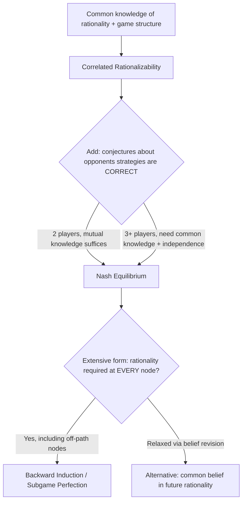

## Epistemic Conditions for Nash Equilibrium

### Overview

This topic addresses a foundational question in game theory: what do players need to *know or believe* — about the game, about each other's rationality, and about each other's strategies — for Nash equilibrium to be the "correct" prediction of play? Unlike rationalizability, which requires only common knowledge of rationality, Nash equilibrium turns out to require a **strictly stronger** epistemic package, formalized rigorously by Aumann and Brandenburger (1995). Understanding precisely what this package is — and what it is not — clarifies both the conceptual foundations and the practical limits of Nash equilibrium as a solution concept.

### The Core Result: What Nash Equilibrium Does *Not* Require

A common misconception is that Nash equilibrium is simply "the natural consequence" of common knowledge of rationality. Aumann and Brandenburger's central, somewhat surprising result is that **common knowledge of rationality alone is neither necessary nor sufficient** for Nash equilibrium — rationalizability (a weaker concept, surviving iterated strict dominance) is what common knowledge of rationality actually delivers. Nash equilibrium requires additional structure concerning players' **conjectures** (beliefs) about each other's strategies.

[Inference] This is why the epistemic program treats Nash equilibrium and rationalizability as answering different questions: rationalizability characterizes what is consistent with rational play under common knowledge of rationality, while Nash equilibrium additionally presupposes a form of mutual belief accuracy that is a substantive, separate assumption.

### Formal Setup: Conjectures and Interactive Beliefs

Following the Aumann-Brandenburger framework, model an $n$-player game with a state space $\Omega$ where each state $\omega$ specifies:

- The **actual strategy** $s_i(\omega)$ played by each player $i$.
- Each player $i$'s **conjecture** (belief) $\mu_i(\omega)$ about the strategies of the *other* players, $s_{-i}$.
- Each player's information partition $\Pi_i$, generating their **knowledge** as in the standard interactive epistemology framework (see "Common Knowledge and Interactive Epistemology").

**Rationality at $\omega$**: player $i$ is rational at $\omega$ if $s_i(\omega)$ maximizes $i$'s expected payoff given conjecture $\mu_i(\omega)$ — i.e., $i$ is best-responding to their own beliefs, whatever those beliefs happen to be.

### Two-Player Games: Mutual Knowledge of Conjectures Suffices

**Key theorem (2-player case)**: in a game with exactly two players, if it is **mutual knowledge** at $\omega$ that:

1. Both players are rational, and
2. Both players' conjectures about the other's strategy are correct (i.e., $\mu_1(\omega)$ assigns probability 1 to the actual $s_2(\omega)$, and vice versa),

then the profile of conjectures $(\mu_1(\omega), \mu_2(\omega))$ (equivalently, the pair of actual strategies, since conjectures are correct) constitutes a **Nash equilibrium**.

**Key Points**

- Remarkably, for exactly two players, only **mutual knowledge** (not full common knowledge) of rationality and correct conjectures is needed — a considerably weaker epistemic requirement than one might expect, and weaker than what turns out to be needed for three or more players.
- "Correct conjectures" here means each player's belief about the *other's actual strategy* is accurate, not merely that beliefs are reasonable or consistent with rationality — this correctness condition is the substantive assumption doing the work that distinguishes Nash equilibrium from rationalizability.

### Games with Three or More Players: Independence and Common Knowledge Required

With **three or more players**, the analysis is more delicate, because Nash equilibrium (particularly in mixed strategies) requires each player's conjecture about the *joint* distribution of others' strategies to satisfy a **stochastic independence** condition — player $i$ must believe that players $j$ and $k$ randomize *independently*, matching the product-form definition of a mixed-strategy Nash equilibrium profile.

**Key theorem (n ≥ 3 case)**: common knowledge (not merely mutual knowledge) of the players' conjectures, together with common knowledge of rationality, implies that the common conjecture about each player's strategy constitutes a Nash equilibrium — **provided** the framework accommodates the independence assumption (e.g., via a common prior with independent beliefs about different players, or by directly building the correlation structure into the epistemic model).

[Inference] The added subtlety with 3+ players — needing common knowledge rather than mere mutual knowledge, plus an explicit independence condition — reflects the fact that mixed-strategy Nash equilibrium already embeds a strong assumption (statistical independence across different players' randomizations) that has no analogue in the two-player case, where there is only one "other player" whose strategy needs to be conjectured.

### Diagram: Epistemic Requirements by Solution Concept (svg_diagram)

<svg xmlns="http://www.w3.org/2000/svg" viewBox="0 0 740 420" font-family="Arial, sans-serif">
<title>Epistemic Requirements by Solution Concept (svg_diagram)</title>
<rect x="0" y="0" width="740" height="420" fill="#ffffff" />
<rect x="40" y="30" width="660" height="70" rx="8" fill="#d3f9d8" stroke="#2f9e44" stroke-width="1.5" />
<text x="370" y="55" text-anchor="middle" font-size="13" font-weight="bold" fill="#1b4620">Rationalizability</text>
<text x="370" y="75" text-anchor="middle" font-size="11" fill="#1b4620">Requires: common knowledge of rationality + common knowledge of the game. No assumption that conjectures are correct.</text>
<line x1="370" y1="100" x2="370" y2="130" stroke="#333" stroke-width="2" marker-end="url(#arr4)" />
<text x="470" y="120" font-size="10" fill="#333">+ correctness of conjectures</text>
<rect x="40" y="130" width="300" height="90" rx="8" fill="#fff3bf" stroke="#e8a917" stroke-width="1.5" />
<text x="190" y="155" text-anchor="middle" font-size="13" font-weight="bold" fill="#5c4b00">Nash Equilibrium: 2 players</text>
<text x="190" y="175" text-anchor="middle" font-size="10" fill="#5c4b00">Mutual (not common) knowledge of</text>
<text x="190" y="192" text-anchor="middle" font-size="10" fill="#5c4b00">rationality + correct conjectures suffices</text>
<rect x="400" y="130" width="300" height="90" rx="8" fill="#ffe3e3" stroke="#c92a2a" stroke-width="1.5" />
<text x="550" y="155" text-anchor="middle" font-size="13" font-weight="bold" fill="#7a0d0d">Nash Equilibrium: 3+ players</text>
<text x="550" y="175" text-anchor="middle" font-size="10" fill="#7a0d0d">Common knowledge of rationality +</text>
<text x="550" y="192" text-anchor="middle" font-size="10" fill="#7a0d0d">correct conjectures + independence needed</text>
<rect x="120" y="250" width="500" height="70" rx="8" fill="#e8f0fe" stroke="#3b5bdb" stroke-width="1.5" />
<text x="370" y="275" text-anchor="middle" font-size="13" font-weight="bold" fill="#1c2b4a">Subgame Perfection / Backward Induction</text>
<text x="370" y="295" text-anchor="middle" font-size="10" fill="#1c2b4a">Requires common knowledge of rationality at EVERY node,</text>
<text x="370" y="310" text-anchor="middle" font-size="10" fill="#1c2b4a">including off-path nodes — a further conceptual puzzle</text>
<rect x="180" y="350" width="380" height="50" rx="8" fill="#f1f3f5" stroke="#495057" stroke-width="1.5" />
<text x="370" y="380" text-anchor="middle" font-size="11" fill="#212529">Increasing epistemic strength: Rationalizability ⊊ Nash ⊊ Backward Induction requirements</text>
</svg>

### Worked Example: Battle of the Sexes and Belief Correctness

Consider the classic Battle of the Sexes: two players prefer to coordinate (both attend the same event) but disagree on which event, with payoffs:

|  | Opera | Football |
| --- | --- | --- |
| **Opera** | (2,1) | (0,0) |
| **Football** | (0,0) | (1,2) |

This game has two pure Nash equilibria (both attend Opera; both attend Football) and one mixed equilibrium.

**Applying the epistemic conditions:**

1. Both pure equilibria trivially satisfy the two-player theorem: if it is mutual knowledge that player 1 believes player 2 will attend Opera (correctly) and vice versa, and both are rational (best-responding to these correct beliefs), the resulting outcome is a Nash equilibrium.
2. **Critical subtlety**: nothing in the epistemic conditions explains *why* both players would happen to hold *correct, coordinated* conjectures in the first place — the theorem takes correctness of conjectures as a **hypothesis**, not something derived from more primitive assumptions like rationality alone. If player 1 mistakenly (but rationally, given the mistaken belief) believes player 2 will attend Football while player 2 actually attends Opera, this is a failure of the correctness condition, and the resulting strategy pair (Opera by 1's actual choice, Football-belief) is simply **not** a Nash equilibrium outcome, even though each player is individually rational given their own (now-incorrect) beliefs.
3. This illustrates the celebrated **equilibrium selection / coordination problem**: the epistemic conditions for Nash equilibrium say nothing about *which* of the multiple equilibria will be played, or how players' conjectures come to coincide in the first place — this coordination question is left unanswered by the epistemic characterization itself and motivates separate equilibrium-refinement and equilibrium-selection literatures (e.g., focal points, evolutionary selection, global games).

**Key Points**

- The epistemic analysis clarifies that Nash equilibrium is best understood as a **consistency condition** on beliefs and behavior (if conjectures happen to be correct and rationality holds, equilibrium follows) rather than a **prediction-generating mechanism** that explains how players would arrive at correct, coordinated beliefs from more basic assumptions.

### Rationalizability as the "Correct" Consequence of Common Knowledge of Rationality

Since Nash equilibrium requires the additional correctness-of-conjectures assumption, the epistemic program identifies **correlated rationalizability** (or, in some formulations, ordinary rationalizability) as the solution concept that is exactly characterized by common knowledge of rationality and the game structure, with **no** additional assumption about conjecture correctness:

- A strategy is (correlated) rationalizable if and only if it survives iterated elimination of strategies that are never a best response to *some* belief about opponents (not necessarily a correct or common one).
- Common knowledge of rationality is precisely necessary and sufficient for correlated rationalizability, making this the epistemically "minimal" or "purest" solution concept in the sense of requiring no assumptions beyond rationality and knowledge of the game itself.

[Unverified] The precise correspondence between common knowledge of rationality and rationalizability (versus *correlated* rationalizability specifically) depends on subtle modeling choices about whether players' beliefs about different opponents can be correlated in the epistemic model — the exact characterization theorem differs slightly depending on which of these variants is used, a technical point on which the literature has produced multiple related but non-identical formalizations.

### Backward Induction: A Deeper Epistemic Puzzle

Extending these ideas to extensive-form games with sequential moves surfaces a well-known conceptual difficulty: **subgame perfect equilibrium via backward induction** seems to require common knowledge of rationality to hold not just initially, but **at every node of the game tree**, including nodes that would only be reached if some player had already deviated from what rationality prescribes.

**The paradox**: if node $v$ is only reachable after player 1 makes an "irrational" move, does common knowledge of rationality still hold *at* $v$? If player 2, upon reaching $v$, continues to believe player 1 is rational (as the backward-induction argument requires for justifying player 2's own continuation play), this belief seems to directly contradict the observed evidence (player 1's apparently irrational earlier move) that led to $v$ in the first place.

[Speculation] This tension — sometimes discussed via the "chain store paradox" or similar examples in extensive-form reasoning — has generated substantial philosophical and technical debate (e.g., whether to model off-path beliefs via belief revision that preserves as much rationality-consistency as possible, or whether backward induction should be abandoned as the "correct" implication of common knowledge of rationality in generic extensive-form games); there is no fully settled consensus resolution, and different formal approaches (e.g., "common belief in future rationality" as an alternative to backward induction) yield different predictions in some games.

### Common Prior Assumption and Its Role

Many formal treatments of these epistemic conditions (especially when connecting to the Agreement Theorem and Bayesian game frameworks) invoke a **common prior**: all players' beliefs are derived from updating a single shared prior probability distribution over the state space, differing only due to differential information (partitions), not due to fundamentally different priors.

- The common prior assumption is **not** required for the basic Aumann-Brandenburger characterization of Nash equilibrium via correct conjectures (that result is stated purely in terms of knowledge and correctness, without needing a shared prior).
- However, the common prior assumption becomes important in **richer settings** — e.g., justifying why independent conjectures about different opponents should be treated as consistent with a single underlying joint probability model, and in connecting epistemic game theory to the no-trade/agreement theorems (see "Common Knowledge and Interactive Epistemology").

### Applications

- **Experimental economics**: testing whether observed play in laboratory games is consistent with Nash equilibrium versus weaker rationalizability predictions, often by eliciting subjects' actual beliefs (via incentivized belief-elicitation mechanisms) to directly check the "correct conjectures" condition rather than merely inferring it from observed choices.
- **Mechanism design robustness**: designing mechanisms whose desirable properties hold even under the weaker rationalizability solution concept (rather than relying on Nash equilibrium's stronger, less-justified correct-conjecture assumption) — sometimes called "robust mechanism design" or "detail-free" mechanism design.
- **Equilibrium refinement theory**: the recognition that Nash equilibrium's epistemic foundations do not pin down equilibrium selection motivates the broader refinement literature (trembling-hand perfection, sequential equilibrium, proper equilibrium) that attempts to further restrict which Nash equilibria are "reasonable."
- **Behavioral and experimental critiques**: level-$k$ and cognitive hierarchy models of actual human strategic reasoning are partly motivated by skepticism that real players satisfy the strong correct-conjecture / common-knowledge conditions required for Nash equilibrium, proposing bounded-depth alternatives instead.

### Relationship to Other Frameworks

- **Common Knowledge and Interactive Epistemology** (previous topic): this topic directly builds on and specializes the general common knowledge/partition framework to the specific question of what epistemic conditions justify Nash equilibrium versus rationalizability.
- **Rationalizability and iterated dominance**: rationalizability is shown here to be the epistemically "purer" concept flowing directly from common knowledge of rationality alone, positioning Nash equilibrium as a strictly stronger, additional-assumption-laden refinement of rationalizability from an epistemic standpoint (a perspective that inverts the usual pedagogical order, where Nash equilibrium is typically taught first).
- **Global games**: by perturbing common knowledge assumptions, global games often resolve the multiplicity that arises precisely because standard Nash equilibrium epistemic conditions (correct, coordinated conjectures) do not pin down a unique outcome among several Nash equilibria — the same coordination gap illustrated in the Battle of the Sexes example above.
- **Correlated equilibrium**: dropping the independence requirement (relevant for 3+ player games) and instead allowing correlated conjectures leads naturally to **correlated equilibrium** as the "correct" epistemic consequence of common knowledge of rationality plus common priors, without needing an artificial independence assumption — this is part of the reasoning (alongside computational tractability, covered under graphical games) for why some game theorists view correlated equilibrium as the more natural or fundamental solution concept.

### Common Pitfalls

- Believing that common knowledge of rationality alone implies Nash equilibrium — the correct statement is that it implies (correlated) rationalizability; Nash equilibrium requires the additional, separate assumption of correct conjectures.
- Treating the "correctness of conjectures" condition as something that follows automatically from rationality or common knowledge — it is a distinct, substantive hypothesis about how beliefs happen to align, not a derived consequence.
- Assuming the epistemic characterization explains **equilibrium selection** in games with multiple equilibria — it does not; it only characterizes what must be true *given* that a Nash equilibrium is played, not which one, or how players' beliefs come to coordinate.
- [Speculation] Overextending the backward-induction epistemic paradox to argue that backward induction is never a reasonable solution concept in practice — most game theorists still use it as a standard tool despite the conceptual tension, treating the paradox as a subtle foundational issue for careful epistemic modeling rather than a practical objection that undermines its everyday application, though how seriously to weigh the paradox is itself a matter on which reasonable game theorists differ.

**Related Topics**

- Common Knowledge and Interactive Epistemology
- Rationalizability and Iterated Dominance
- Correlated Equilibrium
- Equilibrium Refinements (Trembling-Hand, Sequential, Proper Equilibrium)
- The Chain-Store Paradox and Backward Induction Puzzles
- Global Games and Equilibrium Selection
- Level-k and Cognitive Hierarchy Models
- Common Prior Assumption and the Agreement Theorem