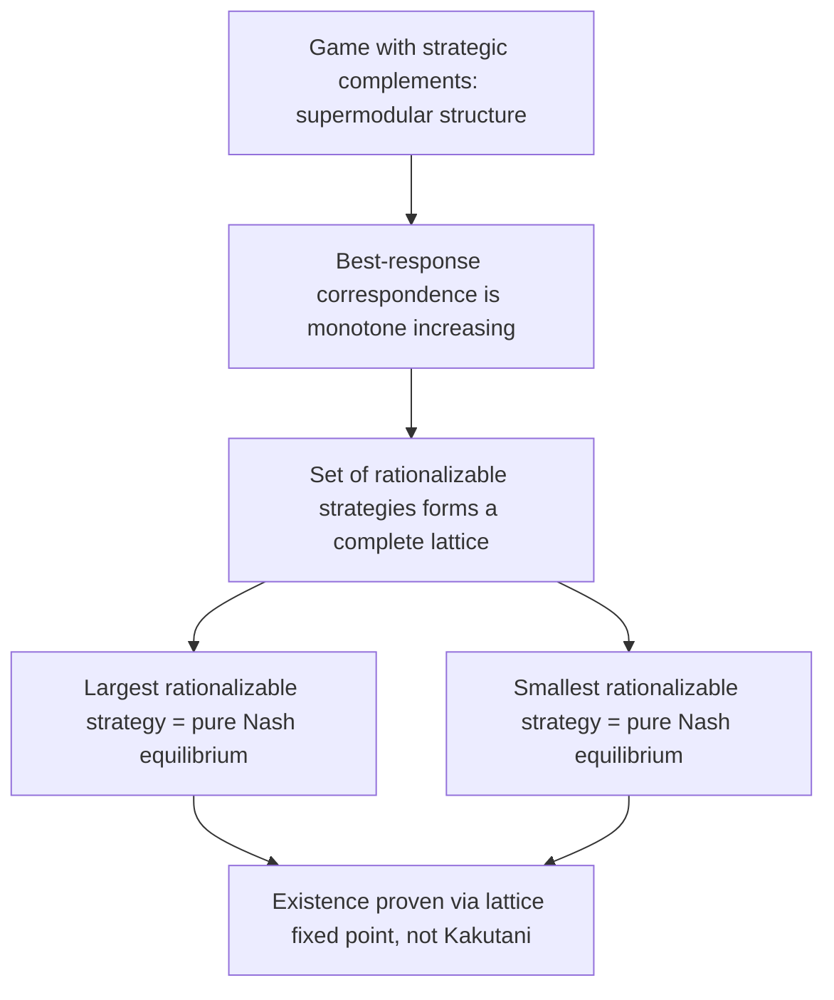

## Rationalizability Foundations Revisited

### Overview

This topic revisits rationalizability — introduced independently by Bernheim and Pearce (1984) — from its epistemic foundations rather than its mechanical iterated-dominance definition, building directly on the previous topic's finding that rationalizability, not Nash equilibrium, is the solution concept exactly characterized by common knowledge of rationality. Where earlier treatments of rationalizability typically emphasize the algorithm (iteratively deleting never-best-responses), this revisit emphasizes the epistemic model that generates it, the precise distinction between rationalizability and correlated rationalizability, and the strategic implications of rationalizability being a **weaker, more permissive** solution concept than Nash equilibrium.

### Formal Definition via Best-Response Sets

A strategy $s_i$ for player $i$ is **rationalizable** if it survives the following iterative process:

- Let $S_i^0 = S_i$ (the full strategy space) for all players.
- At each round $k$, let $S_i^k = \{ s_i \in S_i^{k-1} : s_i \text{ is a best response to some belief } \mu_i \text{ with support in } S_{-i}^{k-1} \}$, where $\mu_i$ ranges over all probability distributions over opponents' surviving strategies from the previous round (in the **independent** rationalizability version) or over the *joint* space $S_{-i}^{k-1}$ allowing correlation (in the **correlated** version).
- The set of rationalizable strategies is $S_i^\infty = \bigcap_{k=0}^{\infty} S_i^k$.

**Key distinction — independent vs. correlated rationalizability:**

- **(Standard/independent) rationalizability** requires $\mu_i$ to be a **product distribution** across the other players (player $i$ believes different opponents randomize independently) — relevant only when there are 3+ opponents, since with a single opponent, independence is vacuous.
- **Correlated rationalizability** allows $\mu_i$ to be any joint distribution over $S_{-i}$, permitting player $i$ to believe opponents' strategies are correlated (e.g., due to a shared unmodeled signal or correlating device).

[Inference] This distinction matters precisely because the epistemic characterization from the previous topic (common knowledge of rationality, full stop, with no further assumption) corresponds most cleanly to **correlated** rationalizability — since nothing in "common knowledge of rationality" alone would justify player $i$ assuming statistical independence across opponents' strategies, that independence assumption is itself an additional, separate modeling restriction, not a consequence of rationality or common knowledge.

### Equivalence to Iterated Strict Dominance

**Key theorem**: in games with finitely many strategies, the set of rationalizable strategies coincides exactly with the set of strategies surviving **iterated elimination of strictly dominated strategies (IESDS)** — regardless of the order in which dominated strategies are eliminated (unlike iterated elimination of *weakly* dominated strategies, which is order-dependent).

**Why order-independence holds for strict dominance**: if strategy $s_i$ is strictly dominated given the full strategy space, it remains strictly dominated after removing *other* players' already-eliminated strategies (since strict dominance only becomes "easier" to satisfy as the opponent's strategy space shrinks) — this monotonicity property guarantees the same final surviving set regardless of elimination order or speed.

**Key Points**

- This equivalence is what makes rationalizability practically computable via the simple, mechanical IESDS algorithm, even though its conceptual/epistemic definition (via best-response sets and common knowledge of rationality) is what gives it theoretical justification as "the" correct implication of rational, mutually-known-rational play.
- The equivalence uses **strict** dominance specifically; iterated elimination of *weakly* dominated strategies is a distinct procedure (order-dependent, and connected to different epistemic assumptions — approximate common knowledge of rationality with vanishingly small "trembles" — rather than exact common knowledge).

### Diagram: Rationalizability via Iterated Best-Response Sets (svg_diagram)

<svg xmlns="http://www.w3.org/2000/svg" viewBox="0 0 740 380" font-family="Arial, sans-serif">
<title>Rationalizability via Iterated Best-Response Sets (svg_diagram)</title>
<rect x="0" y="0" width="740" height="380" fill="#ffffff" />
<rect x="40" y="30" width="660" height="60" rx="8" fill="#e8f0fe" stroke="#3b5bdb" stroke-width="1.5" />
<text x="370" y="55" text-anchor="middle" font-size="13" font-weight="bold" fill="#1c2b4a">Round 0: full strategy space S_i for all players</text>
<text x="370" y="75" text-anchor="middle" font-size="10" fill="#1c2b4a">No restriction yet — every strategy could be rational under SOME belief</text>
<line x1="370" y1="90" x2="370" y2="120" stroke="#333" stroke-width="2" marker-end="url(#arr5)" />
<rect x="40" y="120" width="660" height="60" rx="8" fill="#fff3bf" stroke="#e8a917" stroke-width="1.5" />
<text x="370" y="145" text-anchor="middle" font-size="13" font-weight="bold" fill="#5c4b00">Round k: delete strategies that are never a best response</text>
<text x="370" y="165" text-anchor="middle" font-size="10" fill="#5c4b00">to any belief with support in the OTHER players' round (k-1) surviving strategies</text>
<line x1="370" y1="180" x2="370" y2="210" stroke="#333" stroke-width="2" marker-end="url(#arr5)" />
<rect x="40" y="210" width="660" height="60" rx="8" fill="#d3f9d8" stroke="#2f9e44" stroke-width="1.5" />
<text x="370" y="235" text-anchor="middle" font-size="13" font-weight="bold" fill="#1b4620">Repeat until no further deletions occur (fixed point)</text>
<text x="370" y="255" text-anchor="middle" font-size="10" fill="#1b4620">Surviving set = rationalizable strategies = IESDS survivors</text>
<line x1="200" y1="270" x2="200" y2="300" stroke="#333" stroke-width="2" marker-end="url(#arr5)" />
<line x1="540" y1="270" x2="540" y2="300" stroke="#333" stroke-width="2" marker-end="url(#arr5)" />
<rect x="60" y="300" width="280" height="60" rx="8" fill="#ffe3e3" stroke="#c92a2a" stroke-width="1.5" />
<text x="200" y="325" text-anchor="middle" font-size="12" font-weight="bold" fill="#7a0d0d">Independent Rationalizability</text>
<text x="200" y="345" text-anchor="middle" font-size="10" fill="#7a0d0d">Beliefs are product distributions over opponents</text>
<rect x="400" y="300" width="280" height="60" rx="8" fill="#d0ebff" stroke="#1971c2" stroke-width="1.5" />
<text x="540" y="325" text-anchor="middle" font-size="12" font-weight="bold" fill="#0b3d63">Correlated Rationalizability</text>
<text x="540" y="345" text-anchor="middle" font-size="10" fill="#0b3d63">Beliefs may be any joint distribution</text>
</svg>

### Worked Example: Rationalizability in a 3x3 Game

Consider a symmetric game with strategies $\{T, M, B\}$ (Top, Middle, Bottom) for both players and the following payoff matrix (row player's payoff shown; game assumed symmetric):

|  | L | C | R |
| --- | --- | --- | --- |
| **T** | 3 | 0 | 1 |
| **M** | 0 | 3 | 1 |
| **B** | 1 | 1 | 1.5 |

**Step 1 — Check strict dominance in the base game**: no strategy is strictly dominated initially (each of T, M, B is a best response to some belief: T is best against a belief concentrated on L, M against C, and B against a belief that spreads sufficient weight between L and C to make its "safe" payoff of 1 exceed what T or M could guarantee).

**Step 2 — Suppose an asymmetric payoff perturbation makes B a strictly dominated strategy** (e.g., if B's payoff of 1.5 against R were instead 0.5, making B strictly worse than a mixture of T and M against every column). Then:

- Round 1: eliminate B for both players (strictly dominated by a mix of T, M in the perturbed game).
- Round 2: with B eliminated, R is now potentially dominated for the *column* player, if R's payoffs against the remaining T, M rows are dominated by L or C — check this in the reduced 2x2 game.
- Continue iterating until a fixed point; the surviving strategy set is the rationalizable set.

**Step 3 — Compare to Nash equilibrium**: rationalizability generally yields a **larger** set of surviving strategies than the pure/mixed Nash equilibrium strategies of the game, since Nash equilibrium additionally requires the surviving conjectures to be mutually correct (per the previous topic), while rationalizability only requires each surviving strategy to be a best response to *some* consistent (recursively rationalizable) belief.

**Key Points**

- This example illustrates the general relationship: **Nash equilibrium strategies are always rationalizable, but rationalizable strategies need not be part of any Nash equilibrium** — rationalizability is a strict superset (weakly) of the Nash equilibrium prediction, reflecting its weaker epistemic requirements.

### Rationalizability and Dominance-Solvability

A game is **dominance-solvable** if iterated elimination of strictly dominated strategies converges to a **single** strategy profile for each player (i.e., rationalizability delivers a unique prediction, coinciding with the game's unique Nash equilibrium in this special case).

**Cournot duopoly as the classic dominance-solvable example**: in the standard linear-demand Cournot game, iterated elimination of dominated quantities converges to the unique Cournot-Nash equilibrium, meaning rationalizability and Nash equilibrium coincide exactly — this is a special structural feature (related to the game's strategic substitutes / contraction-mapping structure), not a general property of games.

[Inference] Dominance-solvability is valuable practically because when it holds, the weaker epistemic requirements of rationalizability (mere common knowledge of rationality) are sufficient to pin down the same unique prediction that Nash equilibrium would give — sidestepping entirely the need for the stronger, more demanding "correct conjectures" assumption discussed in the previous topic, since in a dominance-solvable game there is only one possible outcome for rational players to coordinate on regardless.

### The Interim Correlated Rationalizability Extension

For games of **incomplete information** (Bayesian games with private types), the appropriate generalization is **interim correlated rationalizability (ICR)**, developed by Dekel, Fudenberg, and Morris:

- ICR requires that each type's strategy be a best response to *some* belief over opponents' types and strategies that is consistent with that type's information (interim beliefs), without requiring beliefs across different opponents to be independent, and without requiring a common prior.
- ICR is the solution concept characterized by common knowledge of rationality in the **universal type space** (see previous topic's discussion of Mertens-Zamir/Brandenburger-Dekel constructions), making it the incomplete-information analogue of correlated rationalizability's role in complete-information games.
- [Unverified] ICR's robustness properties (invariance to the precise details of the type space beyond the basic hierarchy of beliefs) are a significant technical finding in the mechanism design robustness literature, though the exact scope of this robustness (e.g., under what richness conditions on the type space) involves conditions that are somewhat technical and setting-dependent.

### Rationalizability in Games with Strategic Complements and Substitutes

**Strategic complements** (each player's best response is increasing in others' actions, e.g., technology adoption, coordination games) and **strategic substitutes** (best responses decreasing in others' actions, e.g., Cournot competition) have distinct rationalizability structures:

- In games with strategic complements satisfying suitable monotonicity (supermodular games, per Topkis/Milgrom-Roberts theory), the set of rationalizable strategies has a **largest and smallest element** (a sup and inf), and these bounds themselves constitute **pure-strategy Nash equilibria** — a powerful existence result that follows directly from the lattice-theoretic structure of the best-response correspondence, without needing fixed-point theorems like Kakutani's.
- In games with strategic substitutes, rationalizability sets are generally **not** lattice-structured in the same way, and dominance-solvability (unique rationalizable outcome) is a more common, though not universal, feature (as in the Cournot example above).

**Key Points**

- This connects rationalizability foundations directly to the theory of supermodular games, providing an alternative, order-theoretic existence proof for pure-strategy Nash equilibrium in a broad and economically important class of games (coordination games, games with positive network externalities, patent races with strategic complementarities), distinct from the standard Nash/Kakutani fixed-point existence argument.

### Behavioral and Experimental Critiques

The gap between rationalizability's permissive predictions and the sharper predictions of Nash equilibrium has motivated behavioral alternatives that model **bounded**, finite-depth reasoning rather than the full common-knowledge-of-rationality idealization:

- **Level-$k$ models**: assume a population of players reasoning at different finite "levels" — level-0 players choose non-strategically (e.g., uniformly at random or via a salient default), level-$k$ players best-respond to a belief that opponents are level-$(k-1)$, for small $k$ (typically estimated at $k=1,2,3$ in experimental data).
- **Cognitive hierarchy models**: similar in spirit, but level-$k$ players best-respond to a *distribution* over all lower levels (weighted by an assumed distribution, e.g., Poisson), rather than assuming all opponents are exactly one level below.

[Speculation] These models are often motivated by the observation that rationalizability (and especially the many rounds of iterated reasoning it can require in complex games) may demand more cognitive sophistication than typical experimental subjects display; while level-$k$ and cognitive hierarchy models have shown reasonable fit to certain experimental datasets (e.g., beauty-contest games), the generalizability of specific estimated level distributions across different games and subject populations remains actively debated rather than settled.

### Applications

- **Auction theory**: rationalizability (rather than Nash equilibrium) is sometimes used as the robustness benchmark for auction mechanism design, especially in "detail-free" or "prior-free" mechanism design, since it does not require assuming bidders have correct, coordinated beliefs about competitors' bidding strategies.
- **Global games**: the iterative elimination structure of rationalizability is the core technical tool used to prove unique equilibrium selection in global games (see related topic), where the game's payoff structure combined with small private-information perturbations makes the game dominance-solvable even though the underlying complete-information game had multiple equilibria.
- **Beauty contest games**: the classic experimental paradigm (choose a number, closest to $p$ times the average number wins) is dominance-solvable in principle (iterated dominance converges to everyone choosing 0, if $p<1$), but experimental subjects typically stop after only 1-3 rounds of reasoning — a canonical illustration motivating level-$k$/cognitive hierarchy alternatives to full rationalizability.
- **Robust mechanism design**: designing contracts, auctions, or institutions whose desirable properties are guaranteed for *any* rationalizable behavior, providing stronger guarantees than mechanisms whose properties depend on the players coordinating on a specific Nash equilibrium.

### Relationship to Other Frameworks

- **Epistemic Conditions for Nash Equilibrium** (previous topic): this topic directly extends that discussion, elaborating on rationalizability as the "purer" common-knowledge-of-rationality concept and detailing the independent-vs-correlated distinction only briefly introduced there.
- **Supermodular games and lattice theory**: rationalizability in strategic-complement settings connects directly to Topkis' and Milgrom-Roberts' lattice-theoretic equilibrium existence results, an important alternative to standard fixed-point-based existence proofs.
- **Global games**: rationalizability/dominance-solvability is the核心 technical engine behind global games' unique equilibrium selection results (see forthcoming/related topic), directly building on the iterated-elimination machinery described here.
- **Level-k and cognitive hierarchy models**: positioned as bounded-rationality alternatives to the idealized common-knowledge-of-rationality foundation of rationalizability, motivated by experimental evidence of limited-depth reasoning.
- **Correlated equilibrium**: correlated rationalizability's allowance for correlated beliefs about opponents is conceptually (though not technically identical) related to the correlated equilibrium solution concept's core innovation, both relaxing an independence assumption present in the "standard" (Nash/independent-rationalizability) baseline.

### Common Pitfalls

- Treating rationalizability and Nash equilibrium as interchangeable "rational" predictions — rationalizability is generically a weaker, more permissive concept, and the two coincide only in special cases (e.g., dominance-solvable games).
- Confusing (independent) rationalizability with correlated rationalizability — the two coincide in two-player games (where "independence" across a single opponent is vacuous) but can genuinely differ once there are three or more players, since only correlated rationalizability is exactly implied by unrestricted common knowledge of rationality.
- Assuming iterated elimination of weakly dominated strategies is equivalent to (or as theoretically well-founded as) iterated elimination of strictly dominated strategies — weak-dominance elimination is order-dependent and rests on different, less clean epistemic foundations (approximate rationality / trembles), not exact common knowledge of rationality.
- [Speculation] Assuming level-$k$/cognitive hierarchy models are simply "rationalizability with fewer rounds" — while related in spirit, these behavioral models typically posit specific, often ad hoc distributional assumptions about the population's reasoning-level distribution that are calibrated to data, rather than being derived from a clean epistemic axiomatization the way rationalizability is; treating them as strict formal special cases of rationalizability is an oversimplification.

**Related Topics**

- Epistemic Conditions for Nash Equilibrium
- Common Knowledge and Interactive Epistemology
- Supermodular Games and Lattice-Theoretic Equilibrium Existence
- Global Games and Equilibrium Selection
- Level-k and Cognitive Hierarchy Models
- Correlated Equilibrium
- Robust and Detail-Free Mechanism Design
- Interim Correlated Rationalizability in Bayesian Games