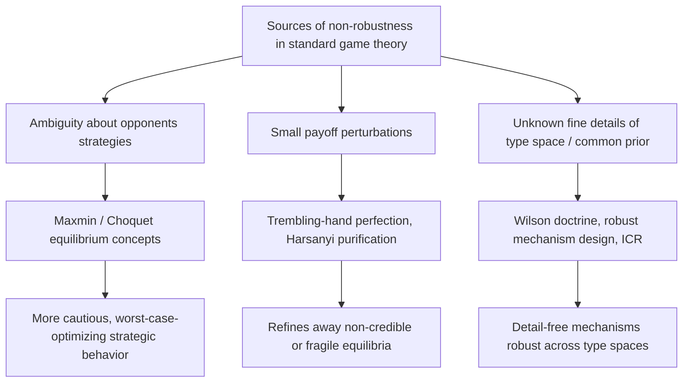

## Robustness and Ambiguity in Games

### Overview

This topic examines how strategic behavior and equilibrium concepts change when players face **ambiguity** — uncertainty that cannot be represented by a single, precisely known probability distribution — rather than standard (Bayesian, subjective-expected-utility) risk. Building on the epistemic foundations covered in prior topics (which assumed players hold well-defined probabilistic beliefs), this topic relaxes that assumption to model players who are unsure of the correct probability model itself, connecting decision-theoretic ambiguity aversion (Knightian uncertainty) to equilibrium concepts, and addressing the closely related question of **robustness**: how sensitive are standard game-theoretic predictions to small misspecifications of the model, payoffs, or information structure.

### Knightian Uncertainty vs. Risk

The foundational distinction, due to Frank Knight (1921):

- **Risk**: uncertainty describable by a known probability distribution (e.g., a fair coin flip with known probability 0.5).
- **Ambiguity (Knightian uncertainty)**: uncertainty where the decision-maker cannot, or does not, assign a single precise probability distribution to the relevant states — instead facing a **set** of plausible distributions, or an inherently vague/imprecise likelihood assessment.

**Ellsberg Paradox**: the classic experimental demonstration that people's choices systematically violate subjective expected utility theory (which requires a single well-defined probability distribution) when facing ambiguity — most people prefer betting on an urn with a known 50/50 split of colored balls over an urn with an unknown mixture, even when standard subjective probability reasoning would treat both bets identically under a symmetric prior. This "ambiguity aversion" behavior motivates the formal decision-theoretic models discussed next.

[Inference] The Ellsberg paradox is significant for game theory specifically because standard Nash equilibrium and Bayesian game analysis both presuppose players form a single well-defined subjective probability over opponents' strategies or types — if real strategic behavior is influenced by ambiguity aversion in the Ellsberg sense, then standard equilibrium predictions may be systematically biased whenever players face genuine, non-probabilizable strategic uncertainty (as opposed to merely mixed-strategy randomization risk).

### Formal Decision-Theoretic Models of Ambiguity

**Maxmin Expected Utility (Gilboa-Schmeidler, 1989)**: rather than a single prior, the decision-maker has a **set** of priors $\mathcal{P}$, and evaluates an act by its **worst-case** expected utility across that set:

$$V(a) = \min_{p \in \mathcal{P}} \mathbb{E}_p[u(a)]$$

This axiomatically-derived representation directly generalizes subjective expected utility (which is the special case $|\mathcal{P}|=1$), and formalizes ambiguity-averse behavior as evaluating uncertain prospects pessimistically across the range of plausible models.

**Choquet Expected Utility (Schmeidler, 1989)**: an alternative representation using **non-additive probabilities (capacities)** rather than a set of priors, where the decision-maker's beliefs are represented by a capacity $\nu$ (satisfying monotonicity but not necessarily additivity), and utility is evaluated via the Choquet integral — mathematically related to, but distinct in axiomatic foundation from, the maxmin multiple-priors model.

**Key Points**

- Both frameworks nest expected utility as a special case and are observationally equivalent in many applications, but they rest on different underlying axiomatic derivations (the specific behavioral axioms relaxed from the von Neumann-Morgenstern/Savage framework differ), which matters for how naturally each extends to strategic (multi-agent) settings.

### Games with Ambiguity-Averse Players

Extending maxmin/Choquet decision theory to strategic settings requires specifying **what the ambiguity is about**: typically, players face ambiguity about **opponents' strategies** (rather than an exogenous state of nature), leading to several distinct equilibrium concepts:

**Maxmin Equilibrium / Equilibrium under Ambiguity**: each player $i$ chooses a strategy maximizing their **worst-case** expected payoff across a set of possible beliefs about opponents' play, and this worst-case optimization is mutually consistent across players (an ambiguity-adjusted fixed-point condition).

$$s_i^* \in \arg\max_{s_i} \min_{\mu_i \in \mathcal{M}_i} \mathbb{E}_{\mu_i}[u_i(s_i, s_{-i})]$$

where $\mathcal{M}_i$ is player $i$'s set of plausible beliefs about $s_{-i}$.

[Unverified] The precise equilibrium existence conditions, uniqueness properties, and even the "correct" way to define mutual consistency of ambiguous beliefs across players (since if I am ambiguous about you, are you ambiguous about my ambiguity, and how does that affect your own optimal ambiguity set) are still active areas of research with multiple competing formalizations in the literature, rather than a single settled framework analogous to standard Nash equilibrium.

### Diagram: Risk vs. Ambiguity in Strategic Belief Formation (svg_diagram)

<svg xmlns="http://www.w3.org/2000/svg" viewBox="0 0 740 380" font-family="Arial, sans-serif">
<title>Risk vs Ambiguity in Strategic Belief Formation (svg_diagram)</title>
<rect x="0" y="0" width="740" height="380" fill="#ffffff" />
<rect x="40" y="40" width="300" height="140" rx="8" fill="#d3f9d8" stroke="#2f9e44" stroke-width="1.5" />
<text x="190" y="65" text-anchor="middle" font-size="13" font-weight="bold" fill="#1b4620">Standard Bayesian Game</text>
<text x="190" y="90" text-anchor="middle" font-size="10" fill="#1b4620">Player holds ONE precise belief</text>
<text x="190" y="108" text-anchor="middle" font-size="10" fill="#1b4620">μ_i about opponent strategies</text>
<text x="190" y="130" text-anchor="middle" font-size="10" fill="#1b4620">Maximizes: E_μi[payoff]</text>
<text x="190" y="155" text-anchor="middle" font-size="10" fill="#1b4620">→ Standard Nash Equilibrium</text>
<rect x="400" y="40" width="300" height="140" rx="8" fill="#ffe3e3" stroke="#c92a2a" stroke-width="1.5" />
<text x="550" y="65" text-anchor="middle" font-size="13" font-weight="bold" fill="#7a0d0d">Ambiguity-Averse Game</text>
<text x="550" y="90" text-anchor="middle" font-size="10" fill="#7a0d0d">Player holds a SET of beliefs</text>
<text x="550" y="108" text-anchor="middle" font-size="10" fill="#7a0d0d">M_i about opponent strategies</text>
<text x="550" y="130" text-anchor="middle" font-size="10" fill="#7a0d0d">Maximizes: min over M_i of E[payoff]</text>
<text x="550" y="155" text-anchor="middle" font-size="10" fill="#7a0d0d">→ Maxmin / Ambiguity Equilibrium</text>
<rect x="180" y="230" width="380" height="90" rx="8" fill="#fff3bf" stroke="#e8a917" stroke-width="1.5" />
<text x="370" y="255" text-anchor="middle" font-size="12" font-weight="bold" fill="#5c4b00">Key structural consequence</text>
<text x="370" y="277" text-anchor="middle" font-size="10" fill="#5c4b00">Ambiguity aversion generally makes players choose</text>
<text x="370" y="295" text-anchor="middle" font-size="10" fill="#5c4b00">more cautious/robust strategies than under a single prior</text>
<text x="370" y="310" text-anchor="middle" font-size="10" fill="#5c4b00">(can support cooperation, deter risky deviations)</text>
<line x1="190" y1="180" x2="330" y2="230" stroke="#666" stroke-width="1.5" />
<line x1="550" y1="180" x2="420" y2="230" stroke="#666" stroke-width="1.5" />
</svg>

### Worked Example: Ambiguity and Cooperation in a Repeated Game

Consider an infinitely repeated Prisoner's Dilemma where each player is uncertain not about the *stage-game payoffs* but about the **opponent's strategy/type** — specifically, whether the opponent will play a Grim Trigger (cooperate until any defection, then defect forever) or defect unconditionally, and this uncertainty is genuinely ambiguous (the player cannot confidently assign a precise probability to either possibility).

**Step 1 — Standard Bayesian analysis**: if the player assigns a precise probability $p$ to "opponent plays Grim Trigger," cooperation is optimal only if $p$ exceeds some threshold $p^*$ derived from comparing expected discounted payoffs of cooperating vs. defecting immediately.

**Step 2 — Ambiguity-averse (maxmin) analysis**: if the player instead holds a **set** of plausible probabilities $[\underline{p}, \bar{p}]$ (rather than a single point estimate $p$) for "opponent plays Grim Trigger," and evaluates cooperation using the **worst-case** probability in this set, cooperation becomes optimal only if it is worthwhile even at the pessimistic end $\underline{p}$.

**Step 3 — Strategic implication**: [Inference] this generally makes ambiguity-averse players **more cautious**, requiring stronger objective grounds for trusting cooperative behavior before reciprocating it themselves, since they evaluate the decision to cooperate against the least favorable belief in their plausible set rather than a single best-guess probability — this can rationalize both increased suspicion/defection in some strategic settings, and in other settings (where the "safe" cautious action happens to itself be cooperative, e.g., avoiding an aggressive first-move), increased caution can *support* cooperative equilibria that would not survive under precise-probability reasoning, depending on the specific payoff structure.

**Key Points**

- This illustrates the general theme that ambiguity aversion is not simply "more pessimism" in a uniform sense — its strategic consequences (more or less cooperative behavior, more or less aggressive deviation) depend on the specific structure of the game and which action the worst-case belief favors, requiring case-by-case analysis rather than a universal comparative-statics rule.

### Robust Mechanism Design and Robust Equilibrium

A closely related but distinct strand of the literature studies **robustness** to model misspecification more broadly — not only ambiguity about opponents' strategies, but robustness of predictions/mechanisms to small perturbations in payoffs, information structures, or higher-order beliefs:

**Wilson Doctrine**: articulated by Robert Wilson, the methodological principle that "good" mechanism design should minimize reliance on detailed, fully-specified common-knowledge assumptions (e.g., a precisely known common prior, or exact knowledge of the type distribution) — motivating the "detail-free" and "prior-free" mechanism design programs.

**Robust implementation (Bergemann-Morris)**: formalizes robustness by requiring a mechanism's desirable properties to hold across the **entire universal type space** (all possible belief hierarchies consistent with a given "basic" payoff-type structure), rather than for a single specific common-prior type space — connecting directly to the interim correlated rationalizability concept from the previous topic, since robust implementation in dominant strategies (or in rationalizable strategies) generally provides the strongest form of such robustness guarantees.

[Inference] The Wilson doctrine and the ambiguity-aversion literature are related in spirit (both express skepticism about the practical realism of assuming players/designers have exact, fully specified probabilistic knowledge) but are technically distinct research programs — one focuses on designer-side robustness to unknown fine details of the environment for mechanism design purposes, the other focuses on player-side strategic behavior when players themselves face ambiguity.

### Robustness to Payoff Perturbations: Purification and Trembling-Hand Refinements

A different, older strand of "robustness" concerns whether an equilibrium (typically a mixed-strategy Nash equilibrium) survives small perturbations to the game's payoffs or to players' rationality:

- **Harsanyi purification**: shows that a mixed-strategy Nash equilibrium of a game with complete information can often be reinterpreted as the **limit of pure-strategy Bayesian equilibria** of a nearby game with slightly perturbed, privately-known payoffs — providing a robustness-based reinterpretation of mixing as resulting from small, unmodeled payoff uncertainty rather than genuine randomization.
- **Trembling-hand perfect equilibrium (Selten)**: requires a Nash equilibrium to remain a best response even when all players' strategies are perturbed by small "trembles" (mistakes) — ruling out equilibria that rely on weakly dominated strategies or non-credible threats sustained only by zero-probability off-path behavior.

**Key Points**

- These refinements address robustness to a different kind of "small perturbation" (payoff or execution noise) than the ambiguity-aversion literature (which addresses genuine non-probabilizable uncertainty about strategic behavior), but both share the broader methodological goal of asking whether a game-theoretic prediction is fragile or robust to relaxing an idealized assumption.

### Applications

- **Auction design under model uncertainty**: robust/detail-free auction design (e.g., robustifying against uncertainty about bidders' exact value distributions) directly applies these ideas to real mechanism design problems where the designer does not trust a fully specified common-prior model.
- **Financial markets and ambiguity aversion**: models of asset pricing and portfolio choice incorporating ambiguity aversion (e.g., "ambiguity premia" in asset prices, home-bias puzzles) extend the single-agent Ellsberg-paradox intuition to strategic and market settings, including strategic trading under model uncertainty.
- **Contract theory and robust incentive design**: designing contracts that perform acceptably well across a range of possible models of agent behavior or environment, rather than being optimized for one precisely specified model — relevant when the principal has genuine model uncertainty about the agent.
- **International relations / security games**: strategic models of deterrence and conflict sometimes incorporate ambiguity about an opponent's true preferences or capabilities (rather than a precise probability distribution over "types"), particularly when historical data for calibrating precise probabilities is sparse or unreliable.
- **Central bank policy under model uncertainty**: robust control approaches (related to but distinct in technical machinery from game-theoretic ambiguity aversion) model policymakers designing decisions robust to a range of possible economic models, an idea with structural parallels to maxmin equilibrium concepts.

### Relationship to Other Frameworks

- **Epistemic Conditions for Nash Equilibrium** (related topic): standard epistemic characterizations assume players hold precise, well-defined conjectures; ambiguity-based models directly relax this precision assumption, asking what happens to equilibrium concepts and their epistemic foundations once beliefs are allowed to be genuinely imprecise/set-valued rather than point-valued.
- **Rationalizability Foundations Revisited** (related topic): interim correlated rationalizability's robustness to details of the type space (from that topic) is conceptually continuous with the Wilson-doctrine robust-mechanism-design literature discussed here, both seeking predictions/mechanisms that do not hinge on fine, possibly-unrealistic details of the epistemic model.
- **Behavioral game theory**: ambiguity aversion is one of several documented systematic departures from strict expected-utility/Bayesian rationality (alongside loss aversion, present bias, and level-$k$ reasoning) that behavioral and experimental game theorists incorporate into richer positive (descriptive) models of actual strategic behavior.
- **Robust control theory**: the maxmin/worst-case optimization structure central to ambiguity-averse equilibrium concepts has deep mathematical parallels to robust control theory in engineering and macroeconomics (e.g., Hansen-Sargent robust control), where a decision-maker optimizes against a worst-case model within a specified "ball" of alternative models around a reference model.

### Common Pitfalls

- Conflating **risk** (known probabilities, e.g., mixed-strategy randomization in standard Nash equilibrium) with **ambiguity** (unknown/imprecise probabilities) — standard game theory handles the former natively via expected utility, but requires the specialized frameworks discussed here (maxmin, Choquet) to handle the latter.
- Assuming ambiguity aversion uniformly makes players more pessimistic or non-cooperative — as the repeated-game example shows, the strategic consequences of worst-case reasoning depend on which action the pessimistic belief favors, which is game-specific.
- Treating "robustness" as a single unified concept — this topic spans several genuinely distinct notions (robustness to opponents' strategic ambiguity, robustness to payoff perturbation/trembles, robustness to unknown details of the common-knowledge/type-space structure), each with its own formal machinery and motivating examples.
- [Speculation] Assuming maxmin/Choquet equilibrium concepts are as empirically well-validated or as widely agreed-upon as standard Nash equilibrium — this remains a more actively contested and rapidly evolving area of theory, with ongoing debate about the "correct" way to model multi-agent ambiguity (e.g., how one player's ambiguity about another interacts with that other player's own strategic sophistication), so results here should be treated as an active research frontier rather than settled canon in the way basic Nash equilibrium theory is.

**Related Topics**

- Epistemic Conditions for Nash Equilibrium
- Rationalizability Foundations Revisited
- Robust Mechanism Design and the Wilson Doctrine
- Harsanyi Purification and Trembling-Hand Perfection
- Behavioral Game Theory and Bounded Rationality
- Robust Control Theory (Hansen-Sargent)
- Interim Correlated Rationalizability
- Repeated Games and Folk Theorems