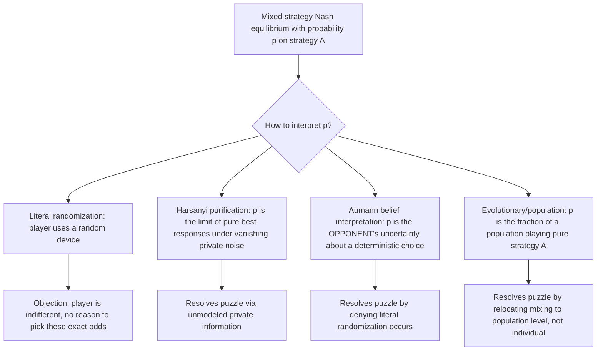

## Interpreting Mixed Strategies

### Overview

This topic addresses a longstanding foundational puzzle in game theory: what does it actually *mean* for a rational player to "randomize" over strategies via a mixed strategy, and why would a rational agent ever deliberately introduce randomness into their own decision-making? While mixed-strategy Nash equilibrium is mathematically indispensable (guaranteeing equilibrium existence in finite games via Nash's theorem), its behavioral and philosophical interpretation has generated substantial debate, producing several distinct — and not fully reconcilable — interpretations that carry different implications for how mixed equilibria should be understood and applied.

### The Core Puzzle

At a mixed-strategy Nash equilibrium, each player's mixed strategy places positive probability only on **pure strategies that are all exactly tied** in expected payoff, given the (mixed) strategies of the other players — this is a defining property of mixed equilibrium (the **indifference condition**). But this creates an immediate conceptual difficulty:

- If all pure strategies in the support yield the **same** expected payoff, the player is **indifferent** among them — so why would they specifically randomize with the *precise* equilibrium probabilities, rather than simply picking any one of the tied pure strategies deterministically, or mixing with different (also non-optimal-improving, since all are tied) probabilities?
- The equilibrium mixing probabilities are pinned down not by the player's *own* optimization (since they are indifferent across the support) but by the requirement that the **opponent's** indifference condition holds — i.e., player $i$'s mixing probabilities are exactly what make player $j$ indifferent, not what player $i$ would choose based on their own preferences alone.

[Inference] This reversal — where a player's equilibrium mixing probabilities are determined by the opponent's indifference condition rather than the player's own strict preference — is precisely what makes the "why would a rational player randomize in this specific way" question conceptually puzzling, and is the starting point for essentially all the interpretive frameworks discussed below.

### Interpretation 1: Literal Randomization Device

The most straightforward reading: players literally use an explicit randomizing device (a coin flip, a random number generator) to select their pure strategy according to the equilibrium probabilities.

**Objections:**

- Since the player is indifferent among all strategies in the support, there is no *incentive* to actually execute this randomization precisely at the equilibrium probabilities — any randomization device, or none at all (just picking one pure strategy), yields the same expected payoff to the player themselves.
- This interpretation, if taken literally, provides no account of **why** the specific equilibrium probabilities would be selected over any other randomization (or no randomization), since the player's own payoff is invariant to which is chosen among the tied support.

[Inference] This objection is widely regarded in the literature as the core weakness of the literal-randomization interpretation — it technically satisfies the mathematical equilibrium conditions but offers little account of the actual decision process that would lead a rational agent to that specific randomization, motivating the alternative interpretations below.

### Interpretation 2: Harsanyi Purification

**Harsanyi's (1973) purification theorem** offers an influential resolution: reinterpret the mixed-strategy equilibrium of a **complete information** game as the limit of **pure-strategy** Bayesian equilibria of a nearby game with slightly perturbed, **privately known** payoffs.

**Mechanism**: suppose each player's true payoffs are subject to small, idiosyncratic private perturbations (unobserved by the opponent) — e.g., player $i$'s payoff to each pure strategy has a small random component $\epsilon_i$ known only to $i$. In this perturbed game, each player has a **pure**-strategy best response for almost every realization of their private payoff perturbation (since ties, which required indifference in the original game, occur with probability zero once continuous private noise is introduced).

**Key result**: as the perturbation vanishes, the **aggregate** (population-level) distribution of pure-strategy choices across the different realizations of $\epsilon_i$ converges to exactly the original game's mixed-strategy equilibrium probabilities — meaning the "randomization" is not deliberately chosen by any single player, but instead **emerges from unmodeled, small idiosyncratic private information** that the analyst has abstracted away in the simplified complete-information model.

**Key Points**

- Purification reframes mixed strategies not as literal randomization by any one player, but as the **observer's/analyst's uncertainty** about a deterministic, purely-payoff-driven choice made by a player with slightly richer private information than the simplified model captures.
- This connects directly to the broader theme of robustness (see previous topic): purification is itself a robustness result, showing that mixed-equilibrium predictions of a stylized complete-information model can be recovered as the limit of pure-strategy behavior in a "nearby," more realistic incomplete-information model.

### Diagram: Purification as the Limit of Perturbed Pure-Strategy Equilibria (svg_diagram)

<svg xmlns="http://www.w3.org/2000/svg" viewBox="0 0 720 340" font-family="Arial, sans-serif">
<title>Purification as the Limit of Perturbed Pure Strategy Equilibria (svg_diagram)</title>
<rect x="0" y="0" width="720" height="340" fill="#ffffff" />
<rect x="40" y="30" width="280" height="90" rx="8" fill="#e8f0fe" stroke="#3b5bdb" stroke-width="1.5" />
<text x="180" y="55" text-anchor="middle" font-size="12" font-weight="bold" fill="#1c2b4a">Complete Information Game</text>
<text x="180" y="78" text-anchor="middle" font-size="10" fill="#1c2b4a">Mixed-strategy Nash equilibrium:</text>
<text x="180" y="95" text-anchor="middle" font-size="10" fill="#1c2b4a">player randomizes with prob p</text>
<rect x="400" y="30" width="280" height="90" rx="8" fill="#d3f9d8" stroke="#2f9e44" stroke-width="1.5" />
<text x="540" y="55" text-anchor="middle" font-size="12" font-weight="bold" fill="#1b4620">Perturbed Incomplete Info Game</text>
<text x="540" y="78" text-anchor="middle" font-size="10" fill="#1b4620">Each player has private noise ε_i</text>
<text x="540" y="95" text-anchor="middle" font-size="10" fill="#1b4620">Pure-strategy Bayesian equilibrium</text>
<line x1="180" y1="120" x2="180" y2="150" stroke="#666" stroke-width="1.5" />
<line x1="540" y1="120" x2="540" y2="150" stroke="#666" stroke-width="1.5" />

<text x="360" y="170" text-anchor="middle" font-size="12" fill="#333">As ε → 0 (noise vanishes) →</text>

<rect x="180" y="200" width="360" height="90" rx="8" fill="#fff3bf" stroke="#e8a917" stroke-width="1.5" />
<text x="360" y="225" text-anchor="middle" font-size="12" font-weight="bold" fill="#5c4b00">Population distribution of pure choices</text>
<text x="360" y="248" text-anchor="middle" font-size="10" fill="#5c4b00">converges to the mixed-equilibrium probability p</text>
<text x="360" y="268" text-anchor="middle" font-size="10" fill="#5c4b00">Mixing = analyst's aggregation of deterministic private choices</text>
<line x1="180" y1="120" x2="270" y2="200" stroke="#999" stroke-width="1.5" stroke-dasharray="3,2" />
<line x1="540" y1="120" x2="450" y2="200" stroke="#666" stroke-width="1.5" />
</svg>

### Interpretation 3: Beliefs, Not Actions (Aumann's Reinterpretation)

Aumann (1987) proposed reinterpreting the mixed strategy not as a randomization actually performed by the player, but as the **opponent's uncertainty (subjective belief) about which pure strategy the player will deterministically choose**.

- Under this view, each player in fact plays a specific **pure** strategy, but the *other* players (and the analyst) are uncertain about which one, and this uncertainty is captured probabilistically by the "mixed strategy" — the randomization lives in the mind of the observer/opponent, not as an actual physical or deliberate randomizing act by the player themselves.
- This interpretation coheres naturally with correlated equilibrium and Bayesian epistemic game theory (see earlier topics): the mixed strategy is simply the *marginal distribution*, from another player's epistemic perspective, over what the focal player will actually (deterministically) do.

**Key Points**

- This "belief-based" interpretation elegantly sidesteps the "why would a rational player literally randomize" puzzle by denying the premise — no one is claimed to be *literally* randomizing; the probabilities represent epistemic uncertainty held by others, consistent with each individual player's actual choice being a specific, deterministic best response given their own (possibly private) information or tie-breaking rule.
- [Unverified] This interpretation is philosophically appealing but raises its own question: what determines an individual player's specific deterministic choice among tied pure strategies, if not some (unmodeled) private information or arbitrary tie-breaking convention — in some formulations this effectively pushes the puzzle back toward the purification story, motivating some game theorists to see the two interpretations as complementary rather than fully independent resolutions.

### Interpretation 4: Evolutionary / Population Interpretation

A distinct interpretation abandons the idea of a single rational individual randomizing altogether, instead treating the mixed-strategy equilibrium as describing the **steady-state distribution of pure strategies within a large population** of players who are matched randomly to play the game repeatedly.

- Under this reading, no single individual "mixes" — rather, different fixed fractions of the population deterministically play each pure strategy in the support, and the mixed-equilibrium probabilities describe these population **shares**, not any individual's randomization.
- This connects the interpretation of mixed strategies directly to **evolutionary game theory**, where an evolutionarily stable strategy (ESS) that happens to be a mixed strategy is standardly interpreted as a polymorphic population state (a mix of different pure-strategy "types") rather than every individual literally randomizing internally.

**Key Points**

- The evolutionary/population interpretation is often considered the most behaviorally natural for **biological** applications (e.g., a species' population exhibiting a mix of aggressive "hawk" and passive "dove" phenotypes, per the Hawk-Dove game) but is a more strained fit for genuinely one-shot strategic interactions between specific, identifiable rational individuals (e.g., a single firm's one-time pricing decision), where a population reinterpretation is less natural.

### Worked Example: Matching Pennies

The canonical zero-sum game illustrating mixed-strategy equilibrium: two players simultaneously choose Heads or Tails; player 1 wins if choices match, player 2 wins if they differ (or vice versa, depending on convention). The unique Nash equilibrium is both players randomizing 50/50.

**Applying each interpretation:**

1. **Literal randomization**: each player actually flips a fair coin to decide. Objection: since 50/50 is the *only* mixture consistent with the *opponent's* indifference (any deviation from 50/50 by player 1 would let player 2 exploit it, but player 1 personally is indifferent among all their own mixtures once player 2 plays 50/50) — nothing about player 1's own preferences explains why they'd pick exactly 50/50 rather than 60/40, absent the strategic requirement to prevent player 2 from exploiting a predictable bias.
2. **Purification**: reinterpret as each player having a small private idiosyncratic payoff shock each round (e.g., a slight private preference for Heads that day), with the pure best-response-to-shock aggregating to a 50/50 split across many repetitions or across a population — resolving why the specific 50/50 split emerges without literal internal randomization.
3. **Belief interpretation**: player 2 is genuinely uncertain (holds a 50/50 subjective belief) about whether player 1 — who in fact deterministically plays, say, Heads on this occasion based on some private tie-breaking rule — will choose Heads or Tails; the "50/50" describes player 2's epistemic state, not player 1's internal randomizing process.
4. **Evolutionary/population**: reinterpret "player 1" as a large population, with exactly half systematically playing Heads and half systematically playing Tails, matched randomly against player 2's population (also split 50/50).

**Key Points**

- Matching Pennies is a particularly clean illustration because its equilibrium (unique, fully mixed, symmetric) isolates the interpretive question without confounding factors like multiple equilibria or asymmetric mixing probabilities that arise in other games.

### Implications for Empirical and Experimental Testing

The choice of interpretation has direct empirical consequences for how mixed-strategy predictions should be tested:

- If mixed strategies are literal individual randomization, **experimental tests** should look for evidence that individual subjects' choice frequencies (across repeated play) match equilibrium probabilities, and ideally that their sequential choices are statistically independent (i.i.d.) draws, as genuine randomization would imply.
- If the evolutionary/population interpretation is correct, the relevant test is whether the **aggregate population distribution** of choices matches equilibrium proportions, without requiring any individual to randomize — a substantially weaker and more easily satisfied empirical prediction.
- [Speculation] Experimental evidence on this question is mixed: some studies of professional athletes (e.g., serve direction in tennis, penalty-kick direction in soccer) find aggregate mixing frequencies and sequential unpredictability broadly consistent with equilibrium mixed-strategy play, while laboratory experiments with student subjects more frequently reveal systematic patterns (e.g., "hot hand" or gambler's-fallacy-type sequential dependencies) inconsistent with genuine randomization at the individual level — the extent to which any specific dataset favors one interpretation over another remains actively studied and somewhat context-dependent, rather than yielding a single decisive verdict for any one interpretation.

### Applications

- **Sports economics**: extensive empirical literature testing mixed-strategy equilibrium predictions in professional sports (soccer penalty kicks, tennis serves), often cited as some of the cleanest available field evidence on whether real high-stakes strategic randomization matches equilibrium predictions.
- **Auction and bidding behavior**: mixed-strategy equilibria in certain auction formats (e.g., all-pay auctions, war-of-attrition-type contests) raise the same interpretive questions when analyzing observed bidding data.
- **Military strategy and deception**: classic applications of mixed-strategy reasoning (e.g., choosing unpredictable patrol routes or attack timing) are most naturally read through the literal-randomization lens, since the strategic value of unpredictability to an adversary is often the explicit, conscious motivation — though this specific class of applications is somewhat different from the more puzzling case of *economic* mixed equilibria, since here the value of randomizing is straightforwardly to defeat an adversary's prediction, not merely a mathematical equilibrium artifact.
- **Evolutionary biology**: the population interpretation is the standard and largely uncontroversial reading for animal behavior modeled via evolutionary game theory (e.g., mixed hawk-dove population equilibria), where no individual organism is presumed to perform conscious probabilistic reasoning at all.

### Relationship to Other Frameworks

- **Robustness and Ambiguity in Games** (previous topic): Harsanyi purification is a direct, specific instance of the broader theme (from that topic) of reinterpreting an idealized equilibrium concept as the robust limit of a richer, more realistic perturbed model — connecting the two topics' methodological approach directly.
- **Common Knowledge and Interactive Epistemology / Epistemic Conditions for Nash Equilibrium**: Aumann's belief-based reinterpretation of mixed strategies is a direct application of the broader epistemic game theory framework (treating strategies-as-conjectures rather than strategies-as-actions) developed in those topics.
- **Evolutionary game theory**: the population interpretation of mixed strategies is the conceptual bridge connecting classical (individual-rationality-based) Nash equilibrium theory to evolutionary game theory's population-dynamics-based equilibrium concepts (ESS, replicator dynamics).
- **Behavioral game theory**: empirical tests of whether real subjects' choices are consistent with genuine randomization (vs. exhibiting the gambler's fallacy, hot-hand bias, or other systematic sequential patterns) connect this topic directly to the broader behavioral critique of idealized rational-choice predictions in game theory.

### Common Pitfalls

- Treating the interpretation of mixed strategies as a settled, uncontroversial matter — this remains a genuine foundational debate among game theorists, with the interpretations above offering complementary but not fully unified perspectives, rather than one interpretation having definitively superseded the others.
- Assuming the mixed-strategy indifference condition means a player is "happy with any" mixture including their own — the equilibrium mixing probabilities are pinned down by making the *opponent* indifferent, not by any preference of the mixing player's own, which is the crux of why the "why these exact odds" puzzle arises in the first place.
- Conflating the evolutionary/population interpretation with literal individual randomization when applying results from one domain (e.g., biological ESS analysis) to a context (e.g., a single firm's strategic pricing decision) where a population reinterpretation is not natural.
- [Speculation] Over-interpreting sports/field-data findings of aggregate consistency with equilibrium mixing frequencies as definitive proof that individual athletes are "literally randomizing" in the cognitive sense — aggregate frequency matching is also consistent with the purification or evolutionary interpretations, and does not by itself distinguish among the different underlying mechanisms, a point sometimes glossed over in popular treatments of this empirical literature.

**Related Topics**

- Robustness and Ambiguity in Games
- Common Knowledge and Interactive Epistemology
- Epistemic Conditions for Nash Equilibrium
- Evolutionary Game Theory and Evolutionarily Stable Strategies
- Harsanyi Purification and Bayesian Games
- Behavioral Game Theory and Experimental Tests of Equilibrium
- Correlated Equilibrium
- Replicator Dynamics