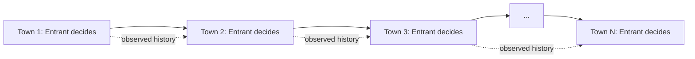

## The Chain Store Paradox

### Overview

The Chain Store Paradox, introduced by Reinhard Selten in 1978, is a foundational puzzle in game theory that exposes a tension between the predictions of backward induction and strong game-theoretic intuition about rational behavior. It demonstrates that subgame perfect equilibrium — despite being the standard refinement for extensive-form games — can produce conclusions that many, including Selten himself, considered strategically implausible. The paradox motivated decades of subsequent work on equilibrium refinements, reputation effects, and bounded rationality.

### The Setup

A chain store (the incumbent) operates branches in $N$ separate towns. In each town, a potential entrant considers whether to enter the local market. The interaction proceeds sequentially, town by town, over $N$ periods.

In each town $i$, the stage game unfolds as follows:

1. The entrant in town $i$ chooses **Enter** or **Stay Out**.
2. If the entrant chooses **Stay Out**, the game in that town ends: the entrant receives a payoff of $0$, and the chain store receives a payoff of $2$ (monopoly profit).
3. If the entrant chooses **Enter**, the chain store chooses **Fight** (aggressive pricing/predatory response) or **Accommodate** (accept shared market).
   - If **Fight**: both players receive $0$.
   - If **Accommodate**: both players receive $1$.

This stage game is played sequentially across all $N$ towns, with the chain store being the same player throughout, while a different entrant plays in each town. Entrants are assumed to observe the outcomes of all previous towns before making their own decision.

**Stage Game Payoff Matrix (Entrant, Chain Store):**

|  | Chain Store: Fight | Chain Store: Accommodate |
| --- | --- | --- |
| **Entrant: Enter** | $(0, 0)$ | $(1, 1)$ |
| **Entrant: Stay Out** | $(0, 2)$ | $(0, 2)$ |

### The Backward Induction Argument

Solving via backward induction, start from the final town, $N$.

- In town $N$, the chain store has no future towns to influence. If the entrant enters, the chain store faces a one-shot decision: Fight yields $0$, Accommodate yields $1$. Since $1 > 0$, the chain store accommodates.
- The entrant in town $N$, anticipating this, knows that entering yields $1$ (since the store will accommodate) versus $0$ for staying out. The entrant enters.
- Rolling back to town $N-1$: the chain store's decision here has no credible way to affect town $N$'s outcome, because the town $N$ entrant will enter and force accommodation regardless of what happened earlier. So the chain store's incentive in town $N-1$ collapses to the same one-shot logic: Accommodate dominates Fight.
- This unravels iteratively backward through every town: in every town $i$, the unique subgame perfect equilibrium action is **Enter** by the entrant and **Accommodate** by the chain store.

**Formal statement of the SPE outcome:**

$$\forall i \in \{1, \ldots, N\}: \quad (\text{Enter}_i, \text{Accommodate}_i) \text{ is played}$$

The chain store earns $1$ per town instead of the monopoly payoff of $2$, for a total of $N$ rather than $2N$.

### The Paradox

This conclusion is the paradox: it seems obvious to most observers, including Selten, that a real chain store facing this sequence of entry decisions would fight early entrants — even at a short-term loss — to build a reputation for toughness that deters entry in later towns. This is standard business intuition and matches observed behavior of firms engaging in predatory pricing or costly signaling.

Yet the subgame perfect equilibrium concept, applied with fully rigorous backward induction, rules this out entirely. The reasoning is that:

- Fighting in town $i$ cannot be a credible threat because it is not optimal in the last town, and by induction, this destroys credibility in every prior town.
- Since the entrant is rational and knows the chain store is rational (common knowledge of rationality), no entrant should ever be deterred by threats that are known to be empty.

Selten himself described this tension by noting he could construct the mathematically valid backward-induction argument, yet his own strategic intuition told him to fight in the early towns. He referred to this as revealing a deep inadequacy in the direct, unmodified application of game-theoretic reasoning to problems of this structure — famously distinguishing "theoretical reasoning" from what he called practical or intuitive reasoning that people actually use.

### Why Reputation Cannot Form in the Complete-Information Model

The core structural reason the paradox arises is the assumption of **complete information**: every entrant knows with certainty that the chain store's payoffs are exactly as specified (Accommodate strictly dominates Fight in any subgame where entry has already occurred). Because this is common knowledge, there is no uncertainty for a reputation to exploit.

- A "reputation for toughness" only has strategic value if there is some probability, in the mind of future entrants, that the incumbent might actually prefer to fight.
- With complete information, fighting is common knowledge to be a strictly dominated action in the terminal subgame, so no amount of past fighting behavior can rationally update entrants' beliefs about future behavior — since the entrants already know the payoffs with certainty and the past actions convey no new information about payoffs that weren't already known.
- This is the crucial fragility: the paradox is not a claim that reputation-building is never rational — it is a claim that reputation-building has zero equilibrium value when the game has complete information and the relevant threats are known in advance to be non-credible.

### Resolution via Incomplete Information: The Kreps-Wilson / Milgrom-Roberts Approach

The most influential resolution came from Kreps and Wilson (1982) and Milgrom and Roberts (1982), who showed that introducing a small amount of **incomplete information** about the chain store's type restores the intuitive outcome (or something close to it) as an equilibrium.

**Modified setup:**

Suppose there is a small probability $\varepsilon > 0$ that the chain store is a "committed" or "irrational" type that always fights entrants regardless of short-run payoff, and probability $1 - \varepsilon$ that it is the standard "rational" type from the original game.

Entrants do not observe the chain store's type directly but update their beliefs using Bayes' rule based on observed behavior in earlier towns.

**Key result:** For sufficiently many towns $N$ and any $\varepsilon > 0$, however small, there exists a sequential equilibrium in which the rational-type chain store fights entry in most or all of the early towns (mimicking the committed type), and entrants in early towns rationally choose to stay out because the posterior probability that they are facing the committed type — combined with the expected losses from testing a fighter — makes staying out optimal.

The intuition is captured by the **Gang of Four reputation result**: even an arbitrarily small prior probability of a commitment type can support reputation-building behavior across a large number of periods, and the value of maintaining that reputation to the rational-type player converges toward the "commitment payoff" (the payoff the player would get if it could credibly commit to always fighting) as the number of remaining periods grows.

**Belief updating example (schematic):**

If the entrant in town $k$ observes that the chain store fought in towns $1$ through $k-1$, Bayesian updating gives:

$$P(\text{Tough} \mid \text{Fought in } 1, \ldots, k-1) = \frac{\varepsilon}{\varepsilon + (1-\varepsilon)\cdot P(\text{Rational type fights} \mid \text{history})}$$

As long as the rational type's equilibrium strategy makes it likely to fight early on (mimicking the tough type), this posterior remains high enough to deter entry, even though $\varepsilon$ itself is small.

### Alternative Resolutions and Critiques

Several other lines of resolution and critique emerged, addressing different aspects of the paradox:

- **Bounded rationality / limited foresight:** Selten's own later work, and subsequent work by others, explored the idea that real agents do not perform unlimited backward induction, especially in games with many stages, and that "theory of moves" or limited-depth reasoning can rationalize fighting behavior without abandoning rationality altogether.
- **Sequential equilibrium and trembles:** Some critiques questioned whether subgame perfection is the "right" refinement at all for games with long chains of reasoning, motivating alternative solution concepts.
- **Finite vs. infinite horizon sensitivity:** The paradox is sensitive to the game being finite with a commonly known end. If the interaction were of uncertain or infinite length, standard folk theorem logic for repeated games could support cooperative-like (fighting-based deterrence) equilibria even under complete information, because there is no final period from which to unravel the induction.
- **Relation to the Finitely Repeated Prisoner's Dilemma:** The Chain Store Paradox is structurally related to the well-known unraveling result in the finitely repeated prisoner's dilemma, where cooperation cannot be sustained in any subgame perfect equilibrium if the number of repetitions is finite and commonly known, for exactly the same backward-induction logic. Both paradoxes were central to motivating the incomplete-information reputation literature of the early 1980s.

### Formal Game Tree (Single Town, Stage Game)

<svg xmlns="http://www.w3.org/2000/svg" viewBox="0 0 640 380" font-family="Arial, sans-serif" font-size="14">
<title>Chain Store Paradox Stage Game Extensive Form (svg_diagram)</title>
<line x1="320" y1="40" x2="150" y2="140" stroke="#333" stroke-width="2" />
<line x1="320" y1="40" x2="490" y2="140" stroke="#333" stroke-width="2" />
<circle cx="320" cy="40" r="6" fill="#333" />
<text x="335" y="35" fill="#333">Entrant</text>
<text x="120" y="130" fill="#333">Stay Out</text>
<text x="480" y="130" fill="#333">Enter</text>
<circle cx="150" cy="150" r="6" fill="#333" />
<text x="60" y="150" fill="#666">(terminal)</text>
<text x="90" y="190" fill="#000">Payoffs (Entrant, Chain Store)</text>
<text x="90" y="210" fill="#000">(0, 2)</text>
<circle cx="490" cy="150" r="6" fill="#333" />
<text x="500" y="145" fill="#333">Chain Store</text>
<line x1="490" y1="150" x2="380" y2="260" stroke="#333" stroke-width="2" />
<line x1="490" y1="150" x2="600" y2="260" stroke="#333" stroke-width="2" />
<text x="360" y="230" fill="#333">Fight</text>
<text x="590" y="230" fill="#333">Accommodate</text>
<text x="330" y="290" fill="#000">Payoffs (Entrant, Chain Store)</text>
<text x="330" y="310" fill="#000">(0, 0)</text>
<text x="540" y="290" fill="#000">Payoffs (Entrant, Chain Store)</text>
<text x="540" y="310" fill="#000">(1, 1)</text>
</svg>

### Multi-Town Sequential Structure

### Numerical Illustration

Consider $N = 3$ towns.

- **Complete information SPE prediction:** In every town, Enter/Accommodate. Chain store total payoff: $1 + 1 + 1 = 3$. Monopoly benchmark (deterrence in all towns) would have given $2 + 2 + 2 = 6$.
- **Incomplete information (small $\varepsilon$) equilibrium possibility:** Rational chain store fights in town 1, deterring entry in towns 2 and 3 (if reputation effect is strong enough given only 2 remaining towns and small $\varepsilon$). Chain store payoff: $0 + 2 + 2 = 4$, still short of full monopoly but strictly better than the complete-information SPE payoff of $3$. This illustrates how even a short horizon can yield reputation value once $\varepsilon > 0$, though the effect strengthens as $N$ grows.

[Inference] The exact equilibrium fighting pattern under incomplete information (how many early towns are fought) depends on the specific value of $\varepsilon$, the payoff parameters, and $N$; the qualitative direction (more deterrence than under complete information) is the robust theoretical result from Kreps-Wilson/Milgrom-Roberts, not a specific fixed schedule of fighting.

### Significance in Game Theory

The Chain Store Paradox is widely regarded as one of the pivotal case studies motivating the shift in the 1980s from complete-information equilibrium refinements (subgame perfection, trembling-hand perfection) toward the broader incomplete-information equilibrium apparatus (Bayesian games, sequential equilibrium, perfect Bayesian equilibrium) that now underlies most modern applied game theory, particularly in industrial organization models of entry deterrence, predatory pricing, and reputation formation in repeated interactions.

**Related Topics**

- Finitely repeated prisoner's dilemma and the unraveling problem
- Sequential equilibrium and perfect Bayesian equilibrium
- Reputation effects in repeated games (Kreps-Wilson-Milgrom-Roberts "Gang of Four" models)
- Trembling-hand perfect equilibrium
- The centipede game and other backward-induction paradoxes
- Bounded rationality and epistemic game theory
- Predatory pricing models in industrial organization
- Bayesian games and Harsanyi transformation
- Folk theorems for infinitely repeated games