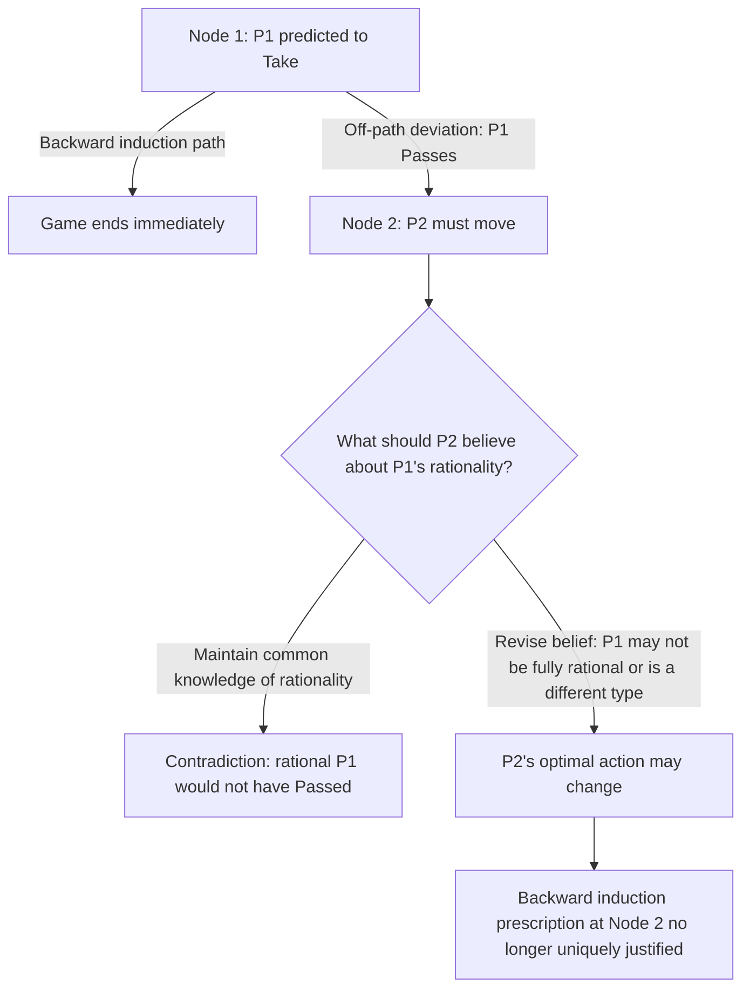

## The Paradox of Backward Induction

### Overview

The Paradox of Backward Induction refers to a cluster of related philosophical and game-theoretic puzzles about whether backward induction — the standard method for solving finite extensive-form games of perfect information — is actually justified by the assumption of common knowledge of rationality. Although backward induction is mathematically well-defined and produces the subgame perfect equilibrium of any finite game with perfect information, a substantial literature initiated by Robert Aumann, Philip Reny, Ken Binmore, Cristina Bicchieri, and others has questioned whether the epistemic assumptions needed to justify the procedure are internally consistent, particularly in games longer than two stages. The Centipede Game is the canonical vehicle for exposing the paradox, but the underlying issue generalizes to any sequential game where a player's rationality must be inferred from what happens after an "irrational-looking" move.

### Backward Induction: The Procedure

Backward induction solves a finite extensive-form game with perfect information by working from the terminal nodes toward the root:

1. At each final decision node, the player who moves selects the action maximizing their own payoff.
2. These choices are folded back into the payoffs of the preceding node, which is now treated as if it directly yielded the resulting payoff.
3. The process repeats until the root is reached, yielding a complete strategy profile for every player at every node — the unique (or one of possibly several, in the case of ties) subgame perfect equilibrium.

Formally, for a finite game tree with perfect information and generic payoffs, backward induction identifies the unique subgame perfect equilibrium, and by Kuhn's theorem, this equilibrium exists for every such finite game.

### The Centipede Game as the Canonical Illustration

Introduced by Rosenthal (1981) and popularized by Robert Aumann, the Centipede Game presents a stark version of the paradox.

**Setup:** Two players alternate moves. At each turn, a player chooses to **Take** (end the game, claiming the larger current share) or **Pass** (continue, growing the total pot but shifting the largest potential share to the other player). The game has a fixed, finite, commonly known number of rounds (e.g., 6 moves).

**Payoff structure (illustrative, 6-move version):**

| Move | Player | Take payoff (P1, P2) | Pass leads to... |
| --- | --- | --- | --- |
| 1 | P1 | $(4, 1)$ | Move 2 |
| 2 | P2 | $(2, 8)$ | Move 3 |
| 3 | P1 | $(16, 4)$ | Move 4 |
| 4 | P2 | $(8, 32)$ | Move 5 |
| 5 | P1 | $(64, 16)$ | Move 6 |
| 6 | P2 | $(32, 128)$ | End: $(128, 64)$ |

**Backward induction solution:** At the final node, Player 2 strictly prefers Take ($128$) over Pass ($64$). Anticipating this, Player 1 at move 5 prefers Take ($64$) over Pass (leading to $32$ if P2 takes next). This unravels all the way back: the unique subgame perfect equilibrium has **Player 1 taking at move 1**, ending the game immediately with payoff $(4, 1)$.

This is the paradox in its sharpest form: both players would be much better off if the game continued to the end ($128, 64$ vastly exceeds $4, 1$ for both), yet the "rational" solution ends the game at the very first opportunity, leaving enormous mutual gains unrealized.

### The Epistemic Problem: Why Backward Induction May Be Self-Undermining

The deeper paradox, articulated most forcefully by Philip Reny (1992) and Cristina Bicchieri, is not merely that the outcome seems inefficient — it is that the *justification* for backward induction may be logically unstable.

Backward induction at any node $k$ relies on the assumption that all players will behave rationally at all future nodes. But consider a node deep in the tree that is only reached if some player already deviated from what backward induction prescribes (e.g., Player 1 passed at move 1, contradicting the "solution"). At that point:

- Strict adherence to "common knowledge of rationality" would require Player 2, upon reaching move 2, to still believe Player 1 is rational — yet Player 1's very presence at that node is evidence against that belief, since a rational Player 1 (per the solution) would never have arrived there.
- If Player 2 revises their belief about Player 1's rationality (concluding Player 1 might not be fully rational, or might be a different "type" who values reciprocity, altruism, or has different payoffs), this changes what Player 2 should optimally do next — potentially rationalizing further deviation from the backward-induction path.
- This creates a self-referential problem: the very act of reaching an off-path node can undermine the epistemic foundation (common knowledge of rationality) that was used to derive the backward induction solution in the first place.

Reny formalized this by showing that in games with more than two stages, common knowledge of rationality is not always **preserved** at every node of the tree — it can fail to survive the counterfactual event of reaching a node the theory itself says should never be reached. This differs sharply from static/simultaneous games, where common knowledge of rationality raises no such issue, because there are no sequential belief-revision points along a path of play.

### Aumann's Defense: Common Knowledge of Rationality Implies Backward Induction

Robert Aumann's influential 1995 paper *"Backward Induction and Common Knowledge of Rationality"* offered a rigorous defense, proving a theorem within an epistemic framework (using knowledge operators over a state space) that:

$$\text{Common knowledge of rationality} \implies \text{the backward induction outcome is played}$$

Aumann's argument rests on a specific formalization in which "rationality" is defined as a property of the player's strategy (a complete, once-and-for-all contingency plan) rather than as sequential node-by-node choice, and counterfactual off-path behavior is handled via a possible-worlds semantics where rationality is evaluated with respect to the entire strategy, not updated beliefs at each node. Under this formalization, Aumann shows that common knowledge of rationality is logically sufficient to force the backward induction path.

However, Aumann's proof has been contested precisely on the grounds that it defines rationality and common knowledge in a way that sidesteps the belief-revision problem rather than resolving it — critics (notably Binmore, and Bicchieri) argue that Aumann's framework doesn't allow for the kind of node-by-node epistemic states needed to represent what a player should rationally believe upon observing an "impossible" deviation, and that once such states are permitted, the paradox resurfaces.

### Binmore's Critique: The Problem of Reaching a "Zero-Probability" Node

Ken Binmore's critique focuses on the standard tool of Bayesian rationality: conditioning on events of prior probability zero.

- If common knowledge of rationality assigns probability $1$ to reaching the backward-induction equilibrium path, then any deviation (a player choosing "Pass" when the theory says "Take") is a zero-probability event under that common prior.
- Standard probability theory does not define conditional beliefs given a zero-probability event (Bayes' rule requires dividing by the probability of the conditioning event). This means there is no theory-internal way to specify what a player *should* believe upon observing a deviation, since the deviation was assigned probability zero by assumption.
- Binmore argues this is not a minor technicality: it means backward induction's off-path prescriptions are, in an important sense, undefined by the very theory that generates them, and any way of "filling in" those beliefs (e.g., via trembling-hand perturbations, as in Selten's own later refinements) requires additional assumptions not contained in common knowledge of rationality alone.

### Bicchieri's Analysis: Common Knowledge Fails to Survive Its Own Implications

Cristina Bicchieri's work sharpened the paradox by showing formally that in games of three or more stages, the statement "it is common knowledge that all players are rational" can be **inconsistent** with certain histories being reached, in the specific sense that supposing the game reaches a particular off-path node while maintaining full common knowledge of rationality throughout generates a logical contradiction in some game structures. This differs from mere "surprising" evidence — it can be a genuine derivation of a contradiction from the premises, revealing that the assumption of common knowledge of rationality is not something that can be coherently maintained as an unchanging background fact throughout an extensive-form game of sufficient length.

### Distinguishing the Different "Paradoxes"

The literature actually contains several distinguishable puzzles often bundled under this name:

- **The efficiency paradox:** Backward induction yields Pareto-dominated outcomes (as in the Centipede Game), which seems to conflict with any account of rationality as "getting good outcomes."
- **The epistemic consistency paradox:** The assumptions needed to derive backward induction (iterated/common knowledge of rationality) may not be jointly satisfiable across the entire tree once off-path nodes are considered — this is Reny's and Bicchieri's core technical point.
- **The counterfactual/belief-revision paradox:** Standard game theory has no canonical, assumption-free account of what a player should believe after observing a zero-probability deviation, so backward induction's prescriptions at unreached nodes rest on an underdetermined foundation — this is Binmore's core point.
- **The empirical paradox:** Experimental evidence (see below) consistently shows that real subjects do not play the backward induction solution, especially in early rounds, raising the separate (non-purely-theoretical) question of whether the solution concept is even a good positive predictor of behavior.

### Experimental Evidence

The Centipede Game has been extensively tested in the lab (most famously by McKelvey and Palfrey, 1992). Empirical findings consistently show:

- Very few subjects "Take" at the very first opportunity, contrary to the unique subgame perfect equilibrium prediction.
- Play typically continues for several rounds before someone takes, with the exact stopping point sensitive to payoff parameters and the total number of rounds.
- Behavior is broadly consistent with models incorporating a mix of altruism, limited depth of reasoning (level-$k$ or cognitive hierarchy models), and heterogeneous beliefs about opponents' rationality or "type," rather than either pure backward-induction rationality or pure altruism.

[Inference] The precise stopping distributions vary considerably by experimental design, stakes, and subject pool; the qualitative finding that observed play deviates substantially from the backward induction prediction is highly robust across replications, but exact quantitative stopping probabilities should not be treated as universal constants.

### Proposed Resolutions

Several distinct resolutions have been proposed, targeting different versions of the paradox:

- **Trembling-hand / incomplete information models:** As with the Chain Store Paradox, introducing a small probability of "altruistic" or "irrational" types (who always Pass, for instance) can rationalize continued play for several rounds as a sequential equilibrium, since a player's Pass is no longer necessarily "impossible" evidence of irrationality — it could instead be Bayesian-consistent evidence of facing an altruistic type.
- **Level-$k$ and cognitive hierarchy models:** These abandon common knowledge of rationality in favor of a distribution over "levels" of strategic sophistication (level-0 players play arbitrarily/naively, level-1 best-responds to level-0, and so on), which naturally generates stopping distributions resembling experimental data without requiring an epistemic paradox to be resolved.
- **Restricting to "forward induction" reasoning:** Some game theorists argue that once a deviation occurs, players should reason forward from what the deviation reveals about the deviator's likely strategy (forward induction) rather than mechanically continuing to apply backward induction, effectively rejecting backward induction's normative force in longer games rather than trying to rescue it.
- **Rejecting the "common knowledge of rationality is common knowledge" step:** Some formal responses (in the spirit of Aumann) maintain that the paradox dissolves once "rationality" is properly defined over entire strategies rather than sequential node-level choices, though as noted, this move itself remains contested.

### Formal Diagram of the Belief-Revision Problem

### Formal Statement of Reny's Result (Schematic)

For an extensive-form game $\Gamma$ with perfect information and at least three sequential decision nodes along some path, Reny shows there exist games $\Gamma$ such that:

$$\text{CKR at the root} \; \not\Rightarrow \; \text{CKR is preserved at all nodes reachable only via a deviation from the backward induction path}$$

where CKR denotes common knowledge of rationality. This is the technical crux distinguishing the paradox in games of three-plus stages from simpler two-stage games (like a basic trust game), where no such preservation failure can arise.

### Significance

The Paradox of Backward Induction sits at the intersection of game theory, epistemic logic, and philosophy of rational choice. It has motivated:

- The development of formal epistemic game theory (interactive epistemology), including the framework of type spaces and epistemic models of games pioneered in part to rigorously state exactly what "common knowledge of rationality" does and does not imply.
- Renewed interest in behavioral and boundedly rational alternatives to equilibrium analysis (level-$k$, cognitive hierarchy, quantal response equilibrium) as descriptively superior models of actual strategic behavior in sequential games.
- Continued philosophical debate about whether game-theoretic solution concepts should be understood as normative claims about ideally rational play, or purely as descriptive/predictive tools, given that the normative case for backward induction turns out to be considerably more fragile in longer games than its ubiquity in textbooks might suggest.

**Related Topics**

- The Centipede Game (detailed strategic and experimental analysis)
- The Chain Store Paradox and reputation effects
- Epistemic game theory and interactive epistemology
- Common knowledge and the Aumann agreement theorem
- Level-$k$ and cognitive hierarchy models of bounded rationality
- Forward induction and its relationship to backward induction
- Trembling-hand perfect equilibrium and sequential equilibrium
- Quantal response equilibrium
- Subgame perfect equilibrium and Kuhn's theorem