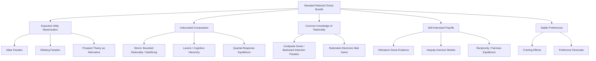

## Critiques of Rational Choice Assumptions

### Overview

Classical game theory rests on a bundle of rationality assumptions: that players have well-defined, complete, and transitive preferences (typically represented by expected utility maximization); that they possess unlimited computational capacity to solve for optimal strategies; and that rationality itself, along with the structure of the game, is common knowledge among all players. Beginning with Allais (1953) and accelerating through the behavioral economics revolution of Kahneman, Tversky, Simon, and others, a substantial body of theoretical and experimental work has challenged each of these assumptions individually and jointly. This chapter surveys the major lines of critique and the alternative frameworks developed in response.

### The Standard Rational Choice Bundle

Before critiquing it, it is useful to isolate the distinct components typically bundled into "rationality" in game-theoretic models:

1. **Preference axioms:** completeness, transitivity, and continuity of preferences, jointly permitting a utility representation.
2. **Expected utility maximization under risk:** the von Neumann–Morgenstern axioms (completeness, transitivity, continuity, and independence), which yield linear-in-probabilities expected utility as the unique representation.
3. **Bayesian updating under uncertainty:** beliefs are represented as probability distributions and updated via Bayes' rule as new information arrives.
4. **Unbounded computation:** players can costlessly compute best responses, solve fixed-point problems (Nash equilibria), and perform unlimited-depth backward induction or iterated elimination.
5. **Common knowledge of rationality and of the game structure:** every player knows the game and knows that all other players are rational, and this is itself commonly known to arbitrary depth.

Each of these five components has been independently challenged.

### Critique 1: Violations of Expected Utility (Allais and Ellsberg Paradoxes)

**The Allais Paradox** demonstrates that people systematically violate the independence axiom of expected utility theory. Consider the following choices:

- **Gamble A:** $\$1{,}000{,}000$ with certainty.
- **Gamble B:** $\$5{,}000{,}000$ with probability $0.10$, $\$1{,}000{,}000$ with probability $0.89$, $\$0$ with probability $0.01$.

Most people prefer A over B. Now consider:

- **Gamble C:** $\$1{,}000{,}000$ with probability $0.11$, $\$0$ with probability $0.89$.
- **Gamble D:** $\$5{,}000{,}000$ with probability $0.10$, $\$0$ with probability $0.90$.

Most people prefer D over C. This combination (A over B, and D over C) is inconsistent with any expected utility representation, since applying the independence axiom to both pairs (which differ only by a common $0.89$-probability component) implies the opposite ranking should hold in both cases simultaneously.

**The Ellsberg Paradox** shows a related violation involving ambiguity (unknown probabilities) rather than risk (known probabilities). People typically prefer bets on urns with known probability distributions over bets on urns with unknown distributions, even when this preference cannot be rationalized by any subjective probability assignment consistent with the Savage axioms — revealing an independent aversion to ambiguity as such, not merely risk.

**Consequence for game theory:** Both paradoxes undermine the descriptive validity of expected utility as the representation of preferences over risky and uncertain outcomes, which is the standard building block for computing payoffs and best responses throughout non-cooperative game theory.

### Critique 2: Prospect Theory as an Alternative Descriptive Model

Kahneman and Tversky's prospect theory (1979) directly responds to the expected utility violations by proposing an alternative functional form built on:

- **Reference dependence:** outcomes are evaluated as gains or losses relative to a reference point, not as final wealth states.
- **Loss aversion:** losses loom larger than equivalent gains, formalized by a value function $v(\cdot)$ that is steeper for losses than gains, typically parameterized as:

$$v(x) = \begin{cases} x^{\alpha} & x \geq 0 \\ -\lambda(-x)^{\beta} & x < 0 \end{cases}$$

with empirical estimates typically placing $\lambda > 1$ (loss aversion) and $\alpha, \beta < 1$ (diminishing sensitivity).

- **Probability weighting:** people do not weight outcomes by objective probabilities but by a nonlinear weighting function $w(p)$ that overweights small probabilities and underweights large/moderate ones, typically S-shaped and inverse-S in the weighting.

Applying prospect theory within game-theoretic models (behavioral game theory) changes predicted equilibrium behavior substantially in domains involving risk, such as auctions, bargaining under uncertainty, and insurance markets, and has generated a distinct subfield of "behavioral game theory."

### Critique 3: Bounded Rationality and Satisficing (Herbert Simon)

Herbert Simon's foundational critique, predating much of behavioral economics, targeted the assumption of unlimited computational capacity directly. Simon argued that real decision-makers face:

- **Limited information-processing capacity:** the cognitive or computational cost of finding a true optimum can be prohibitive, especially in combinatorially large strategy spaces.
- **Limited information availability:** agents often cannot enumerate all possible strategies or fully specify the payoff consequences of each.

Simon proposed **satisficing** — choosing the first option that meets some aspiration-level threshold — as a more descriptively accurate model than optimization. This critique is foundational to the later development of:

- **Level-$k$ and cognitive hierarchy models**, which replace common knowledge of rationality with a distribution over bounded "depths" of iterated reasoning (level-0 players choose non-strategically; level-$k$ players best-respond to a belief that others are level-$(k-1)$).
- **Quantal response equilibrium (QRE)**, developed by McKelvey and Palfrey, which replaces strict best-response with probabilistic choice: players choose better responses more often but not exclusively, formalized via a logit choice rule:

$$P(s_i) = \frac{\exp(\lambda \cdot u_i(s_i, s_{-i}))}{\sum_{s_i' \in S_i} \exp(\lambda \cdot u_i(s_i', s_{-i}))}$$

where $\lambda \geq 0$ is a rationality/precision parameter; $\lambda \to 0$ yields uniformly random choice, and $\lambda \to \infty$ recovers standard best-response (Nash) behavior. QRE has become one of the most empirically successful alternatives to Nash equilibrium for fitting experimental game data.

### Critique 4: Failures of Common Knowledge of Rationality

Beyond the backward-induction-specific issues (Centipede Game, Chain Store Paradox — treated separately elsewhere in this syllabus), a broader critique questions whether common knowledge of rationality is a coherent or realistic assumption at all:

- **Higher-order belief fragility:** common knowledge requires an infinite regress of "I know that you know that I know...," which is both cognitively unrealistic and, in some formal treatments, discontinuous — arbitrarily small perturbations to higher-order beliefs can produce large changes in predicted equilibrium play (Rubinstein's Electronic Mail Game is the canonical demonstration).
- **Rubinstein's Electronic Mail Game:** two players want to coordinate on a joint action that is profitable only if a certain event occurred, but confirmation of the event requires an automated back-and-forth email exchange, each message having a small independent probability of being lost. Even though both players almost always end up with very high-order (though not literally infinite/common) mutual knowledge that the event occurred, the strategy that is theoretically optimal under true common knowledge (coordinate) is not sustained in the actual equilibrium of the model with almost-common knowledge — instead, the equilibrium unravels to the safe, uncoordinated action, illustrating a sharp non-continuity: near-common knowledge does not behave like common knowledge in the limit for this class of games.
- **Empirical implausibility:** experimental subjects rarely perform more than 1–3 levels of iterated reasoning (consistent with level-$k$ findings), casting doubt on models requiring infinite-depth mutual knowledge as a descriptive matter, whatever its usefulness as an idealization.

### Critique 5: Social Preferences and Non-Selfish Utility

Standard game theory typically assumes self-interested (own-payoff-maximizing) preferences. Substantial experimental evidence — especially from ultimatum games, dictator games, trust games, and public goods games — shows systematic deviations consistent with **other-regarding preferences**:

- **Inequity aversion models** (Fehr-Schmidt, Bolton-Ockenfels): utility depends not just on own payoff but on the discrepancy between own and others' payoffs, typically penalizing both disadvantageous and advantageous inequality:

$$U_i = x_i - \alpha_i \max(x_j - x_i, 0) - \beta_i \max(x_i - x_j, 0)$$

where $\alpha_i \geq \beta_i \geq 0$ typically, reflecting greater aversion to disadvantageous than advantageous inequality.

- **Reciprocity models** (Rabin's fairness equilibrium): players respond to perceived kindness or unkindness of others' actions, not merely to final payoff distributions, requiring utility to depend on beliefs about others' intentions, not just outcomes.
- **Ultimatum game evidence:** the subgame perfect equilibrium prediction (proposer offers the smallest possible positive amount, responder accepts anything positive) is robustly violated across cultures — responders frequently reject offers below roughly 20-30% of the pie, and proposers frequently offer substantially more than the equilibrium-minimizing amount, though the exact magnitudes vary considerably by culture, stakes, and experimental framing.

[Inference] Cross-cultural ultimatum game studies (notably the Henrich et al. cross-cultural project) show substantial variation in both offer and rejection thresholds across societies, suggesting social preferences are shaped by cultural norms rather than being a fixed universal parameter — this qualifies, but does not overturn, the general finding that pure own-payoff maximization is a poor descriptive fit.

### Critique 6: Preference Instability and Construction

A further line of critique, associated with Slovic and others, challenges the assumption that preferences pre-exist choice at all, proposing instead that preferences are often **constructed** in the process of choice, contingent on framing, elicitation procedure, and context:

- **Framing effects:** logically equivalent descriptions of the same decision problem (e.g., survival rates vs. mortality rates) produce systematically different choices, violating the "invariance" assumption implicit in treating preferences as well-defined over outcomes independent of description.
- **Preference reversals:** the ranking between two options can flip depending on whether people are asked to choose between them or to price them separately, a finding difficult to reconcile with any single stable underlying utility function.

This critique is more radical than expected-utility-specific critiques (Allais, Ellsberg) because it questions whether the entire framework of "preferences to be revealed or maximized" is the right starting primitive for modeling choice, rather than merely challenging the functional form used to represent those preferences.

### Comparative Summary of Alternative Frameworks

| Assumption Challenged | Alternative Framework | Key Mechanism |
| --- | --- | --- |
| Expected utility (independence axiom) | Prospect theory | Reference dependence, loss aversion, probability weighting |
| Unbounded computation | Level-$k$ / cognitive hierarchy | Finite, distributed depths of iterated reasoning |
| Strict best response | Quantal response equilibrium | Logit-smoothed probabilistic best response |
| Common knowledge of rationality | Epistemic game theory with bounded types | Explicit, possibly heterogeneous, belief hierarchies |
| Self-interested payoffs | Inequity aversion / reciprocity models | Utility depends on relative payoffs or perceived intentions |
| Stable pre-existing preferences | Preference construction / framing models | Preferences elicited, not merely revealed, contingent on context |

### Diagram: Layers of Rationality Assumptions and Corresponding Critiques

### Methodological Implications for Game Theory

These critiques have not displaced classical game theory but have generated a coexisting research program often called **behavioral game theory**, which retains the strategic (interactive, payoff-interdependent) structure of classical models while substituting more descriptively accurate assumptions about individual decision-making at each node. Key methodological consequences include:

- A shift toward treating rationality assumptions as **testable hypotheses** rather than a priori axioms, with structural estimation of behavioral parameters (loss aversion coefficients, quantal response precision $\lambda$, inequity aversion parameters $\alpha, \beta$) from experimental or field data.
- Increasing use of experimental economics as the primary evidentiary base for adjudicating between competing behavioral specifications, given that revealed-preference field data often cannot cleanly separate competing models.
- A parallel, largely unresolved, normative debate: even where classical rationality fails descriptively, many economists and philosophers maintain it retains normative force as a standard of "what an ideally rational agent would do," a position some behavioral economists explicitly reject as unmotivated once systematic descriptive failure is documented.

[Unverified] The relative empirical dominance of any one alternative framework (prospect theory vs. QRE vs. inequity aversion models, etc.) is domain-specific; no single unified framework has achieved consensus status as a full replacement for the classical rational choice bundle across all strategic contexts.

**Related Topics**

- Prospect theory and cumulative prospect theory
- Quantal response equilibrium (McKelvey-Palfrey)
- Level-$k$ and cognitive hierarchy models
- The Centipede Game and the paradox of backward induction
- Rubinstein's Electronic Mail Game and higher-order beliefs
- Inequity aversion (Fehr-Schmidt) and reciprocity (Rabin fairness equilibrium)
- The Ultimatum Game and cross-cultural experimental evidence
- Herbert Simon's bounded rationality and satisficing
- Behavioral game theory as a research program
- Epistemic game theory and interactive epistemology