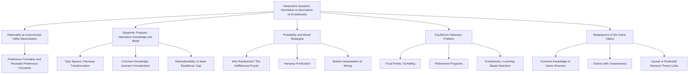

## Philosophical Foundations of Game Theory

### Overview

Beyond its mathematical apparatus, game theory rests on a set of deeper philosophical commitments concerning the nature of rationality, the metaphysics of choice, the epistemology of belief and knowledge among interacting agents, and the normative status of equilibrium concepts. This chapter surveys the foundational philosophical debates that underlie the discipline: what game theory's equilibrium concepts are meant to explain or predict, what "rationality" means as a philosophical primitive, how probability and belief should be understood in strategic contexts, and what the proper interpretation of a "game" as a formal object even is.

### The Interpretive Question: What Is Game Theory a Theory Of?

A foundational and still-unsettled question is what game-theoretic solution concepts are *for*. At least three distinct interpretive stances recur throughout the literature:

- **The normative/eductive interpretation:** Solution concepts like Nash equilibrium describe what perfectly rational agents, reasoning from the common knowledge of the game's structure and each other's rationality, are logically compelled to play. On this view, game theory is a branch of decision logic or formal epistemology, akin to a normative theory of consistent belief and choice under interactive uncertainty.
- **The descriptive/behavioral interpretation:** Solution concepts are empirical hypotheses about how actual human beings (or organizations, or animals) behave in strategic settings, to be tested and revised against experimental and field data — this interpretation is what motivates behavioral game theory and its critiques of the standard rationality bundle.
- **The evolutionary/as-if interpretation:** Equilibrium play emerges not from individual reasoning but from a dynamic selection process (evolutionary game theory, learning dynamics, or market selection) in which agents need not reason their way to equilibrium at all; equilibrium is instead the resting point of an adjustment process, and rationality plays no essential explanatory role, or only a minimal "as-if" role akin to Milton Friedman's methodological instrumentalism in economics generally.

These interpretations are not merely stylistic — they carry different standards of theoretical success. The normative interpretation is judged by logical coherence and derivability from stated axioms (this is the domain where the backward induction paradox and epistemic foundations literature operate); the descriptive interpretation is judged by predictive and explanatory accuracy against data; the evolutionary interpretation is judged by whether the proposed dynamic process is a plausible model of the relevant adjustment mechanism (learning, reproduction, imitation, market entry/exit).

### Rationality as a Philosophical Primitive

Game theory typically operationalizes "rationality" as expected utility maximization given beliefs, but this immediately raises several philosophical questions about what grounds this notion:

- **Instrumental vs. substantive rationality:** The standard game-theoretic notion is purely instrumental — rationality is about consistently pursuing whatever ends/preferences an agent has, taking no stance on whether those ends are themselves reasonable, moral, or wise. This inherits the Humean position that reason is (and ought to be) the "slave of the passions," a substantive philosophical commitment rather than a neutral technical convenience.
- **The problem of preference formation:** Expected utility theory takes preferences as a primitive input, but says nothing about where preferences come from, whether they are stable, or whether an agent can be irrational in having the preferences they have (as opposed to being irrational only in failing to act on them consistently) — a question sharpened by the preference-construction critiques (Slovic, framing effects) discussed elsewhere in this chapter.
- **Revealed preference and circularity concerns:** A long-standing methodological worry, traceable to critiques of Samuelson's revealed preference program, is that if "rationality" is defined merely as "choosing so as to maximize whatever preference ordering is consistent with one's choices," the theory risks becoming empirically empty or circular — unfalsifiable by construction, since any consistent behavior pattern can be redescribed as utility maximization over a suitably gerrymandered utility function. This motivates the demand for *independently specified* utility functions or preference axioms (e.g., stated before observing choices) as a condition for the theory to have genuine empirical content.

### The Epistemic Turn: Games as Objects of Interactive Knowledge

A major development in the philosophical foundations of game theory, especially from the 1990s onward, has been the **epistemic program** (interactive epistemology), associated with Robert Aumann, Adam Brandenburger, Eddie Dekel, and others, which treats the beliefs, knowledge, and higher-order beliefs of players as the primary objects of formal analysis, rather than treating equilibrium concepts as primitive.

- **Type spaces and Harsanyi's transformation:** Harsanyi (1967-68) showed how to represent incomplete information (uncertainty about payoffs or the game itself) using "types" — a formal device encoding each player's beliefs, beliefs about others' beliefs, and so on, converting a game of incomplete information into an equivalent game of complete but imperfect information over a larger state space. This transformation is now the standard technical foundation for Bayesian games.
- **Common knowledge, formally:** Aumann's (1976) formalization defines common knowledge via the "meet" of players' information partitions over a state space $\Omega$: an event $E$ is common knowledge at state $\omega$ if the meet partition cell containing $\omega$ is a subset of $E$. This gives a precise, non-circular definition of the informal "I know that you know that I know..." regress, and underlies the famous **Aumann Agreement Theorem**: two Bayesian agents with the same priors cannot "agree to disagree" — if their posteriors about some event are common knowledge, those posteriors must be equal, even if they observed different private information.
- **Rationalizability as the epistemic foundation of solution concepts:** Bernheim and Pearce independently developed rationalizability, which asks what strategies survive under the weaker (and arguably more epistemically well-founded) assumption of common knowledge of rationality alone, without imposing the additional (and separately questionable) assumption that players correctly anticipate each other's actual strategies, as Nash equilibrium implicitly requires. Rationalizability is generally a weaker solution concept (a superset of Nash equilibria) precisely because it dispenses with the correct-conjectures assumption.
- **The gap between common knowledge of rationality and Nash equilibrium:** A key epistemic-foundations result is that common knowledge of rationality alone justifies rationalizability, not Nash equilibrium — Nash equilibrium additionally requires either that players' conjectures about each other happen to be correct, or some other coordinating device (a focal point, prior communication, or a convention) is invoked. This is a foundational point often underemphasized in introductory treatments: **Nash equilibrium is not simply "what rational players do"; it requires an additional assumption beyond rationality and common knowledge of rationality.**

### Probability, Belief, and the Interpretation of Mixed Strategies

The philosophical status of mixed strategies — where a player randomizes over pure actions according to some probability distribution — has generated substantial debate:

- **The "why would anyone randomize?" puzzle:** At a Nash equilibrium in mixed strategies, each pure strategy in the support yields exactly the same expected payoff, meaning a player is indifferent among them. This raises the question of why a rational agent would bother randomizing rather than simply picking any one of the equally good pure strategies — indifference does not obviously motivate active randomization.
- **Harsanyi's purification theorem:** One influential resolution reinterprets mixed strategies not as literal randomization devices but as the limiting aggregate description of pure-strategy behavior in a game with slightly perturbed, privately known payoffs (a game of incomplete information). Under this reinterpretation, what looks like one player "mixing" is actually the population-level statistical pattern generated by many players, each following a *pure* strategy that depends on their own private payoff perturbation.
- **The "beliefs" interpretation of mixed strategy equilibrium:** An alternative, associated with epistemic game theory, treats a mixed strategy not as a literal randomization by a given player at all, but as encoding the *other* players' subjective uncertainty (belief) about what that player will do — under this interpretation, no one need actually randomize; mixed-strategy equilibrium is a statement about equilibrium beliefs, not equilibrium randomization devices.

### The Problem of Multiple Equilibria and Equilibrium Selection

A long-standing philosophical difficulty is that many games have multiple Nash equilibria, and standard rationality assumptions alone often do not determine which one (if any) will be played — this is the **equilibrium selection problem**, and it raises questions that are as much philosophical as technical:

- **Focal points (Schelling points):** Thomas Schelling's foundational insight was that real players often coordinate on a particular equilibrium not through game-theoretic reasoning about payoffs alone, but via shared cultural, linguistic, or salience-based cues external to the formal payoff structure of the game — raising the philosophical question of whether such solutions are properly "inside" game theory at all, or require importing extra-theoretic sociological or psychological content.
- **Refinement programs and their philosophical status:** The extensive refinement literature (subgame perfection, trembling-hand perfection, sequential equilibrium, proper equilibrium, forward induction criteria) can be understood as a series of attempts to narrow the set of "reasonable" equilibria using ever more demanding rationality-based criteria — but each successive refinement itself imports additional, not always uncontroversial, assumptions about what counts as a reasonable off-path belief, reviving in a different guise the belief-revision problems central to the backward induction paradox.
- **Evolutionary and learning-theoretic equilibrium selection:** An alternative philosophical response abandons the eductive (pure-reasoning) approach to selection altogether, instead asking which equilibria are stable resting points of explicit learning or evolutionary dynamics (replicator dynamics, fictitious play, stochastic best-response dynamics) — shifting the justificatory burden from individual rationality to the properties of a dynamic process operating over historical or evolutionary time.

### Methodological Individualism and the Status of "The Game" as an Object

A more metaphysical line of inquiry concerns what a "game" is taken to represent as an idealized object:

- **Common knowledge of the game structure itself:** Standard game theory typically assumes not only common knowledge of rationality but common knowledge of the *entire game* — the strategy sets, payoffs, and information structure. This is itself a strong idealization, and its philosophical defense (or lack thereof) is distinct from the rationality assumptions per se; relaxing it motivates games of incomplete information and, more radically, "games with unawareness," where players may not even conceive of certain strategies or contingencies (a research area associated with Heifetz, Meier, and Schipper, among others).
- **The individuation of strategies and payoffs:** Philosophical work on decision theory (e.g., debates over causal versus evidential decision theory, prominent in the Newcomb's Problem literature) has direct bearing on game theory's treatment of what a "rational" response to another player's (possibly correlated) strategy should be, particularly in settings involving correlated equilibrium or agents who model each other as potentially predicting their own choices.

### Diagram: The Layered Philosophical Structure of Game-Theoretic Foundations

### The Aumann Agreement Theorem (Formal Statement)

As a representative example of the epistemic program's rigor, the Aumann Agreement Theorem can be stated as follows. Let two agents share a common prior $P$ over a state space $\Omega$, with information partitions $\Pi_1, \Pi_2$. If, at some state $\omega$, it is common knowledge that agent $1$'s posterior for event $E$ is $q_1$ and agent $2$'s posterior for $E$ is $q_2$, then:

$$q_1 = q_2$$

The proof relies on the fact that common knowledge of the posteriors implies both posteriors are constant across every state in the common-knowledge event, and a common prior together with this constancy forces equality. The theorem is often summarized as "agents with common priors cannot agree to disagree," and it has generated its own philosophical literature questioning the plausibility of the common prior assumption itself, since without a shared prior, the theorem's striking conclusion no longer follows — placing significant weight on an assumption (common priors) that is itself philosophically contestable as a description of real agents with potentially different fundamental worldviews rather than merely different information.

### Contemporary Directions

The philosophical foundations literature remains an active area, with continuing work on:

- Formal treatments of **unawareness** and games where the very state space or strategy space is not common knowledge, going beyond incomplete information (uncertainty about payoffs) to genuine conceptual limitations on what players can even entertain as possibilities.
- The relationship between **causal decision theory, evidential decision theory, and correlated/coordinated equilibrium concepts**, particularly in settings involving prediction, commitment, and self-locating uncertainty.
- Renewed philosophical engagement with **behavioral and neuroeconomic evidence** as bearing on whether the normative rationality benchmark itself should be revised, rather than merely supplemented with descriptive alternatives (connecting back to the critiques of rational choice assumptions discussed elsewhere in this chapter).

[Unverified] The relative philosophical consensus (or lack thereof) on questions like the correct interpretation of mixed strategies, or whether common knowledge assumptions are ultimately dispensable, continues to be actively contested in the philosophy of economics and formal epistemology literatures; no single resolution commands universal agreement among specialists.

**Related Topics**

- Epistemic game theory and interactive epistemology
- Rationalizability (Bernheim-Pearce) and its relation to Nash equilibrium
- The Aumann Agreement Theorem and common priors
- Harsanyi's purification theorem and the interpretation of mixed strategies
- The paradox of backward induction and epistemic consistency
- Games with unawareness
- Causal versus evidential decision theory and Newcomb's Problem
- Schelling points and focal-point equilibrium selection
- Evolutionary game theory as an alternative to eductive rationality
- Critiques of rational choice assumptions