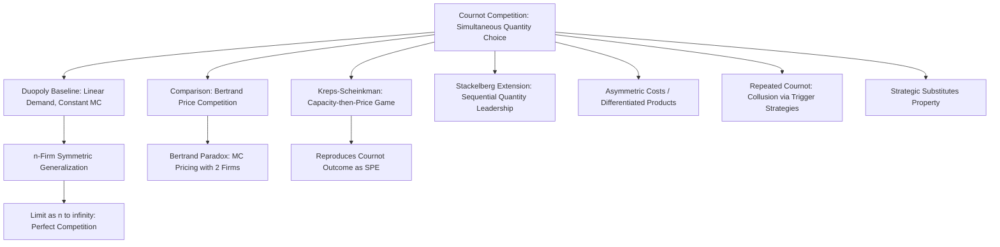

## Cournot Competition

### Overview

Cournot competition, introduced by Antoine Augustin Cournot in 1838, is the foundational model of oligopoly in which firms compete by simultaneously and independently choosing **quantities** to produce, with the market price determined afterward by the aggregate quantity supplied via an inverse demand function. It is one of the earliest applications of what would later be formalized as Nash equilibrium — indeed, the Cournot equilibrium concept predates Nash's general framework by over a century and is often cited as its historical precursor.

### Basic Setup

Consider $n$ firms producing a homogeneous good. Each firm $i$ chooses a quantity $q_i \geq 0$ simultaneously and independently. Let $Q = \sum_{i=1}^{n} q_i$ denote total industry output. The market price is determined by an inverse demand function:

$$P(Q) = a - bQ$$

for constants $a, b > 0$, where $a$ represents the choke price (price at which quantity demanded falls to zero) and $b$ represents the slope of demand.

Each firm has a cost function $C_i(q_i)$, commonly assumed linear for the baseline model:

$$C_i(q_i) = c_i q_i$$

where $c_i \geq 0$ is firm $i$'s constant marginal cost.

**Firm $i$'s profit function:**

$$\pi_i(q_i, q_{-i}) = P(Q) \cdot q_i - C_i(q_i) = \left(a - b\left(q_i + \sum_{j \neq i} q_j\right)\right) q_i - c_i q_i$$

### The Duopoly Case (Symmetric Costs)

The clearest exposition uses two firms with identical marginal cost $c$. Firm 1's profit is:

$$\pi_1(q_1, q_2) = (a - b(q_1 + q_2))q_1 - c q_1$$

**First-order condition** (maximizing over $q_1$, treating $q_2$ as given):

$$\frac{\partial \pi_1}{\partial q_1} = a - 2bq_1 - bq_2 - c = 0$$

Solving for $q_1$ yields Firm 1's **best response function**:

$$q_1^*(q_2) = \frac{a - c - bq_2}{2b}$$

By symmetry, Firm 2's best response function is:

$$q_2^*(q_1) = \frac{a - c - bq_1}{2b}$$

**Solving the system simultaneously** (substituting one into the other) gives the Cournot-Nash equilibrium:

$$q_1^* = q_2^* = \frac{a - c}{3b}$$

**Equilibrium industry output:**

$$Q^* = q_1^* + q_2^* = \frac{2(a-c)}{3b}$$

**Equilibrium price:**

$$P^* = a - bQ^* = a - \frac{2(a-c)}{3} = \frac{a + 2c}{3}$$

**Equilibrium profit per firm:**

$$\pi_i^* = (P^* - c) q_i^* = \frac{(a-c)^2}{9b}$$

### Best Response Functions Diagram

<svg xmlns="http://www.w3.org/2000/svg" viewBox="0 0 500 500" font-family="Arial, sans-serif" font-size="14">
<title>Cournot Duopoly Best Response Functions (svg_diagram)</title>
<line x1="60" y1="440" x2="460" y2="440" stroke="#333" stroke-width="2" />
<line x1="60" y1="440" x2="60" y2="40" stroke="#333" stroke-width="2" />
<text x="440" y="460" fill="#333">q1</text>
<text x="30" y="50" fill="#333">q2</text>
<line x1="60" y1="60" x2="440" y2="420" stroke="#2266cc" stroke-width="2" />
<text x="360" y="400" fill="#2266cc">BR1(q2)</text>
<line x1="80" y1="420" x2="440" y2="80" stroke="#cc4422" stroke-width="2" />
<text x="360" y="100" fill="#cc4422">BR2(q1)</text>
<circle cx="260" cy="250" r="6" fill="#000" />
<text x="270" y="245" fill="#000">Cournot-Nash Equilibrium</text>
<text x="270" y="265" fill="#000">(q1*, q2*)</text>
</svg>

### General $n$-Firm Symmetric Case

With $n$ symmetric firms (identical marginal cost $c$), the same first-order condition approach generalizes. Each firm's best response, given that all other firms collectively produce $Q_{-i} = \sum_{j \neq i} q_j$, is:

$$q_i^*(Q_{-i}) = \frac{a - c - bQ_{-i}}{2b}$$

Imposing symmetry ($q_i = q^*$ for all $i$) and solving:

$$q^* = \frac{a-c}{b(n+1)}$$

$$Q^* = \frac{n(a-c)}{b(n+1)}$$

$$P^* = a - bQ^* = \frac{a + nc}{n+1}$$

$$\pi_i^* = \frac{(a-c)^2}{b(n+1)^2}$$

**Key asymptotic property:** As $n \to \infty$, $P^* \to c$ and industry output $Q^* \to \frac{a-c}{b}$, which is exactly the competitive (perfectly competitive) market outcome. This formalizes the intuition that Cournot oligopoly interpolates continuously between monopoly ($n=1$) and perfect competition ($n \to \infty$), providing one of the most cited theoretical bridges between market structure and competitive intensity.

### Comparison Table: Market Structures as Special Cases

| Structure | $n$ | Industry Output $Q^*$ | Price $P^*$ | Markup over Cost |
| --- | --- | --- | --- | --- |
| Monopoly | $1$ | $\frac{a-c}{2b}$ | $\frac{a+c}{2}$ | $\frac{a-c}{2}$ |
| Cournot Duopoly | $2$ | $\frac{2(a-c)}{3b}$ | $\frac{a+2c}{3}$ | $\frac{a-c}{3}$ |
| Cournot Oligopoly | $n$ | $\frac{n(a-c)}{b(n+1)}$ | $\frac{a+nc}{n+1}$ | $\frac{a-c}{n+1}$ |
| Perfect Competition | $n \to \infty$ | $\frac{a-c}{b}$ | $c$ | $0$ |

### Existence and Uniqueness

For the linear demand and cost specification, existence and uniqueness of the Cournot-Nash equilibrium follow directly from the best-response functions being affine, downward-sloping, and having a unique fixed point. More generally, for convex cost functions and concave (or not-too-convex) inverse demand, existence follows from standard fixed-point arguments (Kakutani/Brouwer applied to the best-response correspondence over compact, convex strategy sets), and uniqueness typically requires additional regularity conditions on the slope of best responses (a standard sufficient condition being that each firm's marginal revenue is decreasing sufficiently steeply in rivals' output — related to the requirement that reaction functions have slope with absolute value less than $1$).

[Inference] For more general (non-linear) demand and cost specifications, uniqueness of the Cournot equilibrium is not guaranteed and multiple equilibria can arise; this is a standard caveat in the industrial organization literature rather than a settled universal result.

### Comparison with Bertrand Competition

Cournot competition is frequently contrasted with **Bertrand competition**, in which firms instead choose **prices** simultaneously, with quantity demanded allocated to the lowest-price firm(s). The stark divergence in predictions between the two models — Cournot yields positive markups over marginal cost even in duopoly, while Bertrand with homogeneous goods and constant marginal costs collapses to marginal-cost pricing with just two firms (the "Bertrand paradox") — has generated substantial literature on which model better describes real-world oligopoly, with the general resolution being that the appropriate model depends on the underlying competitive process: Cournot is generally considered more suitable when firms make capacity or production commitments in advance of price competition (formalized rigorously by the Kreps-Scheinkman result showing that two-stage capacity-then-price games reduce to Cournot outcomes under efficient rationing), while Bertrand is more suitable when firms can adjust prices essentially instantaneously relative to the frequency of demand realization.

### The Kreps-Scheinkman Reconciliation

Kreps and Scheinkman (1983) provided an influential theoretical bridge between the two models by analyzing a two-stage game: in stage one, firms simultaneously choose production capacities; in stage two, having observed capacities, firms compete in prices (Bertrand-style) subject to their capacity constraints, with unmet demand rationed efficiently. The key result is that the unique subgame perfect equilibrium of this two-stage game reproduces exactly the Cournot quantity outcome, providing a price-competition microfoundation for the Cournot model's quantity-setting assumption, which had previously been criticized as an unmotivated primitive (why would firms literally choose quantities rather than prices, which are the natural strategic variable in most real markets?).

[Inference] The Kreps-Scheinkman result is sensitive to the specific rationing rule assumed for unmet demand (efficient rationing); alternative rationing rules can yield different reconciliations between the capacity-price game and Cournot outcomes, a qualification frequently noted in subsequent industrial organization literature.

### Extensions

- **Cournot with differentiated products:** Replacing the homogeneous-good inverse demand with a system of differentiated inverse demands $P_i(q_i, q_{-i})$ (e.g., linear differentiated demand systems common in IO textbooks) allows analysis of imperfect substitutes, generally yielding a family of equilibria that vary continuously with the degree of product differentiation.
- **Cournot with asymmetric costs:** Relaxing $c_i = c_j$ allows analysis of cost-asymmetric oligopolies; lower-cost firms produce more and earn higher equilibrium profit, and the comparative statics of cost changes on rivals' outputs (strategic substitutes) are a standard application.
- **Stackelberg extension:** Converting the simultaneous-move Cournot game into a sequential one, where a leader firm commits to quantity first and a follower best-responds, yields the Stackelberg model — the leader's first-mover advantage results in higher output and profit for the leader and lower output and profit for the follower relative to the simultaneous Cournot outcome, a canonical application of subgame perfection to quantity competition.
- **Cournot with conjectural variations:** An older (largely superseded) approach parameterizing firms' beliefs about how rivals will respond to their own quantity changes, nesting Cournot ($\text{conjecture} = 0$), competitive ($\text{conjecture} = -1$), and collusive (joint-profit-maximizing, $\text{conjecture} = 1$) outcomes as special cases of a single parameter; criticized for lacking a fully consistent game-theoretic (Nash) foundation, since a "conjecture" about rivals' reactions is not itself required to be correct in equilibrium in the way Nash equilibrium demands.
- **Dynamic and repeated Cournot games:** Analysis of collusion sustainability in infinitely repeated Cournot settings, using trigger strategies and folk theorem logic to characterize when tacit or explicit output-restriction collusion can be sustained as a subgame perfect equilibrium given sufficiently patient firms (discount factor above a threshold).

### Strategic Substitutes Property

A defining structural feature of Cournot competition is that quantities are **strategic substitutes**: each firm's best response function is downward-sloping in rivals' quantity ($\partial q_i^*/\partial q_j < 0$), meaning an increase in one firm's output induces optimal contraction by rivals. This property (formalized generally by Bulow, Geanakoplos, and Klemperer's taxonomy of strategic complements/substitutes based on the sign of cross-partial derivatives of payoff functions) has broad implications:

$$\frac{\partial^2 \pi_i}{\partial q_i \, \partial q_j} < 0 \quad \Rightarrow \quad \text{quantities are strategic substitutes}$$

This contrasts with Bertrand price competition with differentiated products, where prices are typically **strategic complements** ($\partial p_i^*/\partial p_j > 0$), a distinction with significant consequences for comparative statics regarding entry, mergers, and cost shocks — under strategic substitutes, an aggressive move by one firm induces a passive response by rivals, while under strategic complements, aggressive and passive moves tend to be mutually reinforcing across firms.

### Diagram: Cournot Model Structure and Extensions

### Empirical and Policy Relevance

The Cournot model remains the workhorse for empirical industrial organization analysis of oligopolistic industries, particularly:

- **Merger simulation:** predicting post-merger price and output effects using calibrated Cournot (or Cournot-differentiated) models is standard practice in antitrust economic analysis.
- **Market concentration measures:** the equilibrium markup formula $\frac{P^* - c}{P^*} = \frac{1}{n+1} \cdot \frac{1}{\epsilon}$ (where $\epsilon$ is the elasticity of demand) directly links the Herfindahl-Hirschman Index-style concentration intuition to the Cournot model's predicted markup, providing a widely used theoretical justification for concentration-based antitrust screening.

[Inference] The empirical fit of Cournot-style markup formulas to real industry price-cost margins varies substantially by industry and depends heavily on correctly specifying marginal costs and demand elasticities, which are themselves estimated with uncertainty in applied work — the theoretical formula is exact within the model, but its real-world empirical performance is an active applied research question rather than a settled fact.

**Related Topics**

- Bertrand competition and the Bertrand paradox
- Stackelberg leadership and sequential quantity competition
- The Kreps-Scheinkman capacity-price reconciliation
- Strategic substitutes vs. strategic complements (Bulow-Geanakoplos-Klemperer)
- Collusion and repeated Cournot games (folk theorems in oligopoly)
- Merger simulation and antitrust applications of oligopoly models
- Product differentiation models (Hotelling, Salop circular city)
- Monopoly and perfect competition as limiting cases