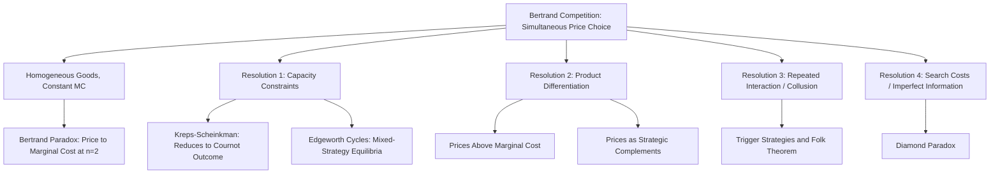

## Bertrand Competition

### Overview

Bertrand competition, introduced by Joseph Bertrand in 1883 as a critique of Cournot's quantity-setting model, is the oligopoly model in which firms compete by simultaneously and independently choosing **prices**, with consumers purchasing from whichever firm offers the lowest price. Despite its structural similarity to Cournot competition — same demand, same costs, same simultaneous-move timing — Bertrand competition produces starkly different equilibrium predictions, most famously the **Bertrand paradox**: with homogeneous goods and constant marginal costs, just two firms are sufficient to drive price down to marginal cost, replicating the perfectly competitive outcome.

### Basic Setup: Homogeneous Goods

Consider $n$ firms producing a perfectly homogeneous good, each with constant marginal cost $c$. Firms simultaneously and independently set prices $p_1, p_2, \ldots, p_n$. Consumers have full information and buy entirely from the lowest-priced firm(s); if multiple firms tie at the lowest price, they typically split demand equally (the standard tie-breaking convention).

Market demand at the lowest price is given by $D(p_{\min})$, where $p_{\min} = \min_i p_i$.

**Demand facing firm $i$:**

$$D_i(p_i, p_{-i}) = \begin{cases} D(p_i) & \text{if } p_i < \min_{j \neq i} p_j \\ \dfrac{D(p_i)}{k} & \text{if } p_i = \min_{j \neq i} p_j \text{ (tied among } k \text{ firms)} \\ 0 & \text{if } p_i > \min_{j \neq i} p_j \end{cases}$$

### The Bertrand Paradox (Duopoly, $n=2$)

**Claim:** The unique Nash equilibrium is $p_1^* = p_2^* = c$, with each firm earning zero economic profit.

**Proof sketch by contradiction:**

- Suppose both firms set $p_1 = p_2 = p > c$. Either firm could deviate to $p - \varepsilon$ for arbitrarily small $\varepsilon > 0$, capturing the *entire* market demand at a price still above marginal cost, strictly increasing profit. So any common price above $c$ cannot be an equilibrium.
- Suppose $p_1 \neq p_2$ with both above $c$, say $p_1 < p_2$. Firm 1 captures all demand, but Firm 2 earns zero. Firm 2 could undercut Firm 1 slightly (set $p_2' = p_1 - \varepsilon$, still above $c$) and capture the whole market, strictly increasing its own profit from zero — so this cannot be an equilibrium either.
- Suppose either price is below $c$. Whichever firm sells at a price below $c$ earns negative profit on every unit sold, and could improve by raising price (either to exit the low-price role, if losing the whole market yields zero profit which exceeds negative profit; or if it still wins, raising price toward but below $c$ reduces losses). So no price below $c$ survives either.
- The only price surviving all deviations is $p_1 = p_2 = c$: neither firm can profitably undercut, since any price below $c$ yields negative profit and any price above $c$ hands all demand to the rival at (weakly) zero profit anyway.

**Equilibrium outcome:**

$$p_1^* = p_2^* = c, \qquad \pi_1^* = \pi_2^* = 0$$

This result generalizes to any $n \geq 2$ symmetric firms with homogeneous goods and constant marginal cost: price collapses to marginal cost with just **two** competitors, regardless of how many additional firms enter — a sharp discontinuity from monopoly ($n=1$, price above cost) to competitive pricing ($n \geq 2$), in stark contrast to Cournot competition's smooth, continuous convergence to the competitive outcome only in the limit as $n \to \infty$.

### Why "Paradox"? Contrast with Cournot

| Feature | Cournot (Quantity Competition) | Bertrand (Price Competition) |
| --- | --- | --- |
| Strategic variable | Quantity $q_i$ | Price $p_i$ |
| Duopoly equilibrium price | $\frac{a+2c}{3} > c$ | $c$ |
| Duopoly equilibrium profit | Positive $\left(\frac{(a-c)^2}{9b}\right)$ | Zero |
| Convergence to competitive outcome | Gradual, as $n \to \infty$ | Immediate, at $n = 2$ |
| Strategic variable classification | Strategic substitutes | Strategic complements (differentiated case) |

The "paradox" label reflects the empirical implausibility of the prediction: real-world duopolies routinely earn substantial positive profits, yet the Bertrand model — using the same underlying demand and cost primitives as Cournot, differing only in the choice of strategic variable — predicts perfectly competitive outcomes with just two firms. This sharp divergence motivated decades of work identifying which of the model's stark assumptions are responsible, and how relaxing each one restores more economically plausible predictions.

### Resolutions of the Bertrand Paradox

Several distinct model modifications are standard responses, each targeting a specific unrealistic assumption in the baseline setup:

- **Capacity constraints (Edgeworth / Kreps-Scheinkman):** If firms face binding capacity limits, a firm cannot always profitably undercut, because it may be unable to serve all resulting demand — this reintroduces positive equilibrium prices and, in the two-stage capacity-then-price formalization of Kreps and Scheinkman (1983), the subgame perfect equilibrium of the resulting game exactly reproduces the Cournot outcome, providing a price-competition microfoundation for Cournot behavior.
- **Product differentiation:** If goods are imperfect substitutes rather than perfectly homogeneous, consumers do not switch entirely to the lowest-priced firm for any price difference, softening price competition. This is typically modeled via a differentiated demand system, e.g., for two firms:

$$D_1(p_1, p_2) = a - p_1 + \gamma p_2$$

where $\gamma > 0$ parameterizes the degree of substitutability. Solving the resulting simultaneous first-order conditions yields equilibrium prices strictly above marginal cost, restoring positive markups and profits, and giving prices the character of **strategic complements** ($\partial p_1^*/\partial p_2 > 0$): a competitor raising price makes it optimal to raise one's own price as well, the opposite comparative-static direction from the strategic substitutes property of Cournot quantities.

- **Repeated interaction and collusion:** In an infinitely (or indefinitely) repeated Bertrand game, trigger strategies (reverting to marginal-cost pricing forever following any deviation) can sustain collusive, above-marginal-cost pricing as a subgane perfect equilibrium provided firms are sufficiently patient (discount factor above a threshold determined by the one-shot deviation temptation versus the discounted value of continued collusion) — this is a direct application of the folk theorem to price-setting oligopoly.
- **Search costs and imperfect information:** If consumers face costs to discover and compare prices across firms (Diamond's search-cost paradox and related models), even homogeneous-good Bertrand competition can sustain prices above marginal cost in equilibrium, since firms exploit the fact that not every consumer will costlessly find the lowest-priced seller.
- **Capacity-constrained mixed-strategy equilibria (Edgeworth cycles):** Even without a two-stage capacity-then-price structure, static Bertrand-Edgeworth models with binding capacity constraints often fail to have a pure-strategy equilibrium at all, instead requiring **mixed-strategy** equilibria in which firms randomize over prices in some interval above marginal cost — this randomization behavior is also observed empirically in some markets as cyclical price patterns ("Edgeworth cycles"), notably in retail gasoline pricing studies.

### Differentiated Bertrand Duopoly: Full Solution

For linear differentiated demand $D_i = a - p_i + \gamma p_j$ (with $0 < \gamma < 1$ ensuring goods are substitutes but not perfect substitutes) and constant marginal cost $c$, Firm 1's profit is:

$$\pi_1(p_1, p_2) = (p_1 - c)(a - p_1 + \gamma p_2)$$

**First-order condition:**

$$\frac{\partial \pi_1}{\partial p_1} = a - 2p_1 + \gamma p_2 + c = 0$$

**Best response function:**

$$p_1^*(p_2) = \frac{a + c + \gamma p_2}{2}$$

By symmetry, solving the system simultaneously:

$$p^* = \frac{a+c}{2-\gamma}$$

**Comparative statics:** As $\gamma \to 0$ (goods become independent), $p^* \to \frac{a+c}{2}$, the monopoly-like price each firm would set facing its own isolated demand. As $\gamma \to 1$ (goods become near-perfect substitutes), $p^* \to a + c$ divided appropriately in the limiting homogeneous-good specification, and the model approaches — though the precise limiting behavior requires care — the Bertrand paradox outcome of price competed down toward cost, illustrating that differentiation is what sustains the markup, and the paradox re-emerges continuously as differentiation vanishes.

### Best Response Functions Diagram (Differentiated Bertrand)

<svg xmlns="http://www.w3.org/2000/svg" viewBox="0 0 500 500" font-family="Arial, sans-serif" font-size="14">
<title>Differentiated Bertrand Duopoly Best Responses (svg_diagram)</title>
<line x1="60" y1="440" x2="460" y2="440" stroke="#333" stroke-width="2" />
<line x1="60" y1="440" x2="60" y2="40" stroke="#333" stroke-width="2" />
<text x="440" y="460" fill="#333">p1</text>
<text x="30" y="50" fill="#333">p2</text>
<line x1="120" y1="400" x2="400" y2="120" stroke="#2266cc" stroke-width="2" transform="rotate(0)" />
<text x="340" y="140" fill="#2266cc">BR1(p2), upward-sloping</text>
<line x1="100" y1="420" x2="420" y2="100" stroke="#cc4422" stroke-width="2" />
<text x="340" y="400" fill="#cc4422">BR2(p1), upward-sloping</text>
<circle cx="260" cy="260" r="6" fill="#000" />
<text x="270" y="255" fill="#000">Bertrand-Nash Equilibrium</text>
<text x="270" y="275" fill="#000">(p*, p*), p* &gt; c</text>
</svg>

*Note: unlike the Cournot best-response diagram (downward-sloping reaction curves reflecting strategic substitutes), differentiated Bertrand best responses slope upward, reflecting strategic complementarity in prices.*

### Diagram: Bertrand Model Structure and Resolutions

### Strategic Complements Property

A defining structural feature of differentiated Bertrand competition is that prices are **strategic complements**: best response functions slope upward ($\partial p_i^*/\partial p_j > 0$), so an increase in a rival's price makes it optimal to raise one's own price as well.

$$\frac{\partial^2 \pi_i}{\partial p_i \, \partial p_j} > 0 \quad \Rightarrow \quad \text{prices are strategic complements}$$

This has significant implications distinct from Cournot's strategic substitutes property (per the Bulow-Geanakoplos-Klemperer taxonomy): under strategic complements, competitive responses tend to reinforce each other (a cost shock raising one firm's price tends to raise rivals' prices too, amplifying the effect through the pricing game), whereas under strategic substitutes, responses tend to offset each other.

### Empirical and Policy Relevance

- **Choice of oligopoly model in applied work:** Applied industrial organization work must choose between Cournot-style and Bertrand-style (typically differentiated) demand systems when modeling a specific industry; the choice is generally guided by whether firms compete primarily via advance production/capacity decisions (favoring Cournot) or can adjust prices flexibly and frequently relative to the relevant demand/cost shocks (favoring Bertrand), as formalized by the Kreps-Scheinkman reconciliation.
- **Merger simulation with differentiated Bertrand demand systems:** Discrete choice demand models (e.g., logit, nested logit) combined with differentiated Bertrand pricing form the standard modern toolkit (associated with Berry, Levinsohn, and Pakes-style estimation) for simulating post-merger price effects in antitrust analysis, particularly in markets with clearly differentiated branded products (automobiles, consumer packaged goods, airlines).
- **Retail gasoline and Edgeworth cycles:** Empirical studies of retail gasoline markets in various countries have documented price patterns consistent with theoretical Edgeworth-cycle dynamics — a sawtooth pattern of gradual price increases followed by sharp undercutting-driven collapses — offering some of the more direct empirical support for the mixed-strategy Bertrand-Edgeworth theoretical prediction.

[Inference] The applicability of specific Edgeworth-cycle empirical findings is generally most robust in retail fuel markets with relatively frequent price adjustment and easily observable rival prices; extrapolating the same dynamic to markets with less frequent or less transparent pricing is a matter of ongoing empirical investigation rather than an established general regularity.

**Related Topics**

- Cournot competition and the quantity-price duopoly contrast
- The Kreps-Scheinkman capacity-price reconciliation
- Strategic complements vs. strategic substitutes (Bulow-Geanakoplos-Klemperer)
- Product differentiation models (Hotelling, Salop circular city, logit demand)
- Edgeworth cycles and empirical retail pricing dynamics
- Collusion and repeated Bertrand games (folk theorems in oligopoly)
- Search-cost models and the Diamond paradox
- Merger simulation using differentiated demand systems