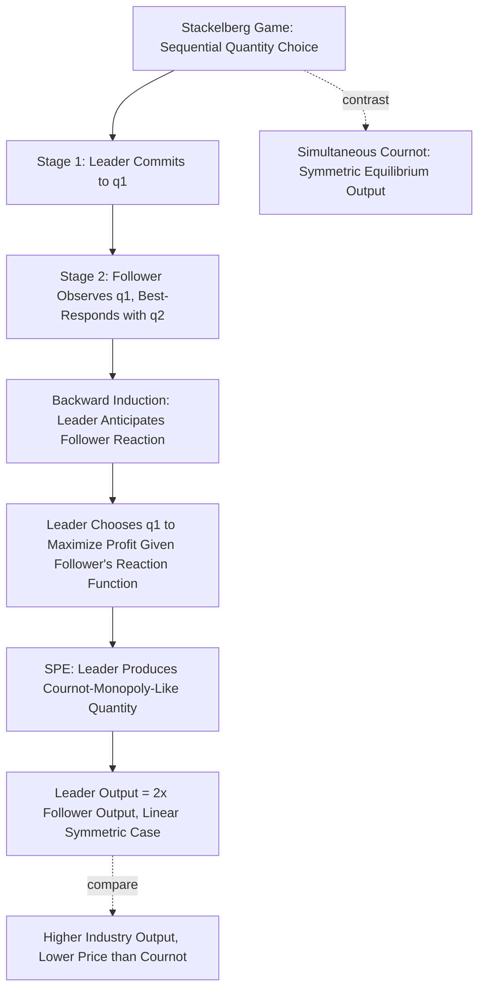

## Stackelberg Leadership Model

### Overview

The Stackelberg leadership model, introduced by Heinrich von Stackelberg in 1934, converts the simultaneous-move Cournot quantity-setting game into a **sequential** game: one firm (the leader) commits to a quantity first, and observing this commitment, a second firm (the follower) chooses its own quantity in response. The model is a canonical application of subgame perfect equilibrium and backward induction to oligopoly theory, and it demonstrates a robust **first-mover advantage**: the leader's ability to commit before the follower moves strictly increases the leader's equilibrium output and profit relative to the simultaneous Cournot outcome, at the follower's expense.

### Basic Setup

Two firms produce a homogeneous good with inverse demand:

$$P(Q) = a - bQ, \qquad Q = q_1 + q_2$$

Both firms have constant marginal cost $c$. The timing is sequential:

1. **Stage 1:** Firm 1 (the leader) publicly and irrevocably chooses $q_1 \geq 0$.
2. **Stage 2:** Firm 2 (the follower), having observed $q_1$, chooses $q_2 \geq 0$.

The solution concept is **subgame perfect equilibrium**, solved by backward induction.

### Step 1: The Follower's Best Response

Since Firm 2 moves second and observes $q_1$, Firm 2 simply solves the same profit maximization problem as in the static Cournot game, treating $q_1$ as a fixed parameter:

$$\pi_2(q_1, q_2) = (a - b(q_1+q_2) - c)q_2$$

**First-order condition:**

$$\frac{\partial \pi_2}{\partial q_2} = a - bq_1 - 2bq_2 - c = 0$$

**Follower's best response function** (identical in form to the Cournot best response, since Firm 2's stage-2 problem is mathematically the same optimization):

$$q_2^*(q_1) = \frac{a - c - bq_1}{2b}$$

### Step 2: The Leader's Optimal Commitment

The key strategic insight of the Stackelberg model is that Firm 1, moving first, does not take $q_2$ as fixed — it **anticipates** and internalizes Firm 2's best response function when choosing $q_1$. Firm 1 solves:

$$\pi_1(q_1) = \left(a - b\left(q_1 + q_2^*(q_1)\right) - c\right) q_1$$

Substituting the follower's best response:

$$\pi_1(q_1) = \left(a - bq_1 - b\cdot\frac{a-c-bq_1}{2b} - c\right)q_1 = \left(\frac{a-c-bq_1}{2}\right)q_1$$

**First-order condition:**

$$\frac{d\pi_1}{dq_1} = \frac{a-c}{2} - bq_1 = 0$$

**Leader's equilibrium quantity:**

$$q_1^{S} = \frac{a-c}{2b}$$

Note this is exactly the **monopoly quantity** for the residual-demand problem — the leader effectively behaves as if it were choosing output to maximize profit against a known, correctly anticipated follower reaction, which mathematically resembles a monopolist facing demand with intercept halved by the follower's reaction.

### Step 3: Follower's Equilibrium Quantity

Substituting $q_1^S$ into the follower's best response:

$$q_2^{S} = \frac{a - c - b \cdot \frac{a-c}{2b}}{2b} = \frac{a-c}{4b}$$

### Full Equilibrium Summary

$$q_1^S = \frac{a-c}{2b}, \qquad q_2^S = \frac{a-c}{4b}$$

$$Q^S = q_1^S + q_2^S = \frac{3(a-c)}{4b}$$

$$P^S = a - bQ^S = a - \frac{3(a-c)}{4} = \frac{a+3c}{4}$$

**Equilibrium profits:**

$$\pi_1^S = (P^S - c)q_1^S = \frac{(a-c)^2}{8b}, \qquad \pi_2^S = (P^S-c)q_2^S = \frac{(a-c)^2}{16b}$$

### Comparison Table: Stackelberg vs. Cournot

| Quantity/Profit | Cournot (Simultaneous) | Stackelberg Leader | Stackelberg Follower |
| --- | --- | --- | --- |
| Individual output | $\frac{a-c}{3b}$ | $\frac{a-c}{2b}$ | $\frac{a-c}{4b}$ |
| Industry output $Q$ | $\frac{2(a-c)}{3b}$ | $\frac{3(a-c)}{4b}$ | (same total) |
| Price | $\frac{a+2c}{3}$ | $\frac{a+3c}{4}$ | (same price) |
| Individual profit | $\frac{(a-c)^2}{9b}$ | $\frac{(a-c)^2}{8b}$ | $\frac{(a-c)^2}{16b}$ |

**Key relationships confirmed by these formulas:**

$$q_1^S > q_2^S, \qquad \pi_1^S > \pi_2^S, \qquad Q^S > Q^{\text{Cournot}}, \qquad P^S < P^{\text{Cournot}}$$

The leader produces exactly **twice** the follower's output ($q_1^S = 2q_2^S$), a distinctive and easily-remembered feature of the linear-demand, symmetric-cost Stackelberg solution. Industry output is higher and price is lower than under simultaneous Cournot competition, meaning **consumers are weakly better off** under Stackelberg leadership than under Cournot, even though the leader firm itself is strictly better off than under Cournot — a useful illustration that first-mover advantage for one firm need not come at the expense of overall market efficiency relative to the simultaneous benchmark.

### Why the Leader Benefits: The Commitment Value

The formal source of the leader's advantage is the **strategic substitutability** of quantities (as in the underlying Cournot game): since $\partial q_2^*/\partial q_1 < 0$, the leader recognizes that committing to a higher $q_1$ than the Cournot level will induce the follower to optimally *contract* its own output in response. This lets the leader effectively "buy" a larger share of the market by moving first and credibly foreclosing part of the demand the follower would otherwise have captured.

This is a clean illustration of the general principle that **the value of commitment depends on the strategic nature of the game**: first-mover advantage of this kind (an aggressive, capacity-expanding commitment that induces a passive rival response) arises specifically because the underlying stage game exhibits strategic substitutes. In games with strategic complements (e.g., differentiated Bertrand price competition), an analogous "Stackelberg leadership" analysis instead tends to produce a **first-mover disadvantage** in certain specifications, since committing to a high price would induce the follower to also set a high price, but the follower's best-response increase does not benefit the leader the way a Cournot follower's *contraction* does — the qualitative direction of the first-mover effect is not a universal property of sequential games but depends on the sign of the cross-partial (strategic substitutes vs. complements).

[Inference] The reversal of first-mover advantage/disadvantage across strategic substitutes and strategic complements settings is a standard result in the sequential-games literature (associated with Gal-Or's analysis of Stackelberg leadership under different demand/cost configurations), though the exact conditions can be sensitive to the specific functional forms of demand and cost used.

### Extensive Form Diagram

<svg xmlns="http://www.w3.org/2000/svg" viewBox="0 0 640 360" font-family="Arial, sans-serif" font-size="14">
<title>Stackelberg Duopoly Extensive Form (svg_diagram)</title>
<circle cx="320" cy="40" r="6" fill="#333" />
<text x="335" y="35" fill="#333">Firm 1 (Leader) chooses q1</text>
<line x1="320" y1="40" x2="150" y2="150" stroke="#333" stroke-width="2" />
<line x1="320" y1="40" x2="490" y2="150" stroke="#333" stroke-width="2" />
<text x="130" y="140" fill="#333">q1 = low</text>
<text x="480" y="140" fill="#333">q1 = high</text>
<circle cx="150" cy="160" r="6" fill="#333" />
<circle cx="490" cy="160" r="6" fill="#333" />
<text x="60" y="180" fill="#333">Firm 2 observes q1, chooses q2</text>
<text x="400" y="180" fill="#333">Firm 2 observes q1, chooses q2</text>
<line x1="150" y1="160" x2="70" y2="270" stroke="#333" stroke-width="2" />
<line x1="150" y1="160" x2="230" y2="270" stroke="#333" stroke-width="2" />
<line x1="490" y1="160" x2="410" y2="270" stroke="#333" stroke-width="2" />
<line x1="490" y1="160" x2="570" y2="270" stroke="#333" stroke-width="2" />
<text x="30" y="300" fill="#000">Payoffs</text>
<text x="190" y="300" fill="#000">Payoffs</text>
<text x="370" y="300" fill="#000">Payoffs</text>
<text x="540" y="300" fill="#000">(q1S, q2S)</text>
<text x="540" y="320" fill="#000">SPE outcome</text>
</svg>

### Comparison with Simultaneous-Move Cournot (Diagram)

### The First-Mover Advantage Result Generally

The Stackelberg first-mover advantage is a special case of a broader principle in dynamic games: **commitment has strategic value whenever it can credibly alter a rival's best response in the committing player's favor**. This underlies:

- **The "top dog" strategy taxonomy** (Fudenberg and Tirole's business strategy classification): being "big" (aggressive, output-expanding) is advantageous when the strategic variable exhibits substitutes-type reaction, which is the Stackelberg leader's position.
- **Entry deterrence models:** an incumbent's ability to commit to a large capacity or output level before a potential entrant decides whether to enter is a direct application of Stackelberg-style commitment logic to deter entry, distinct from — but conceptually related to — the reputation-based deterrence mechanisms in the Chain Store Paradox.
- **General endogenous timing questions:** a substantial literature (Hamilton and Slutsky's "extended games" framework, among others) studies when firms would voluntarily choose to move first versus simultaneously versus second, given the option, which requires comparing the leader's, follower's, and Cournot payoffs directly — in the standard linear duopoly, both firms would in fact prefer being the leader if given the choice, since $\pi_1^S > \pi_i^{\text{Cournot}} > \pi_2^S$ is not the ordering; rather, the correct ordering is $\pi_1^S > \pi_i^{\text{Cournot}} > \pi_2^S$ confirmed by direct calculation: $\frac{(a-c)^2}{8b} > \frac{(a-c)^2}{9b} > \frac{(a-c)^2}{16b}$, meaning leadership is preferred to simultaneous Cournot play, which is in turn preferred to being the follower — raising an endogenous coordination question of which firm actually becomes the leader when both would prefer that role.

### Extensions

- **Stackelberg with $n$ followers or multiple leaders:** Generalizations exist for one leader facing multiple Cournot-competing followers, or multiple leaders followed by a competitive fringe, relevant for modeling dominant-firm-with-competitive-fringe market structures.
- **Stackelberg with asymmetric costs:** If the "follower" by assumption has a significant cost advantage, the pure timing-based first-mover advantage can be partially or fully offset by the cost asymmetry, illustrating that the Stackelberg advantage is a timing effect layered on top of, not a replacement for, underlying cost/efficiency differences.
- **Price-setting (Bertrand) Stackelberg leadership:** As noted above, sequential price leadership under differentiated Bertrand competition can produce different (sometimes reversed) comparative outcomes relative to the quantity-leadership case, due to the strategic complements property of prices.
- **Stackelberg equilibrium as a mechanism design benchmark:** In some contract-theoretic and mechanism design applications, the Stackelberg solution concept is used more broadly (beyond oligopoly) to model any hierarchical leader-follower interaction where one party can commit to a strategy before another responds — the mathematical technique (leader optimizes over the follower's best-response correspondence) generalizes well beyond the original quantity-competition context.

### Policy and Empirical Relevance

- **Antitrust and dominant firm analysis:** The Stackelberg framework provides a stylized model for markets with a clear dominant incumbent and smaller competitive followers, informing analysis of whether an incumbent's capacity expansion decisions should be viewed as ordinary competitive behavior or as a strategic entry-deterrence/leadership device.
- **First-mover advantage in real markets:** While the Stackelberg model gives a clean theoretical benchmark for first-mover advantage, [Inference] empirical evidence on real-world first-mover advantages in actual industries is considerably more mixed than the clean theoretical prediction, since real markets often feature additional frictions (demand uncertainty, technology spillovers, switching costs, and the possibility of "second-mover advantage" from free-riding on a pioneer's market development) not captured in the basic linear-demand Stackelberg model.

**Related Topics**

- Cournot competition and the simultaneous quantity-setting baseline
- Bertrand competition and Stackelberg price leadership contrasts
- Subgame perfect equilibrium and backward induction
- Strategic substitutes vs. strategic complements (Bulow-Geanakoplos-Klemperer)
- Entry deterrence and the Chain Store Paradox
- Fudenberg-Tirole business strategy taxonomy ("top dog"/"puppy dog" strategies)
- Endogenous timing in games (Hamilton-Slutsky extended games)
- Dominant firm and competitive fringe market structure models