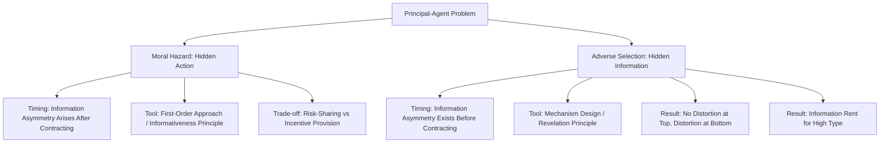

## Principal-Agent Problems

### Overview

The principal-agent problem is the foundational framework in contract theory and information economics for analyzing strategic interactions in which one party (the **principal**) delegates a task to another party (the **agent**) whose actions or private information the principal cannot fully observe or verify. The resulting misalignment of incentives, combined with informational asymmetry, gives rise to two canonically distinguished problem classes: **moral hazard** (hidden action, arising after the contract is signed) and **adverse selection** (hidden information, existing before the contract is signed). Game-theoretically, these problems are typically modeled as Bayesian games or as mechanism design problems in which the principal chooses a contract to maximize expected payoff subject to the agent's incentive and participation constraints.

### The Two Core Information Problems

- **Moral hazard (hidden action):** After the contract is signed, the agent takes an action (e.g., effort level) that affects the outcome but is not directly observable or verifiable by the principal. The principal can typically observe only a noisy outcome correlated with the agent's action, not the action itself.
- **Adverse selection (hidden information / hidden type):** Before the contract is signed, the agent possesses private information (e.g., their skill level, cost type, or valuation) unknown to the principal, who must design a contract without knowing which "type" of agent they are facing.

These two problems require structurally distinct modeling tools — moral hazard is typically solved via the **first-order approach** to optimal contracting under a hidden action, while adverse selection is solved via **mechanism design** and the **revelation principle**, using incentive-compatibility constraints across types.

### Formal Model: Moral Hazard (Hidden Action)

**Setup:** A risk-neutral principal hires a risk-averse agent to perform a task. The agent chooses unobservable effort $e \in [0, \infty)$ at personal cost $c(e)$, with $c'(e) > 0, c''(e) > 0$ (increasing marginal disutility of effort). Output $x$ is stochastic, with a distribution $f(x \mid e)$ depending on effort — higher effort stochastically increases output, but the principal observes only the realized outcome $x$, not $e$ directly.

The principal offers a compensation contract $w(x)$, mapping observed outcome to wage.

**Agent's problem**, given contract $w(\cdot)$:

$$\max_e \; \mathbb{E}\left[u(w(x)) \mid e\right] - c(e)$$

where $u(\cdot)$ is the agent's (typically concave, reflecting risk aversion) utility over wage income.

**Principal's problem:**

$$\max_{w(\cdot)} \; \mathbb{E}\left[x - w(x)\right] \quad \text{subject to:}$$

$$\text{(IR) Participation constraint: } \mathbb{E}[u(w(x)) \mid e^*] - c(e^*) \geq \bar{u}$$

$$\text{(IC) Incentive compatibility: } e^* \in \arg\max_e \; \mathbb{E}[u(w(x)) \mid e] - c(e)$$

where $\bar{u}$ is the agent's reservation utility (outside option) and $e^*$ is the effort level the principal wishes to induce.

### The Fundamental Trade-Off: Risk-Sharing vs. Incentives

The central economic insight of the moral hazard model is a tension between two goals that pull the optimal contract in opposite directions:

- **Risk-sharing efficiency:** Since the principal is risk-neutral and the agent is risk-averse, efficient risk allocation alone would call for a **flat wage** (fully insuring the agent against output fluctuations, since the risk-neutral principal should bear all risk).
- **Incentive provision:** A flat wage gives the agent **zero incentive** to exert effort (since wage doesn't depend on outcome, and effort is personally costly), so if effort is not perfectly observable, the principal must make pay contingent on the observed (effort-correlated) outcome to induce effort — but this necessarily imposes some income risk on the risk-averse agent.

The **first-best benchmark** (effort observable and contractible) simply specifies a fixed wage for a specified effort level, achieving full risk-sharing with no incentive distortion. The **second-best** (moral hazard) contract sacrifices some risk-sharing efficiency to provide incentives, and is characterized by the **Informativeness Principle** (Holmström, 1979): any signal that is statistically informative about the agent's effort, beyond output itself, should optimally be incorporated into the compensation contract, since additional informative signals allow better disentangling of effort from luck, reducing the risk imposed on the agent for a given level of induced effort.

### First-Order Approach and the Optimal Contract Characterization

Under standard regularity conditions (the Monotone Likelihood Ratio Property, MLRP, and the Convexity of the Distribution Function Condition, CDFC), the constrained optimization can be solved via Lagrangian methods, yielding the classic characterization (Holmström 1979; Grossman-Hart 1983):

$$\frac{1}{u'(w(x))} = \lambda + \mu \cdot \frac{f_e(x \mid e^*)}{f(x \mid e^*)}$$

where $\lambda$ is the multiplier on the participation constraint, $\mu$ is the multiplier on the incentive compatibility constraint, and $\frac{f_e(x\mid e^*)}{f(x\mid e^*)}$ is the **likelihood ratio** — how much more likely a given outcome $x$ is under higher effort. This equation says the agent's marginal utility of wage (inverted) is adjusted upward or downward from the risk-sharing benchmark ($1/u'(w) = \lambda$, constant, achieved under a flat wage) in proportion to how informative the outcome is about effort — outcomes strongly associated with high effort are rewarded more than pure risk-sharing would dictate, precisely to provide the necessary incentive.

[Inference] The MLRP and CDFC conditions are sufficient but not strictly necessary for the first-order approach to be valid; outside these conditions, the agent's effort-choice problem may not be well-behaved (the first-order condition may not characterize a global optimum), a technical caveat well-documented in the contract theory literature (Mirrlees's critique, Grossman-Hart's discussion of the first-order approach's validity).

### Formal Model: Adverse Selection (Screening)

**Setup:** A principal (e.g., a monopolist seller, an employer, or an insurer) faces an agent whose type $\theta \in \{\theta_L, \theta_H\}$ (or a continuum) is privately known to the agent and unknown to the principal, who has only a prior belief (probability distribution) over types.

The principal designs a **menu of contracts** $\{(q_\theta, t_\theta)\}$ — one contract per possible announced type — where $q_\theta$ is a quantity/quality/effort specification and $t_\theta$ is a transfer/payment, subject to:

$$\text{(IC)} \quad \theta \in \arg\max_{\theta'} \; U(q_{\theta'}, t_{\theta'} ; \theta) \quad \forall \theta$$

$$\text{(IR)} \quad U(q_\theta, t_\theta; \theta) \geq \bar{U}(\theta) \quad \forall \theta$$

The incentive compatibility constraints ensure each type of agent voluntarily self-selects into the contract designed for their own type (truthful revelation), by the **revelation principle** — any equilibrium outcome achievable by *any* contract or mechanism can be replicated by a **direct mechanism** in which agents simply report their type truthfully, without loss of generality for the principal's design problem.

### Canonical Adverse Selection Result: Information Rent and Distortion at the Bottom

In the standard two-type screening model (e.g., Laffont-Tirole-style regulation, or Mussa-Rosen-style quality screening), solving the principal's constrained optimization typically yields two hallmark qualitative results:

- **Information rent for the "good" type:** The high-type (e.g., low-cost, or high-valuation) agent typically earns strictly positive **information rent** — surplus above their reservation utility — because the principal must leave them enough surplus to prevent them from mimicking the low-type's contract instead (the binding "downward" incentive compatibility constraint).
- **"No distortion at the top, distortion at the bottom":** The contract offered to the highest type is typically set at the **first-best (efficient) level**, since there is no higher type left to which they might want to deviate, so their incentive constraint doesn't bind on that side; but the contract offered to lower types is **distorted downward** relative to the efficient level, specifically to reduce the information rent that would otherwise have to be conceded to the higher type (a smaller, less attractive low-type contract makes mimicking it less appealing to the high type, reducing the informational rent the principal must pay).

This "no distortion at the top, distortion at the bottom" result is one of the most widely cited qualitative conclusions in all of contract theory and recurs across regulation (Baron-Myerson), nonlinear pricing (Mussa-Rosen, Maskin-Riley), and optimal taxation (Mirrlees) applications.

### Diagram: Moral Hazard vs. Adverse Selection

### The Revelation Principle (Formal Statement)

The revelation principle, foundational to mechanism design generally, states that for any Bayesian game (or mechanism) implementing some outcome as a Bayesian Nash equilibrium, there exists an equivalent **direct revelation mechanism** in which each agent's dominant (or equilibrium) strategy is to truthfully report their private type, and this direct mechanism implements the identical outcome. Formally, if a mechanism $M$ implements outcome function $g(\theta)$ in Bayesian Nash equilibrium, there exists a direct mechanism $M'$ (asking agents to report $\hat\theta$ directly and applying $g(\hat\theta)$) such that truthful reporting $\hat\theta = \theta$ is a Bayesian Nash equilibrium of $M'$, yielding the same outcome. This dramatically simplifies mechanism design problems: the principal can restrict attention, without loss of generality, to the class of incentive-compatible direct mechanisms, rather than searching over the vastly larger space of arbitrary communication protocols and contract forms.

### Signaling as the Adverse Selection Mirror Image

A closely related but structurally distinct model class is **signaling** (Spence 1973), in which the *informed* party (rather than the uninformed principal) moves first, taking a costly action intended to credibly reveal their type to an uninformed receiver. The canonical example is education-as-signal in labor markets: workers acquire costly education not necessarily for its productive value, but because doing so credibly separates higher-ability workers (for whom education is less costly at the margin) from lower-ability workers (for whom it is more costly), provided a **single-crossing property** holds on the cost of the signaling action across types. Signaling and screening are often presented as complementary solutions to the same underlying adverse-selection informational structure, differing only in which party (informed or uninformed) moves first and designs/chooses the discriminating instrument.

### Applications

- **Executive compensation:** Stock options, bonus schemes, and performance-based pay are standard applications of the moral hazard framework, addressing the tension between shareholders (principals, who cannot observe managerial effort or decision quality directly) and executives (agents).
- **Insurance markets:** Both moral hazard (insured parties take less care once covered, e.g., deductibles and copayments as partial-insurance devices to preserve some incentive for care) and adverse selection (insurers cannot observe individual risk types, leading to screening via menus of deductible/premium combinations, per Rothschild-Stiglitz) are central applications.
- **Regulation of natural monopolies:** The Baron-Myerson and Laffont-Tirole frameworks apply adverse selection screening theory to regulated utilities, where the regulator (principal) does not observe the firm's true cost type, motivating incentive regulation schemes (price caps, cost-sharing contracts) that trade off rent extraction against cost-reducing effort incentives.
- **Credit markets:** Stiglitz-Weiss style credit rationing models apply adverse selection logic to lending, where interest rates themselves can adversely select for riskier borrowers, potentially rationalizing equilibrium credit rationing rather than market-clearing through price alone.
- **Corporate governance and venture capital contracting:** Optimal contracting between investors and entrepreneurs (e.g., convertible securities, staged financing, control rights allocation) draws directly on both moral hazard (entrepreneur effort) and adverse selection (entrepreneur's private information about venture quality) frameworks.

### Rothschild-Stiglitz Insurance Screening (Illustrative Application)

In the Rothschild-Stiglitz (1976) competitive insurance screening model, insurers cannot observe whether a given applicant is high-risk or low-risk, and compete by offering menus of insurance contracts (premium, coverage level pairs). The equilibrium concept requires that no contract in the offered menu attracts a pooled mix of both types that a rival insurer could profitably "cream-skim" by offering a more attractive contract targeted at low-risk types alone. A key finding is that a **pooling equilibrium** (single contract for both types) is never robust to such cream-skimming entry, so the (Nash) equilibrium, when it exists, is necessarily a **separating equilibrium**: low-risk types receive only partial coverage (a distorted, less-than-efficient contract) precisely to make their contract unattractive to high-risk types, illustrating "distortion at the bottom" in an insurance-specific guise. [Inference] The Rothschild-Stiglitz model is also well known for a pure existence problem: for some prior probability distributions over risk types, no pure-strategy Nash equilibrium (pooling or separating) exists at all, a fragility that motivated substantial follow-up work (Wilson's anticipatory equilibrium concept, Riley's reactive equilibrium, and others) proposing alternative equilibrium refinements or timing assumptions to restore existence.

**Related Topics**

- Mechanism design and the revelation principle
- Signaling games and the Spence education model
- Screening and nonlinear pricing (Mussa-Rosen, Maskin-Riley)
- Optimal regulation under asymmetric information (Baron-Myerson, Laffont-Tirole)
- Rothschild-Stiglitz competitive insurance screening
- Auction theory as a mechanism design application
- Contract theory and incomplete contracts (Grossman-Hart-Moore)
- Bayesian games and Harsanyi's type-space formalization
- Credit rationing and the Stiglitz-Weiss model