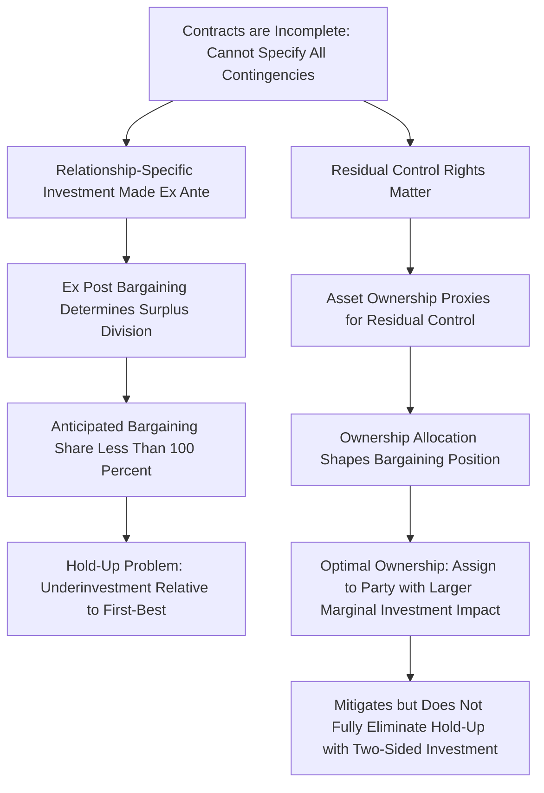

## Contract Theory Foundations

### Overview

Contract theory studies how parties design agreements to govern their interactions under conditions of asymmetric information, unverifiable actions, or unforeseen future contingencies. While the principal-agent framework (moral hazard and adverse selection) addresses asymmetric information *within* a specified contractual relationship, contract theory more broadly also encompasses the foundational question of what a "contract" even is as a formal object, why contracts are typically **incomplete**, how the allocation of residual control rights and asset ownership shapes incentives when contracts cannot specify every contingency, and how renegotiation, verifiability, and commitment interact with the basic mechanism design toolkit. This chapter surveys the foundational concepts underlying modern contract theory beyond the moral hazard/adverse selection framework already covered.

### Complete vs. Incomplete Contracts

A **complete contract** specifies, in advance, the parties' obligations in every conceivable future state of the world — a fully contingent claim covering every relevant contingency, verifiable by a court, with no gaps requiring future renegotiation or discretion.

An **incomplete contract**, by contrast, leaves some contingencies unaddressed, either because:

- **States of the world are unforeseeable** at the time of contracting (bounded rationality in anticipating future contingencies), or
- **States are foreseeable but not describable** in terms precise enough for third-party (court) verification, or
- **Verification is prohibitively costly**, even when the relevant information is observable to the contracting parties themselves (a crucial distinction: information can be *observable* between the parties but not *verifiable* to a court, which is the specific informational friction that drives most of incomplete contract theory).

The **observability vs. verifiability distinction** is foundational: many contract-theoretic frictions arise not because parties themselves lack information (they may both know perfectly well what happened), but because a third-party enforcer (a court) cannot confirm it, and hence cannot be relied upon to enforce a contract contingent on that information.

### The Grossman-Hart-Moore (GHM) Property Rights Theory

The most influential formal theory of incomplete contracts is the property rights approach, developed by Grossman and Hart (1986) and Hart and Moore (1990), often abbreviated GHM.

**Core idea:** Because contracts cannot specify every future contingency, **residual control rights** — the right to make decisions in contingencies not covered by the contract — become economically important. GHM identify the allocation of **asset ownership** as the natural proxy for residual control rights: owning a physical or non-human asset confers the right to decide how it is used in any circumstance the contract does not address.

**Setup (stylized two-party version):**

Two parties (e.g., a buyer and a supplier, or two divisions of a firm) must each make **relationship-specific investments** $i, i'$ prior to a later trade or interaction, where these investments increase the joint surplus from trading but have little or no value outside the relationship (i.e., they are **relationship-specific**, generating limited or no value if the relationship dissolves).

**The hold-up problem:** Because the initial contract is incomplete (cannot fully specify the terms of the later trade, or the precise division of the resulting surplus), the division of surplus from the relationship-specific investment is instead determined by **ex post bargaining** (commonly modeled via Nash bargaining) after the investment is sunk. Anticipating that they will not capture the full marginal return to their investment in this ex post bargaining (since the bargaining partner will capture some share), each party **underinvests** relative to the socially efficient level — this is the **hold-up problem**, the central prediction of incomplete contracting theory.

**Formal underinvestment result:** If party $A$'s investment $i$ increases total surplus $S(i)$ but $A$ only captures a bargaining share $\alpha \in (0,1)$ of the surplus in ex post Nash bargaining, $A$ chooses $i$ to maximize:

$$\max_i \; \alpha S(i) - c(i)$$

rather than the socially efficient:

$$\max_i \; S(i) - c(i)$$

Since $\alpha < 1$, the first-order condition $\alpha S'(i) = c'(i)$ yields $i^* < i^{\text{efficient}}$ whenever $S(\cdot)$ is concave and $c(\cdot)$ is convex — confirming underinvestment relative to the first-best whenever the investing party does not capture the full marginal surplus.

### Asset Ownership as the Solution Instrument

GHM's key theoretical contribution is showing that reallocating **asset ownership** changes each party's bargaining position (their outside option/threat point in the ex post negotiation) in a way that can partially mitigate — though generally not fully eliminate — the hold-up problem:

- **Ownership determines outside options:** the owner of a key asset typically has a stronger outside option (the ability to use or redeploy the asset without the other party's cooperation) in the ex post bargaining, increasing their effective bargaining share $\alpha$ for their own investment.
- **Whoever's investment is more important should generally own the critical asset(s):** the general prescription is that ownership should be allocated to whichever party's investment has the larger marginal impact on total surplus, since ownership increases that party's incentive (via increased bargaining leverage) precisely where the incentive is most valuable to preserve.
- **Ownership cannot achieve full efficiency in general (with non-contractible, two-sided investment):** even optimal ownership allocation generally leaves *some* residual underinvestment on the non-owning party's side, since with two-sided investment (both parties making relationship-specific investments), no single allocation of ownership can simultaneously give both parties full residual claim on their own marginal contribution. This is one of the framework's central results distinguishing it from the frictionless Coasian benchmark.

### The Coase Theorem as Contrast/Benchmark

The property rights theory of the firm is often introduced in explicit contrast to the **Coase Theorem**, which states that if property rights are well-defined and bargaining is costless (zero transaction costs), parties will bargain to the efficient outcome regardless of the initial allocation of property rights — implying, in a frictionless Coasian world, that ownership allocation would be irrelevant to efficiency (only to the *distribution* of surplus, not its total size).

GHM's contribution is precisely to explain the **conditions under which the Coase Theorem's irrelevance result breaks down**: once relationship-specific investments must be made *before* the (costless, ex post) bargaining occurs, the *anticipation* of that ex post bargaining outcome feeds back into the investment decision, and the initial allocation of asset ownership/control rights becomes payoff-relevant even though the eventual bargaining itself remains efficient (ex post) — this is a subtle but important point: hold-up is not caused by ex post bargaining being *inefficient*; it is caused by anticipated (even fully efficient) ex post bargaining distorting the *ex ante* investment incentives.

### Diagram: Property Rights Theory Logic

### Complete Contracting and the Nirvana Benchmark

The **complete contracting benchmark** (sometimes associated with the mechanism design tradition more broadly, and formalized rigorously in the Maskin-Tirole "unforeseen contingencies" debate) provides the theoretical first-best against which incomplete contracting outcomes are measured. Under a hypothetical complete contract, all relevant contingencies would be specified ex ante, all relevant investment incentives would be fully internalized, and no hold-up problem would arise regardless of asset ownership. The persistent theoretical debate (associated especially with Maskin and Tirole's critique of the foundations of the GHM approach) concerns whether truly unforeseeable contingencies are actually necessary to generate meaningful contractual incompleteness, or whether sufficiently cleverly designed *ex ante* mechanisms (even without literally describing every future state) could in principle replicate complete-contracting outcomes — this remains a genuinely contested foundational question in the theory, sometimes referred to as the "Maskin-Tirole critique" of incomplete contracts, without full consensus resolution.

[Unverified] The Maskin-Tirole critique and the broader debate over the theoretical robustness of contractual incompleteness as a distinct primitive (versus a derived consequence of other frictions like unverifiability alone) remains actively and substantively contested among contract theorists; this document presents the standard GHM framework as the dominant applied paradigm while noting the debate exists, rather than asserting the debate is resolved.

### Renegotiation and the Renegotiation-Proofness Constraint

A related complication is that contracts are typically **renegotiable**: even if an initial contract specifies inefficient terms for some realized contingency, the parties can typically agree, after the fact, to renegotiate to a mutually more efficient arrangement (since renegotiation that makes both parties better off is generally not something an initial contract can credibly prevent, absent enforceable no-renegotiation clauses, which courts often will not enforce against mutual consent).

This gives rise to the **renegotiation-proofness constraint** in mechanism design and dynamic contracting: an optimal mechanism must anticipate that any terms specifying an outcome that is *ex post* Pareto-dominated by some alternative will simply be renegotiated away, so the mechanism designer should restrict attention to mechanisms whose prescribed outcomes are already ex post efficient given the information revealed at that point — otherwise the renegotiation possibility itself must be explicitly modeled as part of the game, often substantially complicating equilibrium characterization (the **ratchet effect** in repeated moral hazard/adverse selection settings, where an agent revealing favorable information today anticipates the principal exploiting that information via a renegotiated, less favorable contract tomorrow, is a canonical instance of this class of problems).

### Formal Contracting vs. Relational Contracting

A parallel strand distinguishes **formal (court-enforceable) contracts** from **relational contracts**, which are self-enforcing agreements sustained not by legal enforcement but by the shadow of future interaction (game-theoretically, by repeated-game/folk-theorem logic: each party complies with the informal understanding because deviating would trigger the collapse of a valuable ongoing relationship, in a manner directly analogous to trigger-strategy-sustained cooperation in repeated games).

- **Levin's (2003) relational contracting framework** formalizes optimal relational contracts as constrained-optimal mechanisms subject to **self-enforcement constraints** (analogous to no-deviation/incentive constraints in repeated games) in place of, or alongside, formal legal enforceability constraints, showing how the *combination* of limited formal contractibility and a valuable ongoing relationship can support incentive provision that neither pure spot contracting nor a single non-repeated formal contract could achieve alone.
- This connects contract theory directly back to repeated games (folk theorems, trigger strategies) covered elsewhere in this syllabus, illustrating that "informal enforcement via repeated interaction" and "formal enforcement via verifiable, court-enforceable contract terms" are best understood as complementary, not mutually exclusive, mechanisms for sustaining efficient exchange.

### Applications

- **Theory of the firm (boundaries of the firm):** GHM property rights theory directly addresses Coase's original "make or buy" question — why some transactions are organized within a single firm (vertical integration, common asset ownership) versus across firms via arm's-length contracting — by analyzing which ownership structure best mitigates the relevant parties' hold-up problems given the relative importance of their respective relationship-specific investments.
- **Joint ventures and strategic alliances:** Ownership-sharing arrangements in joint ventures are frequently analyzed using incomplete contracting and hold-up logic to explain observed governance structures (equity splits, control rights allocation) as responses to the relative investment importance of each partner.
- **Employment relationships and the employment contract:** Simon's (1951) classic analysis of the employment relationship as a contract granting the employer broad (but not unlimited) residual authority over unspecified future tasks is an early precursor to the modern incomplete contracting/residual control rights framework.
- **Optimal debt and equity contracts (financial contracting):** Aghion-Bolton and related corporate finance applications use incomplete contracting logic to explain the allocation of control rights between entrepreneurs and financiers (e.g., why control shifts to creditors in states of financial distress) as an efficient response to non-contractible managerial actions.
- **Public-private partnerships and privatization:** Hart-Shleifer-Vishny apply property rights theory to the question of when government provision versus private contracting of public services is more efficient, based on the relative non-contractibility of quality-improving versus cost-reducing investments in each institutional arrangement.

**Related Topics**

- Principal-agent problems: moral hazard and adverse selection
- The Coase Theorem and transaction cost economics
- Hold-up problem and relationship-specific investment
- Nash bargaining solution and axiomatic bargaining theory
- Repeated games, folk theorems, and relational contracting
- The theory of the firm and vertical integration (Coase, Williamson, GHM)
- Renegotiation-proofness in dynamic mechanism design
- Financial contracting and corporate control rights (Aghion-Bolton)
- The Maskin-Tirole unforeseen contingencies debate