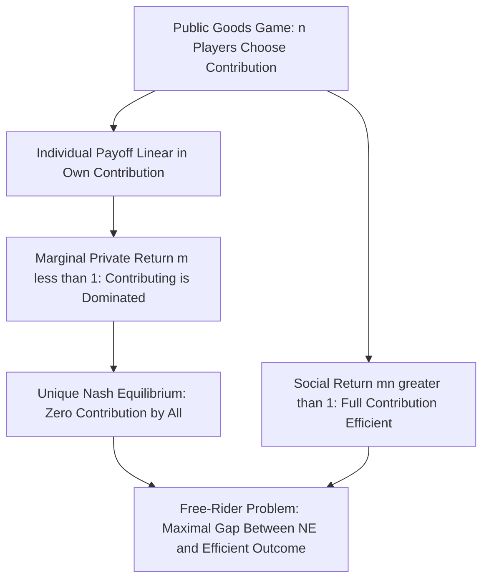
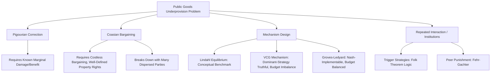

## Public Goods and Externality Games

### Overview

Public goods and externality games formalize situations in which individual actions generate benefits or costs that spill over onto others without being fully captured or internalized through market prices, giving rise to strategic interdependence and typically **inefficient equilibrium outcomes** relative to the socially optimal allocation. Game theory provides the formal apparatus — Nash equilibrium in continuous-action games, the free-rider problem, mechanism design solutions (Vickrey-Clarke-Groves, Lindahl pricing), and repeated-game/evolutionary approaches to voluntary cooperation — for analyzing why public goods tend to be underprovided and externalities tend to be inefficiently generated absent corrective intervention.

### Defining Public Goods

A pure public good is characterized by two properties:

- **Non-excludability:** it is impossible, or prohibitively costly, to prevent any individual from consuming/benefiting from the good once it is provided, regardless of whether they contributed to its provision.
- **Non-rivalry:** one individual's consumption of the good does not diminish its availability to others (the marginal cost of an additional consumer is zero).

Goods satisfying both properties (national defense, basic research, clean air) are pure public goods; goods satisfying only one property are classified separately (a **club good** is excludable but non-rival; a **common-pool resource** is non-excludable but rival, generating the distinct "tragedy of the commons" problem).

### The Voluntary Contribution Mechanism (Public Goods Game)

The canonical game-theoretic model of public goods provision is the **voluntary contribution mechanism (VCM)**. Consider $n$ players, each with an initial endowment $w$, who simultaneously and independently choose a contribution $g_i \in [0, w]$ to a public good. Each player's payoff is:

$$\pi_i(g_i, g_{-i}) = (w - g_i) + m \sum_{j=1}^{n} g_j$$

where $(w - g_i)$ is the value retained in the player's private consumption, and $m$ (the **marginal per-capita return**, MPCR) represents the return each player individually gets from the total contributed pool. Critically, the model is defined by the parameter restriction:

$$\frac{1}{n} < m < 1$$

The condition $m < 1$ ensures that contributing is individually costly at the margin (a dollar kept privately is worth more to the contributor than a dollar's contribution to the public good, from their own private perspective) — so free-riding is a dominant strategy. The condition $m \cdot n > 1$ ensures that full contribution by everyone would be **socially efficient**, since the total return to the group from one more dollar contributed ($m \cdot n$) exceeds the dollar's private opportunity cost — creating the fundamental **social dilemma** structure: individually dominant free-riding, combined with socially superior full contribution.

### Nash Equilibrium: Complete Free-Riding

**Best response derivation:** Player $i$'s payoff is linear in $g_i$ with slope $\frac{\partial \pi_i}{\partial g_i} = -1 + m$. Since $m < 1$, this slope is strictly negative for all $g_i$, meaning contributing is a **dominant strategy to avoid** regardless of what others do:

$$g_i^* = 0 \quad \forall i$$

**Unique Nash equilibrium:** $(g_1^*, \ldots, g_n^*) = (0, \ldots, 0)$, with total public good provision $G^* = 0$.

**Socially efficient benchmark:** maximizing total surplus $\sum_i \pi_i = nw - (1-mn)\sum_i g_i$ requires, since $mn > 1$ makes the coefficient on $\sum g_i$ positive, setting every $g_i = w$ (full contribution):

$$G^{\text{efficient}} = nw$$

The gap between $G^* = 0$ and $G^{\text{efficient}} = nw$ is the formal statement of the **free-rider problem**: the unique Nash equilibrium involves zero voluntary provision, while the socially efficient outcome requires full contribution — a maximal divergence, illustrating why public goods are a paradigm example of market/voluntary-mechanism failure requiring either non-market intervention or carefully designed incentive mechanisms.

### Diagram: Free-Rider Problem Structure

### Externalities and the Pigouvian Framework

An **externality** is a cost or benefit imposed on a third party not directly involved in a transaction or decision, and not reflected in the decision-maker's private payoff. Externality games formalize the same underlying logic as public goods (indeed, a public good can be viewed as a special case of a positive externality with the specific non-excludability/non-rivalry structure), typically via a simple model where player $i$'s action $a_i$ generates a private benefit $b(a_i)$ and an external cost or benefit $e(a_j)$ on other players $j \neq i$.

**Negative externality example (pollution):** Firm $i$ chooses production/pollution level $a_i$, receiving private profit $\pi_i(a_i) = b(a_i)$ but imposing external damage $d(a_j)$ on others per unit of $a_j$. Since firm $i$'s private optimization ignores the damage imposed on others:

$$\text{Private optimum: } b'(a_i) = 0 \qquad \text{Social optimum: } b'(a_i) = \sum_{j \neq i} d'(a_i)$$

The gap between these two first-order conditions is the formal source of **overproduction of negative externalities** in the uncorrected Nash equilibrium relative to the social optimum.

**Pigouvian correction:** Named for Arthur Pigou, the standard corrective mechanism imposes a per-unit tax $\tau^*$ set equal to the marginal external damage evaluated at the socially efficient action level:

$$\tau^* = \sum_{j \neq i} d'(a_i^{\text{efficient}})$$

which, once imposed, makes the privately optimal choice coincide exactly with the socially optimal one, since the tax internalizes the externality directly into the decision-maker's private payoff function.

### The Coase Theorem Applied to Externalities

As introduced in the contract theory foundations context, the **Coase Theorem** offers an alternative (non-Pigouvian) resolution: if property rights over the externality-generating activity are clearly assigned and bargaining between the affected parties is costless, the parties will bargain to the efficient outcome *regardless* of the initial rights assignment — the assignment affects only the distribution of surplus (who pays whom), not the efficiency of the final allocation. This provides a game-theoretic (bargaining-based) alternative to Pigouvian taxation, contingent on the strong assumption of costless bargaining, which becomes increasingly implausible as the number of affected parties grows (bargaining among many dispersed parties faces severe coordination and free-riding problems of its own — a point often raised as the central practical limitation of Coasian bargaining relative to Pigouvian correction in genuinely public-good-like externality settings, such as pollution affecting an entire population).

### Mechanism Design Solutions: Efficient Public Good Provision

Beyond simple Pigouvian taxation (well-suited to bilateral or small-group externalities), mechanism design provides more general solutions for efficiently financing public goods even when individuals' valuations are private information:

- **Lindahl equilibrium:** A conceptual (not typically implementable without a mechanism, since it requires knowing individual valuations) benchmark in which each individual pays a personalized price for the public good equal to their own marginal valuation, with total payments summing to the total cost — at Lindahl prices, individually optimal demand for the public good coincides exactly across all individuals at the efficient quantity, generalizing the competitive equilibrium efficiency result to public goods, but requiring information the mechanism designer does not actually have.
- **Vickrey-Clarke-Groves (VCG) mechanism:** A dominant-strategy incentive-compatible mechanism (introduced by Vickrey, Clarke, and Groves) that elicits truthful revelation of private valuations for a public project by having each agent pay a "pivot" tax equal to the externality their reported valuation imposes on other agents' welfare (specifically, the difference between others' total welfare with and without that agent's presence/reported valuation). VCG achieves efficient public decision-making as a dominant-strategy equilibrium, but is well known to generally run a **budget deficit or surplus** (violating budget balance) and to be vulnerable to collusion among agents, both significant practical limitations extensively documented in the mechanism design literature.
- **The Groves-Ledyard mechanism** and related quadratic/Nash-implementation mechanisms achieve efficient public goods provision as a Nash equilibrium (rather than dominant strategy) outcome while maintaining exact budget balance, at the cost of requiring the (weaker, but still non-trivial) Nash equilibrium behavioral assumption rather than dominant-strategy truthfulness.

### The Impossibility of "Free" Efficient Mechanisms: Green-Laffont / Myerson-Satterthwaite Connections

[Inference] It is a standard and well-established result in the mechanism design literature (related to, though distinct in details from, the Myerson-Satterthwaite impossibility theorem for bilateral trade) that no mechanism can simultaneously achieve efficiency, budget balance, individual rationality (voluntary participation), and dominant-strategy (or even Bayesian Nash) incentive compatibility in fully general public goods settings with private information — some property must generally be sacrificed, and the choice of which property to relax (VCG sacrifices budget balance; Groves-Ledyard sacrifices dominant-strategy incentive compatibility in favor of Nash implementation) defines the major design trade-offs surveyed in this literature.

### Repeated Games and Voluntary Cooperation

Beyond one-shot mechanism design, a substantial literature examines whether **repeated interaction** can sustain voluntary public goods contribution above the static Nash prediction, using the same folk-theorem logic as repeated oligopoly and other social dilemmas:

- **Trigger strategies in repeated public goods games:** if players are sufficiently patient (discount factor above a threshold), a strategy of contributing fully as long as everyone else has contributed in the past, and reverting to zero contribution forever following any observed defection, can sustain full contribution as a subgame perfect equilibrium.
- **Experimental evidence on public goods games:** Extensive experimental work (Ledyard's foundational survey, and subsequent replications) documents that observed contributions in one-shot and finitely repeated public goods games are typically substantially **above** the zero-contribution Nash prediction, particularly in early rounds, but decay toward the Nash prediction over repeated play absent additional institutions (communication, punishment mechanisms, or reputation systems) — a pattern often interpreted through the same behavioral lenses (social preferences, reciprocity, bounded rationality) discussed in the critiques of rational choice assumptions chapter.
- **Punishment mechanisms:** Fehr and Gächter's influential experimental work shows that introducing a costly peer-punishment option (allowing contributors to sanction free-riders at a personal cost) substantially raises and sustains cooperation levels even in one-shot-per-round settings without repeated-game reputation effects, though the punishment itself is individually costly and represents its own second-order public goods/free-rider problem (since punishing is costly to the punisher but benefits the whole group by deterring future free-riding).

### Diagram: Solution Approaches to the Public Goods Problem

### Applications

- **Environmental policy:** Pigouvian carbon taxes and cap-and-trade (a Coasian-inspired, property-rights-based alternative creating a market for pollution permits) are the two dominant real-world policy instruments directly derived from this theoretical framework.
- **International climate agreements:** The provision of global public goods (greenhouse gas mitigation) among sovereign nations, absent any supranational enforcement mechanism, is a canonical large-scale application of the free-rider problem, motivating game-theoretic analysis of self-enforcing international agreements using repeated-game and coalition-formation logic.
- **Open-source software and knowledge production:** The voluntary provision of non-excludable, non-rival digital public goods (open-source code, Wikipedia contributions, scientific knowledge) is frequently analyzed using public goods game frameworks, often supplemented with reputation and signaling motives (contributors may gain private reputational benefits) not captured in the pure VCM baseline.
- **Common-pool resource management:** Elinor Ostrom's empirical and theoretical work on real-world common-pool resource governance (fisheries, irrigation systems, forests) documents numerous cases of successful self-governance institutions that sustain cooperation without either pure privatization (property rights) or centralized top-down regulation, extending the theoretical toolkit beyond the stylized two-polar-case (private property vs. government provision) framing often presented in introductory treatments.

**Related Topics**

- The tragedy of the commons and common-pool resource games
- Repeated games and folk theorems
- Mechanism design and the Vickrey-Clarke-Groves mechanism
- The Coase Theorem and property rights
- Social preferences and reciprocity (Fehr-Schmidt inequity aversion)
- Coalition formation and international environmental agreements
- Behavioral and experimental game theory (public goods experiments)
- Contract theory foundations and the hold-up problem