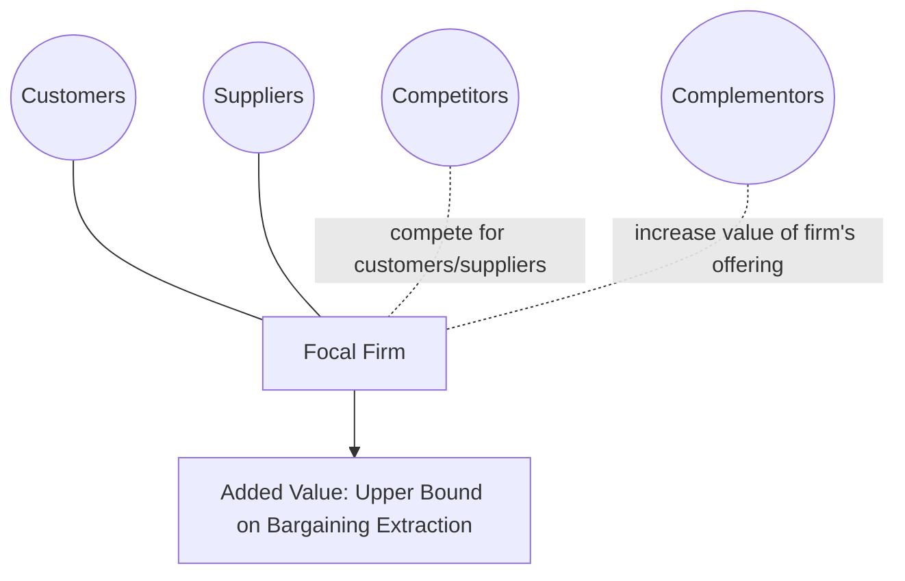
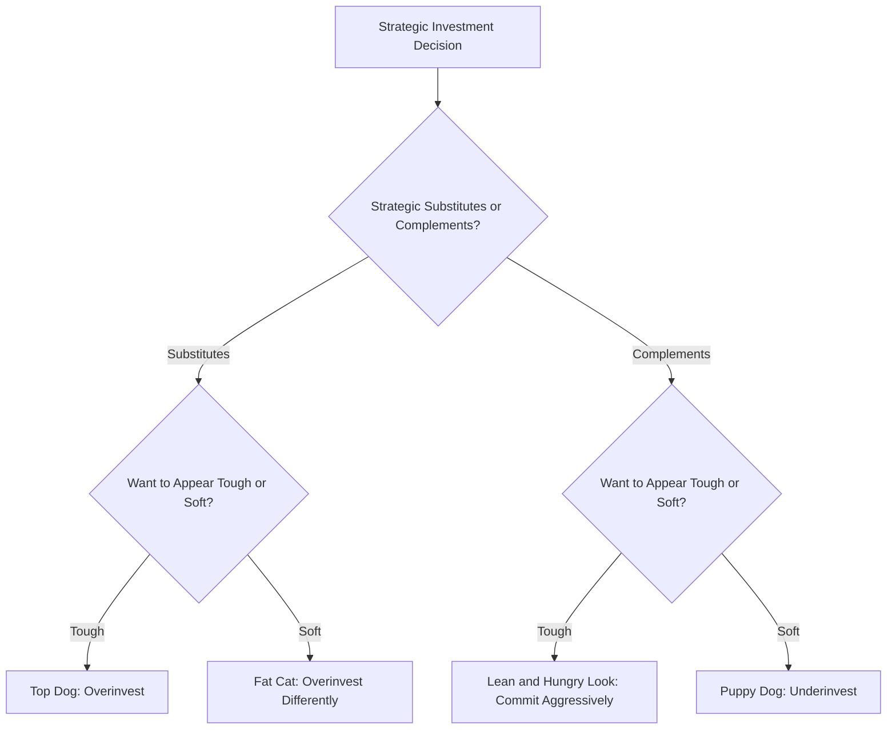

## Competitive Strategy and Game Theory

### Overview

The application of game theory to competitive business strategy formalizes the intuitive but often imprecise vocabulary of strategic management — "commitment," "signaling," "deterrence," "cooperation," "first-mover advantage" — into a rigorous analytical framework. This synthesis, most associated with the seminal work of Avinash Dixit and Barry Nalebuff (*Thinking Strategically*, 1991; *Co-opetition* with Adam Brandenburger, 1996) and the formal industrial organization contributions of Drew Fudenberg and Jean Tirole (*Game Theory*, 1991, and their earlier "top dog/puppy dog" strategic investment taxonomy), provides business strategists with tools to systematically analyze competitive interactions rather than relying purely on qualitative frameworks like Porter's Five Forces.

### From Qualitative Frameworks to Game-Theoretic Formalization

Traditional strategy frameworks (Porter's Five Forces, SWOT analysis) describe the *structural* determinants of industry attractiveness and competitive position but are largely static and do not formally model the sequential, interactive nature of specific competitive moves and counter-moves between identifiable rivals. Game theory supplements these frameworks by providing:

- **Explicit modeling of interdependence:** a firm's optimal action depends directly on rivals' anticipated reactions, formalized through best-response functions and equilibrium concepts rather than treated as an unmodeled "competitive rivalry" force.
- **Precise treatment of sequencing and commitment:** the distinction between simultaneous-move competition (Cournot/Bertrand) and sequential competition (Stackelberg) and their differing implications for optimal strategy, directly informing real decisions about whether to move first, wait, or attempt to shape the order of moves itself.
- **Formal treatment of credibility:** game theory's insistence on **subgame perfection** — that a threat or promise must be optimal to carry out if the relevant contingency actually arises — directly operationalizes the strategic management concept of "credible commitment," distinguishing empty threats from strategically effective ones (directly connecting to the Chain Store Paradox and its resolutions).

### The Added Value Framework (Brandenburger-Nalebuff)

Brandenburger and Nalebuff's **Co-opetition** framework introduces the concept of **added value** as a game-theoretically grounded measure of a firm's strategic bargaining position, defined as:

$$\text{Added Value} = \text{Total value created with the firm in the game} - \text{Total value created without the firm}$$

A player's added value represents an **upper bound on what that player can extract** in cooperative bargaining over the total surplus generated by the "game" (the full network of customers, suppliers, complementors, and competitors) — a player with zero added value can be excluded from the game entirely without loss to the remaining participants, and hence has essentially no bargaining leverage, regardless of their nominal size or market share.

**The PARTS framework**, a companion tool from the same authors, identifies five levers for changing the game itself rather than merely optimizing play within a fixed game: **P**layers (who is in the game — adding or removing players changes total value creation and each player's added value), **A**dded value (directly increasing one's own or decreasing rivals'), **R**ules (the formal or informal rules governing interaction, e.g., most-favored-customer clauses, contract structures), **T**actics (perception management, information revelation strategies), and **S**cope (the boundaries of the game — linking or delinking issues, markets, or time horizons).

### The Value Net

The **Value Net** extends the traditional supplier-firm-customer value chain to explicitly include **complementors** — players whose products or services increase the value of the focal firm's offering (e.g., a hardware maker and complementary software developers) — alongside traditional competitors, formalizing a key insight of *Co-opetition*: business relationships are frequently simultaneously cooperative (in growing the total pie, i.e., increasing total value creation) and competitive (in dividing that pie, i.e., bargaining over its distribution), and successful strategy requires reasoning correctly about both dimensions rather than assuming all relationships are purely adversarial or purely cooperative.

### Diagram: The Value Net Structure

### Fudenberg-Tirole's Strategic Investment Taxonomy ("Top Dog" / "Puppy Dog")

Fudenberg and Tirole's business strategy taxonomy classifies strategic investment decisions (capacity, R&D, advertising, reputation-building) according to two dimensions: (1) whether the strategic variables are **strategic substitutes or complements**, and (2) whether the investment makes the investing firm "tough" or "soft" in the eyes of a rival — yielding four canonical strategic postures:

| Posture | Investment Effect | Strategic Variable Type | Business Intuition |
| --- | --- | --- | --- |
| **Top Dog** | Invest to appear tough/aggressive | Strategic substitutes | Overinvest in capacity/output to deter a rival (Stackelberg leader logic) |
| **Puppy Dog** | Invest to appear soft/accommodating | Strategic complements | Underinvest deliberately to avoid provoking aggressive rival response |
| **Lean and Hungry Look** | Invest to appear tough | Strategic complements | Commit aggressively even under complements, to induce rival accommodation |
| **Fat Cat** | Invest to appear soft | Strategic substitutes | Overinvest in a way that credibly signals reduced future aggressiveness |

This taxonomy formalizes the previously ad hoc business-strategy intuition that "being aggressive" is not universally advantageous — its strategic value depends entirely on the sign of the cross-partial derivative of the rival's payoff with respect to the focal firm's action (strategic substitutes vs. complements), a direct application of the same Bulow-Geanakoplos-Klemperer taxonomy underlying the Cournot/Bertrand contrast covered earlier in this syllabus.

### Diagram: Fudenberg-Tirole Taxonomy Logic

### Commitment, Credibility, and Strategic Moves (Schelling/Dixit Tradition)

Thomas Schelling's foundational insight — later formalized rigorously by Dixit — is that **commitment devices** can convert an otherwise non-credible threat or promise into a credible one by altering the *actual payoffs* the committing party faces, not merely by declaring an intention. Standard classes of commitment devices analyzed in the strategy literature include:

- **Burning bridges / eliminating options:** reducing one's own future flexibility (e.g., publicly announced capacity investments that are costly to reverse, or contractual most-favored-customer clauses that make future price cuts to new customers automatically costly) to make an aggressive response the *only* remaining rational option, thereby making the threat credible via genuine payoff restructuring rather than mere announcement.
- **Delegation as a commitment device:** appointing a manager or negotiator with a compensation structure or mandate that removes their own discretion to back down (e.g., a manager compensated purely on market share rather than profit) can serve as a credible commitment mechanism, since the delegate genuinely lacks the incentive to deviate even though the principal firm's "true" underlying preferences might otherwise favor accommodation.
- **Contracts as commitment devices:** most-favored-nation clauses, meet-the-competition clauses, and long-term exclusive contracts are all real-world instruments that function, game-theoretically, as commitment devices altering the firm's own future payoff structure to make certain competitive responses (price matching, non-poaching) credible without requiring repeated ad hoc renegotiation of intent.

### Reputation and Repeated Competitive Interaction

Directly building on the Chain Store Paradox and its incomplete-information resolution (covered in the Foundational Debates chapter), competitive strategy applications emphasize that reputation for aggressiveness (in pricing, litigation, or retaliation against entrants) has genuine strategic value specifically because of the information asymmetry between an incumbent's true cost/preference type and what rivals or potential entrants can observe — a firm may rationally fight an unprofitable early battle specifically to sustain a reputation that deters costlier future challenges, formalized rigorously via the Kreps-Wilson/Milgrom-Roberts sequential equilibrium apparatus rather than relying on the (game-theoretically unjustified, under complete information) folk notion of "sending a message" through actions alone.

### Applications and Case Studies (Illustrative Categories)

- **Entry deterrence and preemption:** using Stackelberg-style capacity commitment, brand proliferation (crowding a market with multiple similar products to leave no profitable niche for an entrant), or reputation-building (Chain Store logic) to raise a potential entrant's expected cost of entry above their expected return.
- **Standards wars and platform competition:** analysis of network-effect-driven "winner-take-most" competitive dynamics (e.g., historical VHS vs. Betamax, or contemporary platform competition) using game-theoretic models of coordination games with multiple equilibria, where early positioning, expectations management, and strategic alliances (with complementors, per the Value Net framework) can tip the market toward a particular equilibrium.
- **Coopetition in technology ecosystems:** joint standard-setting or patent pooling among nominal competitors (increasing total value creation, i.e., "growing the pie") followed by continued vigorous competition for market share (dividing the pie), a direct real-world instance of the Value Net's simultaneous cooperative/competitive relationship structure.
- **Pricing wars and signaling:** price-matching guarantees and most-favored-customer clauses analyzed as commitment devices that can, counter-intuitively, *soften* rather than intensify price competition by removing each firm's individual incentive to initiate price cuts (since matching is automatic, the expected gain from undercutting is eliminated).

[Inference] The empirical success of applying these frameworks to specific historical business cases (e.g., particular standards wars or pricing episodes) is generally presented in the strategy literature as illustrative case analysis rather than as rigorously tested, statistically validated causal claims; the frameworks provide a systematic lens for ex post interpretation and ex ante strategic reasoning, but should not be read as offering the same degree of empirical validation as the underlying formal economic models (Cournot, Bertrand, Stackelberg) from which they are derived.

**Related Topics**

- Cournot, Bertrand, and Stackelberg models as strategic-substitute/complement baselines
- The Chain Store Paradox and reputation-based entry deterrence
- Strategic substitutes vs. strategic complements (Bulow-Geanakoplos-Klemperer)
- Coordination games and standards wars (network effects)
- Nash bargaining and the added value concept
- Commitment devices and credible threats (Schelling, Dixit)
- Mechanism design applications to platform and ecosystem strategy
- Behavioral game theory in negotiation and competitive perception management