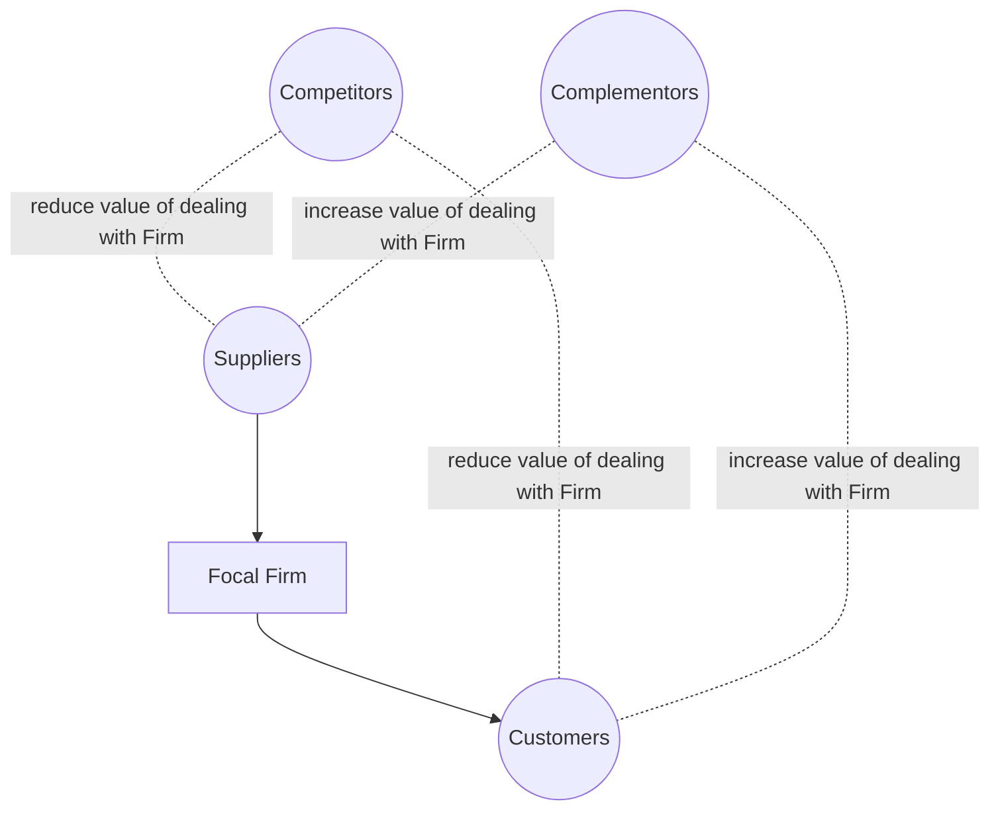
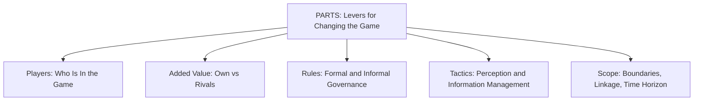

## Co-opetition and Value Net Analysis

### Overview

Co-opetition, a term coined by Ray Noorda and formalized rigorously by Adam Brandenburger and Barry Nalebuff in their 1996 book of the same name, describes business relationships that are simultaneously cooperative and competitive: firms cooperate to expand the total value available to be captured (growing the pie) while competing to determine how that value is divided among the participants (dividing the pie). The **Value Net** is the accompanying analytical framework mapping the full set of players relevant to a firm's strategic position, extending traditional value-chain and five-forces thinking to explicitly incorporate complementary relationships alongside the standard competitive ones. Formally, co-opetition analysis draws on cooperative game theory (particularly the Shapley value and core solution concepts) as well as non-cooperative bargaining theory to make the "growing vs. dividing the pie" distinction analytically precise.

### The Value Net Structure

The Value Net organizes the relevant players along two axes: **vertical** (customers and suppliers, the traditional value chain) and **horizontal** (competitors and complementors, a genuinely novel addition relative to Porter's Five Forces).

- **Customers:** buy the focal firm's product or service.
- **Suppliers:** provide inputs to the focal firm.
- **Competitors:** players whose products make a customer value the focal firm's product *less*, or whose presence makes a supplier less willing to supply the focal firm favorably (i.e., a player of whom customers/suppliers would rather have less, not more, in the game).
- **Complementors:** players whose products make a customer value the focal firm's product *more*, or make a supplier more willing to provide favorable input terms — a player of whom customers/suppliers would rather have more, not less, in the game.

**Formal complementor definition (customer side):** Player $C$ is a complementor to the focal firm from the customer's perspective if:

$$v(\text{Firm} + C) - v(C) > v(\text{Firm})$$

meaning the customer values the focal firm's product more when $C$'s product is also available than when the focal firm's product is offered alone — the presence of the complementor increases the total value the customer derives from the interaction, precisely the reverse of the competitor relationship, where the presence of the rival *reduces* the customer's valuation of dealing with the focal firm.

### Diagram: The Value Net (Full Structure)

### Added Value: The Core Analytical Concept

The Value Net's central analytical output is a player's **added value**, defined using cooperative game theory's characteristic function $v(S)$, which specifies the total value created by any coalition $S$ of players:

$$\text{Added Value of player } i = v(N) - v(N \setminus \{i\})$$

where $N$ is the full set of players ("the game") and $N \setminus \{i\}$ is the game with player $i$ removed. Added value represents the maximum amount player $i$ can hope to extract in cooperative bargaining over the total surplus $v(N)$ — a direct consequence of core-theoretic reasoning in cooperative game theory: any allocation giving player $i$ more than their added value would leave the remaining coalition $N \setminus \{i\}$ worse off than they could achieve by excluding $i$ and keeping $v(N \setminus \{i\})$ for themselves, making such an allocation unstable (outside the core).

**Strategic implication:** A firm with **zero added value** — one whose removal from the game would not reduce total value creation at all, because some other player or combination of players perfectly substitutes for its contribution — has, in principle, no bargaining power regardless of its absolute size, revenue, or market share. This reframes competitive strategy's central question from "how large or dominant is my firm" to "how much unique, non-substitutable value does my firm's presence in the network actually create."

### Increasing Added Value: Strategic Levers

Brandenburger and Nalebuff identify several concrete strategic actions for increasing a firm's added value, all of which operate by making the firm's contribution to $v(N)$ larger relative to what could be achieved without it:

- **Exclusive relationships:** locking in unique suppliers or customers (via exclusivity contracts) increases added value by ensuring $v(N \setminus \{i\})$ falls further when firm $i$ is removed, since alternative arrangements are foreclosed.
- **Reducing substitutability:** product differentiation, proprietary technology, and patents all function as added-value-increasing devices by making the firm's specific contribution harder for the "rest of the game" to replicate absent that firm.
- **Building complementor relationships:** actively cultivating complementors (rather than treating them as strategically neutral) increases $v(N)$ — the total value created — which, if the firm's own relative contribution to that increase is significant, correspondingly raises its own added value.
- **Reducing rivals' added value:** symmetrically, a firm can improve its *relative* bargaining position not by increasing its own added value directly but by decreasing a rival's, e.g., by cultivating alternative suppliers/customers that make the rival more substitutable (lowering $v(N \setminus \{\text{rival}\})$'s shortfall).

### The PARTS Framework: Changing the Game

Beyond optimizing within a given Value Net structure, the co-opetition framework's most distinctive contribution is the **PARTS** framework for **changing the game itself** — recognizing that the players, rules, tactics, and scope of a competitive interaction are themselves often subject to strategic choice, not fixed exogenous parameters:

- **Players:** who participates in the game. Adding a complementor (e.g., recruiting third-party developers to a platform) or removing a competitor (via acquisition, or by making the market unattractive to potential entrants) directly changes $v(N)$ and the resulting added-value calculus for all remaining players.
- **Added Value:** as detailed above, the direct lever of increasing one's own or decreasing others' added value.
- **Rules:** the formal and informal rules governing the interaction — contract terms, industry standards, most-favored-customer clauses, and legal/regulatory structures all function as rule-level strategic choices with first-order effects on bargaining outcomes, independent of the underlying value-creation structure.
- **Tactics:** the management of perceptions and information — since many real-world bargaining and coordination games have multiple possible outcomes (as in games with multiple Nash equilibria), managing rivals' or partners' *beliefs* about the game (which equilibrium will be played, what one's own reservation value is) is itself a strategic lever distinct from changing the underlying payoff structure.
- **Scope:** the boundaries of the game in terms of markets, products, time horizon, or linked issues — bundling or unbundling different games together (e.g., linking a pricing negotiation to a separate joint R&D agreement) can change the effective bargaining leverage of each party by altering what is "in" versus "outside" the relevant game.

### Diagram: PARTS Framework

### Cooperative Game Theory Foundations: The Shapley Value Connection

While "added value" gives an *upper bound* on what a player can extract, it does not by itself specify a unique predicted division of surplus among all players simultaneously (multiple allocations can respect every player's added-value ceiling). The **Shapley value**, a core cooperative game theory solution concept, provides one widely used way to pin down a specific, axiomatically justified allocation:

$$\phi_i(v) = \sum_{S \subseteq N \setminus \{i\}} \frac{|S|!(|N|-|S|-1)!}{|N|!} \left[v(S \cup \{i\}) - v(S)\right]$$

This formula averages player $i$'s marginal contribution $v(S \cup \{i\}) - v(S)$ across all possible orderings in which coalitions could form, weighted appropriately. The Shapley value satisfies desirable fairness axioms (efficiency, symmetry, additivity, and the null player property — a player with zero marginal contribution to every coalition receives exactly zero) and is frequently invoked in co-opetition analysis as a principled benchmark for "fair" surplus division in multi-party value-net bargaining, complementing the added-value concept's role as merely an upper bound.

[Inference] In practice, real-world bargaining outcomes in business co-opetition settings are shaped by relative bargaining power, outside options, sequencing, and negotiation skill at least as much as by any single normative allocation rule like the Shapley value; the Shapley value and added-value bound are best understood as analytical benchmarks for reasoning about the *range* and *fairness* of plausible outcomes, not as literal predictions of observed real-world contract terms.

### Applications and Illustrative Cases

- **Technology platform ecosystems:** Video game console makers cultivating third-party game developers (complementors) exemplifies active Value Net management — the console maker's added value depends heavily on complementor participation, motivating platform strategies such as developer subsidies, favorable revenue-sharing terms, and software development kit investment, all aimed at increasing $v(N)$ and securing a favorable share of it.
- **Standard-setting consortia and patent pools:** Nominal competitors jointly establishing a technical standard (increasing total value creation by resolving costly standards wars and enabling market growth) while continuing to compete vigorously for market share within the resulting standardized market is a canonical instance of co-opetition's "cooperate to grow the pie, compete to divide it" dynamic.
- **Airline alliances (codesharing, joint ventures):** Competing airlines cooperating on codeshare agreements, shared lounges, and joint scheduling (growing total network value for shared customers) while continuing to compete on individual routes and pricing exemplifies simultaneous cooperative/competitive relationships within a single Value Net.
- **Supplier ecosystem cultivation:** Firms deliberately supporting the financial health and capability of key suppliers (sometimes counter-intuitively providing suppliers with resources or technology assistance) to increase the total value the supply relationship can generate, rather than treating supplier interactions as purely zero-sum price negotiations, directly reflects Value Net reasoning about growing $v(N)$ before dividing it.

**Related Topics**

- Competitive strategy and game theory (Fudenberg-Tirole taxonomy, commitment devices)
- Cooperative game theory: the Shapley value and the core
- Bargaining theory and the Nash bargaining solution
- Coordination games and standards wars
- Nash equilibrium and multiple-equilibria selection problems
- Network effects and platform economics
- Mechanism design applications to ecosystem and platform strategy