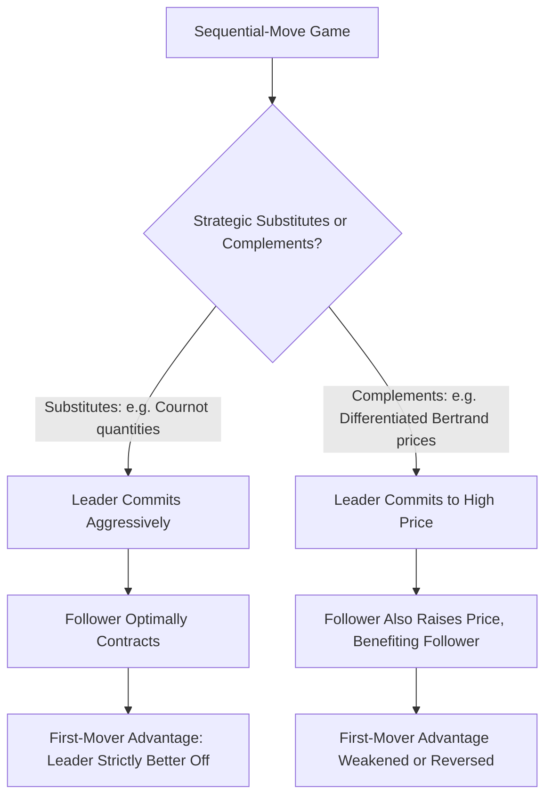
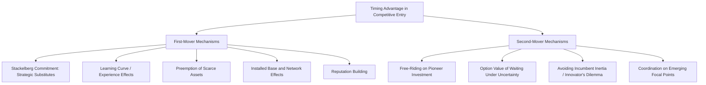

## First-Mover and Second-Mover Advantage

### Overview

The question of whether it is strategically advantageous to move first or to wait and move second in a competitive interaction is one of the most direct practical applications of extensive-form game theory to business strategy. While the Stackelberg model demonstrates a clean, unambiguous first-mover advantage in the specific context of quantity competition with strategic substitutes, the broader business strategy literature recognizes that the sign and magnitude of any timing advantage is highly context-dependent, driven by the underlying strategic variable's classification (substitutes vs. complements), the presence of irreversible commitments, demand and technology uncertainty, and the specific mechanisms through which "moving first" translates into an economic advantage or disadvantage.

### The Formal Game-Theoretic Baseline: Stackelberg Revisited

As established in the Stackelberg leadership model, when the underlying stage game exhibits **strategic substitutes** (as in Cournot quantity competition), moving first and credibly committing to an aggressive (high-output) strategy induces the follower to optimally *contract*, unambiguously benefiting the leader:

$$\pi_1^{\text{Stackelberg leader}} > \pi_i^{\text{Cournot simultaneous}} > \pi_2^{\text{Stackelberg follower}}$$

This is the cleanest possible theoretical case for first-mover advantage, but it depends critically on two features: the ability to make an **observable, irreversible commitment**, and the underlying game having a **strategic substitutes** structure. Relaxing either feature can reverse or eliminate the advantage.

### When First-Mover Advantage Reverses: Strategic Complements

Under **strategic complements** (as in differentiated Bertrand price competition), an analogous sequential-move analysis often yields a **first-mover disadvantage**, or at least a substantially weaker advantage than under substitutes. The intuition: if Firm 1 commits first to a high price, Firm 2's best response (since prices are complements, $\partial p_2^*/\partial p_1 > 0$) is to *also* raise its price — but this benefits Firm 2 without correspondingly harming Firm 1 the way a Cournot follower's *contraction* directly benefits a Stackelberg leader. In some parameterizations, the follower can even end up strictly better off than the leader, since the follower gets to react optimally to an already-fixed rival price while incurring none of the downside risk of committing first under uncertainty about the rival's eventual response.

**General principle (Gal-Or, 1985):** the sign of the first-mover advantage in a two-stage sequential game is determined by the interaction between (a) whether reaction functions slope up or down (complements vs. substitutes) and (b) whether the leader's optimal commitment shifts the follower's best response in a direction that helps or hurts the leader — a systematic taxonomy rather than a universal "first is always best" rule.

### Diagram: Timing Advantage as a Function of Strategic Variable Type

### Mechanisms Generating First-Mover Advantage (Beyond Pure Stackelberg Commitment)

The broader strategy literature (notably Lieberman and Montgomery's influential 1988 synthesis) identifies several distinct economic mechanisms, beyond the pure Stackelberg quantity-commitment logic, through which moving first can generate a durable advantage:

- **Technological leadership and learning curve effects:** early entry allows accumulation of production experience, potentially generating a cost advantage via learning-by-doing that persists even if that specific quantity-commitment advantage would not.
- **Preemption of scarce assets:** early movers can lock up scarce inputs, prime retail locations, key patents, or exclusive supplier/distributor relationships before rivals recognize their value, a mechanism distinct from but complementary to Stackelberg-style output commitment.
- **Buyer switching costs and installed base effects:** particularly in markets with network effects or significant switching costs, early customer acquisition can become self-reinforcing — an installed base attracts complementary products (per Value Net logic), which further increases the platform's value to new customers, a dynamic formalized in the tipping/coordination-game literature on standards competition.
- **Reputation and brand-building:** early market presence can allow a firm to establish brand recognition and reputation (directly connecting to the Chain Store Paradox's incomplete-information reputation mechanism) that later entrants must overcome at a cost.

### Mechanisms Generating Second-Mover Advantage

Symmetrically, Lieberman and Montgomery and subsequent literature identify concrete mechanisms favoring followers:

- **Free-riding on pioneer investments:** followers can observe and imitate a pioneer's product design, marketing approach, and market-education investments without incurring the pioneer's original R&D and market-development costs — the pioneer effectively subsidizes demand creation and consumer education that the follower can then exploit more cheaply.
- **Resolution of technological and demand uncertainty:** a follower can wait to observe which technology standard, product design, or market segment proves successful, avoiding the risk of the pioneer committing to an approach that the market ultimately rejects — this is a genuine **option value of waiting**, formally analogous to real options theory, distinct from the discrete Stackelberg commitment logic.
- **Incumbent inertia and the "innovator's dilemma":** an early leader may become organizationally or strategically anchored to its original technology or business model (sunk investments, organizational routines, channel relationships built around the original approach), making it slower to adapt when a superior alternative emerges — a mechanism more associated with Christensen's disruptive innovation framework than with formal game theory per se, but frequently cited alongside the game-theoretic first/second-mover literature as a complementary organizational-economics explanation.
- **Avoiding a Stackelberg-follower-type penalty by waiting for cooperation/coordination instead of commitment competition:** in coordination games with multiple equilibria (rather than a single dominant strategic-substitutes logic), waiting can allow a firm to observe emerging focal points and coordinate on a mutually beneficial equilibrium rather than risking a costly commitment that fails to induce the anticipated rival response.

### Formal Model Incorporating Uncertainty: The Option Value of Waiting

A stylized extension incorporates demand or technology uncertainty explicitly. Suppose a firm can enter now (period 1) facing uncertain future demand realized in period 2, or wait until period 2 to enter after uncertainty resolves. Entering early captures period-1 profits (a pioneer advantage) but forecloses the option to avoid entry if the resolved demand state turns out unfavorable, whereas waiting sacrifices the period-1 profit opportunity but avoids the downside risk. Formally, if entry cost is sunk and irreversible, and demand resolves to a bad state $\theta_L$ with probability $p$ and good state $\theta_H$ with probability $1-p$:

$$\mathbb{E}[\pi_{\text{early entrant}}] = \pi_1 + p\cdot\pi_2(\theta_L) + (1-p)\cdot\pi_2(\theta_H)$$

$$\mathbb{E}[\pi_{\text{waiting entrant}}] = p \cdot 0 + (1-p) \cdot \pi_2(\theta_H)$$

(assuming the waiting entrant avoids entering at all if the bad state $\theta_L$ is realized, since entry cost is not sunk for that firm in period 1). The early entrant gains $\pi_1$ (the pioneer profit) but is exposed to $p \cdot \pi_2(\theta_L)$, which may be negative if entry turns out to be a losing proposition in the bad state — whichever timing choice is superior depends on the specific magnitudes of $\pi_1$, $p$, and the state-contingent second-period profits, formalizing the genuine trade-off rather than presupposing either timing is universally dominant.

[Inference] This formalization captures the qualitative "option value of waiting" logic emphasized in the strategy literature, but real-world applications typically require richer, industry-specific calibration of the relevant probabilities and payoffs; the model here is illustrative of the mechanism rather than a general-purpose predictive tool.

### Empirical Evidence on First-Mover Advantage

[Inference] The empirical literature on first-mover advantage (surveyed extensively by Lieberman and Montgomery in both their original 1988 article and a 1998 follow-up reassessment) finds substantially more mixed and heterogeneous results than the clean theoretical Stackelberg prediction would suggest — pioneering firms in many industries have failed to sustain their initial advantage or have been overtaken by later entrants, while in other industries (particularly those with strong network effects or patent-protectable innovations) first-mover advantages have proven durable; the overall empirical consensus is that the timing advantage is heavily moderated by industry-specific factors (appropriability regime, capital intensity, presence of network effects, rate of technological change) rather than being a universal empirical regularity, a nuance the authors themselves emphasized was often lost in less careful applications of the concept in popular business writing.

### Diagram: Summary of Mechanisms

### Applications and Illustrative Contexts

- **Technology standards and platform markets:** early mover advantage tends to be strongest in markets with pronounced network effects and low switching costs for early adopters, where installed-base dynamics can tip the market decisively (connecting directly to coordination game and standards-war analysis).
- **Pharmaceutical and patent-intensive industries:** first-mover advantage is often strong and durable due to patent protection directly preventing imitation, removing the "free-riding on pioneer investment" mechanism that erodes first-mover advantage in less IP-protected industries.
- **Retail and consumer goods with rapidly evolving consumer preferences:** second-mover advantage is more commonly observed, since the ability to observe which product concepts and marketing approaches succeed, combined with lower switching costs for consumers, favors well-resourced fast followers over pioneers.
- **Capital-intensive industries with high sunk costs:** the Stackelberg-style capacity commitment mechanism for first-mover advantage is most directly applicable here, since capacity commitments are genuinely difficult to reverse, giving credibility to the leader's implicit "no room for you" signal to potential entrants.

**Related Topics**

- Stackelberg leadership model and sequential quantity competition
- Strategic substitutes vs. strategic complements (Bulow-Geanakoplos-Klemperer)
- The Chain Store Paradox and reputation-based deterrence
- Coordination games, network effects, and standards wars
- Real options theory and investment under uncertainty
- Competitive strategy and the Fudenberg-Tirole strategic investment taxonomy
- Co-opetition and Value Net analysis