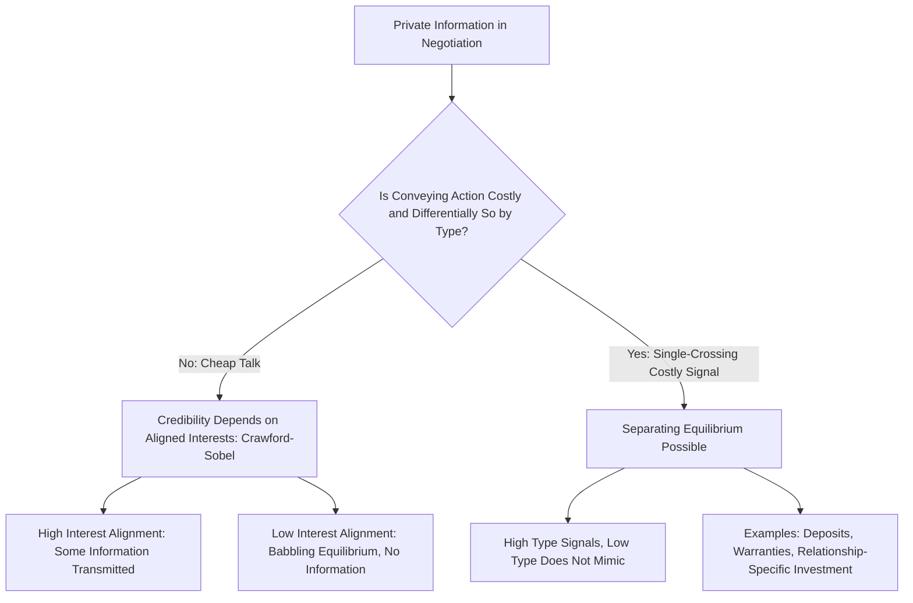

## Signaling in Business Negotiation

### Overview

Signaling theory, originating from Michael Spence's foundational 1973 job-market signaling model, formalizes how a privately informed party in a negotiation or transaction can credibly convey information about their type (quality, reservation value, cost structure, willingness to walk away) to an uninformed counterpart through a costly action, rather than through cheap talk alone. Applied to business negotiation, signaling theory explains a wide range of otherwise puzzling negotiation behaviors — costly concessions, elaborate due diligence demands, extravagant opening offers, and deliberately wasteful commitment gestures — as rational responses to the fundamental problem that unverified verbal claims about one's own type or reservation value are not, absent some costly action, credible.

### The Core Signaling Problem in Negotiation

Consider a bilateral negotiation (buyer and seller, or two firms negotiating a partnership) in which one party — say, the seller — has private information about a payoff-relevant type $\theta \in \{\theta_L, \theta_H\}$ (e.g., the true quality of an asset, their true cost of production, or their true reservation value/outside option), unknown to the other party (the buyer).

**Why cheap talk fails:** If the seller could simply announce "I am type $\theta_H$" and be believed, every seller — regardless of true type — would have an incentive to make that announcement whenever $\theta_H$ leads to a more favorable negotiated outcome. Since announcements are costless and this incentive is common knowledge, a rational buyer should not update their beliefs based on unverified cheap-talk claims alone (formally, cheap-talk equilibria in this setting typically collapse to "babbling," where messages carry no information, unless the parties' interests are sufficiently aligned — the Crawford-Sobel cheap talk framework formalizes exactly how much information can be credibly conveyed as a function of the degree of preference alignment between sender and receiver).

**The signaling solution:** If the seller can instead take a **costly action** whose cost differs systematically by type — specifically, satisfying a **single-crossing property** where the marginal cost of the signaling action is lower for the high type than the low type — then a separating equilibrium can exist in which only the high type finds it worthwhile to take the costly action, making the action itself a credible (because costly and differentially costly by type) signal of the underlying type.

### The Single-Crossing Property (Formal Condition)

Let $s$ denote the costly signaling action (e.g., time invested in due diligence preparation, size of an earnest-money deposit, willingness to accept a long exclusivity period) and $C(s, \theta)$ the cost of taking action $s$ for a party of type $\theta$. The single-crossing property requires:

$$\frac{\partial}{\partial \theta}\left(\frac{\partial C(s,\theta)}{\partial s}\right) < 0$$

meaning the marginal cost of higher signaling effort is strictly decreasing in type quality $\theta$ (i.e., it is cheaper at the margin for a genuinely high-quality party to signal high quality than it would be for a low-quality party to mimic that same signal) — this is the structural condition that makes credible, costly separation possible at all, and its absence is precisely why cheap talk alone cannot achieve the same separation.

### The Separating Equilibrium Condition

For a signal level $s^*$ to support a separating equilibrium where only the high type sends $s^*$ and the low type sends $s = 0$ (or some lower baseline level), the following incentive compatibility conditions must hold:

$$\text{High type prefers signaling: } B(\theta_H) - C(s^*, \theta_H) \geq B(\theta_L) - C(0, \theta_H)$$

$$\text{Low type prefers not mimicking: } B(\theta_L) - C(0, \theta_L) \geq B(\theta_H) - C(s^*, \theta_L)$$

where $B(\theta)$ denotes the negotiated benefit obtained by being perceived as type $\theta$. The single-crossing property ensures a **range** of signal levels $s^*$ exists satisfying both constraints simultaneously — this range is often summarized graphically as the region between the low type's and high type's indifference curves in $(s, B)$ space, a diagram standard throughout the signaling literature.

### Diagram: Separating Equilibrium via Single-Crossing Property

<svg xmlns="http://www.w3.org/2000/svg" viewBox="0 0 560 420" font-family="Arial, sans-serif" font-size="13">
<title>Signaling Separating Equilibrium Single-Crossing Diagram (svg_diagram)</title>
<line x1="60" y1="380" x2="500" y2="380" stroke="#333" stroke-width="2" />
<line x1="60" y1="380" x2="60" y2="40" stroke="#333" stroke-width="2" />
<text x="480" y="400" fill="#333">Signal level s</text>
<text x="20" y="50" fill="#333">Perceived Benefit B</text>
<path d="M 60 340 Q 250 280 420 60" stroke="#cc4422" fill="none" stroke-width="2" />
<text x="300" y="130" fill="#cc4422">Low-type indifference curve (steep)</text>
<path d="M 60 360 Q 250 340 420 200" stroke="#2266cc" fill="none" stroke-width="2" />
<text x="300" y="330" fill="#2266cc">High-type indifference curve (flatter)</text>
<rect x="180" y="150" width="90" height="150" fill="#eef" fill-opacity="0.5" stroke="#888" stroke-dasharray="4" />
<text x="180" y="140" fill="#000">Feasible separating signal range s*</text>
</svg>

### Applications to Common Business Negotiation Tactics

Signaling theory reframes a wide array of standard negotiation behaviors as instances of the costly-signal-with-single-crossing-property structure:

- **Earnest money deposits and non-refundable commitments in deal-making:** a buyer offering a large, non-refundable deposit signals genuine seriousness/high valuation, since a buyer with a low true valuation would find the risk of forfeiting the deposit (if the deal ultimately falls through for reasons correlated with low valuation) too costly relative to the expected benefit of appearing serious — the single-crossing property here rests on the deposit being more costly (in expected forfeiture terms) for a low-valuation buyer.
- **Extensive/costly due diligence demands:** a buyer's willingness to invest substantial resources in due diligence can signal genuine interest and financial capability to close, since a buyer without real intent to close would not rationally incur those costs.
- **Warranties and guarantees as quality signals:** a seller offering an extensive warranty on a product or service signals genuine confidence in quality, since offering the same warranty terms would be more costly (in expected future claim payouts) for a seller who privately knows their product is low quality — this is the direct negotiation/contracting analog of Spence's original education-signaling model, applied to product quality rather than labor market ability.
- **Reputation and relationship-specific investment as signals of long-term commitment:** a party's willingness to make relationship-specific investments (customized systems, dedicated personnel, long lead-time commitments) signals genuine long-term intent, since such investments would be a poor use of resources for a party planning to exit the relationship quickly — directly connecting to the hold-up/relationship-specific investment logic from contract theory foundations, but here operating as a *voluntary, informative* signal rather than merely as a source of ex post bargaining vulnerability.
- **Anchoring with extreme opening offers:** while classic anchoring effects are often explained through purely psychological/behavioral channels (as covered in the critiques of rational choice assumptions chapter), a game-theoretic signaling interpretation holds that an aggressive opening offer can, under some circumstances, signal a genuinely strong outside option or high reservation value — though this interpretation requires the aggressive offer to be at least somewhat costly or risky (e.g., risking impasse or reputational cost) to the sender, since a costless aggressive announcement collapses back into unconvincing cheap talk.

### Distinguishing Costly Signaling from Cheap Talk in Negotiation

A key practical and theoretical distinction is between genuine costly signals (satisfying single-crossing, and hence credible) and cheap talk (costless statements, credible only under sufficiently aligned interests per the Crawford-Sobel framework). Negotiators frequently attempt to blur this distinction — presenting essentially costless claims (a stated "final offer," a claimed competing bid) as though they were binding, costly commitments — and much of the tactical negotiation literature on detecting bluffs and testing credibility can be understood as the receiver's side of exactly this signaling/cheap-talk distinction problem: a sophisticated counterparty should discount claims that are not backed by some genuinely costly or difficult-to-reverse action, while appropriately updating beliefs in response to claims that are.

### Diagram: Signaling vs. Cheap Talk in Negotiation

### Signal-Jamming and Counter-Signaling

Two refinements of the basic signaling model are particularly relevant to sophisticated negotiation strategy:

- **Signal-jamming:** when the informed party can take actions that manipulate the *uninformed* party's inference process itself (beyond simply choosing a costly signal level), potentially including actions that are informative-looking but deliberately uninformative or misleading, creating a more adversarial signaling environment than the baseline Spence model where signaling actions are assumed to have a fixed, type-dependent cost structure known to both sides.
- **Countersignaling:** in some settings, the *most* confident/highest types deliberately **avoid** costly signaling (e.g., an extremely strong negotiating party may forgo elaborate credential displays or aggressive tactics precisely because doing so would be beneath or unnecessary for a party of their evident strength), while medium types signal most vigorously and the weakest types do not signal at all — a U-shaped rather than strictly monotonic relationship between type and signaling intensity, documented formally in Feltovich, Harbaugh, and To's countersignaling model, relevant to understanding why the most powerful negotiating parties sometimes negotiate with conspicuous simplicity or brevity rather than elaborate positioning.

[Inference] The applicability of specific countersignaling dynamics to any given real-world negotiation context depends on the receiver correctly understanding the countersignaling logic itself; if a receiver naively interprets the absence of signaling as low type rather than potentially very high type, the countersignaling equilibrium may not be self-sustaining, an important qualification noted in the theoretical literature on this refinement.

### Empirical and Practical Considerations

[Inference] While the formal signaling framework provides a rigorous logical structure for understanding why certain costly negotiation behaviors are credible, real-world negotiators' actual behavior is shaped by a complex mix of genuine signaling motives, behavioral biases (overconfidence, anchoring effects, loss aversion as covered under critiques of rational choice), and relationship/reputational considerations extending beyond any single negotiation episode — the formal model is best understood as isolating one specific, rigorously justified mechanism among several operative forces in real negotiations, rather than as a complete positive theory of negotiator behavior.

**Related Topics**

- Signaling games and the Spence education model (labor market application)
- Cheap talk and the Crawford-Sobel model
- Principal-agent problems: screening as the mirror image of signaling
- Contract theory foundations and relationship-specific investment
- Bargaining theory and the Nash bargaining solution
- Behavioral and experimental negotiation research (anchoring, overconfidence)
- Perfect Bayesian equilibrium and belief updating off the equilibrium path