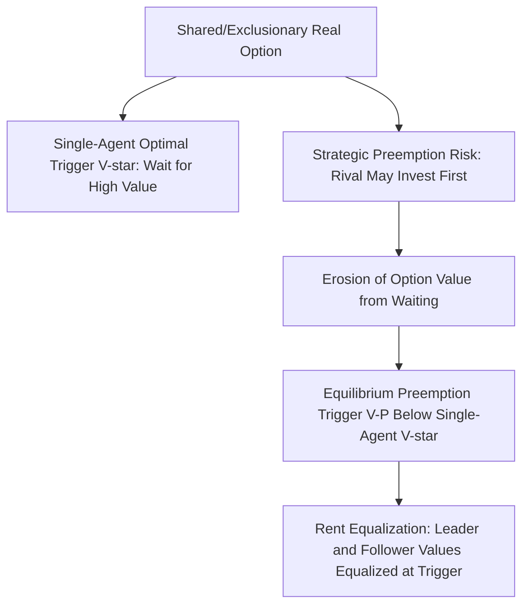
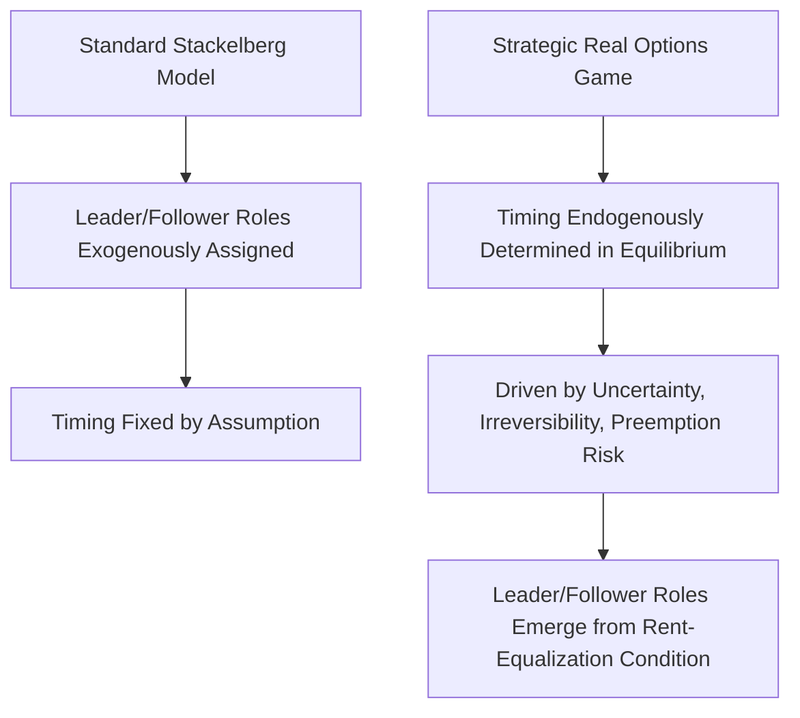

## Real Options as Strategic Games

### Overview

Real options theory applies the mathematical machinery of financial options pricing to real (non-financial) investment decisions characterized by irreversibility, uncertainty, and the ability to delay — recognizing that the option to wait, expand, contract, or abandon an investment has genuine economic value that standard net present value (NPV) analysis ignores. When multiple strategic players each hold real options whose values depend on rivals' investment and exercise decisions, the analysis becomes a genuinely game-theoretic problem — a **strategic real options game** — requiring the integration of option-value reasoning (from Black-Scholes/binomial option pricing theory) with equilibrium concepts from extensive-form game theory (subgame perfection, preemption dynamics, and war-of-attrition timing games).

### Real Options: The Basic Non-Strategic Framework

The foundational real options insight (Dixit and Pindyck, 1994) is that an irreversible investment opportunity is analogous to a financial call option: the firm holds the **right, but not the obligation**, to invest at a cost $I$ in exchange for an uncertain future payoff $V$, and this option has positive value even when immediate investment has zero or negative NPV, because of the **option value of waiting** to resolve uncertainty about $V$.

**The investment trigger rule:** Rather than investing whenever $V \geq I$ (the naive NPV rule), the optimal real-options investment rule is to invest only when $V$ exceeds a higher **trigger value** $V^* > I$, where the gap $V^* - I$ reflects the value of the option being "given up" by investing now rather than preserving the flexibility to wait:

$$V^* = \frac{\beta}{\beta - 1} \cdot I$$

for the standard geometric Brownian motion formulation, where $\beta > 1$ is a parameter derived from the underlying stochastic process's drift, volatility, and discount rate. **Key qualitative result:** the investment trigger $V^*$ is **increasing in volatility** — greater uncertainty about future payoffs makes waiting more valuable, raising the bar for immediate investment, the opposite of the naive intuition that "riskier projects should be evaluated more cautiously by requiring the same fixed hurdle rate," since here the entire trigger threshold itself shifts with volatility.

### Why Real Options Become Strategic Games

The single-agent real options framework above treats $V$ as an exogenous stochastic process unaffected by the decision-maker's own actions or any rival's actions. This assumption breaks down whenever:

- **Multiple firms hold competing/exclusionary options on the same opportunity:** if only one firm can ultimately capture the investment opportunity (e.g., entering a market with limited room for a single successful entrant, or securing a scarce resource), then one firm's exercise of its option to invest actively destroys or diminishes the value of a rival's otherwise-identical option — this interdependence converts an individual optimal-stopping problem into a genuinely multi-player game.
- **Investment by one firm changes the option value of a rival's option:** in oligopolistic settings, one firm's capacity expansion or product launch changes the market conditions ($V$ or its distribution) faced by rivals holding similar investment options, directly analogous to how Cournot/Stackelberg quantity choices affect rivals' profit functions.

### The Preemption Game: Racing to Exercise a Shared Option

The canonical strategic real options game is the **preemption game** (formalized by Fudenberg and Tirole, 1985, in their broader war-of-attrition/preemption framework, and specifically applied to real options by Grenadier, among others): two symmetric firms each hold the option to invest in a market opportunity that will be significantly less valuable (or entirely unavailable) to whichever firm invests second.

**Key strategic tension:** Waiting has option value (per the standard single-agent real-options logic — waiting resolves uncertainty), but waiting also risks the rival investing first and capturing the preemptive advantage. This creates a strategic trade-off structurally similar to a **war of attrition**, except the "prize" for moving first (rather than for outlasting a rival) is the preemptive capture of the investment opportunity.

**Equilibrium characterization:** Under the standard symmetric preemption game setup, the unique symmetric subgame perfect equilibrium typically involves both firms investing **earlier** than the single-agent optimal-stopping trigger $V^*$ would prescribe — the fear of being preempted erodes some of the option value of waiting, since a firm that waits too long risks the rival capturing the entire opportunity first. Formally, the equilibrium preemption trigger $V^P$ satisfies:

$$V^P < V^*_{\text{single-agent monopoly trigger}}$$

reflecting a **rent equalization** condition: in the standard symmetric preemption equilibrium, the leader's investment trigger is set exactly at the point where the value of being the leader equals the value of remaining a follower and waiting — if this equality did not hold, one role would be strictly preferred, incentivizing pure the other player to preempt.

### Diagram: Preemption Game Logic

### Real Options Games and Cournot/Stackelberg Integration

A substantial theoretical literature (particularly associated with Steven Grenadier's work applying real options games to real estate and other capital-intensive industries) integrates the preemption/option-value framework directly with the Cournot and Stackelberg oligopoly models covered earlier in this syllabus:

- **Grenadier's option exercise game in Cournot markets:** firms hold options to add capacity, and each firm's optimal exercise trigger depends on anticipated future capacity additions by rivals, generating an equilibrium in which capacity is added **incrementally and non-simultaneously**, timed strategically to balance the option value of waiting against the risk of being preempted or of missing a favorable demand realization relative to rivals.
- **Comparison with the standard Stackelberg timing:** unlike the standard Stackelberg model (where the leader's first-mover role and timing are exogenously fixed by assumption), strategic real options games typically **endogenize the timing decision itself** as an equilibrium outcome, determined by the interaction of uncertainty, irreversibility, and strategic preemption risk, rather than assumed a priori — this is one of the framework's most significant contributions relative to the earlier, timing-exogenous industrial organization models.

### Diagram: Real Options Games vs. Standard Oligopoly Timing Models

### War of Attrition Applications: Exit Rather Than Entry Options

A closely related strategic real options game concerns **exit** (abandonment) rather than entry: firms in a declining industry with excess capacity each hold a real option to exit (abandon sunk, industry-specific capital), but if only one firm needs to exit for the remaining firm(s) to become profitable again, each firm has an incentive to **delay** exit, hoping the rival exits first — the reverse-preemption structure of a classic **war of attrition**. Ghemawat and Nalebuff's (1985) formal analysis of this "shakeout" dynamic shows that, under symmetric costs, the equilibrium typically involves randomized (mixed-strategy) exit timing, since neither firm has a dominant reason to exit before the other absent an asymmetry (e.g., differing capacity levels, with the analysis showing that the **larger** firm — counter to a naive "deep pockets" intuition — often has a stronger incentive to exit first in some formulations, since its losses from continued operation in an overcrowded market scale with its own capacity).

### Applications

- **Natural resource extraction (oil, mining) investment timing:** the option to develop a resource deposit, sensitive to volatile commodity prices, is a textbook real options application; when multiple firms hold adjacent or overlapping claims, extraction timing becomes a strategic preemption game reflecting concerns about drainage or first-mover capture of favorable price windows.
- **Real estate development:** Grenadier's original applications analyze how developers' land-development timing decisions in a given market are strategically interdependent, since one developer's completed project changes local supply/demand conditions faced by others holding adjacent undeveloped land options.
- **R&D patent races:** technology development races, where the first firm to successfully innovate and patent captures the entire value (a winner-take-all structure closely analogous to the entry preemption game), are frequently modeled using a hybrid of real options (uncertain R&D success timing) and preemption-game strategic structure.
- **Industry shakeouts and capacity rationalization:** declining industries with persistent excess capacity (e.g., historical shakeouts in industries facing demand decline or foreign competition) are commonly analyzed using the war-of-attrition exit-timing framework, explaining observed patterns of prolonged coexistence of loss-making competitors before eventual exit.

[Inference] While the qualitative predictions of strategic real options games (equilibrium timing earlier than single-agent optimal stopping under preemption risk; randomized exit timing under symmetric war-of-attrition conditions) are well-established theoretically, precise quantitative calibration of real-world investment timing to these models requires industry-specific estimation of volatility, irreversibility costs, and competitive structure that is considerably more data-intensive than applying the qualitative framework alone, a standard caveat in applied corporate finance and industrial organization work using these models.

**Related Topics**

- Stackelberg leadership model and endogenous timing games
- First-mover and second-mover advantage
- War of attrition games and their equilibrium characterization
- Cournot competition and capacity investment games
- Financial option pricing theory (Black-Scholes, binomial models) as a mathematical foundation
- Patent races and R&D competition
- Entry deterrence and the Chain Store Paradox