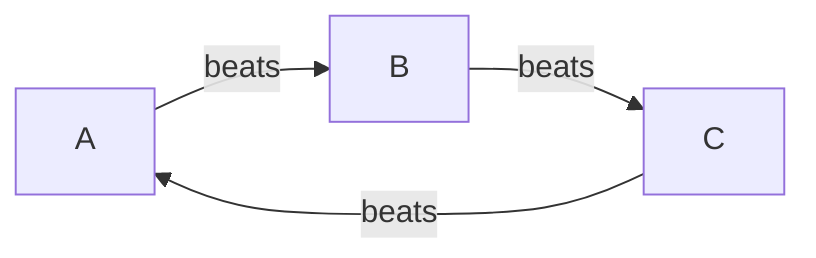
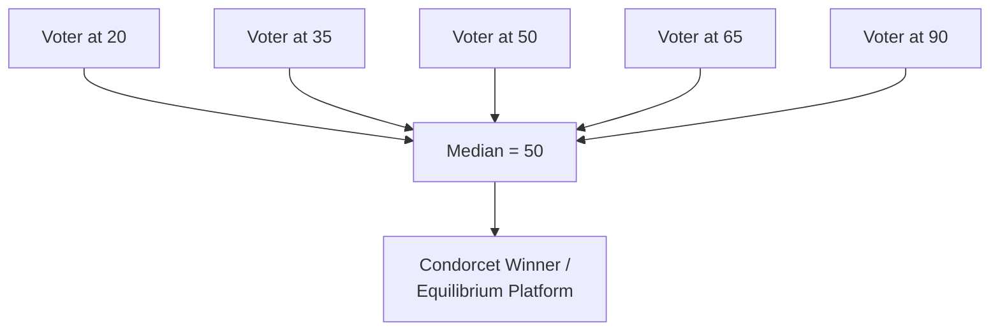

## Voting Theory and Social Choice

### Overview

Voting theory and social choice theory study how individual preferences over a set of alternatives can be aggregated into a collective decision. The field sits at the intersection of game theory, welfare economics, and mathematical logic, and asks a deceptively simple question: given that a group of people hold different rankings over candidates or outcomes, is there a "fair" or "rational" way to combine those rankings into a single group decision?

Game theory enters this field in two ways. First, voting rules are mechanisms, and mechanism design asks whether a rule can be structured so that truthful reporting of preferences is a dominant or equilibrium strategy. Second, voters and candidates are strategic agents; a voting rule induces a game in which voters choose how to vote (sincerely or strategically) and candidates choose platforms or entry decisions. Social choice theory provides the impossibility results that bound what any mechanism can achieve, while game-theoretic analysis characterizes the equilibrium behavior that arises under a given rule.

### Formal Setup

**Key Points**

- A set of alternatives (candidates) $A = \{a_1, a_2, \ldots, a_m\}$.
- A set of voters $N = \{1, 2, \ldots, n\}$.
- Each voter $i$ has a preference ordering $\succ_i$, a complete, transitive, antisymmetric ranking over $A$.
- A preference profile is the vector $(\succ_1, \succ_2, \ldots, \succ_n)$ of all voters' rankings.
- A social welfare function (SWF) $F$ maps a profile to a single social ranking $\succ$ over $A$.
- A social choice function (SCF) maps a profile to a single winning alternative (or a set of tied winners) $a^* \in A$.

The distinction between SWF and SCF matters: an SWF produces a full ranking (useful when a complete ordering of outcomes is needed, e.g., committee seat allocation), while an SCF only needs to select a winner (the typical case in single-office elections).

### Voting Rules

**Plurality Rule**

Each voter names one candidate; the candidate with the most votes wins. Formally, $a^*$ maximizes $|\{i : \text{top}(\succ_i) = a\}|$.

- Simple and widely used (US presidential primaries, UK general elections).
- Vulnerable to vote-splitting among similar candidates, which can let a polarizing candidate win with a plurality but not a majority.

**Plurality with Runoff (Two-Round System)**

If no candidate exceeds 50% in round one, the top two candidates face a second round. Reduces vote-splitting relative to plain plurality but retains susceptibility to "spoiler" dynamics before the runoff and can produce different outcomes depending on which two candidates advance.

**Ranked-Choice Voting / Instant-Runoff Voting (IRV)**

Voters submit a full or partial ranking. The candidate with the fewest first-place votes is eliminated, and their votes transfer to the next-ranked candidate on each ballot; this repeats until one candidate has a majority.

- Used in Australia (House of Representatives), Ireland (presidential elections), and several US jurisdictions (e.g., Maine, Alaska statewide races).
- Satisfies the majority criterion and reduces (but does not eliminate) spoiler effects.
- Not monotonic in general: [Inference — depends on specific profile structure] it is possible, though empirically rare, for a candidate to be harmed by receiving additional first-place support, a property called a "monotonicity failure."

**Borda Count**

Each voter ranks all $m$ candidates; a candidate ranked in position $k$ (from the top, 1-indexed) receives $m - k$ points. The candidate with the highest point total wins.

$$\text{Score}(a) = \sum_{i=1}^{n} (m - \text{rank}_i(a))$$

- Rewards broad acceptability over narrow intensity of support.
- Highly sensitive to irrelevant alternatives: adding or removing a losing candidate can flip the ranking of the remaining candidates (a documented weakness even in real committee use, historically criticized by Borda's contemporary Condorcet).

**Approval Voting**

Each voter approves (votes for) any subset of candidates they find acceptable; the candidate approved by the most voters wins.

- Simple ballot, no ranking required.
- Encourages sincere approval of multiple acceptable candidates and tends to elect broadly acceptable candidates rather than narrowly polarizing ones.

**Condorcet Methods**

A Condorcet winner is a candidate who would defeat every other candidate in a pairwise majority comparison. Condorcet methods (e.g., Copeland's method, the Schulze method, Ranked Pairs) are designed to elect the Condorcet winner whenever one exists.

- Condorcet winners do not always exist, because pairwise majority preference can cycle (see Condorcet's Paradox below).
- When a Condorcet winner exists, most theorists regard electing it as a strong normative desideratum.

**Score Voting (Range Voting)**

Voters rate each candidate on a numerical scale (e.g., 0–10); scores are summed or averaged, and the highest total wins.

### Condorcet's Paradox

**Example**

Consider three voters and three candidates $\{A, B, C\}$ with the following strict preferences:

- Voter 1: $A \succ B \succ C$
- Voter 2: $B \succ C \succ A$
- Voter 3: $C \succ A \succ B$

Pairwise majority comparisons:

- $A$ vs $B$: Voters 1 and 3 prefer $A$ → $A$ wins 2-1.
- $B$ vs $C$: Voters 1 and 2 prefer $B$ → $B$ wins 2-1.
- $C$ vs $A$: Voters 2 and 3 prefer $C$ → $C$ wins 2-1.

The majority relation is cyclic: $A \succ B \succ C \succ A$. No candidate is a Condorcet winner, and the social preference relation produced by pairwise majority rule is intransitive even though every individual voter's preferences are transitive. This demonstrates that transitivity of individual preferences does not guarantee transitivity of the aggregated social preference.

### Arrow's Impossibility Theorem

Kenneth Arrow (1951) asked whether any SWF aggregating three or more alternatives could simultaneously satisfy a small set of seemingly minimal fairness conditions:

1. **Unrestricted Domain (Universality):** the SWF accepts any logically possible profile of individual rankings.
2. **Pareto Efficiency (Unanimity):** if every voter prefers $a$ to $b$, the social ranking places $a$ above $b$.
3. **Independence of Irrelevant Alternatives (IIA):** the social ranking of $a$ versus $b$ depends only on how voters rank $a$ versus $b$, not on how they rank other candidates.
4. **Non-Dictatorship:** no single voter's preferences determine the social ranking regardless of all other voters.

**Theorem (Arrow, 1951/1963).** For $m \geq 3$ alternatives, no SWF can satisfy Unrestricted Domain, Pareto Efficiency, IIA, and Non-Dictatorship simultaneously.

The proof typically proceeds by showing that any SWF satisfying the first three conditions must have a "decisive" voter for every pair of alternatives, and that decisiveness over one pair forces decisiveness over all pairs, yielding a dictator. This is a genuine mathematical result, not an empirical claim: it holds for any conceivable aggregation rule under the stated axioms, not merely the rules in common use.

The theorem's practical implication is that every voting rule used in practice necessarily violates at least one of the four conditions. Plurality and Borda violate IIA (adding or removing a candidate can change the relative ranking of two other candidates). Systems that guarantee a Condorcet winner exists trivially (by restricting the domain) violate Unrestricted Domain.

### Gibbard–Satterthwaite Theorem

A closely related result addresses strategic voting directly. The Gibbard–Satterthwaite theorem states that for any SCF with at least three possible outcomes, unrestricted domain, and that is not dictatorial, there exists some preference profile under which a voter can obtain a preferred outcome by misreporting their true preferences — that is, the rule is not strategy-proof.

$$\text{No SCF with } |A| \geq 3 \text{ is simultaneously: onto, non-dictatorial, and strategy-proof.}$$

This is the social-choice analogue of Arrow's theorem, phrased directly in terms of incentive compatibility, and it is what connects social choice theory to mechanism design: strategic manipulation of voting rules is not a design flaw specific to any one system but a mathematically unavoidable feature of any reasonable rule when three or more alternatives are possible.

### Sen's Liberal Paradox

Amartya Sen (1970) demonstrated a further tension: no SWF can simultaneously satisfy Unrestricted Domain, Pareto Efficiency, and even a minimal notion of individual liberty (each individual is "decisive" over at least one pair of alternatives that concerns only them, e.g., what color to paint their own bedroom). This shows that Pareto efficiency and individual rights protection can directly conflict, even before considering strategic behavior.

### May's Theorem: A Positive Result

Not all results in the field are impossibility results. Kenneth May (1952) showed that for exactly two alternatives, simple majority rule is the *unique* SWF satisfying:

1. **Anonymity** (voter identities don't matter — permuting who casts which vote doesn't change the outcome),
2. **Neutrality** (candidate labels don't matter — relabeling the alternatives relabels the outcome accordingly),
3. **Positive Responsiveness** (if the outcome is a tie or a win for $a$, and one voter switches to $a$, the outcome becomes a win for $a$).

May's theorem is often read as an axiomatic vindication of majority rule specifically in the two-candidate case, in contrast to the difficulties that emerge once a third alternative is introduced.

### Strategic Voting

**Key Points**

- **Compromising:** a voter ranks a less-preferred but more viable candidate above their true favorite to avoid "wasting" their vote (common under plurality).
- **Burying:** a voter ranks a strong rival artificially low, below even less-preferred candidates, to damage that rival's standing (a documented strategic vulnerability under Borda count).
- **Push-over:** in some multi-round systems, a voter's coalition strategically helps a weak candidate advance past an elimination round because they are believed easier to beat later.

**Example**

Under plurality, if voters truly rank $A \succ B \succ C$ but pre-election polling shows $B$ and $C$ are the only competitive candidates, a voter may vote for $B$ (compromising) rather than "waste" a vote on $A$. This is the standard game-theoretic explanation for Duverger's Law: plurality elections tend toward two-party systems because rational, strategic voters abandon candidates perceived as non-viable.

### Duverger's Law

**Key Points**

- Empirical/theoretical regularity: single-member-district plurality ("first-past-the-post") systems tend toward two dominant parties.
- Mechanical effect: smaller parties are mechanically underrepresented in seat share relative to vote share because they rarely place first in any single district.
- Psychological effect: strategic voters and donors anticipate the mechanical effect and shift support away from perceived non-viable candidates in advance, reinforcing the two-party equilibrium.
- Proportional representation systems do not exhibit the same mechanical penalty against smaller parties, and empirically tend to sustain multi-party systems. [Inference — this is a well-documented comparative-politics regularity rather than a strict mathematical theorem, and exceptions exist]

### Median Voter Theorem

In a one-dimensional policy space (e.g., a left–right ideological spectrum) where voters have single-peaked preferences (each voter has one ideal point and prefers alternatives closer to it), and candidates choose platforms to maximize votes under majority rule between two candidates, the median voter's ideal point is a Condorcet winner and is the unique majority-rule equilibrium.

$$x^* = \text{median}(\{x_1, x_2, \ldots, x_n\})$$

where $x_i$ is voter $i$'s ideal point on the policy line.

**Example**

Suppose voter ideal points on a 0–100 left-right scale are $\{20, 35, 50, 65, 90\}$. The median is 50. Any platform other than 50 can be defeated in a pairwise majority vote by a platform closer to 50 on the side with more remaining voters. Two office-motivated candidates competing for votes are therefore predicted to converge toward $x = 50$, a result known as the Hotelling-Downs convergence result in spatial voting models.

This result depends critically on the single-peakedness assumption and the one-dimensionality of the policy space; in two or more dimensions, McKelvey's chaos theorem shows that majority rule generally has no stable equilibrium and that the agenda-setter can, through a sequence of pairwise votes, engineer a path from any outcome to any other outcome.

### Single-Peaked Preferences and the Black Median Voter Theorem

Duncan Black (1948) formalized the condition under which a Condorcet winner is guaranteed to exist even with more than two candidates: if all voters' preferences over a one-dimensional ordering of alternatives are single-peaked (each voter's utility strictly decreases as alternatives move away from their ideal point in either direction), then the median voter's most preferred alternative is a Condorcet winner and majority rule produces a transitive, well-defined social ranking. This is the domain-restriction escape from Arrow's theorem: restricting the space of admissible preference profiles (violating Unrestricted Domain) can restore consistent majority rule.

### Voting Power Indices

Where voting is weighted (e.g., shareholder votes, EU Council of Ministers, US Electoral College), game-theoretic power indices measure a voter's influence, which need not be proportional to their raw vote weight.

**Shapley-Shubik Index**

Measures the probability that a voter is "pivotal" — the voter whose vote changes a losing coalition into a winning one — averaged over all possible orderings in which voters could join a coalition.

\phi_i = \sum_{S \subseteq N \setminus \{i\}} \frac{|S|!(n - |S| - 1)!}{n!} \left[v(S \cup \{i\}) - v(S)\right]$​

where $v(S)$ is 1 if coalition $S$ can pass a decision and 0 otherwise.

**Banzhaf Index**

Counts the number of winning coalitions in which a voter is a "swing" voter (removing them turns a winning coalition into a losing one), divided by the total number of coalitions the voter could belong to (or normalized across all voters).

**Example**

Consider a weighted voting body with weights $\{50, 49, 1\}$ and a passage threshold of 51 (simple majority of 100 total votes). Naively, the voter with weight 1 seems nearly powerless. But:

- Coalition $\{50, 1\}$: total 51, passes. Voter 1 (weight 1) is pivotal (50 alone fails).
- Coalition $\{49, 1\}$: total 50, fails.
- Coalition $\{50, 49\}$: total 99, passes without voter 3.
- Coalition $\{50, 49, 1\}$: total 100, passes; the last voter to join is pivotal.

Careful enumeration of all orderings shows the weight-1 voter has exactly the same Shapley-Shubik power as the weight-49 voter in this specific configuration, illustrating that raw vote weight is a poor proxy for actual decisive power — this is the standard textbook illustration of the paradox of voting weight.

### Liquid Democracy and Delegative Voting

**Key Points**

- A newer institutional design (used in some digital platforms and party internal votes, e.g., early German Pirate Party tooling) in which voters may either vote directly or delegate their vote to a trusted proxy, who may further delegate.
- Framed game-theoretically as a hybrid between direct democracy (every voter decides every issue) and representative democracy (voters delegate permanently to elected representatives).
- Open research questions include delegation cycles, concentration of delegated voting power in a small number of "super-delegates," and strategic incentives to delegate versus vote directly. [Speculation — this is an active and comparatively less mature research area relative to classical social choice theory, and formal equilibrium characterizations are less settled than for classical voting rules]

### Comparative Summary of Voting Rules

| Rule | Guarantees Condorcet Winner | Strategy-Proof | Satisfies IIA |
| --- | --- | --- | --- |
| Plurality | No | No | No |
| Two-Round Runoff | No | No | No |
| IRV / Ranked-Choice | No | No | No |
| Borda Count | No | No | No |
| Approval Voting | No | No | Partially (approval sets) |
| Condorcet Methods (Schulze, Ranked Pairs) | Yes, when one exists | No | No |
| Majority Rule (2 candidates only) | Yes (trivially) | Yes | Yes |

By the Gibbard-Satterthwaite theorem, the "No" entries in the strategy-proof column for $m \geq 3$ candidates are not incidental design failures — they are mathematically unavoidable for any non-dictatorial rule with unrestricted domain.

### Conclusion

Voting theory and social choice demonstrate, with mathematical rigor, that there is no neutral or purely technical way to aggregate individual preferences into a collective decision once three or more alternatives are on the table. Arrow's and Gibbard-Satterthwaite's theorems establish hard impossibility boundaries; May's and Black's theorems identify the narrow but real domains (two alternatives, or single-peaked preferences) in which consistent, strategy-resistant rules do exist. Game-theoretic analysis of voter and candidate strategy — spatial competition, strategic voting, and power indices — explains how real political institutions behave within, and around, these theoretical limits.

**Related Topics**

- Mechanism Design and Incentive Compatibility
- Spatial Models of Political Competition (Hotelling-Downs, Multidimensional Extensions)
- McKelvey's Chaos Theorem and Agenda-Setting Power
- Coalition Formation Games and the Core
- Cooperative Game Theory and Cost/Surplus-Sharing Solutions
- Fair Division and Apportionment Methods (Jefferson, Webster, Huntington-Hill)
- Mechanism Design in Auctions (contrast with voting mechanisms)