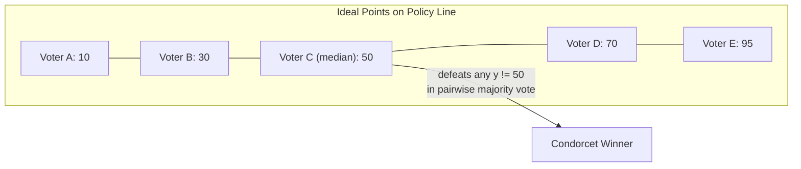
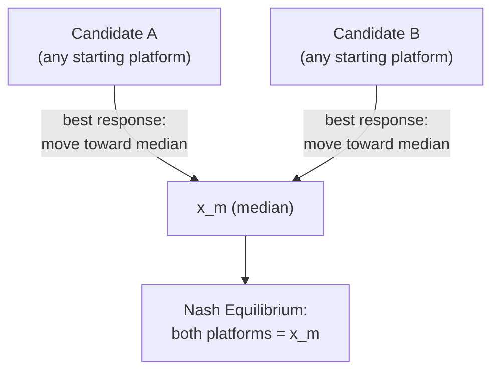

## The Median Voter Theorem

### Statement of the Theorem

The Median Voter Theorem (MVT) is a foundational result in spatial voting theory, formalized by Duncan Black (1948) and later popularized in the context of two-party electoral competition by Anthony Downs (1957). In its canonical form:

**Theorem.** Suppose policy alternatives lie on a single-dimensional continuum (e.g., a left-right ideological axis), each voter $i$ has a single-peaked preference with ideal point $x_i$, and the number of voters $n$ is odd (or ties are resolved by a fixed rule). Then under pairwise majority rule, the alternative located at the median of the voters' ideal points, $x_m$, defeats every other alternative and is therefore the unique Condorcet winner.

$$x_m = \text{median}(x_1, x_2, \ldots, x_n)$$

### Assumptions

**Key Points**

- **One-dimensional policy space:** all alternatives can be ordered on a single line (e.g., tax rate, left-right ideology score).
- **Single-peaked preferences:** each voter has one ideal point $x_i$, and utility strictly decreases as the distance from $x_i$ increases in either direction. Formally, for voter $i$ with ideal point $x_i$: if $x_i \leq y < z$ or $z < y \leq x_i$, then $u_i(y) > u_i(z)$.
- **Majority rule:** the alternative preferred by more than half the voters in any pairwise comparison wins.
- **Sincere voting:** voters vote according to their true preferences rather than strategically (the theorem's basic form does not model strategic voting).

Single-peakedness is the critical restriction. It is precisely the domain restriction that allows majority rule to escape the cyclical outcomes permitted by Condorcet's Paradox and ruled out in general by Arrow's Impossibility Theorem, since Arrow's theorem assumes an unrestricted preference domain.

### Why the Median Wins: Proof Sketch

Let $x_m$ be the median ideal point, and let $y \neq x_m$ be any other alternative on the line. Without loss of generality, assume $y < x_m$ (the argument is symmetric for $y > x_m$).

Every voter whose ideal point satisfies $x_i \geq x_m$ prefers $x_m$ to $y$, because $x_m$ is closer to their ideal point than $y$ is (single-peakedness). By definition of the median, at least half of all voters have $x_i \geq x_m$, so at least half prefer $x_m$ over $y$. Combined with the median voter's own preference for $x_m$ (a policy exactly at their ideal point) over $y$, this constitutes a strict majority. Hence $x_m$ defeats $y$ in a pairwise vote. Since $y$ was arbitrary, $x_m$ defeats every other alternative and is a Condorcet winner. Because a Condorcet winner is unique when one exists, $x_m$ is the unique majority-rule equilibrium.

### Worked Example

**Example**

Five voters have the following ideal points on a 0–100 policy scale representing government spending levels:

$$\{x_1, x_2, x_3, x_4, x_5\} = \{15, 40, 55, 70, 90\}$$

The median is $x_3 = 55$.

Test whether $x = 55$ defeats a challenger platform at $x = 30$:

- Voter 1 (15): distance to 55 is 40; distance to 30 is 15. Prefers 30.
- Voter 2 (40): distance to 55 is 15; distance to 30 is 10. Prefers 30.
- Voter 3 (55): distance to 55 is 0; distance to 30 is 25. Prefers 55.
- Voter 4 (70): distance to 55 is 15; distance to 30 is 40. Prefers 55.
- Voter 5 (90): distance to 55 is 35; distance to 30 is 60. Prefers 55.

Result: 55 wins 3–2. Repeating this comparison against any other challenger value shows that 55 wins every pairwise contest, confirming it as the Condorcet winner.

### Application to Two-Candidate Electoral Competition (Downsian Convergence)

Downs (1957) applied the median voter result to model competition between two office-motivated candidates, each choosing a platform on the policy line to maximize their vote share, under the assumption that voters vote sincerely for whichever candidate's platform is closer to their ideal point.

**Key Points**

- If both candidates are purely office-motivated (they only care about winning, not about policy outcomes), the unique Nash equilibrium of the platform-choice game has both candidates locate exactly at the median voter's ideal point, $x_m$.
- Any candidate positioned away from $x_m$ can be defeated by a rival who moves toward $x_m$, since doing so captures the majority of voters lying between the two platforms.
- This predicts platform convergence and centrist policy outcomes in two-party systems operating on a single dominant ideological dimension, and is frequently invoked to explain the empirical tendency of the two major US parties to compete for centrist or swing voters. [Inference — this is a widely cited theoretical prediction rather than a universally observed empirical regularity; real-world platform divergence is well documented and attributed to factors outside the basic model, discussed below]

$$\text{Platform}^*_{\text{Candidate A}} = \text{Platform}^*_{\text{Candidate B}} = x_m$$

### Limitations and Extensions

**Key Points**

- **Multidimensionality:** if policy space has two or more dimensions (e.g., economic policy and social policy as separate axes) and preferences are not restricted further, McKelvey's Chaos Theorem shows that no Condorcet winner generally exists, and an agenda-setter with control over the sequence of pairwise votes can engineer a path from any status quo to any other outcome whatsoever.
- **Candidates with policy preferences:** if candidates care about policy outcomes and not just winning (Wittman-style models), or if candidates face uncertainty about the location of the median voter, equilibrium platforms can diverge from $x_m$ rather than converge to it.
- **Valence and non-policy attributes:** models incorporating candidate "valence" (competence, charisma, trustworthiness, perceived apart from policy positions) predict that a valence-disadvantaged candidate may differentiate their platform from the median rather than converge, to compete on a dimension other than pure policy proximity.
- **Turnout and abstention:** the basic MVT assumes fixed, fully participating voters. If turnout is endogenous (voters abstain if a candidate's platform is too far from their ideal point, "abstention due to alienation"), the equilibrium can shift away from the median.
- **Primary elections and party bases:** in systems with primaries, candidates must first win over their more ideologically extreme party base before competing for the general-election median, which is frequently invoked to explain observed platform divergence in the US context. [Inference — this is a standard theoretical explanation for primary-driven polarization, not a result derivable from the basic MVT itself]
- **Non-single-peaked preferences:** if any voter's preferences are not single-peaked (e.g., a voter who prefers both extremes of a spending debate over a moderate compromise), the median voter result can fail to hold, and majority rule may not produce a stable Condorcet winner even in one dimension.

### Relationship to Arrow's Theorem and Black's Theorem

The Median Voter Theorem is best understood as a domain-restriction escape from Arrow's Impossibility Theorem. Arrow's theorem assumes voters may hold *any* logically possible preference ordering (Unrestricted Domain). Duncan Black's broader theorem shows that restricting attention to single-peaked preferences over a one-dimensional alternative space is sufficient to guarantee a transitive social preference ordering and a well-defined Condorcet winner (the median), even though Arrow's theorem proves this is impossible in general. The Median Voter Theorem is the specific case of Black's median voter result applied to elections.

### Conclusion

The Median Voter Theorem shows that under fairly restrictive but analytically tractable conditions — one policy dimension, single-peaked preferences, majority rule — a stable, unique, non-cyclical majority-rule winner exists, corresponding to the median voter's ideal point. Extended to electoral competition, it predicts platform convergence between office-seeking candidates. The theorem's practical value lies as much in understanding *why* it fails (multidimensional policy spaces, candidate policy motivation, valence, endogenous turnout, primary systems) as in its basic prediction, since these extensions are what connect the elegant one-dimensional result to observed patterns of political polarization and platform divergence.

**Related Topics**

- Duncan Black's Single-Peaked Preference Theorem
- McKelvey's Chaos Theorem and Multidimensional Spatial Models
- Hotelling-Downs Model of Spatial Competition
- Arrow's Impossibility Theorem
- Wittman Model of Policy-Motivated Candidates
- Valence Models of Electoral Competition
- Probabilistic Voting Theory