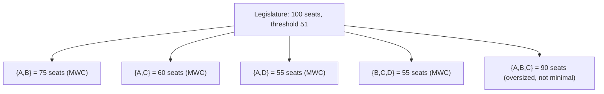
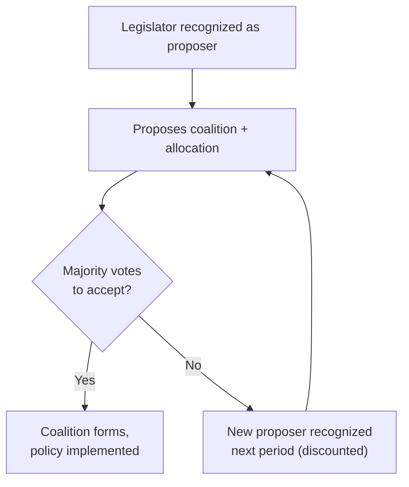

## Coalition Formation in Legislatures

### Overview

Coalition formation in legislatures studies how parties or blocs combine to secure a governing majority when no single party controls enough seats to govern alone. This arises routinely in parliamentary systems with proportional representation (e.g., Germany, Israel, the Netherlands), where post-election bargaining among party leaders determines the governing coalition, cabinet portfolio allocation, and policy program. Game theory supplies the primary formal toolkit: cooperative game theory (characteristic function games, the core, power indices) analyzes which coalitions are stable and how the "spoils" of governing should be divided, while non-cooperative bargaining models analyze the sequential process by which coalitions actually form.

### The Legislature as a Cooperative Game

A legislature can be modeled as a simple voting game $(N, v)$ where $N$ is the set of parties and $v(S) \in \{0, 1\}$ indicates whether coalition $S \subseteq N$ controls enough seats to pass legislation (typically a majority of the total seats, though supermajority rules apply in some contexts).

**Key Points**

- A coalition $S$ is **winning** if $v(S) = 1$ and **losing** otherwise.
- A **minimal winning coalition (MWC)** is a winning coalition that becomes losing if any single member is removed.
- The set of all minimal winning coalitions defines the essential strategic structure of the bargaining environment, since including any additional party beyond a minimal winning coalition dilutes the payoff (portfolio share) to existing members without changing the coalition's winning status.

### Riker's Minimum Winning Coalition Theory

William Riker (1962), drawing on cooperative game theory, proposed the "size principle": in a zero-sum bargaining environment over a fixed pool of spoils (cabinet portfolios, policy influence), rational, self-interested parties will prefer minimal winning coalitions over larger ("oversized") coalitions, because adding unnecessary partners only dilutes each existing member's share of the fixed prize.

$$\text{Party } i\text{'s expected payoff share} \approx \frac{w_i}{\sum_{j \in S} w_j} \quad \text{for } S \text{ minimal winning}$$

where $w_i$ is party $i$'s bargaining weight (often approximated by seat share or a power index).

**Example**

Consider a 100-seat legislature with four parties:

- Party A: 45 seats
- Party B: 30 seats
- Party C: 15 seats
- Party D: 10 seats

Majority threshold: 51 seats.

Possible minimal winning coalitions:

- {A, B}: 75 seats — winning; removing either party drops below 51, so it is minimal.
- {A, C}: 60 seats — winning and minimal.
- {A, D}: 55 seats — winning and minimal.
- {B, C, D}: 55 seats — winning; removing any one member drops it below 51, so also minimal.
- {A, B, C}, {A, B, D}, {A, B, C, D}, etc.: winning, but not minimal, since a proper subset already wins.

Riker's size principle predicts that rational parties prefer one of the minimal winning coalitions ({A,B}, {A,C}, {A,D}, or {B,C,D}) over any oversized alternative, since an oversized coalition would only reduce each member's per-capita share of the payoff pool without contributing additional legislative security.

### Limitations of Pure Size-Based Theories

**Key Points**

- Riker's original size principle is a **zero-sum, office-seeking** model: it assumes parties care only about maximizing their share of a fixed payoff pool and treats policy positions as irrelevant.
- Empirically, real coalitions are frequently **not minimal winning** and are frequently **not the smallest available minimal winning coalition**, which motivated the development of policy-based theories below. [Inference — well-documented across comparative-politics coalition studies, though the precise empirical frequency varies by country and time period, and Claude cannot verify current-decade statistics without a search]
- Grand coalitions (encompassing far more than a bare majority, e.g., German "Grand Coalitions" between the CDU/CSU and SPD) occur when parties value stability, crisis management, or policy consensus over maximizing individual spoils, a pattern the pure size principle does not predict.

### Policy-Based (Minimal Connected Winning) Coalition Theory

Axelrod (1970) and De Swaan (1973) extended coalition theory by incorporating parties' positions on a policy dimension (analogous to the spatial models used in the Median Voter Theorem), arguing that parties are not purely office-seeking but also policy-seeking, and prefer coalition partners who are ideologically proximate.

**Key Points**

- A **minimal connected winning coalition** is a winning coalition such that all parties are adjacent on the policy dimension (no ideologically distant party is included unnecessarily) and removing any member breaks either the winning status or the connectedness.
- This theory predicts that coalitions form among ideologically neighboring parties rather than the numerically smallest coalition, better matching empirical patterns such as center-left or center-right governing blocs that exclude the numerically convenient but ideologically distant extremes.

**Example**

Suppose the four parties above are positioned on a left-right axis as: D (far left, 10 seats) — C (center-left, 15 seats) — A (center-right, 45 seats) — B (far right, 30 seats).

Even though {A, D} is a minimal winning coalition by seats (55 seats), it spans the entire ideological spectrum and is not "connected" (C sits between D and A). Policy-based theory predicts {A, C} (adjacent, minimal winning, ideologically connected, 60 seats) is more likely to form than {A, D}, despite {A, D} satisfying Riker's minimal-size criterion.

### The Core and Coalition Stability

In cooperative game theory terms, an allocation of payoffs (cabinet portfolios, policy concessions) to coalition members is in the **core** if no alternative coalition could form and make all of its members strictly better off by breaking away.

$$\text{Allocation } x \text{ is in the core if } \nexists S \subseteq N : \sum_{i \in S} x_i < v(S)$$

A core allocation is one that no "blocking coalition" wants to deviate from. In many legislative bargaining games — particularly with a multidimensional policy space — the core is empty, meaning no allocation is fully stable against all possible deviations, which helps explain the empirical instability and frequent renegotiation of coalition governments in some systems.

### Non-Cooperative Bargaining Models: The Baron-Ferejohn Model

Baron and Ferejohn (1989) modeled legislative coalition and policy bargaining as a non-cooperative, sequential game rather than a cooperative allocation problem:

1. A legislator (the "proposer") is recognized, typically at random or according to a fixed protocol, often correlated with party size.
2. The proposer proposes a policy and/or a division of a fixed budget among coalition members.
3. Other legislators vote on the proposal; if a majority accepts, the game ends and the proposal is implemented.
4. If the proposal is rejected, the game moves to the next period (possibly with discounting), and a new proposer is recognized.

**Key Points**

- This model produces a **subgame-perfect equilibrium** in which the recognized proposer forms a minimal winning coalition and offers just enough to the minimum number of additional legislators needed to secure passage, giving those legislators a payoff slightly above their discounted continuation value (what they would expect to get if they rejected and waited for a future round), while keeping the surplus for themselves.
- The model formalizes Riker's minimal-winning-coalition intuition using explicit extensive-form game theory (sequential proposals, discounting, backward induction) rather than static cooperative-game assumptions.
- Discounting (impatience) matters: legislators who must wait longer for a possible future proposal accept a worse deal today, which gives the proposer bargaining leverage proportional to the discount factor $\delta$.

$$U_i(\text{accept now}) \geq \delta \cdot E[U_i(\text{continuation})]$$

### Portfolio Allocation and Gamson's Law

**Key Points**

- **Gamson's Law** (Gamson, 1961) is an empirical regularity, not a formal theorem: cabinet portfolios (ministries) tend to be allocated to coalition partners roughly in proportion to the number of seats each party contributes to the coalition.
- This is broadly consistent with cooperative bargaining-power measures (e.g., Shapley-Shubik or Banzhaf indices applied to the coalition), though Gamson's Law is typically stated in terms of raw seat proportionality rather than a formal power index. [Inference — the correspondence between Gamson's Law and power-index-based predictions is a standard point of comparison in the coalition-theory literature, but the two do not always coincide precisely, since power indices can diverge sharply from raw seat share, as in the earlier weighted-voting example]

### Portfolio Payoff Example Using Power Indices

Returning to the four-party legislature (A: 45, B: 30, C: 15, D: 10, threshold 51): if coalition {A, C} forms (60 seats), a naive proportional (Gamson's Law) split of, say, 10 cabinet ministries would allocate roughly 7.5 to A and 2.5 to C based on seat share within the coalition (45:15 = 3:1 ratio). A power-index-based prediction (e.g., Shapley-Shubik computed only over feasible coalitions) could diverge from this if C turns out to be pivotal in more orderings than its seat share alone would suggest, illustrating the same general tension between raw resource share and formal decisive power seen in weighted voting games.

### Coalition Stability and Government Duration

**Key Points**

- Comparative-politics research treats coalition government **duration** and **survival** as outcomes to be explained using the same bargaining and stability concepts: coalitions with an empty core, high ideological heterogeneity, or non-minimal-winning status are generally associated with a higher hazard of early dissolution or renegotiation. [Inference — this is a widely cited finding in the coalition-government literature, but exact quantitative relationships and country-specific variation should be treated as empirical claims requiring current sourcing rather than fixed constants]
- **Caretaker governments** and formal **investiture votes** (some systems require an explicit parliamentary vote of confidence before a coalition can take office) add additional strategic stages to the bargaining game not captured in the baseline Baron-Ferejohn framework.

### Conclusion

Coalition formation in legislatures is a direct legislative application of cooperative and non-cooperative game theory: cooperative concepts (minimal winning coalitions, the core, power indices) characterize which coalitions are stable and how spoils should be divided, while non-cooperative extensive-form models (Baron-Ferejohn) explain the sequential bargaining process and generate sharper, testable predictions about proposer advantage and payoff allocation. The empirical literature shows that pure office-seeking, size-based theories (Riker) are necessary but insufficient; incorporating policy proximity (Axelrod, De Swaan) and institutional detail (investiture rules, discounting, portfolio allocation norms like Gamson's Law) is required to match observed coalition patterns.

**Related Topics**

- The Core and Stable Cooperative Game Solutions
- Shapley-Shubik and Banzhaf Power Indices
- The Baron-Ferejohn Bargaining Model (extended forms)
- Spatial Models of Party Competition
- Median Voter Theorem
- Cabinet Formation and Investiture Rules (Comparative Institutions)
- Repeated and Sequential Bargaining Games