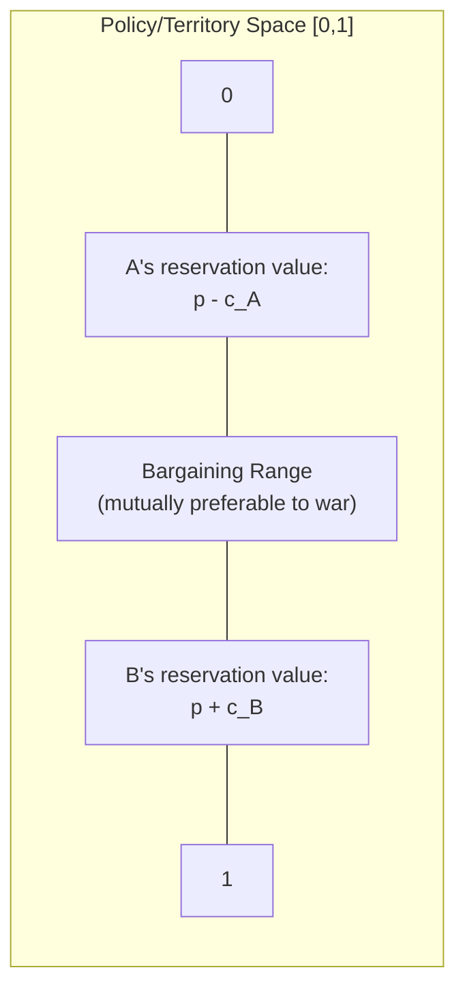
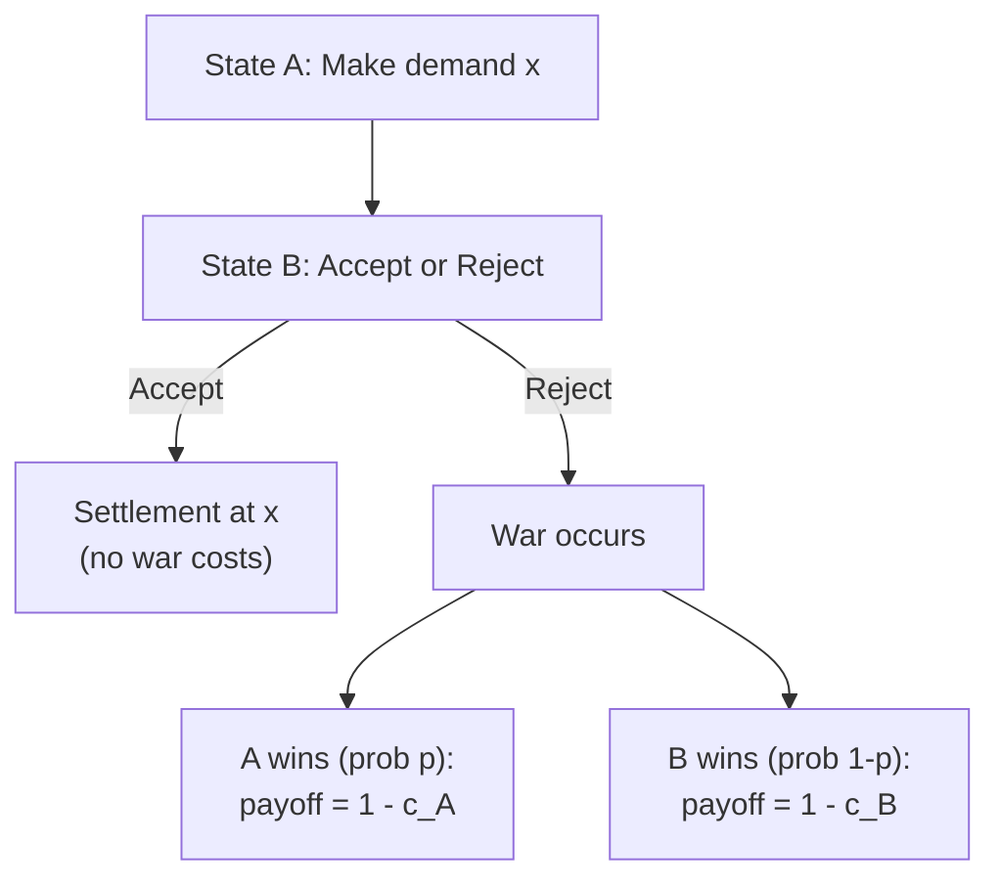

## Conflict and War Bargaining Models

### Overview

Bargaining models of war treat armed conflict as a breakdown of negotiation rather than as an alternative to it. The central puzzle these models address, often called the **bargaining puzzle of war**, is: if fighting is costly and both sides could, in principle, agree ex ante to whatever division of the contested good would result from a war (while saving the costs of actually fighting), why does war occur at all? James Fearon's 1995 article "Rationalist Explanations for War" formalized this puzzle and remains the canonical reference point for the field. The models below identify specific mechanisms — private information, commitment problems, and issue indivisibility — under which rational, unitary state actors can nonetheless fail to reach a negotiated settlement and instead fight.

### The Bargaining Range

**Key Points**

- States are modeled as bargaining over a divisible good (territory, resources, policy concessions), represented as a point $x \in [0, 1]$, where $x$ is the share allocated to State A and $1-x$ to State B.
- Each state has a **reservation value**: the minimum share it would accept rather than go to war, determined by its expected value of fighting minus its expected costs of war.
- If State A wins a war with probability $p$ and both sides bear war costs $c_A$ and $c_B$ (as fractions of the good's total value), then State A's expected payoff from war is $p - c_A$ and State B's is $(1-p) - c_B$.
- A **bargaining range** exists whenever there is a settlement $x$ that both sides prefer to fighting:

$$p - c_A \leq x \leq p + c_B$$

Because $c_A, c_B > 0$ (war is costly), this range is always non-empty under complete information: there always exists some $x$ that both sides prefer to the expected outcome of war net of its costs. This is the formal basis of the puzzle — war destroys value that a negotiated settlement within the bargaining range could have preserved for both sides.

### Why War Happens Anyway: Three Rationalist Mechanisms

Fearon (1995) identifies three broad classes of explanation for why rational states might fail to locate a point within this always-existing bargaining range.

### 1. Private Information and Incentives to Misrepresent

**Key Points**

- States often have private information about their own military capability, resolve, or costs of fighting, and have a strategic incentive to misrepresent this information during negotiations (e.g., a weak state has an incentive to bluff that it is strong, to extract a better settlement).
- Because both sides know the other has an incentive to bluff, cheap talk alone cannot credibly convey private information; some communication mechanisms are needed for the information to be believed.
- War can serve as a **costly signal** that separates types: only a state that truly believes it has good prospects will fight, because a weak state would find the expected costs of fighting to reveal its type not worth it. This maps onto a signaling-game equilibrium.

This is a standard application of asymmetric-information game theory (screening and signaling) to conflict: peace fails not because bargaining is impossible in principle, but because with incomplete information, no mutually acceptable offer is available that both a "strong" type and a "weak" type of state would find credible to make or accept simultaneously — a violation of the conditions needed for a fully separating, peaceful equilibrium.

**Example**

Consider two states bargaining under incomplete information about State A's true military strength, which can be either "Strong" ($p_{strong} = 0.7$) or "Weak" ($p_{weak} = 0.4$), where $p$ is A's probability of winning a war. State B does not observe A's type directly.

- If B offers a settlement generous enough to satisfy a Strong A (e.g., $x = 0.65$), a Weak A would happily accept this same offer too, since it exceeds what Weak A would get from fighting ($0.4 - c_A$). B has overpaid relative to A's true (weak) strength.
- If B offers a settlement calibrated to Weak A's true reservation value (e.g., $x = 0.35$), Strong A rejects it, since Strong A's reservation value is higher, and this rejection can lead to war.
- Formally, a **separating equilibrium** may require Strong A to take a costly action (military mobilization, limited demonstration of force, or actual initial combat) that a Weak A would not find worthwhile to imitate, allowing B to update beliefs and eventually locate a settlement — but the informational separation itself can only be achieved by incurring some of the very costs war-avoidance was supposed to save.

### 2. Commitment Problems

**Key Points**

- Even with complete information, if one or both sides cannot credibly commit to abide by a bargain over time — because the future distribution of power, or one side's incentives, will shift — a mutually acceptable deal today may unravel, making war rational as a preemptive or preventive measure.
- **Preventive war** is the canonical example: if State A is rising in relative power and State B knows that a future, more powerful A will demand a better deal (or attack outright), B may have an incentive to fight now, while the power balance still favors B, rather than accept a temporarily attractive settlement it expects A to renege on later.
- **First-strike incentives** are a related commitment problem: if military technology rewards striking first (offense-dominant environments), both sides may find war rational even without any real underlying dispute over the contested good, purely because failing to strike first is severely costly if the other side strikes.

$$\text{Preventive war rational for B if: } U_B(\text{fight now}) > U_B(\text{accept deal, be attacked later by stronger A})$$

Commitment problems are formally distinct from private-information explanations: they can generate war even under complete, symmetric information about both sides' capabilities and resolve, because the source of the difficulty is the inability to bind one's own or the other side's future behavior, not any factual disagreement about relative strength.

### 3. Issue Indivisibility

**Key Points**

- If the contested good genuinely cannot be divided (e.g., control over a single capital city, a religious site, or an indivisible sovereignty claim), the continuous bargaining range described above may not have a feasible intermediate settlement, even though the abstract mathematical bargaining range still exists in principle.
- Fearon and later scholars note that most seemingly "indivisible" goods can, in principle, be divided via side payments, alternating control, or issue linkage (trading concessions on other unrelated issues), so pure indivisibility is generally regarded as a weaker or less complete explanation than private information or commitment problems, unless side payments and issue linkage are themselves constrained (e.g., by domestic audience costs that make a leader's compromise politically catastrophic). [Inference — this ranking of the three mechanisms' relative theoretical importance reflects the standard framing in the bargaining-theory literature since Fearon (1995), though scholars disagree on relative empirical weight across specific historical conflicts]

### The Bargaining Model of War as an Extensive-Form Game

A simplified extensive-form representation:

Under complete information, backward induction implies State A should never make a demand that State B would rationally reject, since war destroys value both sides could otherwise have shared — this is precisely why complete-information models predict that war should not occur in equilibrium, throwing the analytical weight onto the incomplete-information, commitment-problem, and indivisibility mechanisms above to explain observed conflict.

### Crisis Bargaining and Audience Costs

**Key Points**

- Fearon's separate 1994 work on **audience costs** models domestic political consequences as a mechanism that can make threats credible: a leader who publicly threatens to fight and then backs down pays a domestic political cost (loss of face, electoral punishment), and democratic leaders — who face more attentive domestic audiences able to punish backing down — can therefore make more credible threats than leaders insulated from public accountability.
- This connects crisis bargaining to the private-information mechanism above: audience costs function as a **costly signaling device** that helps separate resolved leaders (willing to pay the domestic cost of standing firm) from unresolved leaders (who would rather back down quietly), improving the informativeness of diplomatic signals and, in some equilibria, helping states avoid war by making bluffing more costly and less common.

### War Termination as Renewed Bargaining

**Key Points**

- Bargaining models extend naturally to **war termination**: fighting itself is modeled as a costly, informative process that updates both sides' beliefs about relative strength and resolve over time, and a war ends when the updated beliefs of both sides bring their expectations of continued fighting close enough together that a new bargaining range opens up and a settlement becomes mutually preferable to continued combat.
- This treats ongoing war not as a suspension of bargaining but as an information-revelation process running in parallel with combat, which is why battlefield outcomes ("who is winning") are treated in these models as directly informative signals that shift the location of the (re-opened) bargaining range.

### Conclusion

Bargaining models of war reframe conflict as a specific failure mode of negotiation rather than a fundamentally separate phenomenon, using the same game-theoretic toolkit (extensive-form games, Bayesian signaling, commitment and credibility) applied elsewhere in political-economy applications of game theory. The core insight — that a mutually preferable bargaining range almost always exists in principle, so an explanation is needed for why states fail to find it — has organized several decades of formal international-relations scholarship around three mechanisms: private information with incentives to misrepresent, commitment problems (especially preventive war and first-strike incentives), and issue indivisibility (the weakest of the three on its own). Audience costs and war-termination bargaining extend the same framework to crisis signaling and to the dynamics of ongoing conflict.

**Related Topics**

- Signaling Games and Costly Signaling
- Commitment Devices in Repeated and Dynamic Games
- Audience Costs and Crisis Bargaining
- Deterrence Theory and Nuclear Strategy
- Preventive War and Power Transition Theory
- Extensive-Form Games and Backward Induction
- Bayesian Games and Incomplete Information