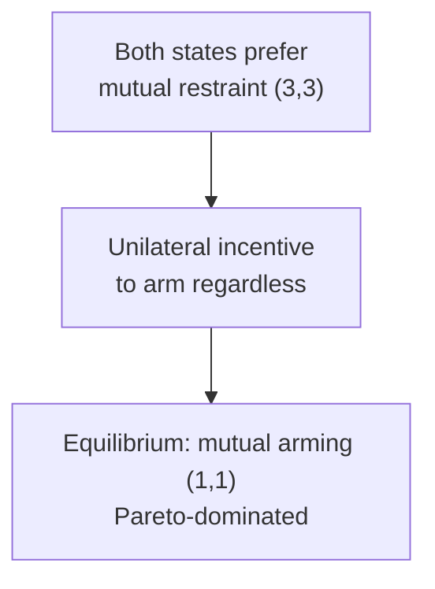
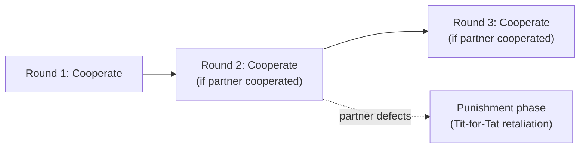
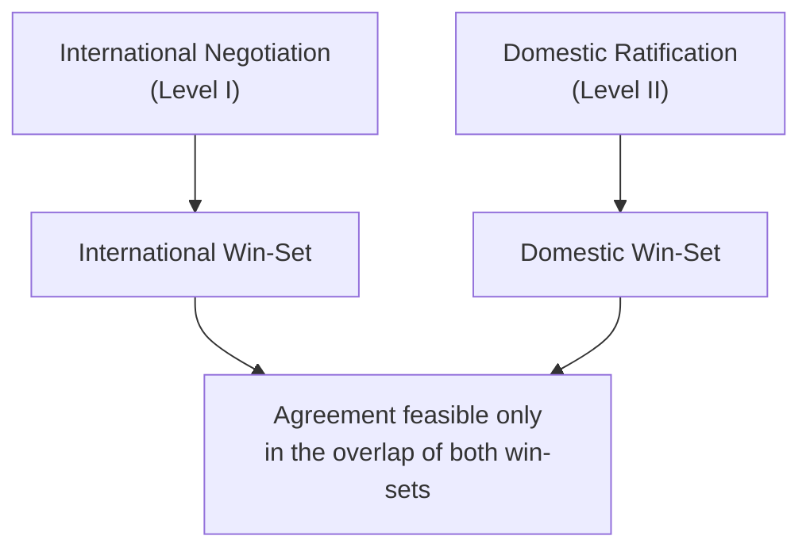

## Game Models in International Relations

### Overview

International relations (IR) theory uses game theory to model interactions among states (and, in some frameworks, non-state actors) as strategic situations where each actor's optimal choice depends on the anticipated choices of others. Unlike domestic political applications (voting, coalition formation), IR games typically feature few players (often exactly two, "the dyad"), operate under anarchy (no external enforcer of agreements), and are frequently repeated or embedded in reputational dynamics that unfold over decades. This entry surveys the canonical game forms used across security studies, international political economy, and cooperation theory, several of which extend directly from the bargaining-model-of-war framework and the signaling logic covered elsewhere in this chapter.

### The Security Dilemma as a Coordination/Prisoner's Dilemma Hybrid

**Key Points**

- The **security dilemma** describes a situation in which actions one state takes to increase its own security (arms buildup, fortification, alliance formation) are perceived by another state as threatening, prompting a reciprocal response that leaves both states no more secure, and often less so, than before.
- Under a strict Prisoner's Dilemma payoff structure, mutual restraint (both states hold back on arms buildup) is Pareto superior to mutual arming, yet each state has a unilateral incentive to arm regardless of what the other does, so mutual arming is the unique Nash equilibrium.

|  | State B: Restrain | State B: Arm |
| --- | --- | --- |
| **State A: Restrain** | (3, 3) | (0, 5) |
| **State A: Arm** | (5, 0) | (1, 1) |

- The equilibrium outcome (Arm, Arm) yields payoff (1,1), strictly dominated by the unreached (Restrain, Restrain) outcome (3,3) — the defining signature of a Prisoner's Dilemma and the formal basis for characterizing arms races as inefficient but individually rational.
- Whether a given security interaction is better modeled as a Prisoner's Dilemma (dominant strategy to defect regardless of the other's move) or as a **Stag Hunt** (mutual cooperation is also a Nash equilibrium, but so is mutual defection, making the outcome sensitive to trust and expectations rather than strictly dominated) is itself a substantive debate in the security-dilemma literature, since the Stag Hunt structure implies that trust-building and reassurance signals can shift the system to the cooperative equilibrium, whereas a true Prisoner's Dilemma cannot be resolved by trust alone. [Inference — this classification debate is a well-established point of contention in the IR security-dilemma literature, e.g., in work distinguishing "deterrence" from "spiral" models of conflict]

### Deterrence Games

**Key Points**

- **Deterrence** models a defender attempting to prevent a challenger from taking an action (e.g., invasion) by threatening a costly response, typically represented as a sequential game where the challenger moves first (attack or not), and the defender then chooses whether to carry out its threatened response.
- The central strategic problem is the **credibility of the threat**: if the defender's threatened response is costly to execute (e.g., risks escalation to nuclear war) and the challenger believes the defender would not rationally follow through, the threat is not credible, and backward induction predicts the challenger will attack, because a rational defender would not carry out a threat that hurts the defender more than accepting the fait accompli.
- This is the same class of commitment problem discussed in bargaining models of war: **extended deterrence** (protecting an ally rather than oneself) is regarded as harder to make credible than direct deterrence, because the defender's stake in the ally's territory is typically lower than the challenger's stake in taking it, a asymmetry historically referred to as the "commitment problem of extended deterrence" or, informally, whether a defender would truly "trade New York for Paris."
- Formal solutions to the credibility problem mirror those in bargaining/signaling theory: costly signals (troop deployments that cannot easily be reversed, treaty commitments with domestic audience costs attached, or automatic/tripwire response mechanisms that remove the defender's later discretion) can restore credibility by changing the defender's own incentives ex post, rather than relying on the challenger to simply trust the defender's stated intentions.

### Alliance Formation and Balance-of-Power Games

**Key Points**

- Alliance formation is frequently modeled using cooperative game theory tools directly analogous to legislative coalition formation (minimal winning coalitions, the core), with states as players and "winning coalition" defined as sufficient combined power to deter or defeat a rival bloc.
- **Balance-of-power theory** predicts that states will ally so as to prevent any single state or bloc from achieving preponderant power, which can be formalized as states choosing alliance partners to maximize their own security subject to the constraint of not enabling a dominant hegemon — producing dynamic, shifting alliance patterns rather than fixed blocs.
- **Buck-passing** and the **free-rider problem** in alliances: because collective deterrence or defense is a public good among alliance members (non-excludable, and to a degree non-rival, benefit), standard public-goods game theory predicts that smaller or less-exposed alliance members have an incentive to under-contribute to collective defense spending, relying on larger members to bear a disproportionate share of the burden — this maps onto the same underlying logic as **NATO burden-sharing debates**, extensively studied via a Prisoner's-Dilemma or public-goods game lens.

### Repeated Games and the Shadow of the Future

**Key Points**

- Robert Axelrod's work (*The Evolution of Cooperation*, 1984) applied the **iterated Prisoner's Dilemma** and the **Folk Theorem** to international cooperation, showing computationally and analytically that cooperation can be sustained as an equilibrium in a repeated game even among purely self-interested actors, provided interactions repeat with sufficiently high probability and actors are sufficiently patient (a high discount factor).
- The **Folk Theorem** result underlying this is central to IR cooperation theory: in an infinitely (or indefinitely) repeated game, any individually rational payoff — including the cooperative outcome — can be sustained as a subgame-perfect equilibrium via trigger strategies (e.g., Tit-for-Tat, or grim trigger strategies that punish defection with permanent retaliation), provided the discount factor $\delta$ is high enough.

$$\delta \geq \frac{T - R}{T - P}$$

where $T$ is the temptation payoff (unilateral defection), $R$ is the mutual cooperation payoff, and $P$ is the mutual punishment (defection) payoff, in a standard Prisoner's Dilemma parameterization. This inequality gives the minimum discount factor needed for cooperation to be sustainable as an equilibrium via a grim trigger strategy.

- This provides the formal microfoundation for institutionalist claims that repeated interaction, issue linkage, and the expectation of future dealings ("the shadow of the future") can sustain international cooperation on trade, arms control, and environmental agreements even absent a supranational enforcer — directly countering the strict, one-shot-Prisoner's-Dilemma pessimism of structural realism.

### International Regimes and Coordination Games

**Key Points**

- Many international cooperation problems are better modeled as **coordination games** rather than Prisoner's Dilemmas: multiple equilibria exist (e.g., "everyone drives on the left" vs. "everyone drives on the right" as a stand-in for technical or regulatory standards), and the central strategic problem is not incentive-compatibility but **selecting among multiple mutually acceptable equilibria**.
- **Battle of the Sexes**-type asymmetric coordination games are used to model situations where states agree cooperation is preferable to non-cooperation but disagree over which specific cooperative arrangement (which regulatory standard, whose currency serves as reserve currency) benefits them more.
- International institutions and regimes (WTO, IMF, environmental treaty secretariats) are frequently modeled, in this view, as **focal points** or coordinating mechanisms that help states select among multiple possible cooperative equilibria and reduce transaction costs of renegotiating agreements repeatedly, an application of Schelling's focal-point concept to interstate cooperation.

### Two-Level Games

**Key Points**

- Robert Putnam's (1988) **two-level games** framework models international negotiation as simultaneous bargaining at two linked levels: the international level (between state leaders/negotiators) and the domestic level (between a leader and their domestic constituents, legislature, or ratifying body).
- A negotiated international agreement must fall within both the international "win-set" (acceptable to the other state(s)) and the domestic "win-set" (ratifiable domestically); the size of a leader's domestic win-set affects their international bargaining leverage, since a leader with a narrow domestic win-set can credibly claim limited room to make concessions — a version of the same commitment-and-credibility logic seen in audience-cost models, here formalized as a constraint on the negotiator rather than as a costly signal.
- This framework is widely used to analyze trade negotiations, international treaty ratification, and any setting where a state's negotiator must satisfy both a foreign counterpart and a domestic ratifying institution (e.g., a legislature or referendum requirement).

### Comparative Summary of IR Game Structures

| Game Structure | Strategic Problem | Canonical IR Application |
| --- | --- | --- |
| Prisoner's Dilemma | Dominant strategy to defect despite joint gains from cooperation | Arms races, some security dilemmas |
| Stag Hunt | Multiple equilibria; trust/expectations determine outcome | Security dilemma (alternative framing), disarmament |
| Coordination Game | Multiple mutually acceptable equilibria; selection problem | Technical/regulatory standards, reserve currency choice |
| Battle of the Sexes | Cooperation preferred by both, but disagreement over which equilibrium | Distributive negotiations within cooperative regimes |
| Sequential Deterrence Game | Credibility of a costly threat | Extended deterrence, nuclear strategy |
| Repeated/Iterated Game | Sustaining cooperation via the shadow of the future | Trade regimes, arms control, environmental treaties |
| Two-Level Game | Simultaneous international and domestic feasibility constraints | Treaty ratification, trade negotiation |

### Conclusion

Game-theoretic models in international relations extend the core logic of strategic interaction — dominant strategies, Nash equilibrium, credible commitment, repeated-game folk theorems, and Bayesian signaling — to the distinctive setting of interstate anarchy, where no external enforcer exists and reputational and institutional mechanisms must substitute for centralized enforcement. The field's major theoretical debates (realist pessimism about cooperation versus institutionalist optimism, the sources of extended-deterrence credibility, the conditions sustaining alliances and regimes) map closely onto the underlying game structure assumed: Prisoner's Dilemma-type environments predict cooperation is fragile absent repeated play or strong monitoring, while coordination-game and two-level-game framings emphasize institutional design and domestic-international linkage as the operative levers for achieving cooperative outcomes.

**Related Topics**

- Bargaining Models of War (Fearon)
- Signaling Games and Audience Costs
- The Folk Theorem in Repeated Games
- Public Goods Games and Free-Riding
- Schelling Points and Focal-Point Coordination
- Two-Level Games and Domestic Ratification Constraints
- Deterrence Theory and Nuclear Strategy