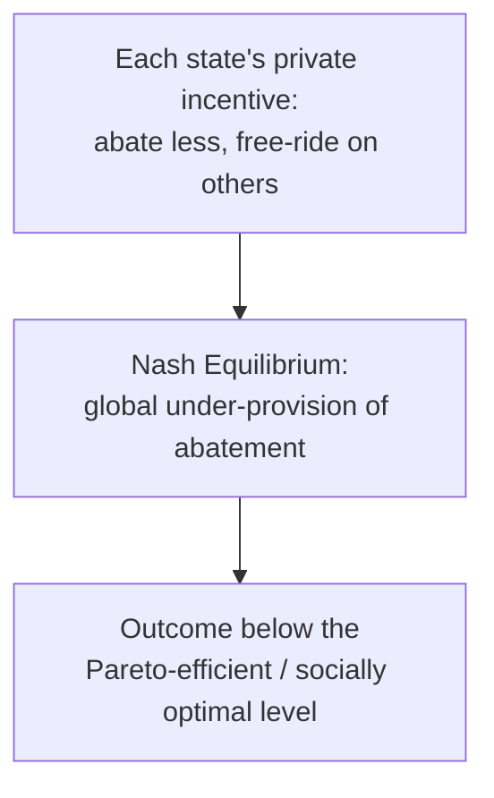
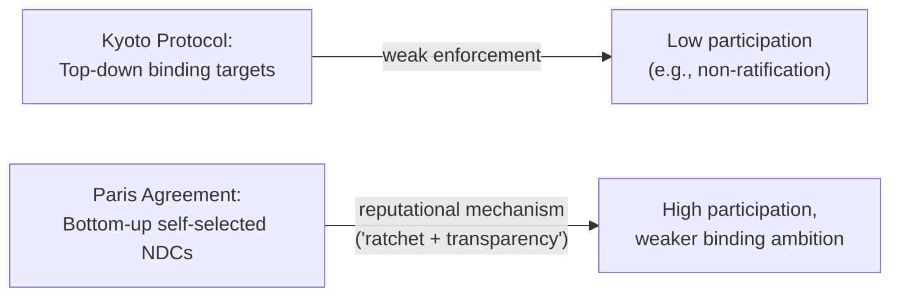

## Climate Negotiations and Environmental Agreements

### Overview

Climate negotiations and international environmental agreements present a distinctive game-theoretic environment: the underlying good at stake (a stable climate, an intact ozone layer, healthy fish stocks) is a **global public good** or **common-pool resource**, contributions are costly and largely unobservable in real time, benefits are diffuse and shared by contributors and free-riders alike, and there is no supranational enforcer capable of compelling compliance. This combination — public-goods incentive structures, an absence of centralized enforcement, and typically large numbers of heterogeneous players — produces strategic dynamics that differ in important ways from the small-N, security-focused games covered elsewhere in this chapter, even though many of the same underlying tools (repeated games, coalition theory, mechanism design) apply.

### The Public Goods Game Structure

**Key Points**

- Climate mitigation (reducing greenhouse gas emissions) is a **public good**: non-excludable (a country cannot be excluded from the benefits of a stabilized climate even if it contributed nothing) and, at the global atmospheric level, non-rival (one country's benefit from reduced warming does not subtract from another's).
- Standard public-goods game theory predicts **under-provision** relative to the socially optimal level: each state's private marginal cost of abatement is borne entirely by that state, while the marginal benefit (reduced future warming) is shared globally, so a rational, narrowly self-interested state abates less than the level that would maximize aggregate global welfare.
- This is formally a **generalized, N-player Prisoner's Dilemma**: for any individual state, the dominant strategy is to free-ride on others' abatement efforts, yet if all states free-ride, the collectively worst outcome (unmitigated climate change) results.

$$\text{Global welfare-maximizing abatement } a^*_i > \text{Nash equilibrium abatement } a_i^{NE} \text{ for each state } i$$

### Why Climate Games Are Harder Than Standard Public Goods Games

**Key Points**

- **Asymmetric stakes and capabilities:** unlike a standard symmetric public-goods game, states differ enormously in emissions levels, abatement costs, vulnerability to climate impacts, and historical responsibility for existing atmospheric concentrations, which is the formal underpinning of the "common but differentiated responsibilities" (CBDR) principle embedded in the UN Framework Convention on Climate Change (UNFCCC) and subsequent agreements.
- **Long time horizons and discounting:** costs of abatement are borne largely in the near term, while the principal benefits (avoided warming, avoided catastrophic tipping points) accrue mostly to future generations and future governments, weakening the "shadow of the future" mechanism that sustains cooperation in standard repeated games, since a government facing near-term political costs may substantially discount benefits decades away.
- **Weak monitoring and verification:** unlike arms-control treaties that can sometimes be verified via satellite or inspection regimes, national emissions reporting has historically relied heavily on self-reported inventories, weakening the credibility of punishment strategies (e.g., grim-trigger or tit-for-tat strategies) that require reliably detecting defection to function as designed.
- **Catastrophic and uncertain damage functions:** unlike divisible bargaining goods in the war-bargaining framework, the marginal damage from an additional unit of emissions is highly uncertain and potentially subject to threshold or tipping-point dynamics, complicating the calculation of each state's optimal contribution level even under full cooperation.

### The Kyoto Protocol: Top-Down Targets and Compliance Failure

**Key Points**

- The Kyoto Protocol (1997) attempted a **top-down** design: legally binding, differentiated emissions-reduction targets for developed ("Annex I") countries, negotiated collectively and then ratified individually.
- Game-theoretically, this structure faced a **participation game** layered on top of the underlying public-goods game: because the treaty's targets were fixed independently of any individual state's ratification decision, and because the treaty lacked a credible, strong enforcement mechanism for non-compliance, some large emitters (notably the United States, which signed but did not ratify) had a dominant strategy to decline formal binding commitment while still benefiting from any abatement other parties undertook.
- The absence of a credible sanction mechanism for non-compliance (the Kyoto compliance regime's penalties were comparatively weak and largely prospective, adjusting future commitment periods rather than imposing immediate, costly sanctions) meant the treaty's self-enforcement properties were considerably weaker than a repeated-game folk-theorem argument would require for full cooperation, since credible, reliably triggered punishment is a necessary condition for sustaining cooperation via trigger strategies. [Inference — this diagnosis of *why* Kyoto's top-down design proved politically fragile is a standard account in the international-environmental-cooperation literature, though scholars differ on the relative weight of enforcement design versus other factors such as domestic politics in specific non-ratifying states]

### The Paris Agreement: Bottom-Up Pledge-and-Review

**Key Points**

- The Paris Agreement (2015) shifted to a **bottom-up** design: each country submits its own **Nationally Determined Contribution (NDC)**, a self-selected emissions target, rather than accepting a target negotiated top-down and imposed on it.
- Game-theoretically, this can be understood as trading the free-rider problem inherent in top-down target-setting for a **participation-maximizing** design: because commitments are self-selected, the treaty achieves near-universal participation (nearly all UNFCCC parties have submitted NDCs), but at the cost of an equilibrium concept closer to voluntary contribution than to an enforceable, jointly optimal allocation, since a state can select a comparatively unambitious NDC without formally violating the agreement's binding terms.
- The Paris framework relies principally on a **"ratchet mechanism"** (successive rounds of NDC submission, intended to become more ambitious over time) combined with **transparency and reporting requirements** rather than binding sanctions, substituting reputational and diplomatic pressure — a soft, repeated-game-style mechanism reliant on naming-and-shaming rather than material punishment — for the harder enforcement Kyoto had aimed for and largely failed to achieve.
- Whether this bottom-up, pledge-and-review design ultimately sustains a higher steady-state level of cooperation than a top-down design would have is a live empirical and theoretical question, since it depends on assumptions about the relative strength of reputational costs versus material sanctions as enforcement mechanisms. [Speculation — this comparative assessment of Kyoto versus Paris is contested in current scholarship, and any confident claim about which design is more effective would require current empirical evidence beyond formal theory alone]

### Coalition Theory Applied to Environmental Agreements: Self-Enforcing International Environmental Agreements (IEAs)

A substantial formal literature (Barrett, Carraro and Siniscalco, and others) models the size and stability of a "coalition" of countries voluntarily committing to cooperate on abatement, using tools closely related to the coalition-formation and core concepts covered in the legislative-coalition entry, adapted to an open-membership, non-cooperative game framework.

**Key Points**

- A coalition of cooperating states is **internally stable** if no member wants to unilaterally leave and free-ride instead (given the coalition's abatement level), and **externally stable** if no non-member wants to join (given the same).
- A robust finding across this literature is that self-enforcing (voluntary, non-coerced) environmental coalitions tend to be **small relative to the full set of affected countries** whenever the free-riding incentive is strong, unless side payments, issue linkage, or trade sanctions against non-participants are used to alter non-members' incentives to stay outside the coalition.
- This formalizes the practical policy intuition that voluntary climate coalitions face an inherent tension: the abatement benefits of a coalition scale with the coalition's aggregate size and ambition, but the free-riding incentive for any individual potential joiner also scales with coalition size (a larger existing coalition means a marginal joiner captures nearly all the same climate benefit by staying outside as by joining, while avoiding the abatement cost).

$$\text{Coalition stable if: } \Pi_i(\text{member, coalition size } k) \geq \Pi_i(\text{non-member, coalition size } k-1)$$

for every current member $i$, and the symmetric condition holds for external stability with respect to non-members.

### Linkage, Side Payments, and Issue Linkage as Stabilizing Mechanisms

**Key Points**

- **Side payments** (climate finance, technology transfer, capacity-building funds directed from wealthier to poorer or more vulnerable states) are modeled as a mechanism to shift the coalition-stability condition above by directly compensating potential joiners for their abatement costs, changing a state's participation decision without requiring it to bear the full private cost of abatement unassisted.
- **Issue linkage** (bundling climate commitments with trade concessions, technology-sharing, or other unrelated cooperative benefits) is modeled analogously to issue linkage in general international-cooperation theory: linking issues can expand the feasible cooperative bargaining range by allowing gains in one domain to offset losses in another, potentially stabilizing a larger coalition than either issue could sustain in isolation.
- **Trade sanctions or border carbon adjustments** directed at non-participating states are modeled as a mechanism to alter the external-stability condition by imposing a cost on remaining outside the coalition, converting a purely voluntary public-goods game into one with a partial, decentralized enforcement mechanism.

### Common-Pool Resource Management (Ostrom's Contribution)

**Key Points**

- Elinor Ostrom's empirical and game-theoretic work on **common-pool resources** (fisheries, groundwater, forests) showed that self-organized, community-level institutions can sustain cooperative resource management without either full privatization or top-down state regulation, contrary to the pessimistic predictions of a pure "tragedy of the commons" framing.
- Ostrom's design principles for durable, self-governing common-pool-resource institutions — clearly defined boundaries, rules matched to local conditions, mechanisms for collective rule-modification, graduated sanctions for violators, low-cost conflict-resolution mechanisms, and monitoring conducted by the resource users themselves — function as institutional solutions to the monitoring and enforcement weaknesses identified above in the global-climate context, though Ostrom's own work centered on smaller-scale, more easily monitored resource systems than the global atmospheric commons.
- The applicability of Ostrom-style polycentric, community-level solutions to a genuinely global-scale public good like atmospheric greenhouse gas concentration remains a debated extension of her original framework, since monitoring and graduated sanctioning are considerably harder to implement at the scale of the entire community of sovereign states. [Inference — this caveat about scaling Ostrom's community-level findings to the global climate regime is a standard point of discussion in the polycentric-governance literature applying her work to climate policy]

### Comparative Summary

| Mechanism | Function | Example |
| --- | --- | --- |
| Top-down binding targets | Sets collectively negotiated abatement levels | Kyoto Protocol |
| Bottom-up pledge-and-review | Maximizes participation via self-selected commitments | Paris Agreement (NDCs) |
| Self-enforcing coalition theory | Predicts stable coalition size given free-riding incentives | Barrett-style IEA models |
| Side payments / climate finance | Shifts a state's participation incentive directly | Green Climate Fund mechanisms |
| Issue linkage | Expands the cooperative bargaining range across domains | Climate-trade package deals |
| Trade sanctions / border adjustments | Partial decentralized enforcement against non-participants | Proposed carbon border adjustment mechanisms |
| Polycentric, community-level governance | Local monitoring and graduated sanctions | Ostrom-style common-pool-resource institutions |

### Conclusion

Climate negotiations exemplify a particularly difficult class of cooperation problem within international-relations game theory: a genuinely global public good, large and heterogeneous player sets, weak monitoring, and long, discounting-sensitive time horizons combine to undermine the standard repeated-game and coalition-stability mechanisms that sustain cooperation in smaller or more easily monitored settings. The shift from Kyoto's top-down, binding-target design to the Paris Agreement's bottom-up, pledge-and-review structure reflects a deliberate trade-off between participation and binding ambition, while the formal self-enforcing-coalition literature, side-payment and issue-linkage mechanisms, and Ostrom's polycentric-governance insights each represent distinct theoretical strategies for narrowing the gap between individually rational free-riding and collectively optimal abatement.

**Related Topics**

- Public Goods Games and the Free-Rider Problem
- The Tragedy of the Commons and Common-Pool Resources
- Self-Enforcing International Environmental Agreements
- The Folk Theorem and Repeated-Game Cooperation
- Mechanism Design for Public Goods Provision
- Issue Linkage in International Bargaining
- Ostrom's Design Principles for Collective Governance