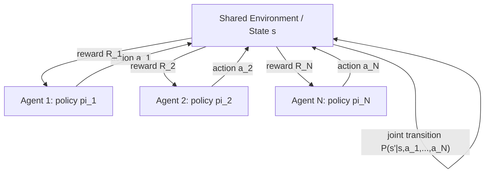
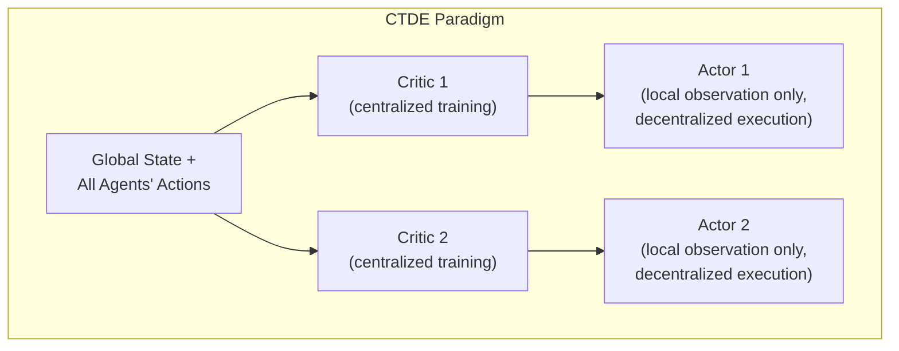

## Multi-Agent Systems

### Overview

A multi-agent system (MAS) consists of multiple autonomous, computational agents that perceive their environment, make decisions, and act — often interacting with, coordinating with, or competing against one another. Game theory provides the primary formal language for analyzing these interactions once agents are assumed to be self-interested (or at least payoff-driven) rather than purely cooperative by design: each agent's optimal policy depends on the anticipated policies of the others, which is precisely the structure of a game. This entry surveys how core game-theoretic concepts — Nash equilibrium, mechanism design, learning dynamics — are applied and extended within computer science to build, analyze, and predict the behavior of multi-agent systems, including modern multi-agent reinforcement learning (MARL) settings.

### Multi-Agent Systems as Games

**Key Points**

- A multi-agent system can be formalized as a **stochastic game** (also called a Markov game), a generalization of a single-agent Markov Decision Process (MDP) to multiple agents: a tuple $(S, \{A_i\}_{i=1}^n, P, \{R_i\}_{i=1}^n, \gamma)$ where $S$ is the state space, $A_i$ is agent $i$'s action space, $P$ is the state-transition function (now dependent on the joint action of all agents), $R_i$ is agent $i$'s individual reward function, and $\gamma$ is the discount factor.
- Unlike a single-agent MDP, the environment's transition dynamics from any given agent's perspective are **non-stationary**, because other agents are simultaneously learning and changing their own policies — this non-stationarity is the central technical difficulty that distinguishes multi-agent reinforcement learning from single-agent reinforcement learning.
- The solution concept of interest is typically a (Markov Perfect) **Nash equilibrium** of the stochastic game: a joint policy $\pi^* = (\pi_1^*, \ldots, \pi_n^*)$ such that no agent can improve its own expected discounted return by unilaterally deviating, given the others' policies.

$$V_i^{\pi_i^*, \pi_{-i}^*}(s) \geq V_i^{\pi_i, \pi_{-i}^*}(s) \quad \forall \pi_i, \forall s \in S, \forall i$$

### Cooperative, Competitive, and Mixed-Motive Settings

**Key Points**

- **Fully cooperative MAS:** all agents share a common reward function ($R_1 = R_2 = \cdots = R_n$), reducing the coordination problem to identifying a jointly optimal policy; the strategic difficulty here is primarily one of coordination (agreeing on which of possibly several equally good joint policies to play) rather than incentive misalignment.
- **Fully competitive (zero-sum) MAS:** agents' rewards sum to zero (or a constant) at every state, so one agent's gain is exactly another's loss; the relevant solution concept is the minimax equilibrium, and von Neumann's minimax theorem guarantees existence of a value and optimal (possibly mixed) strategies in finite two-player zero-sum games.
- **Mixed-motive (general-sum) MAS:** agents have partially aligned and partially conflicting interests, the most common and most analytically difficult case, requiring general Nash equilibrium concepts and admitting the possibility of multiple, Pareto-rankable equilibria, social dilemmas (Prisoner's-Dilemma-like structures), and coordination-game-like equilibrium selection problems, exactly analogous to those in the international-relations and legislative-coalition entries.

### Multi-Agent Reinforcement Learning (MARL)

Multi-agent reinforcement learning extends single-agent RL algorithms to the stochastic-game setting, and confronts directly the non-stationarity problem noted above.

**Key Points**

- **Independent Learners (Independent Q-Learning):** each agent runs a standard single-agent RL algorithm (e.g., Q-learning) treating all other agents as part of a (non-stationary) environment. This is simple to implement but offers no convergence guarantees in general, since the "environment" each agent perceives is shifting as other agents update their own policies simultaneously.
- **Centralized Training with Decentralized Execution (CTDE):** a widely used paradigm (e.g., MADDPG — Multi-Agent Deep Deterministic Policy Gradient, QMIX, COMA) in which each agent's critic (value function) is trained with access to global state and all agents' actions during training, but each agent's actor (policy) uses only its own local observations at execution time, addressing non-stationarity during training while preserving decentralized, realistic deployment.
- **Self-play:** an agent (or its recent past versions) trains against copies of itself, widely used in competitive game-playing systems (e.g., AlphaGo, AlphaZero, OpenAI Five); self-play can be understood as an approximate method for computing a Nash equilibrium of a zero-sum or symmetric game by iteratively improving a policy against the best-response dynamics of its own recent history.
- **Fictitious self-play** and its deep-learning variants extend the classical fictitious-play learning dynamic (each agent best-responds to the empirical historical distribution of the other agents' play) to function approximation settings, and are notably used in poker-playing agents (e.g., Libratus, Pluribus) to approximate Nash equilibria in large imperfect-information extensive-form games.

### Convergence and Learning Dynamics

**Key Points**

- **Fictitious play:** a classical learning rule (Brown, 1951) in which each agent best-responds, in every round, to the empirical frequency distribution of opponents' historical actions. Fictitious play is proven to converge to a Nash equilibrium in specific game classes (e.g., zero-sum games, and games solvable by iterated dominance) but does not converge to equilibrium in general games.
- **Regret matching and no-regret learning:** algorithms designed so that each agent's time-averaged regret (the gap between realized payoff and the best payoff achievable in hindsight with a fixed alternative strategy) approaches zero as the number of rounds grows. A key convergence result: if all agents in a game use no-regret learning algorithms, the empirical distribution of joint play converges to the set of **coarse correlated equilibria** — a solution concept weaker than, and containing, Nash equilibrium.
- **Counterfactual Regret Minimization (CFR)** and its sampling-based variants (Monte Carlo CFR) are the algorithmic backbone of the strongest computer poker agents, using regret-minimization at every information set of an extensive-form game to converge toward a Nash equilibrium (specifically, an approximate Nash equilibrium given finite training iterations) in large imperfect-information games.
- Convergence guarantees are considerably weaker or entirely absent for general-sum, many-player MARL settings using deep function approximation; empirically, deep MARL algorithms are frequently evaluated by measured performance and exploitability rather than by a formal equilibrium-convergence proof, and cycling or non-convergent training dynamics remain an active empirical and theoretical concern. [Inference — the state of convergence guarantees for deep MARL is an actively evolving research area, so any characterization of "current" limits should be treated as time-sensitive rather than a fixed mathematical fact]

### Mechanism Design in Multi-Agent Systems

**Key Points**

- Where a system designer (rather than a neutral observer) controls the rules of interaction among agents, **mechanism design** — the "inverse" of game theory, which starts from a desired outcome and works backward to design a game (mechanism) that implements it in equilibrium — becomes directly applicable, exactly as in the auction-design and voting-mechanism contexts covered elsewhere.
- **Auction-based task and resource allocation** is a standard MAS technique: agents (e.g., autonomous vehicles, cloud-computing tasks, or robots in a warehouse) bid for tasks or resources, and a designed auction mechanism (e.g., a Vickrey-Clarke-Groves mechanism) can be structured to be incentive-compatible, meaning truthful bidding is each agent's dominant strategy, avoiding the need for agents to strategically misrepresent their true valuations.
- **Contract-Net Protocol**, a classical distributed-AI task-allocation protocol (Smith, 1980), structures task assignment as a bidding process among agents (a "manager" agent announces a task, "contractor" agents bid, the manager awards the contract) and can be analyzed using the same incentive-compatibility lens as formal auction mechanisms.

### Communication and Coordination Games

**Key Points**

- **Cheap talk** (costless, non-binding pre-play communication) can, under specific conditions related to partially aligned incentives, allow agents to coordinate on a mutually preferred equilibrium in a coordination or mixed-motive game, formalized via the Crawford-Sobel signaling-game framework originally developed for economic and political communication settings.
- **Emergent communication** research in deep MARL studies whether and how agents, trained end-to-end via reinforcement learning with a differentiable or reward-based communication channel, spontaneously develop structured, compositional signaling protocols to coordinate — an empirical, learning-driven analogue of the equilibrium-selection problem in classical coordination games.
- **Correlated equilibrium** concepts are directly relevant to MAS communication design: if agents can observe a shared public signal (e.g., a "correlation device" or a shared random seed) before acting, they may coordinate on outcomes that are not achievable via independent randomization in a standard Nash equilibrium, a formal justification for shared-randomness-based coordination protocols in distributed systems.

### Practical Application Domains

**Key Points**

- **Autonomous vehicle coordination:** intersection management, merging, and platooning are modeled as multi-agent (often mixed cooperative-competitive) games, where mechanism-design-based intersection-reservation protocols and MARL-based negotiation policies are both active research directions.
- **Multi-robot systems and swarm robotics:** task allocation, formation control, and collision-avoidance are frequently posed as cooperative or near-cooperative stochastic games, with CTDE-style MARL algorithms a common modern approach.
- **Automated trading and market-making:** financial markets populated by autonomous trading agents are a canonical mixed-motive MAS, studied both via classical auction/market-microstructure game theory and via MARL simulation (e.g., agent-based market simulators used to study price impact and market stability).
- **Network routing and resource allocation:** distributed routing protocols and bandwidth allocation among self-interested network agents are classically studied through the lens of **congestion games** and the associated **price of anarchy** — the ratio between the worst Nash equilibrium's social cost and the socially optimal cost — a concept originating in algorithmic game theory that quantifies the efficiency loss from decentralized, self-interested routing decisions relative to centralized optimal routing.

$$\text{Price of Anarchy} = \frac{\text{Cost of worst Nash equilibrium}}{\text{Cost of social optimum}} \geq 1$$

### Conclusion

Multi-agent systems research treats game theory not merely as a descriptive lens but as an active design and analysis toolkit: stochastic games generalize the single-agent MDP formalism agents are trained within; equilibrium concepts (Nash, correlated, coarse correlated) characterize the target or observed behavior of learning agents; and mechanism design provides the principled approach for a system architect to structure incentives so that self-interested agents' equilibrium behavior aligns with system-level objectives. The transition from classical, small, fully-specified games to deep multi-agent reinforcement learning has introduced substantial new empirical and algorithmic richness (CTDE architectures, emergent communication, self-play), while simultaneously weakening the formal convergence guarantees available in the classical, tabular game-theory setting — a gap that remains an active area of both theoretical and applied research.

**Related Topics**

- Mechanism Design and the Vickrey-Clarke-Groves Mechanism
- Correlated Equilibrium and Coarse Correlated Equilibrium
- Counterfactual Regret Minimization and Poker AI
- Congestion Games and the Price of Anarchy
- Self-Play and AlphaZero-Style Training
- Emergent Communication in Deep Multi-Agent RL
- Auction Theory and Incentive Compatibility